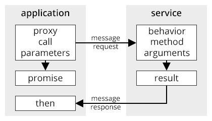

# KinomaJS: No Services & Proxy Service
**Patrick Soquet, Kinoma Software Architect**  
April 21, 2016

## Separate Threads

KinomaJS creates multiple threads and multiple JS machines. The main thread runs one JS machine for the shell and one JS machine for every application. Other threads and JS machines run asynchronous services, for instance: the media library in Connect, the pins scripts in Create, the search feature in Code, etc.

Applications and services communicate thru KinomaJS messages, which are structured like HTTP messages: URL, request and response, headers and body. Applications send and receive messages with handlers and contents. 

Building your own service is complex. It requires to define a C extension that registers a KinomaJS service with C callbacks to read and write messages. If you want to use a JS machine, you have to use XS in C to host scripts calls within the C callbacks.

On the application side, using a service is verbose enough. So it is often helpful to offer a friendlier programming interface. For instance the Pins library provides calls and callbacks that encapsulate the messages, handlers and contents required by the Pins service. 

From my point of view, the architectural issue is that if forces us to decide a priori which features are available to applications only thru services. And vice versa, which features are available to services only thru applications. To understand what I mean, think about using Create to build an HTTP server that reports sensors activity in XML.

Recently several network protocols have been developed for KinomaJS following the calls and callbacks pattern, which is common in node.js. And for Element, the whole programming interface follows that pattern since there is only one thread and one JS machine. To understand the difference, think now about using Element to build an HTTP server that reports sensors activity in XML.

In the first part of this document, I summarize a few techniques related to asynchronous functions. JavaScript 6th Edition already helps a lot. And JavaScript 7th Edition will have `async` and `await`. The idea is that we should avoid to build services for the sake of asynchronous scripts. It is more and more a gratuitous complication. 

That being said, separate threads and JS machines are sometimes useful, especially when there is a user interface. Users are of course extremely sensitive to anything that would seem to block a device. The second part of this document proposes a simple way to build and use services, thanks to JS modules, promises and proxies.

## No Services

### Callbacks

There are many kinds of asynchronous functions but let us define a simple one based on `setTimeout`:

	var when = Date.now();
	function timestamp(name) {
	 	trace((Math.round((Date.now() - when) / 250) * 250) + " " + name + "\n");
	}
	
	function step(callback, name) {
	 	timestamp(name);
		setTimeout(callback, 250);
	}

The `step` function will just trace its `name` argument and call its `callback` argument 250 milliseconds later.	

To chain explicitly several asynchronous functions, you can use something like:

	function callback123(callback) {
		step(function() {
			step(function() {
				step(function() {
	 				callback();
				}, "THREE");
			}, "TWO");
		}, "ONE");
	}
	callback123(function() {
		timestamp("DONE");
	});

A common case is to have several tasks to do asynchronously.

To do them in parallel, you can use something like:

	function callbackParallel(callback, ...array) {
		let i = 0, c = array.length;
		function aux() {
			i++;
			if (i == c)
				callback();
		}
		array.forEach(name => {
			step(aux, name);
		})
	}
	callbackParallel(function() {
		timestamp("DONE");
	}, "ONE", "TWO", "THREE");

To do them in sequence, you can use something like:

	function callbackSequence(callback, ...array) {
		let i = 0, c = array.length;
		function aux() {
			if (i < c) {
				let name = array[i++];
				step(aux, name);
			}
			else
				callback();
		}
		aux();
	}
	callbackSequence(function() {
		timestamp("DONE");
	}, "ONE", "TWO", "THREE");

There is nothing terrible about the code here above, except for its awkward cascades. But, in real life, you would have to propagate exceptions in order to catch them in the application, which would need some conventions in the callbacks themselves, `try` and `catch` blocks everywhere, etc. It becomes quickly complex enough and error prone.

### Promises

Let us "promisify" our asynchronous function:

	function Step(name) {
		return new Promise(function(resolve, reject) {
			step(resolve, name);
		});
	}

The explicit chain becomes:

	function Promise123() {
		return Step("ONE")
		.then(() => Step("TWO"))
		.then(() => Step("THREE"));
	}
	Promise123().then(() => timestamp("DONE"));

The parallel case becomes:

	function PromiseParallel(...array) {
		return Promise.all(array.map(name => Step(name)));
	}
	PromiseParallel("ONE", "TWO", "THREE").then(() => timestamp("DONE"));
	
The sequence case becomes:

	function PromiseSequence(...array) {
		return array.reduce((promise, name) => promise.then(() => Step(name)), 
			Promise.resolve());
	}
	PromiseSequence("ONE", "TWO", "THREE").then(() => timestamp("DONE"));

To catch exceptions in the application you just need to add `catch` at the end.

	Promise123()
	.then(() => timestamp("DONE"))
	.catch(error => trace(error + "\n"));

### Generators

Anticipating what will happen with JavaScript 7th Edition, several patterns have been proposed to mix generators and promises. The idea is to define a function that encapsulates a generator that yields promises. Here is one adapted from [Forbes Lindesay](https://www.promisejs.org/generators/):

	function async(Generator){
		return function () {
			var generator = Generator.apply(this, arguments);
			function handle(result) {
				if (result.done) 
					return Promise.resolve(result.value);
				return Promise.resolve(result.value)
				.then(function (result) {
					return handle(generator.next(result));
				})
				.catch(function (error) {
					return handle(generator.throw(error));
				});
			}
			try {
				return handle(generator.next());
			} catch (exception) {
				return Promise.reject(exception);
			}
		}
	}

Then you can write asynchronous code almost like synchronous code: 

	let generator123 = async(function *() {
		yield Step("ONE");
		yield Step("TWO");
		yield Step("THREE");
	 	timestamp("DONE");
	});
	generator123();
	
	let generatorSequence = async(function *(...array) {
		for (let i = 0; i < array.length; i++)
			yield Step(array[i]);
	 	timestamp("DONE");
	});
	generatorSequence("ONE", "TWO", "THREE");

## Proxy Service

### Service Calls

Let us define a `service` module, which exports a class that constructs behaviors for service calls:

##### service.js
	
	export default class {
		add(a, b, c) {
			trace("service.add(" + a + ", "  + b + ", "  + c + ")\n");
			return a + b + c;
		}
	}	
	
The `ProxyService` constructor creates a service from the module and returns a proxy to such service behavior.

##### application.js

	let ps = new ProxyService("service")
	ps.add(1, 2, 3).then(result => {
		trace("service.add => " + result + "\n");
	});

Calling the proxy invokes a message and returns a promise. 

The message is transformed into a call to the service behavior. Parameters are marshalled from the application JS machine to the service JS machine. The result of the call is marshalled from the service JS machine to the application JS machine, then resolves the promise.

> The URL of the message is `xkpr://services/proxy/[index]?key=[name]` where `[index]` is automatically generated by the Proxy Service extension and where `[name]` is the name of the method.

### Service Callbacks

The `ProxyService` constructor takes an optional argument: a behavior for service callbacks. It can be the application behavior for instance.

##### application.js

	let model = application.behavior = {
		step(i) {
			trace("application.step(" + i + ")\n");
			return i;
		}	
	};
	let ps = new ProxyService("service", model)
	ps.loop(3).then(result => {
		trace("service.loop => " + result + "\n");
	});

The argument of the constructor of the class exported by a service is a proxy to such application behavior. 

##### service.js
	
	export default class {
		constructor(pa) {
			this.pa = pa;
		}
		loop(c) {
			trace("service.loop(" + c + ")\n");
			for (let i = 0; i < c; i++) {
				this.pa.step(i).then(result => {
					trace("application.step => " + result + "\n");
				});
			}
			return c;
		}
	}	

Callbacking the proxy invokes a message and returns a promise. 

The message is transformed into a callback to the application behavior.  Parameters are marshalled from the service JS machine to the application JS machine. The result of the callback is marshalled from the application JS machine to the service JS machine, then resolves the promise.

> The URL of the message is `xkpr://[id]/proxy/[index]?key=[name]` where `[id]` is the application id,  `[index]` is automatically generated by the Proxy Service extension and `[name]` is the name of the method. The corresponding handler is added to and removed from the application by the Proxy Service extension.

### Deferred Results

Both service calls and service callbacks can return a promise to defer their result. The message is suspended then resumed when the promise resolves. It is the resolution of the promise that provides the result to marshall in the response of the message. That is useful to synchronize operations for instance. 

Let us revisit the former example.

##### service.js
	
	export default class {
		constructor(pa) {
			this.pa = pa;
		}
		loop(c) {
			trace("service.loop(" + c + ")\n");
			let promises = [].fill();
			for (let i = 0; i < c; i++)
				promises[i] = this.pa.step(i);
			return Promise.all(promises);
		}
	}	

Now the result of `loop` is the resolution of `Promise.all` applied to the promises returned by the callbacks. 

##### application.js

	let model = application.behavior = {
		step(i) {
			trace("application.step(" + i + ")\n");
			return i;
		}	
	};
	let ps = new ProxyService("service", model)
	ps.loop(3).then(result => {
		trace("service.loop => [" + result + "]\n");
	});

The application will trace `service.loop => [0, 1, 2]`.

### Exceptions

Both service calls and service callbacks can throw exceptions. 

##### service.js

	export default class {
		fail() {
			throw Error("oops");
		}
	}

The exception is marshalled across machines, then rejects the promise.

##### application.js

	let ps = new ProxyService("service");
	ps.fail().catch(error => {
		trace(error + "\n");
	});
 

