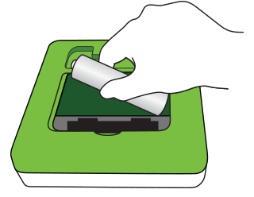
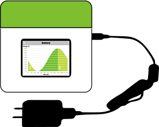
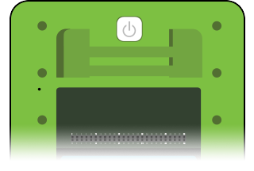
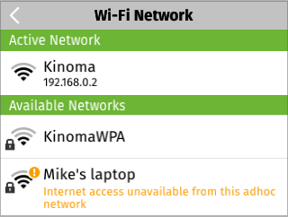
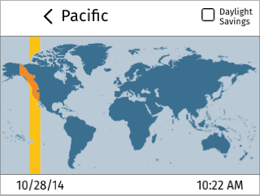
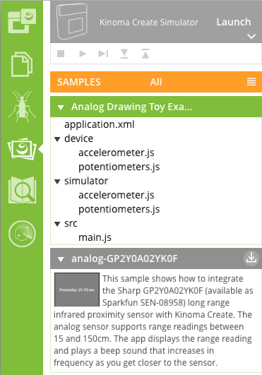

#Kinoma Create Quick Start Guide

##Device set up

####Step 1

Remove back cover and install battery.

####Step 2

Begin charging device with supplied charger. 

Note that Kinoma Create uses special charging circuitry and requires a sensing charger to correctly charge the battery. Only use the provided charger, other chargers may not charge the battery.

####Step 3

Press the power button on the back of Kinoma Create. Kinoma Create typically takes 35 seconds to boot up.

####Step 4

Use the Wi-Fi app to add your Kinoma Create to your network.

####Step 5

Set the timezone for your device.

<!-- link to create-tips removed here -->

##Running sample apps

There are 2 ways to run our [sample apps](https://github.com/Kinoma/KPR-examples) on your Kinoma Create.

1. Using the built-in Samples app on the device
2. Using the [Kinoma Code IDE](../../kinoma-code-overview.md)

####Samples app

The Samples app on Kinoma Create allows you to run, view source code of, and install applications from our sample repository directly on the device.

See a video demonstration of the Samples app [here](https://www.youtube.com/watch?v=u3HYZfXcS64).

<!--
<iframe width="100%" height="500" src="https://www.youtube.com/embed/u3HYZfXcS64?rel=0&amp;vq=hd720" frameborder="0" allowfullscreen></iframe>
-->

####Running samples from Kinoma Code

If you want to view and edit the source code on a computer, the easiest way is using the Samples tab in Kinoma Code. Like the Samples app on Kinoma Create, this tab is automatically populated with the samples from our repository.

Applications that you have not downloaded have a gray background. A download button appears when you mouseover a gray bar, as seen with the **analog-GP2Y0A02YK0F** example in the picture below. Once downloaded, the background turns green as seen with the **Analog Drawing Toy Example**. Then you can view and edit the locally saved source code and run the app on a device.

To run an app on your device, make sure it's connected to the same Wi-Fi network as your computer, select it from the list of target devices, and hit the Run button.

See a video demonstration of this process [here](https://www.youtube.com/watch?v=3A9Vmi60oqc).

<!--
<iframe width="100%" height="500" src="https://www.youtube.com/embed/3A9Vmi60oqc?rel=0&amp;vq=hd720" frameborder="0" allowfullscreen></iframe>
-->

##Writing applications

Looking at sample apps is a great way to familiarize yourself with the KinomaJS application framework, but there are many tutorials available as well. We recommend the following for beginners:

- [KinomaJS Tutorials](../../tutorials/): Tutorials and sample code for building responsive user interfaces, communicating with web services, and more
- [Getting Started with Hardware](): An overview of all the hardware protocols supported by Kinoma Create, complete with examples of popular sensors, video demos, and sample code
- [Basic Hardware Tutorials](https://github.com/Kinoma/KPR-examples/tree/master/tutorials/basic-sensors): Simple tutorials that include wiring diagrams and sample code for specific sensors and BLE peripherals
- [Full Project Tutorials](https://github.com/Kinoma/KPR-examples/tree/master/tutorials/projects): Step by step instructions to make a selection of more robust projects, including a biometric fingerprint controlled lock prototype and mechanical labyrinth maze
- [Tech Notes](../../tech-notes/): A collection of articles covering specific hardware and software features of interest to developers

If you have any questions or run into problems along the way, please post them on our [forum](http://forum.kinoma.com/)!
