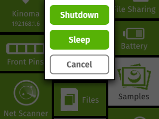
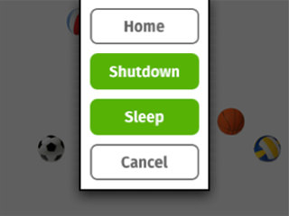
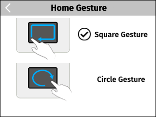

<!-- Version: 160419-CR / Last reviewed: November 2015 (with subsequent OK to change Quit gesture to Home gesture)

Kinoma Create has just one button: the power button. Yes, you use the power button to turn Kinoma Create on--but it has other useful functions as well.
-->


#Kinoma Create Power Button

**Peter Hoddie**  
December 18, 2014

Kinoma Create has just one button: the power button. Yes, you use the power button to turn Kinoma Create on--but it has other useful functions as well.

The power button is located on the back of Kinoma Create, at the top above the built-in holders for the adjustable stand (the two removable white dowels).

Once Kinoma Create has booted, press the power button to bring up its menu. The menu always includes **Shutdown**, **Sleep**, and **Cancel** buttons (see Figure 1).

**Figure 1.** Power Button Menu  
 


- **Shutdown** is the safest way to turn off Kinoma Create. It ensures that all file system caches have been flushed to flash memory and the SD card. Shutting down usually takes just a few seconds, or longer when a large file system cache flush is pending. If you do not turn off Kinoma Create using the **Shutdown** command, there is a chance that the file system will be corrupted, which could lead to erratic behavior or failure to boot. **Shutdown** invokes `onQuit` on the current application's behavior before shutting down.

- **Sleep** puts Kinoma Create into a lower power mode. The CPU, Wi-Fi, speaker, microphone, touch sensor, screen, and many other components are completely powered off. Sleep mode uses more power than turning Kinoma Create off, so use **Shutdown** if you do not expect to use Kinoma Create for an extended period of time. After you choose **Sleep**, the screen will dim as the device goes to sleep. To wake from sleep, press the power button. Kinoma Create takes a few seconds to wake from sleep; it is fully awake and ready for use when the screen un-dims.

- **Cancel** removes the power button menu from the screen. You can also cancel by tapping in the area outside the menu.

When an application is running, the power button menu adds a **Home** item (Figure 2). Tap it to return to Home from any application running on Kinoma Create. When you return to Home this way, the shell first invokes `onQuit` on the application's behavior, so the application has a chance to clean up, flush preferences, and so on.

**Figure 2.** Power Button Menu When an App Is Running  
 


If Kinoma Create is not responding, you can try using the Home gesture (Figure 3). This gesture will return Kinoma Create to Home, just as if the **Home** button had been pressed. It runs in a background daemon, so it can respond in some situations where the power button cannot (such as when the application is in an infinite loop).

**Figure 3.** Home Gesture  



If Kinoma Create is on but not responding to the power button press or the Home gesture, force Kinoma Create to turn off by pressing and holding the power button for about 8 seconds. Using this approach to shut down Kinoma Create is not recommended, however, because it does not flush the file system caches.

From a KinomaJS perspective, the power button behaves like a key on a keyboard, generating both key-down and key-up events, which are delivered to the active application. Typically applications on Kinoma Create do not watch for key events, so the key-down and key-up events are delivered to the shell, which triggers the power button menu. Your application can monitor and handle power button presses. Here is a trivial `onKeyDown` handler that disables the power button, which would be useful for installations of Kinoma Create in which you do not want the user to access the power button menu:

```
function onKeyDown(label, key, repeat, ticks) { 
	if (key) { 
		var code = key.charCodeAt(0); 
	if (Event.FunctionKeyPower == code) 
		return true; 
	} 
	return false; 
}
```

>**Note:** The long press-and-hold behavior of the power button, which turns off Kinoma Create, is implemented in hardware. It cannot be overridden in software.