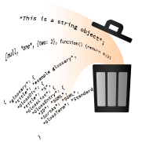

<!-- Version: 160421-CR / Last reviewed: November 2015

The Kinoma team regularly receives questions from developers who are considering adopting JavaScript but are concerned the user experience of their product will suffer because of unpredictable interruptions by the garbage collector. KinomaJS, with its XS6 JavaScript virtual machine, addresses this challenge in a way that is simple for developers and efficient on resource-constrained hardware.
-->

#Garbage Collection in KinomaJS

**Peter Hoddie**  
October 27, 2015

The Kinoma team regularly receives questions from developers who are considering adopting JavaScript but are concerned the user experience of their product will suffer because of unpredictable interruptions by the garbage collector. KinomaJS, with its XS6 JavaScript virtual machine, addresses this challenge in a way that is simple for developers and efficient on resource-constrained hardware.

##Background

The JavaScript programming language manages memory using a garbage collector (GC). A GC analyzes all memory allocated by an application to determine which allocations are in use and which can be freed for reuse. Other approaches to memory management include maintaining reference counts on objects (as in [ARC](https://developer.apple.com/library/ios/releasenotes/ObjectiveC/RN-TransitioningToARC/Introduction/Introduction.html) for iOS) and requiring applications to explicitly dispose of or free allocations (as in C). 

> **Note:** Wikipedia has a good [general introduction to garbage collection](https://en.wikipedia.org/wiki/Garbage_collection_%28computer_science%29), and Mozilla provides a good overview of [Memory Management in JavaScript](https://developer.mozilla.org/en-US/docs/Web/JavaScript/Memory_Management).

The advantages of using a GC include less script code and fewer memory leaks. A significant disadvantage is that when the GC runs, it takes time to analyze all existing allocations--significantly more time than disposing of a single allocation. The GC runs when the JavaScript engine's runtime chooses--for example, because no memory is available for a requested allocation. In some systems, the GC takes long enough to run that it causes animations to drop frames and the user interface to become unresponsive.

##Common Solutions

Script developers work around garbage collection delays by managing when the GC runs. They explicitly run the GC when they believe the system is idle. They also disable the GC when performing operations--such as animation--in which delays are particularly problematic. The JavaScript language does not define an API for GC operations, so scripts that use them are not portable across JavaScript engines.

Developers of JavaScript engines have invested considerable effort in optimizing their GCs to run faster, incrementally, or asynchronously. Countless clever implementations have been deployed, with impressive results. One challenge faced by these approaches is that they make the GC implementation considerably more complex, which tends to make it more fragile, increases code size, and potentially increases runtime memory needs.

##The KinomaJS Approach

Because KinomaJS is not designed to run inside a web browser, it is not obliged to support the JavaScript objects and API used for rendering web pages. For example, instead of using DOM, KinomaJS has its own content hierarchy to manage user interface elements. In the design of the KinomaJS JavaScript API, care has been taken to minimize when and how often new objects are created. This minimizes memory allocations, significantly reducing how often the GC needs to run. In short, rather than making the GC run faster or trying to control when it runs, KinomaJS runs the GC less often.

The KinomaJS API is designed to allocate new objects when entering a new screen or beginning a new operation. Once these large operations have completed, relatively few new allocations occur. This means that even when animating at 60 fps, a properly written application built with KinomaJS does not experience dropped frames. 

KinomaJS also works to ensure that the GC runs quickly. It uses the well-known "mark and sweep" algorithm for collecting, which runs very quickly on resource-constrained devices and requires no additional runtime memory. In addition, KinomaJS applications tend to use relatively small memory heaps, which can usually be garbage-collected more quickly. A typical application on Kinoma Create uses about 3 MB of JavaScript memory heaps. The shell and each application are loaded into their own virtual machine with its own memory heaps, so the application and shell do not impact each another.

##Garbage Collection Demo

The GC runs behind the scenes, making it difficult to be certain what it is doing. The video in Figure 1 makes the GC visible. It shows Kinoma Create running a build of KinomaJS with GC output enabled. Kinoma Create is connected to the Mac OS X console using Telnet running over Wi-Fi. Each time the GC runs, the console displays two lines with the current sizes of the memory heaps that were garbage-collected. The video enables you to see on the console when the GC runs, while seeing the corresponding operation on the Kinoma Create screen. The audio track plays a pop sound each time the GC runs.

**Figure 1.** KinomaJS Garbage Collection Video

<iframe width="560" height="315" src="https://www.youtube.com/embed/0iRfQfzcKvg" frameborder="0" allowfullscreen><a href="https://www.youtube.com/embed/0iRfQfzcKvg">Watch Video</a></iframe>  

Notice that the GC almost never runs except when entering a new screen. Even when scrolling through long lists at 60 fps, the GC is silent. Of particular note is the Samples application (at time 1:10), which scrolls the list vertically while scrolling the title text of some items horizontally, all while loading JPEG thumbnails from the internet and decompressing them for display.

Kinoma Create uses a single core 800 MHz ARM CPU, which is considerably slower than modern mobile devices. The graphics on Kinoma Create are rendered in 100% software: there is no GPU.
