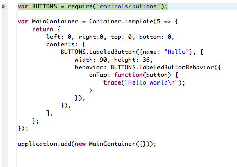

<!-- Version: 160415-CR / Last reviewed: February 2016

What should you do if, after creating an application project based on KinomaJS sample code, you encounter a mysterious `THEME: undefined global variable` error when you run the application? This Tech Note gives you the answer.
-->


#The Mystery of `THEME`

**Basuke Suzuki**  
February 8, 2016

What should you do if, after creating an application project based on KinomaJS sample code, you encounter a mysterious `THEME: undefined global variable` error when you run the application? This Tech Note gives you the answer.

##Encountering the `THEME` Error

When you explore the KinomaJS sample code [on GitHub](https://github.com/Kinoma/KPR-examples), you will often find a solution to help you achieve what you want to do. Your next steps would be to create an application project, add the required libraries, and copy and paste from the sample you found, resulting in an application that might look in part like what is shown in Figure 1.

**Figure 1.** Code Causing the `THEME` Error  



Once you are ready, you click **Run** ... but what if you then encounter the following error, telling you that there is an undefined variable named `THEME`? Who said anything about `THEME`? Why should it be defined?

```console
### BREAK: ?: get THEME: undefined variable! (main.js:1)
```


##Solving the Mystery: `THEME` Is a Global Variable

The variable named `THEME` is a global variable that some KinomaJS libraries expect to be defined in the application by the developer. That means you!

This convention is used in the all KinomaJS libraries related to UI elements. All UI elements that have a visual representation needs skins, styles, or both. If KinomaJS were to define those values locally to the module, there would be no easy way for the developer to customize the appearance of the app (its *theme*). The `THEME` variable is used to provide flexibility for the developer to be able to change the app's appearance without modifying the library's code.

You define `THEME` without prefixing it with `var`, as shown below.

#####In JavaScript (`main.js`):

```
THEME = require("themes/sample/theme");  // Whichever theme file you need
```

#####In XML (`main.xml`):

```xml
<require id="THEME" path="themes/sample/theme"/>
```

###Avoiding Build Path Warnings in Kinoma Studio

If you are using Kinoma Studio, be sure to add the library containing the theme to your build path if it is external to the project (for example, one of the built-in libraries). To do this:

1. Open the project in the Project pane.

2. Right-click the top-level folder for the project.

3. Select **Build Path** > **Configure Build Path**.

4. In the dialog that appears, use the appropriate button at the right (for built-in libraries, the **Add Built-in Libraries** button).

##Defining Global Variables

Let's take a look at what is happening behind the scenes. Usually variables are defined in the context of a local module. But if you define a variable without prefixing it with `var`, that variable is global.

#####In `foobar.js`:

```
//@module
foo = "Hello world";
var bar = "Hello world!!!";
```

#####In `main.js`:

```
require("./foobar");

trace(foo);  // "Hello world!!!"
trace(bar);  // Error: get bar: undefined variable!
```

Global variables are convenient, but using them can be dangerous. Recent programming culture tends to avoid globals. KinomaJS has chosen to use globals only for defining an application-wide theme, which exists solely in the application's lifecycle. Please do not define your own global variables only because it is an easy way to share information; use them with careful consideration.

The definition of globals is allowed only in CommonJS modules. In KinomaJS, a JavaScript file that has a `//@module` line at the beginning is treated as a CommonJS module. (XML files are always treated as CommonJS modules.) It is impossible to define global variables inside a module using the ES6 module syntax.

>**Note:** ES modules are written in strict mode, whereas CommonJS modules are not; for more about strict mode, see the section on compatibility in the Kinoma blog entry [Kinoma now shipping JavaScript 6th Edition (ES) support](https://blog.kinoma.com/2015/10/es6_support).

## What Is Exported from a Theme

Typical items exported from a theme might include:

* Predefined constants for commonly used states and variants, such as `NEXT`, `PREVIOUS`, `PLAY`, `PAUSE`, `CHECK_ON`, and `CHECK_OFF`

* Transitions for menu and dialog open and close operations and for screen changes

* Layout elements, such as headers, footers, and tabs

* Skins and styles for layout elements and common dialog and screen elements and controls

* Textures for common UI elements such as progress bars and spinners

If you have defined `THEME`, you can quickly browse the objects exported from that theme using your debugger's variable browser; as noted earlier, `THEME` is in the globals. 

To get a clearer idea of what these exported objects are, look at the source code. In Kinoma Studio, the libraries will appear under the `Modules` folder in the Project pane once they have been added to the build path as described earlier.

KinomaJS currently provides two themes in the Kinoma built-in libraries: the `flat` theme can be found in the `Controls` library, and the `sample` theme is part of the `MobileFramework` library.

##Using More Than One Theme

Using the ES6 prototype chain, you can define a hierarchy of themes as illustrated below.

#####In `src/theme.js`:

```
//@module

var theme = {
	errorHeaderSkin: new Skin('red'),
	errorHeaderStyle: new Style({ color: 'white'}),
	// ... more application theme elements
};

theme.__proto__ = require('themes/flat/theme');
theme.__proto__.__proto__ = require('themes/sample/theme');

exports.__proto__ = theme;
```

#####In `main.js`:

```
THEME = require("./theme");
```

In the ES6 specification, an object's prototype can be modified. The code snippet uses this feature of ES6 to build a inheritance tree of themes.

Themes follow typical inheritance patterns, cascading down through prototypes. In the example above, objects exported from `flat` will take precedence over the same objects exported from `sample`.

You can access all values exported in both themes, as in the following example. 

#####In `main.js`:

```
/* labeledButtonStyle is not defined in ./theme.js but is defined
 * in themes/flat/theme.xml, so it is available. */
	
let Button = Container.template($ => ({
	style: THEME.labeledButtonStyle,
}));
```

Also, you can override some definitions by defining the `name` property in your local `theme` object. This approach separates your `main.js` from visual representation definitions.

#####In `main.js`:

```
THEME = require("./theme");
	
/* errorSkin and errorStyle are defined in both ./theme.js and
 * themes/sample/theme.xml, and those defined in ./theme.js are
 * used here. */
 
 let ErrorLabel = Label.template($ => ({
 	skin: THEME.errorSkin,
 	style: THEME.errorStyle,
 }));
```
