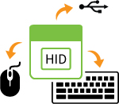
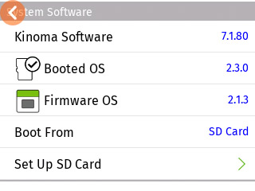

#Prototyping Peripherals with <span style="white-space: nowrap;">Kinoma Create</span>

**Andy Carle, Director, Kinoma**  
June 29, 2016

Kinoma Create serves as the main computing device in most of our [sample projects](https://github.com/Kinoma/KPR-examples) and [hardware tutorials](https://github.com/Kinoma/KPR-examples/tree/master/tutorials/basic-sensors). The prototypes being built in these cases are standalone products, intended to be used on their own.

But what if the product concept you have in mind does not stand on its own? What if it is an input device, such as a new type of keyboard, mouse, or gamepad? These are **peripherals** — products that serve as input devices to other systems, such as a computer or video game console.

With today's Kinoma Software update you can now build peripherals using your [Kinoma Create Version 2](../../../../../xs6/xsedit/features/documentation/docs/create-user-guide/create-user-guide.md). This is done by connecting Kinoma Create to a computer via the micro USB connector. Kinoma Create acts as a USB [HID device](https://en.wikipedia.org/wiki/USB_human_interface_device_class) and will be recognized by your computer as a composite device that can function as a keyboard, a mouse, and a gamepad.

A new KinomaJS HID library, the API for which is described below, can be used to programmatically control these input channels. This means that you can send keystrokes to a computer, move the mouse cursor on your computer, and send gamepad joystick and button presses to your computer all from KinomaJS. Combined with Kinoma Create's ability to work with a variety of sensors, the possibilities for novel input peripherals are limitless.

##Getting Started with HID

###Make a Bootable SD Card
Using the HID library with Kinoma Create Version 2 (the original Kinoma Create does not support HID mode) requires booting from an updated Micro SD card. The card should have at least 1GB of capacity and **will be completely erased and reformatted** during the installation process. Faster SD cards, naturally, provide faster boot times and better overall performance.

The steps to building a bootable SD card are:

1. With the device turned off, insert a blank SD card into the Kinoma Create.
1. Boot Kinoma Create.
1. Go into the Settings app and select Set Up SD Card from the System Software section.
1. Follow the steps in the Update SD Card wizard.
1. When complete, go back into the Settings app and select "Boot From."
1. Select SD Card and then back.
1. Wait a moment, and then power off the device by tapping the power button on the back and selecting "Shutdown."
1. Power on the device again. You should now be booted from the SD card. You can verify this by going into the Settings app once more and checking the "Booted OS" line. It should show a picture of an SD card, as in the screenshot below, and a version of at least 2.3.0.

**Figure 1.** The Settings App Showing the Booted OS Line.
  


###Connect Kinoma Create to a Computer
Using your Kinoma Create as a HID device starts with connecting it to your computer (or video game console, etc.) with a Micro USB cable. Do not accidentally use the Mini USB port — that provides a serial console connection rather than the USB OTG functionality. This connection is best made after both the computer and Kinoma Create are fully booted up.

When the Kinoma Create is plugged in, the computer will often react as if a keyboard has been connected. On a Mac the Keyboard Identification dialog will appear and can be safely closed. Windows PCs will play the system noise to indicate a new USB device has been connected.

###Running Sample Code
The next step is to try out some sample code. We have several apps available in our [sample repository](https://github.com/Kinoma/KPR-examples) that can be downloaded directly from the Samples tab in Kinoma Code.

####hid-keyboard and hid-mouse
The [hid-keyboard](https://github.com/Kinoma/KPR-examples/tree/master/hid-keyboard) and [hid-mouse](https://github.com/Kinoma/KPR-examples/tree/master/hid-mouse) samples are the easiest to use as they require nothing but a Kinoma Create and your computer. 

The hid-keyboard app simply displays the default system keyboard on the screen of the Kinoma Create and sends keyboard input to the device it's hooked up to whenever a key is tapped. 

The hid-mouse app displays a gray rectangle and three buttons labeled "left", "middle", and "right". The gray area acts as a touchpad, and the buttons allow you to left, middle, and right click.

####hid-spotify
The [hid-spotify](https://github.com/Kinoma/KPR-examples/tree/master/hid-spotify) app should be used with the [Spotify](https://www.spotify.com) desktop app. The volume controller, play/pause button, and skip buttons send keyboard shortcut commands. Make sure the Spotify app is open and active when you use the controls on the Kinoma Create screen.

####hid-wii-nunchuck
The [hid-wii-nunchuck](https://github.com/Kinoma/KPR-examples/tree/master/hid-wii-nunchuck) app requires a [Wii nunchuck controller](https://www.adafruit.com/product/342) paired with this [Wii Nunchuck breakout adapter](https://www.adafruit.com/product/345). The Kinoma Create then acts as a joystick for the game Bit Blaster XL.

####hid-gamepad
The [hid-gamepad](https://github.com/Kinoma/KPR-examples/tree/master/hid-gamepad) app uses 16 on-screen buttons and 2  [analog joysticks](https://www.adafruit.com/products/512) attached to the front pins to make Kinoma Create act as a controller for games running on PC, Mac, and Steam Link. It works reasonably well for multi-directional shooters, such as Geometry Wars.


###Troubleshooting
If the HID connection is not properly made between the Kinoma Create and the computer you will see errors from the HID library. Most of these connection problems can be fixed by unplugging the Kinoma Create, rebooting it, and then plugging back in. Some rare cases seem to only be resolved by also rebooting the computer.

We have seen the most persistent stability problems when connecting Kinoma Create to MacBook Pros and MacBook Airs. In these cases, stability is *greatly* improved by connecting the Kinoma Create to an externally powered USB hub rather than directly to the laptop. We have had good luck with [this model from Amazon](https://www.amazon.com/gp/product/B00E6GX4BG/ref=oh_aui_search_detailpage?ie=UTF8&psc=1), but likely any powered hub would do.

The FTDI serial console on the Mini USB port is also useful for debugging HID issues on the Micro USB port. If you are connected via serial console, you should see several USB status messages when making the Micro USB connection to the computer. If these messages are absent, the Kinoma Create needs to be rebooted or is not running the proper SD card firmware.

If you encounter any other issues, please let us know on the [Kinoma Create forums](http://forum.kinoma.com/categories/kinoma-create). 


##HID Class Reference
###Keyboard

To use your Kinoma Create as a keyboard, import the HID module and create a new Keyboard object.

```
import HID from "HID";
var keyboard = new HID.Keyboard();
```
####Functions 

**sendKey(key)**: sends a single letter/number/symbol. The **key** argument may be a:

- single letter string, i.e. "a" or "A"
- one digit number, i.e. 5 or 9
- symbol, i.e. "." or ";"

```
keyboard.sendKey("a");
keyboard.sendKey(5);
keyboard.sendKey("!");
```

If a string with a length greater than 1 or a number with more than one digit is passed in, only the first letter/number/symbol will be sent.

**sendString(string)**: sends a string. The **string** argument may be a:

- string of any length
- number with more than one digit

```
keyboard.sendString("Hello world!");
keyboard.sendString(123456789);
keyboard.sendString("You can add line breaks too\n");

let x = 2;
keyboard.sendString(`x: ${x}`); //sends the string "x: 2"
```

**sendSpecial(code, times, modifiers)**: sends a single key.

- **code** is a 16 bit keycode as specified in Section 7 of [this document](http://www.freebsddiary.org/APC/usb_hid_usages.php). Keycodes that represent letters, numbers, and symbols are allowed, as are other keys that cannot be represented as strings such as arrows and volume controls.
- **times** is the number of times to send it (optional)
- **modifiers** are bitmasks that you can bitwise OR together as needed to send [modifier keys](https://en.wikipedia.org/wiki/Modifier_key); the constructed object has properties LEFT\_SHIFT, LEFT\_CTRL, LEFT\_ALT, LEFT\_GUI, RIGHT\_SHIFT, RIGHT\_CTRL, RIGHT\_ALT, and RIGHT\_GUI. (optional)

```
keyboard.sendSpecial(0x50, 3); // sends left arrow 3 times
keyboard.sendSpecial(0x16, 1, keyboard.LEFT_GUI); // sends command+s
keyboard.sendSpecial(0x50, 1, keyboard.LEFT_GUI | keyboard.LEFT_CTRL); // sends command+control+left arrow
```

**keysDown( keys, modifiers )**: holds down on the virtual keyboard device all keys and modifiers specified until `keysUp` (described below) is called or `keysDown` is called with a different set of keys.

- **keys** is an array; its contents may be a mix of up to 6 single character strings and 16 bit keycodes as specified in section 7 of [this document](http://www.freebsddiary.org/APC/usb_hid_usages.php). The array can be empty if you just want to send modifiers, but it must be present. 
- **modifiers** are bitmasks that you can bitwise OR together as needed to send [modifier keys](https://en.wikipedia.org/wiki/Modifier_key); the constructed object has properties LEFT\_SHIFT, LEFT\_CTRL, LEFT\_ALT, LEFT\_GUI, RIGHT\_SHIFT, RIGHT\_CTRL, RIGHT\_ALT, and RIGHT\_GUI. (optional)

```
keyboard.keysDown([0x2C]); //holds down the virtual space bar
keyboard.keysDown(["w", "a"]); //holds down w and a (forward-strafe-left in some video games)
keyboard.keysDown(["a"], keyboard.LEFT_SHIFT); //holds down a and SHIFT on the virtual keyboard
```

**keysUp()**: releases all keys.

```
keyboard.keysUp();
```

**close()**: closes the connection to the keyboard. This will be called automatically when the host application exits, but can be called at any other time if desired.

```
keyboard.close();
```

###Mouse

To use your Kinoma Create as a mouse, import the HID module and create a new Mouse object.

```
import HID from "HID";
var mouse = new HID.Mouse();
```

####Functions 

**click(left, middle, right)**: sends a single mouse click. The arguments are Booleans that represent whether the corresponding mouse button should be clicked or not.

```
mouse.click(true, false, false); // sends a left mouse click
mouse.click(false, true, false); // sends a middle mouse click
mouse.click(false, false, true); // sends a right mouse click
```

**mouseDown(left, middle, right)**: holds specified mouse button(s) down until `mouseUp` (described below) is called or `mouseDown` is called with a different button configuration. The arguments are Booleans that represent whether the corresponding mouse button should be clicked or not.

```
mouse.mouseDown(true, false, false); // holds the left mouse button down
mouse.mouseDown(false, true, false); // holds the middle mouse button down
mouse.mouseDown(true, false, true); // holds the left and right mouse buttons down
```

**mouseUp()**: releases all mouse buttons. 

```
mouse.mouseUp();
```

**move(xDelta, yDelta)**: moves the cursor horizontally **xDelta** units and vertically **yDelta** units. Units of movement are mapped to screen pixels by the operating system based on your configured mouse sensitivity. 

```
mouse.move(0, -25); //moves the cursor up 25
mouse.move(25, 0); //moves the cursor right 25
```
    
**close()**: closes the connection to the mouse. This will be called automatically when the host application exits, but can be called at any other time if desired.

```
mouse.close();
```

###Gamepad 

To use your Kinoma Create as a gamepad, import the HID module and create a new Gamepad object.

```
import HID from "HID";
var gamepad = new HID.Gamepad();
```

####Functions 

**sendPosition(leftJoystick, rightJoystick)**: sends the position of a left and right analog joystick. Each argument is an object of the format `{x: valueX, y: valueY}` where `valueX` and `valueY` are integers in the range [-32768, 32767] with 0 as the neutral point of the joystick.

```
gamepad.sendPosition({x: 0, y: 0}, {x: 1000, y: -1000});
```


**pressButtons(buttons)**: holds down specified buttons on the virtual gamepad. The **buttons** argument is an array of Booleans describing whether the buttons are pressed or not. Arguments that are not present are treated as `false`. The buttons remain pressed until `releaseButtons` is called or `pressButtons` is called with a different button configuration.

```
gamepad.pressButtons([true, false, true]); //presses down gamepad buttons 1 and 3.
```


**releaseButtons()**: releases all buttons being pressed.

```
gamepad.releaseButtons();
```

	
**close()**: closes the connection to the gamepad. This will be called automatically when the host application exits, but can be called at any other time if desired.

```
gamepad.close();
```

##USB HID Report Descriptors
For USB experts, it may be useful to examine the USB HID Report Descriptors used to define the transactions between Kinoma Create and the USB host. They are defined as follows:

```
/* keyboard descriptor */
 static struct hidg_func_descriptor keyboard_hid_data = {
 	.subclass		= 0, /* No subclass */
 	.protocol		= 1, /* Keyboard */
 	.report_length		= 8,
 	.report_desc_length	= 63,
 	.report_desc		= {
 		0x05, 0x01,	/* USAGE_PAGE (Generic Desktop)	          */
 		0x09, 0x06,	/* USAGE (Keyboard)                       */
 		0xa1, 0x01,	/* COLLECTION (Application)               */
 		0x05, 0x07,	/*   USAGE_PAGE (Keyboard)                */
 		0x19, 0xe0,	/*   USAGE_MINIMUM (Keyboard LeftControl) */
 		0x29, 0xe7,	/*   USAGE_MAXIMUM (Keyboard Right GUI)   */
 		0x15, 0x00,	/*   LOGICAL_MINIMUM (0)                  */
 		0x25, 0x01,	/*   LOGICAL_MAXIMUM (1)                  */
 		0x75, 0x01,	/*   REPORT_SIZE (1)                      */
 		0x95, 0x08,	/*   REPORT_COUNT (8)                     */
 		0x81, 0x02,	/*   INPUT (Data,Var,Abs)                 */
 		0x95, 0x01,	/*   REPORT_COUNT (1)                     */
 		0x75, 0x08,	/*   REPORT_SIZE (8)                      */
 		0x81, 0x03,	/*   INPUT (Cnst,Var,Abs)                 */
 		0x95, 0x05,	/*   REPORT_COUNT (5)                     */
 		0x75, 0x01,	/*   REPORT_SIZE (1)                      */
 		0x05, 0x08,	/*   USAGE_PAGE (LEDs)                    */
 		0x19, 0x01,	/*   USAGE_MINIMUM (Num Lock)             */
 		0x29, 0x05,	/*   USAGE_MAXIMUM (Kana)                 */
 		0x91, 0x02,	/*   OUTPUT (Data,Var,Abs)                */
 		0x95, 0x01,	/*   REPORT_COUNT (1)                     */
 		0x75, 0x03,	/*   REPORT_SIZE (3)                      */
 		0x91, 0x03,	/*   OUTPUT (Cnst,Var,Abs)                */
 		0x95, 0x06,	/*   REPORT_COUNT (6)                     */
 		0x75, 0x08,	/*   REPORT_SIZE (8)                      */
 		0x15, 0x00,	/*   LOGICAL_MINIMUM (0)                  */
 		0x25, 0x65,	/*   LOGICAL_MAXIMUM (101)                */
 		0x05, 0x07,	/*   USAGE_PAGE (Keyboard)                */
 		0x19, 0x00,	/*   USAGE_MINIMUM (Reserved)             */
 		0x29, 0x65,	/*   USAGE_MAXIMUM (Keyboard Application) */
 		0x81, 0x00,	/*   INPUT (Data,Ary,Abs)                 */
 		0xc0		/* END_COLLECTION                         */
 	}
 };

/* mouse descriptor */
static struct hidg_func_descriptor mouse_hid_data = {
	.subclass		= 0, /* No subclass */
 	.protocol		= 2, /* Mouse */
 	.report_length		= 3,
 	.report_desc_length	= 50,
	.report_desc = {
	    0x05, 0x01,                    // USAGE_PAGE (Generic Desktop)
	    0x09, 0x02,                    // USAGE (Mouse)
	    0xa1, 0x01,                    // COLLECTION (Application)
	    0x09, 0x01,                    //   USAGE (Pointer)
	    0xa1, 0x00,                    //   COLLECTION (Physical)
	    0x05, 0x09,                    //     USAGE_PAGE (Button)
	    0x19, 0x01,                    //     USAGE_MINIMUM (Button 1)
	    0x29, 0x03,                    //     USAGE_MAXIMUM (Button 3)
	    0x15, 0x00,                    //     LOGICAL_MINIMUM (0)
	    0x25, 0x01,                    //     LOGICAL_MAXIMUM (1)
	    0x95, 0x03,                    //     REPORT_COUNT (3)
	    0x75, 0x01,                    //     REPORT_SIZE (1)
	    0x81, 0x02,                    //     INPUT (Data,Var,Abs)
	    0x95, 0x01,                    //     REPORT_COUNT (1)
	    0x75, 0x05,                    //     REPORT_SIZE (5)
	    0x81, 0x01,                    //     INPUT (Cnst,Ary,Abs)
	    0x05, 0x01,                    //     USAGE_PAGE (Generic Desktop)
	    0x09, 0x30,                    //     USAGE (X)
	    0x09, 0x31,                    //     USAGE (Y)
	    0x15, 0x81,                    //     LOGICAL_MINIMUM (-127)
	    0x25, 0x7f,                    //     LOGICAL_MAXIMUM (127)
	    0x75, 0x08,                    //     REPORT_SIZE (8)
	    0x95, 0x02,                    //     REPORT_COUNT (2)
	    0x81, 0x06,                    //     INPUT (Data,Var,Rel)
	    0xc0,                          //   END_COLLECTION
	    0xc0                           // END_COLLECTION
	}
};

/* gamepad descriptor */
static struct hidg_func_descriptor gamepad_hid_data = {
	.subclass		= 0, /* No subclass */
	.protocol		= 0, /* N/A */
	.report_length		= 10,
	.report_desc_length	= 63,
	.report_desc = {
		0x05, 0x01,                    // USAGE_PAGE (Generic Desktop)
		0x09, 0x05,                    // USAGE (Game Pad)
		0xa1, 0x01,                    // COLLECTION (Application)
		0x75, 0x10,                    //   REPORT_SIZE (16)
		0x16, 0x00, 0x80,              //   LOGICAL_MINIMUM (-32768)
		0x26, 0xff, 0x7f,              //   LOGICAL_MAXIMUM (32767)
		0x46, 0xff, 0x7f,              //   PHYSICAL_MAXIMUM (32767)
		0x36, 0x00, 0x80,              //   PHYSICAL_MINIMUM (-32768)
		0x09, 0x01,                    //   USAGE (Pointer)

		0xa1, 0x00,                    //   COLLECTION (Physical)
		0x95, 0x02,                    //     REPORT_COUNT (2)
		0x09, 0x30,                    //     USAGE (X)
		0x09, 0x31,                    //     USAGE (Y)
		0x81, 0x02,                    //     INPUT (Data,Var,Abs)
		0xc0,                          //   END_COLLECTION

		0x09, 0x01,                    //   USAGE (Pointer)
		0xa1, 0x00,                    //   COLLECTION (Physical)
		0x95, 0x02,                    //     REPORT_COUNT (2)
		0x09, 0x33,                    //     USAGE (Rx)
		0x09, 0x34,                    //     USAGE (Ry)
		0x81, 0x02,                    //     INPUT (Data,Var,Abs)
		0xc0,                          //   END_COLLECTION

		0x05, 0x09,                    //   USAGE_PAGE (Button)
		0x15, 0x00,                    //   LOGICAL_MINIMUM (0)
		0x25, 0x01,                    //   LOGICAL_MAXIMUM (1)
		0x75, 0x01,                    //   REPORT_SIZE (1)
		0x19, 0x01,                    //   USAGE_MINIMUM (Button 1)
		0x29, 0x10,                    //   USAGE_MAXIMUM (Button 16)
		0x95, 0x10,                    //   REPORT_COUNT (16)
		0x81, 0x02,                    //   INPUT (Data,Var,Abs)
		0xc0                           // END_COLLECTION
	}
};
```