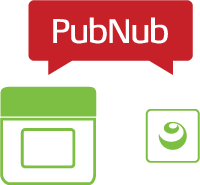
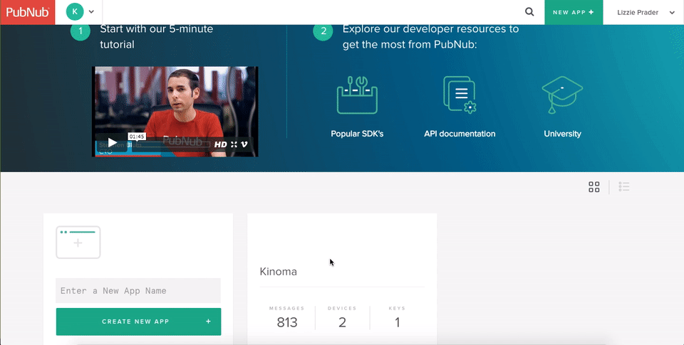

<!-- Blurb for landing page:

This tech note explains how to connect Kinoma applications to the PubNub Data Stream Network and provides links to samples and an API reference for the PubNub modules for Kinoma Create and Kinoma Element.
-->



#Realtime Cross-Device Communication with PubNub

**Lizzie Prader**  
September XX, 2016

The [PubNub](https://pubnub.com) Data Stream Network is a global network that allows developers to build and scale realtime applications for a [variety of mobile, web, and IoT platforms](https://www.pubnub.com/docs). The PubNub publish/subscribe messaging API is an excellent tool to establish cross-device (and cross-platform) communication and stream data to and from any number of devices. 

A new JavaScript module for Kinoma Element and an update to the JavaScript module for Kinoma Create are now available, making it possible for developers to easily connect Kinoma devices to the PubNub Data Stream Network. The modules and API reference are available below. Before you can run samples and create applications, follow the steps in the next section to set up a PubNub account.

##Getting started with PubNub

1. Log in to your PubNub account. 

	If you do not already have an account, you can sign up for one for free on the [PubNub website](https://pubnub.com) by clicking the **Get Started** button, as shown in figure 1.
	
	**Figure 1.** Get Started button
	
	

2. Get publish and subscribe keys by creating a new PubNub application from the Admin Portal.

	Every PubNub application you create will create a keyset with unique publish and subscribe keys. The same keyset will be used by all the devices you want to connect to the same network. Figure 2 shows how to create a new application and view the publish and subscribe keys.
	
	**Figure 2.** Creating a PubNub application
	
	
	
	You may create more than one keyset for a PubNub application. A common use for this is to have a free development/testing keyset and an upgraded production keyset. See the PubNub website for details on paid accounts.

##Download links and sample applications

Click the links below to download the PubNub modules for Kinoma Create and Kinoma Element.

- <a href="media/create-pubnub.js" download>Kinoma Create</a>
- <a href="media/element-pubnub.js" download>Kinoma Element</a>

In addition, we have several apps available in our [sample repository](https://github.com/Kinoma/KPR-examples) to help you get started quickly. These can be downloaded directly from the Samples tab in [Kinoma Code](http://kinoma.com/develop/code/).

- The [pubnub](https://github.com/Kinoma/KPR-examples/tree/master/pubnub) sample is for Kinoma Create. It allows you to send messages and retrieve previously published messages that are traced to the console by tapping onscreen buttons. It also subscribes to the specified PubNub channel and displays the messages it receives in a `label` object on the screen.
- The [element-pubnub](https://github.com/Kinoma/KPR-examples/tree/master/element-pubnub) sample is for Kinoma Element. It is a starter app that demonstrates how to use the publish, subscribe, and history functions. Received messages are traced to the console in Kinoma Code.
- The [element-analog-pubnub](https://github.com/Kinoma/KPR-examples/tree/master/element-analogpubnub) sample streams data to a PubNub channel from an analog sensor connected to Kinoma Element. You can view the data by connecting to your channel in the PubNub developer console, or by running the [create-analog-pubnub](https://github.com/Kinoma/KPR-examples/tree/master/create-analog-pubnub) sample on a Kinoma Create simulator or device.
- The [pubnub-temp](https://github.com/Kinoma/KPR-examples/tree/master/pubnub-temp) sample streams data to a PubNub channel from a [SparkFun TMP102](https://www.sparkfun.com/products/11931) temperature sensor plugged into the back of Kinoma Create. It also includes a simulator BLL so it can be run on the Kinoma Create simulator in Kinoma Code. You can view the data by connecting to your channel in the PubNub developer console.

##API Reference

> **Note:** This reference assumes familiarity with the [PubNub Data Stream Network service](https://www.pubnub.com/docs) and the [PubNub JavaScript V4 SDK](https://www.pubnub.com/docs/javascript/pubnub-javascript-sdk-v4). For a more gentle introduction, focus on the samples provided above.

The PubNub module implementations for Kinoma Create and Kinoma Element differ slightly, but the API is the same for both platforms. Both provide a subset of the [PubNub JavaScript V4 SDK](https://www.pubnub.com/docs/javascript/pubnub-javascript-sdk-v4): the publish, subscribe, and history features.

###Setup

To connect your application to the PubNub Data Stream Network, save the proper PubNub module to your project with the file name `pubnub.js` and import the PubNub class into your application file.

```
import PubNub from "pubnub";
```

Then create a new PubNub object, passing a dictionary with the following key value-pairs into the constructor:

- `subscribeKey`: your subscribe key as a string
- `(optional) publishKey`: your publish key as a string; there is no need to include this if your application is not going to publish messages
- `(optional) ssl`: a Boolean value; set to `true` if you want to establish an SSL connection, `false` otherwise. Default value is `false`.

```
let pubnub = new PubNub({
	publishKey: <YOUR_PUBLISH_KEY_HERE>,
	subscribeKey: <YOUR_SUBSCRIBE_KEY_HERE>,
	ssl: true
});
```	
<a id="important-notes"></a>
	
###Important notes

The `publish`, `subscribe`, and `history` functions support callbacks with the standard error and data arguments. It is the responsibility of the developer to check for errors.

The callback may be specified in the first argument (as `params.callback`) or the second argument (`callback`). If specified in the first argument, the callback scope is the `params` object. If specified in the second argument, the callback scope is the third parameter (`scope`), or null if not specified.

While callbacks may be used for `subscribe`, **listeners are supported and they are the recommended option.** When using listeners, the PubNub modules automatically manage connection/reconnection and announce messages and statuses to listeners. This eliminates the need to check for errors. Listeners may be added using the `addListener` function, as per the PubNub JavaScript V4 SDK. They can also be specified in the first parameter to the subscribe function (as `params.message` and `params.status`). 

A callback is required for `history` and `publish`. A callback or listener is required for `subscribe`. If not provided, the code will break into the debugger.


###Functions

####Publish

`publish(params, callback, scope)`: sends a message to a channel

- `params` is a dictionary that contains the following:

><table class="normalTable">
  <tbody>
    <tr>
      <th scope="col">Parameter</th>
      <th scope="col">Type</th>
      <th scope="col">Description</th>
    </tr>
    <tr>
      <td>channel</td>
      <td>String</td>
      <td>The channel name</td>
    </tr>
    <tr>
      <td>message</td>
      <td>Any JSON serializable data (including Objects, Arrays, Numbers and Strings)</td>
      <td>The message you want to send</td>
    </tr>
  </tbody>
</table>

- `callback` and `scope` are optional parameters, as detailed in the [Important notes](#important-notes) section above

```
pubnub.publish({
	channel: <YOUR_CHANNEL_NAME_HERE>,
	message: "Hello from Kinoma!",
	callback: (error, message) {
		if (error) trace(`Publish error: ${JSON.stringify(error)}\n`);
		else trace(`Publish response: ${JSON.stringify(message)}\n`);
	}
});	
```

####Subscribe

`subscribe(params, callback, scope)`: establishes a connection to the PubNub Data Stream network and begins listening for messages on a specified channel

- `params` is a dictionary that contains the following:

><table class="normalTable">
  <tbody>
    <tr>
      <th scope="col">Parameter</th>
      <th scope="col">Type</th>
      <th scope="col">Description</th>
    </tr>
    <tr>
      <td>channel</td>
      <td>String</td>
      <td>The channel name</td>
    </tr>
    <tr>
      <td>message</td>
      <td>Function</td>
      <td>A function to be called when a message is received</td>
    </tr>
    <tr>
      <td>status</td>
      <td>Function</td>
      <td>A function to be called when the connectivity status updates</td>
    </tr>
  </tbody>
</table>

>or
	
><table class="normalTable">
  <tbody>
    <tr>
      <th scope="col">Parameter</th>
      <th scope="col">Type</th>
      <th scope="col">Description</th>
    </tr>
    <tr>
      <td>channel</td>
      <td>String</td>
      <td>The channel name</td>
    </tr>
    <tr>
      <td>callback</td>
      <td>Function</td>
      <td>A function to be called when the message is received</td>
    </tr>
  </tbody>
</table>
	
- `callback` and `scope` are optional parameters, as detailed in the [Important notes](#important-notes) section above

```
pubnub.subscribe({ 
    channel: <YOUR_CHANNEL_NAME_HERE>,
    message: event => {
        trace(`Received message: ${JSON.stringify(event.message)}\n`);
    },
    status: status => {
    	trace(`Subscribe status: ${JSON.stringify(status)}\n`);
    }
});
```

> **Note:** The sample code above uses listeners instead of callbacks, as recommended. Calling `subscribe` with a callback will only make one request to the channel. If you choose to use callbacks, it is up to you to process errors and data and keep the subscribe loop alive.

####History

> **Note:** You must use a channel that supports the Storage/Playback Service for this feature.

`history(params, callback, scope)`: fetches archived messages of a channel

- `params` is a dictionary that contains the following:

><table class="normalTable">
  <tbody>
    <tr>
      <th scope="col">Parameter</th>
      <th scope="col">Type</th>
      <th scope="col">Required</th>
      <th scope="col">Defaults</th>
      <th scope="col">Description</th>
    </tr>
    <tr>
      <td>channel</td>
      <td>String</td>
      <td>yes</td>
      <td></td>
      <td>The channel name</td>
    </tr>
	 <tr>
      <td>callback</td>
      <td>Function</td>
      <td>yes</td>
      <td></td>
      <td>A function to be called when the messages or an error are returned</td>
    </tr>
    <tr>
      <td>count</td>
      <td>Number</td>
      <td>optional</td>
      <td>Kinoma Element: 10<BR>Kinoma Create: 50</td>
      <td>The number of messages you want to retrieve</td>
    </tr>
    <tr>
      <td>reverse</td>
      <td>Boolean</td>
      <td>optional</td>
      <td>false</td>
      <td>Set to <code>true</code> to traverse the time line in reverse and receive the oldest message first</td>
    </tr>
  </tbody>
</table>
	
- `callback` and `scope` are optional parameters, as detailed in the [Important notes](#important-notes) section above

```
pubnub.history({
    channel: <YOUR_CHANNEL_NAME_HERE>,
    callback: (error, data) => {
    	if (data) trace(`History: ${JSON.stringify(data)}\n`);
    	else if (error) trace(`History Error: ${JSON.stringify(error)}\n`);
    }
 });
```

```
pubnub.history({
    channel: <YOUR_CHANNEL_NAME_HERE>,
    callback: (error, data) => {
    	if (data) trace(`History: ${JSON.stringify(data)}\n`);
    	else if (error) trace(`History Error: ${JSON.stringify(error)}\n`);
    },
    count: 5, 
    reverse: true
 });
```