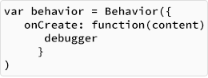

<!-- Version: 160421-CR / Last reviewed: <TBD>

This Tech Note covers the use of dictionary-based constructors and templates to build KinomaJS `behavior` objects, and presents a shortcut to bind KinomaJS `handler` and `behavior` objects.
-->



# Using Dictionary-Based Constructors for KinomaJS Behaviors

**Patrick Soquet, Kinoma Software Architect**    
March 10, 2015

In the Tech Note [Introducing KinomaJS Dictionary-Based Constructors and Templates](../introducing-kinomajs-dictionary-based-constructors-and-templates/introducing-kinomajs-dictionary-based-constructors-and-templates.md), I introduced the use of dictionary-based constructors and templates to build KinomaJS `content`, `container`, `skin`, and `style` objects. Here I will apply similar techniques to KinomaJS `behavior` objects, and present a shortcut to bind KinomaJS `handler` and `behavior` objects.


## Overview

KinomaJS behaviors are ordinary objects with functions corresponding to events triggered by contents or handlers. Typically, frameworks use inheritance to define increasingly specialized behaviors; for example, a framework defines a button behavior that inherits from a control behavior that inherits from `Behavior.prototype`, which is provided by KinomaJS itself. Applications use these constructors and prototypes to create behaviors or to further specialize behaviors.

As ordinary objects, behaviors can of course be coded with standard JavaScript features such as `Object.create` or `Object.defineProperties`. To simplify the code, behaviors can also be created with dictionaries and specialized with templates. The examples in this Tech Note present the dictionary- or template-based notation followed by the equivalent JavaScript notation.


## Dictionary-Based Behavior Constructor

To create behaviors, you can use the `Behavior` constructor as a function that takes one argument, an object with properties. The constructor uses those properties to initialize the properties of the behavior it creates.

```
var behavior = Behavior({
	onCreate: function(content) {
		debugger
	}
});
```

is equivalent to

```
var behavior = Object.create(Behavior.prototype, {
	onCreate: { value: function(content) {
		debugger
	}}
});
```

## Behavior Templates

For specializing behaviors, the `Behavior` constructor also provides a `template` function. The `template` function returns a constructor and takes one argument, an object with properties. The function uses the properties of its argument to initialize the properties of the prototype of the constructor that the `template` function returns.

```
exports.ButtonBehavior = Behavior.template({
	onTap: function(content) { },
	onTouchBegan: function(content) {
		content.state = 1;
	},
	onTouchEnded: function(content) {
		content.state = 0;
		this.onTap(content);
	}
})
```
	
is equivalent to

```
exports.ButtonBehavior = function(content, data, dictionary) {
	Behavior.call(this, content, data, dictionary);
};
	
exports.ButtonBehavior.prototype = Object.create(Behavior.prototype, {
	onTap: { value: function(content) { }},
	onTouchBegan: { value: function(content) {
		content.state = 1;
	}},
	onTouchEnded: { value: function(content) {
		content.state = 0;
		this.onTap(content);
	}}
});
```
	
Notice that behavior templates build a prototype hierarchy:

`Behavior.prototype`  
&nbsp;&nbsp;&nbsp;&nbsp;&nbsp;&nbsp;&nbsp;`↳ CONTROL.ButtonBehavior.prototype`  
&nbsp;&nbsp;&nbsp;&nbsp;&nbsp;&nbsp;&nbsp;&nbsp;&nbsp;&nbsp;&nbsp;&nbsp;&nbsp;&nbsp;`↳ URLButtonBehavior.prototype`  
&nbsp;&nbsp;&nbsp;&nbsp;&nbsp;&nbsp;&nbsp;&nbsp;&nbsp;&nbsp;&nbsp;&nbsp;&nbsp;&nbsp;&nbsp;&nbsp;&nbsp;&nbsp;&nbsp;&nbsp;&nbsp;`↳ backButtonBehavior`
				

## Shortcut: Handler Constructor bind Function

Handlers bind a URL path to a behavior to receive messages, as described in the [*KinomaJS Overview*](../../../../../xs6/xsedit/features/documentation/docs/overview/overview.md) document. The `bind` function of the `Handler` constructor is a shortcut.

```
Handler.bind("/wow", Behavior({
	onInvoke: function(handler, message) {
		debugger
	}
})));
```
	
is equivalent to

```
var wowHandler = new Handler("/wow");
wowHandler.behavior = Object.create(Behavior.prototype, {
	onInvoke: { value: function(handler, message) {
		debugger;
	}}
})
	
Handler.add(wowHandler);
```

## Reference

Following are reference details about the forms of constructor described above.

### Behavior Constructor

`Behavior(dictionary)`  

| | | |
| --- | --- | --- |
| `dictionary`| `object`| |

> An object with properties to initialize the result

| | | |
| --- | --- | --- |
| Returns | `object`| |

> A `behavior` instance, an object that inherits from `Behavior.prototype`  


`Behavior.template(dictionary)`

| | | |
| --- | --- | --- |
| `dictionary`| `object`| |

> An object with properties to initialize the prototype of the result

| | | |
| --- | --- | --- |
| Returns | `function`| |

> A constructor that creates instances of a prototype that inherits from `Behavior.prototype`. The result can also be used as a dictionary-based constructor and provides a `template` function.


### Handler Constructor

`Handler.bind(path, behavior)`

| | | |
| --- | --- | --- |
| `path`| `object`| required |

> The path of the `handler` object

| | | |
| --- | --- | --- |
| `behavior`| `object`| required |

> The handler's behavior

Creates a `handler` object with `path`, assigns its behavior with `behavior`, and puts the handler into the set of active `handler` objects.