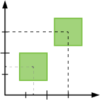

<!-- Version: 160419-CR / Last reviewed: October 2015

This Tech Note explains how to use fractional pixel coordinates in KinomaJS to create smooth animations, especially for slow-moving objects.
-->



# Using Fractional Coordinates for Animation in KinomaJS

**Lizzie Prader**  
October 9, 2015

This Tech Note explains how to use fractional pixel coordinates in KinomaJS to create smooth animations, especially for slow-moving objects.

>**Note:** All objects referred to in this Tech Note are described in detail in the [*KinomaJS JavaScript Reference*](../../../../../xs6/xsedit/features/documentation/docs/javascript/javascript.md) document.

## Background

All `content` objects in KinomaJS can be resized or moved, and some can be rotated and skewed; to animate `content` objects, you adjust these properties at regular intervals. If a `content` object moves several pixels at each interval, our eyes will fill in the blanks to see it as if it is hitting every coordinate on the way to the other side of the screen.

In JavaScript, all numbers are floating-point. For rendering, KinomaJS rounds numbers used as coordinates to integers by default. Since `content` objects are almost always positioned on whole pixel boundaries, this gives the expected result and helps to maximize graphics rendering performance. Furthermore, you will not be able to tell the difference between an object moving exactly 4 pixels and moving 4.0001 pixels. However, this rounding may be undesirable if you want to, for example, translate an image by a tenth of a pixel at a time in an animation to make it move very slowly. The good news is that you can explicitly enable the use of fractional coordinates, which will allow you to create slow and steady movement. This Tech Note explains how and when you can do this.
​
## How to Use Fractional Coordinates

In KinomaJS, `layer` objects and `picture` objects have a `subPixel` property, which, when set to `true`, enables you to give an object fractional coordinates. In many situations the difference is not noticeable, but if you want to animate with small movements, slow motion, or smooth scaling, it may be necessary. It is easy to check whether it will make a difference; all you have to do is set the `subPixel` property to `true`.

​Here are some quick exercises to demonstrate the usefulness of fractional coordinates in animation.

### Slideshow Project

The [`slideshow`](https://github.com/Kinoma/KPR-examples/tree/master/slideshow) sample project is a great example of where fractional coordinates are necessary. If you download the source code and run the application, you will see a series of images with Ken Burns effects applied to them.
​
Now open `main.xml`. If you read through the code you will see that it is creating animation by adjusting the scale and translation of the images shown. It is a few hundred lines of code, but you only have to edit one line. Go to line 54 and change

```
picture.subPixel = true;
```
	
to

```
picture.subPixel = false;
```

Now run the application again. Note that the animation is not as smooth as it was before; images seem to twitch a bit several times a second. Comparing the two side by side makes the difference quite obvious, as you can see in Figure 1.

​**Figure 1.** Slideshow Example

<iframe width="667.5" height="375" src="https://www.youtube.com/embed/i2sYa4vUxYQ?rel=0&amp;vq=hd720" frameborder="0" allowfullscreen><a href="https://www.youtube.com/embed/i2sYa4vUxYQ?rel=0&amp;vq=hd720">Watch Video</a></iframe>

### Simple Layer Translation
​
If you want a simpler JavaScript example to work with, try the following exercise. This application animates `layer` objects with white squares and text on them.
​
Start by creating a `behavior` prototype that makes a layer move slowly to the right.

```
var LayerBehavior = function () {
	this.dx = 0;
}
LayerBehavior.prototype = Object.create(Object.prototype, {
	onDisplaying: {
		value: function(layer) {
			layer.start();
		}
	},
	onTimeChanged: {
		value: function(layer) {
			this.dx += 0.1;
			layer.translation = {x: this.dx, y: 0};
		}
	},
});
```

​Create a `layer` object with a white box and some text. Set its `subPixel` property to `true`.

```
var labelStyle = new Style( { font: "40px", color:"white" } );
var whiteSkin = new Skin({fill:"white"});
var subpixelLayer = new Layer({left:0, right:0, top:15, height:100, 
	contents: [
		new Content({top:0, left:1, width:100, height:100, skin: whiteSkin}),
		new Label({top:0, bottom:0, left:110, width:200, string:"subpixel", style:labelStyle})
	]
})
subpixelLayer.subPixel = true;
```

Create another `layer` object with the same content. Keep its `subPixel` property unchanged (causing it to default to `false`).

```
var pixelLayer = new Layer({left:0, right:0, top:125, height:100, 
	contents: [
		new Content({top:0, left:1, width:100, height:100, skin: whiteSkin}),
		new Label({top:0, bottom:0, left:110, width:200, string:"pixel", style:labelStyle})
	]
})
```
​
Set the behaviors of the `layer` objects and add them to the application.

```
subpixelLayer.behavior = new LayerBehavior();
pixelLayer.behavior = new LayerBehavior();
application.add(subpixelLayer);
application.add(pixelLayer);
application.skin = new Skin({fill:"black"});
```
	
You should see that the text that uses fractional coordinates (on the top in Figure 2) goes across the screen smoothly, while the normal text (on the bottom) twitches as it goes across.

​**Figure 2.** Fractional vs. Integer Coordinates

<iframe width="667.5" height="375" src="https://www.youtube.com/embed/iimwPI1Bk3A?rel=0&amp;vq=hd720" frameborder="0" allowfullscreen><a href="https://www.youtube.com/embed/iimwPI1Bk3A?rel=0&amp;vq=hd720">Watch Video</a></iframe>

<br>Now go back to the line in the `behavior` prototype that adds to the `dx` value. Change it to add 0.5 instead of 0.1.

```
this.dx += 0.5;
```

If you run the application again, you will see that the difference between the two strings' animation is much less pronounced. See the video in Figure 3 for a side-by-side comparison (noting the faster speed in the case of adding the larger value to `dx`).

​**Figure 3.** Side-by-Side Speed Comparison

<iframe width="667.5" height="375" src="https://www.youtube.com/embed/uz7TDiaK3Vc?rel=0&amp;vq=hd720" frameborder="0" allowfullscreen><a href="https://www.youtube.com/embed/uz7TDiaK3Vc?rel=0&amp;vq=hd720">Watch Video</a></iframe>

<br>
> **Note:** While writing this Tech Note I came across a strange quirk. If you look at the code that adds the white squares to each layer, you will notice that the `content` objects have a 1-pixel left margin. If you change this to 0 and run the application, you will see that the left side of the square in the `subPixel` layer twitches like the square in the normal layer. This is caused by rounding that occurs when the image is rendered. It will inevitably occur any time a `layer` object's contents have a left/right margin of 0 and move horizontally or a top/bottom margin of 0 and move vertically. If you encounter this effect in your own project, just add a small margin to mask the effect.
 
## When to Use Fractional Coordinates

If you spend some time changing parameters in the sample code above, you will see that using fractional coordinates makes a noticeable difference only when you scale or translate an object very slowly, making it unnecessary for many projects. 

You should also keep in mind that not all functions in the `content` object API support fractional coordinates. For example, the `moveBy` function will round the input deltas to the nearest integer.

Rendering with fractional coordinates may be slower, so if there is no visible difference it is not recommended. But, as you have now seen, it certainly makes a difference for projects that require small, subtle, or slow animation, and it can greatly improve the smoothness of a project.

## Drawbacks

You may have noticed that objects whose `subPixel` property is set to `true` look slightly out of focus. To understand why, it is best to look at what is happening in slow motion. In the video in Figure 4, I zoomed in and slowed the animation down to 10% speed. Watch it in full-screen mode and you will see that the edges of the square are not actually moving at each interval; they are simply cycling through shades of gray. Because we cannot physically render at an arbitrary fractional pixel position, anti-aliasing is used to approximate the appearance of fractional pixels; this is what causes the blurring effect.

​**Figure 4.** Slowed Square with Fractional Coordinates

<iframe width="890" height="500" src="https://www.youtube.com/embed/doAf6At0NCw?rel=0&amp;vq=hd720" frameborder="0" allowfullscreen><a href="https://www.youtube.com/embed/doAf6At0NCw?rel=0&amp;vq=hd720">Watch Video</a></iframe>