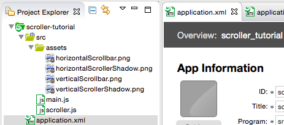

#Scrolling Content and Programmatically Adjusting Layout

This tutorial describes two advanced uses of the KinomaJS containment hierarchy in UI development: scrolling content and programmatically adjusting layout. You will learn how to make large pieces of content scroll on the screen horizontally or vertically and how to build your own layout manager in JavaScript.

A full description of the objects introduced in this tutorial can be found in the [*KinomaJS JavaScript Reference*](../../../../../xs6/xsedit/features/documentation/docs/javascript/javascript.md) document.


##Scrolling Content

The `scroller` object is a `container` object that scrolls its first `content` object horizontally and/or vertically. If you have content larger than the dimensions of the screen, you will need to place it in a scroller to be able to see all of it.

In this part of the tutorial, you will learn to create `scroller` objects. Start by downloading the file <a href="../content/scroller.js" download>`scroller.js`</a> and saving it into your `src` folder.

> **Note:** This is a JavaScript module with all the code that is relevant to creating scrollers in the built-in [MobileFramework library](https://github.com/Kinoma/kinomajs/tree/master/kinoma/kpr/libraries/MobileFramework). It includes the JavaScript version of some of the XML code from `scroller.xml` and `theme.xml`.

Now download the following images, which are used in `scroller.js`, and put them in a folder named `assets` in your project's `src` folder:

- [Horizontal scroller shadow](https://github.com/Kinoma/kinomajs/blob/master/kinoma/kpr/libraries/MobileFramework/src/themes/sample/assets/horizontalScrollerShadow.png)

- [Horizontal scroll bar](https://github.com/Kinoma/kinomajs/blob/master/kinoma/kpr/libraries/MobileFramework/src/themes/sample/assets/horizontalScrollbar.png)

- [Vertical scroller shadow](https://github.com/Kinoma/kinomajs/blob/master/kinoma/kpr/libraries/MobileFramework/src/themes/sample/assets/verticalScrollerShadow.png)

- [Vertical scroll bar](https://github.com/Kinoma/kinomajs/blob/master/kinoma/kpr/libraries/MobileFramework/src/themes/sample/assets/verticalScrollbar.png)

Figure 1 shows what your project directory should look like when you are finished.

**Figure 1.** Files in Project Explorer



Now you can start filling in your `main.js` file. To add a module, you use `require`. This creates a reference that can be assigned to a variable name.  By convention, module variables are usually ALL CAPS.

```	
var SCROLLER = require("scroller");
```
	
###Scrolling Vertically

Now create a container template that will let you pass in the content you want to be scrollable when you create an instance. The following code creates a container that scrolls vertically with a scroll bar and shadows that move as you scroll. The scroll bar and shadows are optional.

```
var darkGraySkin = new Skin({ fill:"#202020" });
var titleStyle = new Style( { font: "20px", color: "white" } );
	
var MainContainer = Container.template($ => ({
	left: 0, right: 0, top: 0, bottom: 0,
	contents: [
		SCROLLER.VerticalScroller($, { 
			active: true, top: 25, bottom: 0,
			contents: [
				$.contentToScrollVertically,
				SCROLLER.VerticalScrollbar(), 
				SCROLLER.TopScrollerShadow(), 
				SCROLLER.BottomScrollerShadow(),	
			]         			
		}),
		new Container({ 
			top: 0, height: 25, left: 0, right: 0, skin: darkGraySkin, 
			style: titleStyle, 
			contents: [
				new Label({ string: "Vertical Scroller Example" }),
			]
		})
	]
}));
```

Create some content to put in your scroller.

```
var contentToScrollVertically = new Column({ 
	top: 0, left: 0, right: 0, 
	contents: [
		['#1ACC45', '#79FFBF', '#FF6F3A', '#998060', '#CC7E1A'].map(color => 
			new Container({ top: 0, height: 120, left: 0, right: 0, 
			skin: new Skin({ fill: color }) }))
	]
});
```
	
> ***Important:*** Do not put a bottom coordinate on a vertically scrolling `content` object or a left coordinate on a horizontally scrolling `content` object. Doing so will lock it in place and prevent it from being scrollable.
	
Next, create an instance of your template that contains the column you just created and add it to the application.
	
```
var scrollerExample = new MainContainer({ contentToScrollVertically }); // ES6 shorthand
application.add(scrollerExample);
```

You can now run the application on your preferred simulator. The video in Figure 2 shows it running on Kinoma Create.

**Figure 2.** Running the Vertical Scroller Example

<iframe width="100%" height="500" src="https://www.youtube.com/embed/yImfySOY4vU?rel=0&amp;vq=hd1080" frameborder="0" allowfullscreen><a href="https://www.youtube.com/embed/yImfySOY4vU?rel=0&amp;vq=hd1080">Watch Video</a></iframe>

###Scrolling Horizontally

The process to create a container that scrolls horizontally is almost identical. Here is `main.js` with a horizontal scroller:

```
var SCROLLER = require("scroller");
	
var darkGraySkin = new Skin({ fill: "#202020" });
var titleStyle = new Style( { font: "20px", color: "white" } );
	
var MainContainer = Container.template($ => ({
	left: 0, right: 0, top: 0, bottom: 0,
	contents: [
		SCROLLER.HorizontalScroller($, { active: true, top: 25, bottom: 0, 
			skin: whiteSkin,
			contents: [
				$.contentToScrollHorizontally,
				SCROLLER.HorizontalScrollbar(), 
				SCROLLER.LeftScrollerShadow(), 
				SCROLLER.RightScrollerShadow(),	
			]         			
		}),
		new Container({ top: 0, height: 25, left: 0, right: 0, 
			skin: darkGraySkin, style: titleStyle, 
			contents: [
				new Label({ string: "Horizontal Scroller Example" }),
			]
		})
	]
}));
	
var contentToScrollHorizontally = new Line({ top: 0, bottom: 0, left: 0,
	contents: [
		['#1ACC45', '#79FFBF', '#FF6F3A', '#998060', '#CC7E1A'].map(color => 
			new Container({ top: 0, bottom: 0, left: 0, width: 120, 
			skin: new Skin({ fill: color }) }))
	]
});
	
var scrollerExample = new MainContainer({ contentToScrollHorizontally }); //note ES6 Shorthand
application.add(scrollerExample);
```

##Programmatically Adjusting Layout

The `layout` object is a `container` object that delegates positioning and sizing of its contents to a script in its behavior. If you are making an application for a resizable screen (that is, a desktop application), you may want to use `layout` objects. In this part of the tutorial you will learn to use a `layout` object and dynamically change the dimensions of its contents.

Start a new application project and add the following template to your `main.js` file. This template creates simple `content` objects that resize when an `onDimensionsChanged` event is triggered.

```
var colors = ['#79FFBF', '#FF6F3A', '#998060'];
var VerticalBar = Content.template($ =>({
	left: n0, right: n0, bottom: n0, height: $.percentage*application.height,
	skin: new Skin({ fill: $.fillColor }),
	behavior: Behavior({
		onCreate: function(content, data) {
			this.data = data;
		},
		onDimensionsChanged: function(content, data) {
			content.height = this.data.percentage*application.height;
		},	
	})
}))
```
	
Put three instances of your bar template into a `layout` object that triggers their `onDimensionsChanged` event when it is resized vertically. Because you are putting the bars in a line, there is no need to explicitly adjust their width when the layout is resized horizontally; that will be done automatically.

```
var layoutExample = new Layout({
	left: 0, right: 0, top: 0, bottom: 0, skin: whiteSkin,
	contents:[
		new Line({
			left: 0, right: 0, top: 0, bottom: 0,
			contents:[
				new VerticalBar({ percentage: 0.25, fillColor: colors[0] }),
				new VerticalBar({ percentage: 0.5, fillColor: colors[1] }),
				new VerticalBar({ percentage: 0.75, fillColor: colors[2] })
			]
		}),
	],
	behavior: Behavior({
		onCreate: function(container, data){
			this.height = -1;		
		},
		onMeasureVertically: function(container, height){
			if (this.height != application.height){
				this.height = application.height;
				application.distribute("onDimensionsChanged");		
			}
			return height;
		},
	})
});
application.add(layoutExample);
```

Run your application on the desktop simulator and observe the effects of resizing the window, as shown in the video in Figure 3.

**Figure 3.** Running the Layout Example

<iframe width="100%" height="500" src="https://www.youtube.com/embed/mu1KYQdD_oY?rel=0&amp;vq=hd1080" frameborder="0" allowfullscreen><a href="https://www.youtube.com/embed/mu1KYQdD_oY?rel=0&amp;vq=hd1080">Watch Video</a></iframe>