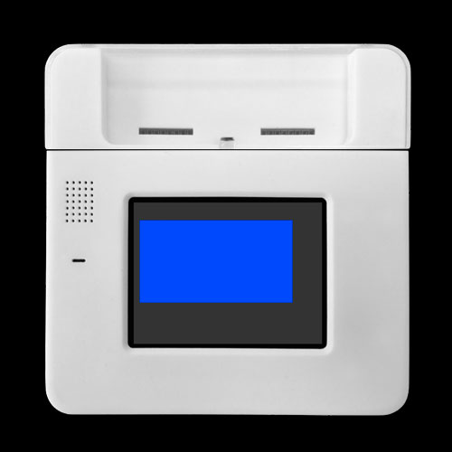
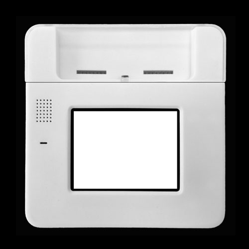
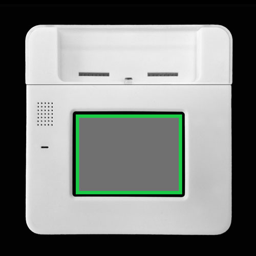
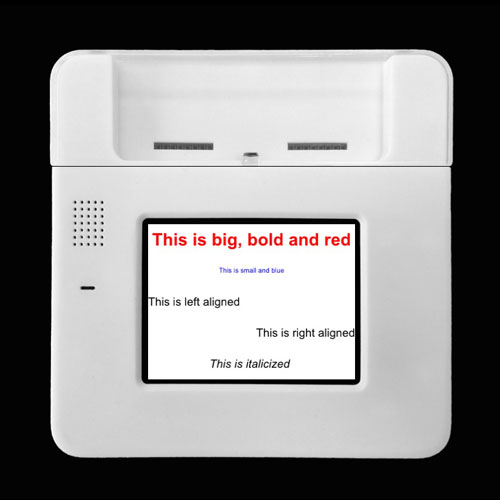
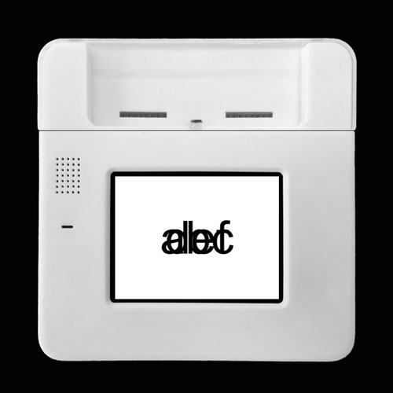
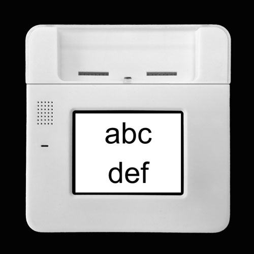
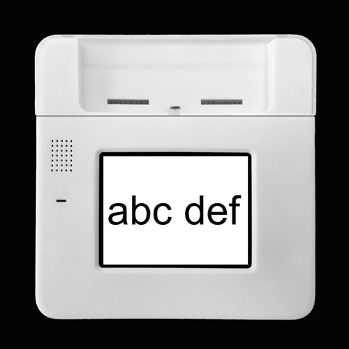
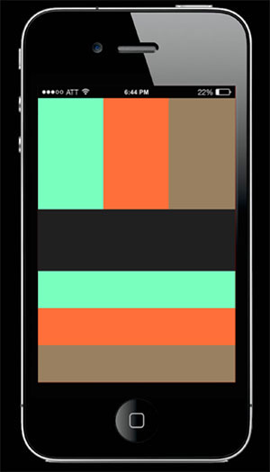

#The KinomaJS Containment Hierarchy

This tutorial explains how to build KinomaJS application user interfaces using `content` and `container` objects. The associated reference documentation can be found in [*KinomaJS JavaScript Reference*](../../../../../xs6/xsedit/features/documentation/docs/javascript/javascript.md).

##Content Objects

The graphical user interface elements of most KinomaJS applications are composed of a hierarchy of `content` objects. These compositions range from simple displays (for example, colored boxes, text labels, and icons) to complex widgets (such as buttons, sliders, switches, and tabs). Grid-based layouts are built up from simple components.

###Basic Layout

Copy and paste the following basic (but complete) KinomaJS application it into your `main.js` file and save.

```
var blueSkin = new Skin({ fill:"blue" });
	
var myContainer = new Container({
	left: 10, top: 30, right: 50, bottom: 70, skin: blueSkin
});
	
application.add(myContainer);
```
	
In this code, `blueSkin` is a `skin` object that defines the appearance of the content it is applied to. The `Container` constructor creates a `container` object, which is a `content` object that can contain other `content` objects. The container is initialized with a set of coordinates (`left`, `top`, `right`, and `bottom`) that define its margins within its parent container (in this case, the application). As shown in Figure 1, the result is an off-center blue rectangle 10 pixels away from the left edge of the application, 30 from the top, 50 from the right, and 70 from the bottom.

**Figure 1.** Blue Container Offset by Margins



###Changing Content Appearance with Skins

The `skin` object defines the appearance of `content` objects. It can fill or stroke `content` objects with colors or draw or fill `content` objects with images from `texture` objects. In this tutorial, we cover solid colors; textures are covered in the tutorial [Displaying Images and Media](../images-media/images-media.md).

Start by creating a template for a container that fills the entire screen. This will enable you to pass in a `skin` object whenever you create an instance, so that you can quickly test the subsequent examples.

```
var ScreenTemplate = Container.template($ => ({ 
	left: 0, right: 0, top: 0, bottom: 0, 
	skin: $.skin,
}));
```

The simplest skin you can make is one that defines only the fill color. The following code creates a skin with a white fill, creates a container that uses it, and adds it to the application (see Figure 2).

```
var whiteSkin = new Skin({ fill: "white" });
var whiteCon = new ScreenTemplate({ skin: whiteSkin });
application.add(whiteCon);
```

**Figure 2.** Plain White Container (Full-Screen)



You can also add borders. The following code creates a skin with a gray background and 10-pixel green borders (as shown in Figure 3). You can see that this example uses hex color values rather than a CSS string as in the previous example.

```
var borderedSkin = new Skin({
	fill: "#707070",
	borders: {left: 10, right: 10, top: 10, bottom: 10}, 
	stroke: "#1ACC45"
});
var borderedCon = new ScreenTemplate({ skin: borderedSkin });
application.add(borderedCon);
```

**Figure 3.** Gray Container with Green Borders



###Labels and Text

The `label` object is a `content` object that renders a string on a single line with a single style. (The next section addresses styles in more detail.) The string is truncated if it does not fit the bounds of the `label` object.

```
new Label({ left: 0, right: 0, top: 0, bottom: 0, string: "YOUR_STRING_HERE" })
```

The `text` object is a `content` object that renders a string on multiple lines with multiple styles.

```
new Text({ left: 0, right: 0, top: 0, bottom: 0, string: "YOUR_STRING_HERE" }),
```

###Changing Text Appearance with Styles

The `style` object defines the appearance of strings in `label` and `text` objects. This section will show you how to use them. 

>**Note:** For a fuller description of styles and a comparison of `label` and `text` objects, see the section on strings and styles in the [*KinomaJS Overview*](../../../../../xs6/xsedit/features/documentation/docs/overview/overview.md) document.

Start by creating a template for a `label` object that fills whatever container it is in. Again, this will enable you to pass in a `style` object whenever you create an instance, so that you can quickly test the subsequent examples.

```
var StringTemplate = Label.template($ => ({
	left: 0, right: 0, top: 0, bottom: 0,
	style: $.style,
	string: $.string
}));
```

Now define some `style` objects and put them in a `column` object. (The next section goes into more detail about the `column` object.)

```
var hugeRedText = new Style({ font: "bold 30px", color: "red" });
var smallText = new Style({ font: "12px", color: "blue" });
var leftAlignedText = new Style({ font: "20px", color: "black", 
	horizontal: "left" });
var rightAlignedText = new Style({ font: "20px", color: "black", 
	horizontal: "right" });
var italicText = new Style({ font: "italic 20px", color: "black"} );
	
var mainCon = new Column({ 
	left: 0, right: 0, top: 0, bottom: 0, skin: new Skin({ fill: "white" }),
	contents: [
		new StringTemplate({ style: hugeRedText, 
			string: "This is big, bold and red" }),
		new StringTemplate({ style: smallText, 
			string: "This is small and blue" }),
		new StringTemplate({ style: leftAlignedText, 
			string: "This is left aligned" }),
		new StringTemplate({ style: rightAlignedText, 
			string: "This is right aligned" }),
		new StringTemplate({ style: italicText, 
			string: "This is italicized" }),
	]
});
application.add(mainCon);
```

If you run this application on the Kinoma Create simulator, you will see the screen shown in Figure 4.

**Figure 4.** Text Styles


	
For more examples of styles being used to change the appearance of `label` and `text` objects, see the [`styles`](https://github.com/Kinoma/KPR-examples/tree/master/styles) sample app.

###Colors

You can use `style` and `skin` objects to customize the colors of `content` objects. Colors in KinomaJS follow the same basic rules as when colors are specified in CSS. More information on specifying color in KinomaJS can be found in the Tech Note [Specifying Color in KinomaJS](../../notes/specifying-color-in-kinomajs/specifying-color-in-kinomajs.md).

##Container Objects

In this section we will look at three of the most basic types of containers used to create screens with grid-based layouts:

- The `container` object is a `content` object that can contain other `content` objects.

- The `column` object is a `container` object that arranges its contents vertically.

- The `line` object is a `container` object that arranges its contents horizontally.

An important distinction to be aware of before continuing any further is that a `content` object is not the same as the contents of a `container` object; the contents of a `container` object is an *array* of `content` objects.

###Comparing and Contrasting Containers

The following code, which we will use for the next three examples, creates two `label` objects. Copy and paste it into your `main.js` file and save.

```
var whiteSkin = new Skin({ fill: "white" });
var normalText = new Style( { font: "100px", color: "black" });

var label0 = new Label({ left: 0, right: 0, top: 0, bottom: 0, string: "abc", 
	style: normalText }),
var label1 = new Label({ left: 0, right: 0, top: 0, bottom: 0, string: "def", 
	style: normalText }),
```

####Example 1: Container Object

To create a `container` object with our `label` objects as its contents, add the following code.

```
var containerExample = new Container({ 
	left: 0, right: 0, top: 0, bottom: 0, skin: whiteSkin
});
containerExample.add(label0);
containerExample.add(label1);
application.add(containerExample);
```
	
If you run this application on the Kinoma Create simulator, you can see that the two labels overlap (as shown in Figure 5). This happens because they have the exact same computed coordinates: both are centered horizontally because the `left` and `right` coordinates are 0, and centered vertically because the `top` and `bottom` coordinates are 0. To prevent the objects in a `container` object from overlapping, you need to give them different coordinates.

**Figure 5.** Container Object with Overlapping Labels



####Example 2: Column Object

To create a `column` object with our `label` objects as its contents, replace the container sample code from Example 1 with the following:

```	
var columnExample = new Column({ 
	top: 0, bottom: 0, left: 0, right: 0, skin: whiteSkin
});
columnExample.add(label0);
columnExample.add(label1);
application.add(columnExample);
```
	
Note that the only difference from Example 1 is the name of the variable and the replacement of `new Container` with `new Column`.
	
If you run this application on the Kinoma Create simulator, you can see that the two `label` objects no longer overlap (see Figure 6). Because they are in a column, they are arranged vertically. And because each label is requesting the same amount of vertical space (`top: 0, bottom: 0`), they are given equal space on the screen. 

**Figure 6.** Column with Labels Arranged Vertically



####Example 3: Line Object

To create a `line` object with our `label` objects as its contents, replace the column sample code from Example 2 with the following:

```
var lineExample = new Line({ 
	top: 0, bottom: 0, left: 0, right: 0, skin: whiteSkin
});
lineExample.add(label0);
lineExample.add(label1);
application.add(lineExample);
```

If you run this application on the Kinoma Create simulator, you will see the screen shown in Figure 7. You can see that the two `label` objects do not overlap here either. Because they are in a `line` object, they are arranged horizontally. And because they are requesting the same amount of horizontal space (`left: 0, right: 0`), they are given equal space on the screen. 

**Figure 7.** Line with Labels Arranged Horizontally



##Making Grid-Based Layouts

A common task in user interface design is to lay out a collection of components in a grid. As mentioned earlier, `column` and `line` objects help with this.

The following `main.js` makes use of one large `column` object for the full-app layout, with two `line` objects and another `column` object within it (see Figure 8).

```
var colors = ['#1ACC45', '#79FFBF', '#FF6F3A', '#998060', '#202020'];
var mainColumn = new Column({ 
   left: 0, right: 0, top: 0, bottom: 0,
   contents: [
      new Line({ 
         left: 0, right: 0, top: 0, bottom: 0,
         contents:[
            new Content({ left: 0, right: 0, top: 0, bottom: 0, 
                          skin: new Skin({ fill: colors[1] }) }),
            new Content({ left: 0, right: 0, top: 0, bottom: 0, 
                          skin: new Skin({ fill: colors[2] }) }),
            new Content({ left: 0, right: 0, top: 0, bottom: 0, 
                          skin: new Skin({ fill: colors[3] }) }),
         ]
      }),
      new Line({ 
         left: 0, right: 0, top: 0, height: 100, skin: new Skin({ fill: colors[4] }) 
      }),
      new Column({
         left: 0, right: 0, top: 0, bottom: 0,
         contents: [
            new Content({ left: 0, right: 0, top: 0, bottom: 0, 
                          skin: new Skin({ fill: colors[1] }) }),
            new Content({ left: 0, right: 0, top: 0, bottom: 0, 
                          skin: new Skin({ fill: colors[2] }) }),
            new Content({ left: 0, right: 0, top: 0, bottom: 0, 
                          skin: new Skin({ fill: colors[3] }) }),
         ]
      })
   ]
});
	
application.add(mainColumn);
```

**Figure 8.** Mobile App with Grid Layout



The middle row has a defined height but the top and bottom rows do not, so they split the remaining space evenly. The top and bottom rows have identical contents, but you can see how they are displayed differently based on the type of container they are in.

## Where to Go Next

Now that you know how to display a basic user interface, the next step is to learn how to add logic to your application with behaviors; for this, see the tutorial [Application Logic in Behaviors](../behaviors/behaviors.md).

For advanced topics in UI development, you might want to check out these tutorials:

- [Transforming Content at Runtime](../layers/layers.md)
- [Scrolling Content and Programmatically Adjusting Layout](../advanced-layouts/advanced-layouts.md)
- [Displaying Images and Media](../images-media/images-media.md)