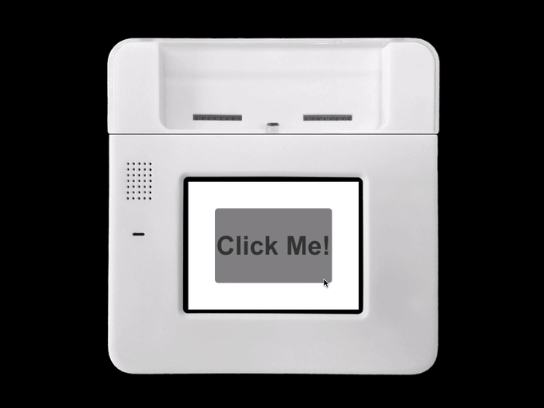
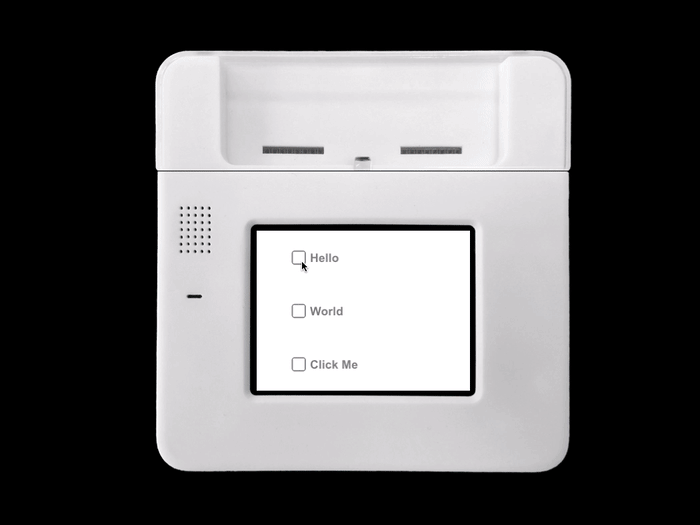
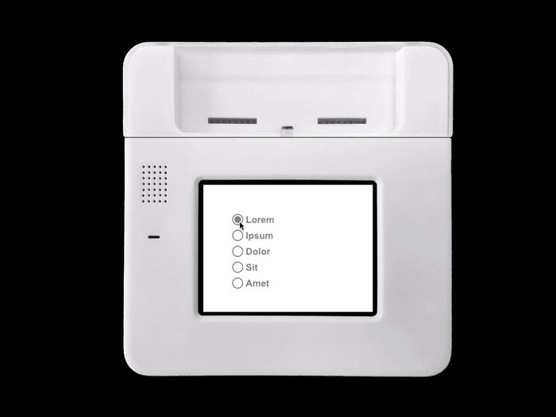
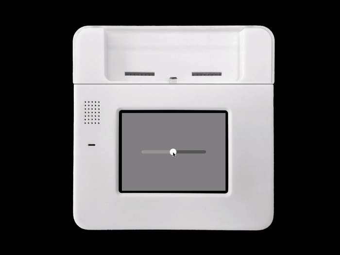
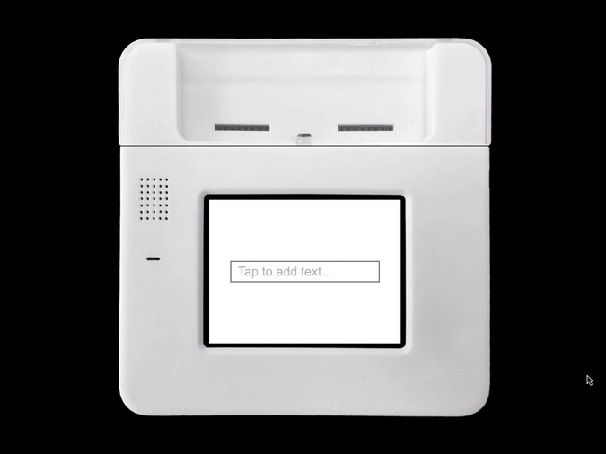

#Adding Pre-made Controls 

Much of the strength of KinomaJS is in its flexibility. The basic tools of drawing containers, labels, skins, and textures can be combined to make arbitrarily complex widgets and UIs. But for rapid prototyping it is often beneficial to work with existing input controls; this tutorial will teach you to use a selection of modules and assets we have created for this purpose. It assumes a basic understanding of how to use Kinoma Code and how to create and customize user interfaces with KinomaJS; if you are not familiar with these topics, please refer to the tutorials on [The KinomaJS Containment Hierarchy](../containment-hierarchy) and [Displaying Images and Media](../images-media).

##Sample Application

Start by downloading <a href="../content/controls.zip" download>this sample application</a> and opening it in Kinoma Code. 

In the subsequent sections, we will walk through the process to create the following controls: buttons, checkboxes, radio groups, sliders, switches, and fields. All will use some subset of the modules and assets found in this project. All you will need to change is the application file `main.js`, which is found in the `src` folder.

##Buttons

The following example builds a single button that traces to the console when tapped. When this application is run, you see the button as shown in Figure 1; the fill color of the button switches from gray to blue when tapped.

```
import { 
	Button,
	ButtonBehavior 
} from 'buttons';

let whiteSkin = new Skin({ fill: "white" });
let bigText = new Style({ font: "bold 55px", color: "#333333" });

let MyButtonTemplate = Button.template($ => ({
    top: 50, bottom: 50, left: 50, right: 50,
    contents: [
        Label($, {left: 0, right: 0, height: 55, string: $.textForLabel, style: bigText})
    ],
    Behavior: class extends ButtonBehavior {
        onTap(button){
            trace("Button was tapped.\n");
        }
    }
}));

let mainContainer = new Container({
	left: 0, right: 0, top: 0, bottom: 0, skin: whiteSkin,
	contents: [
		new MyButtonTemplate({ textForLabel: "Click Me!" })
	]
});
application.add(mainContainer);
```

**Figure 1.** Button



There is a lot going on here, but it all builds on things you have already seen in the Containment Hierarchy tutorial. The big new additions are:

- We use JavaScript’s inheritance mechanism to extend the built-in button `container` and `behavior` objects.

- Rather than just instantiate content directly, we make our own custom template. This template (`MyButtonTemplate`) enables us to make multiple instances that share common properties (in this case, `top`, `bottom`, `left`, `right`, a behavior, and a subcontent label). Templates can be dynamically bound to data at instantiation time. Here we use that feature to set the `string` property of the inner `label` object.


##Checkboxes

Checkboxes are buttons that toggle between a selected and an unselected state. This example draws three checkboxes with labels (Figure 2) and traces to the console whenever they are selected or unselected. In this sample we add one more syntactical convenience: the ability to specify a behavior definition inline with the definition of a `content` template.

```
import { 
	LabeledCheckbox 
} from 'buttons';

let MyCheckBoxTemplate = LabeledCheckbox.template($ => ({
    active: true, top: 50, bottom: 50, left: 50, right: 50,
    behavior: Behavior({
        onSelected: function(checkBox){
            trace("Checkbox with name " + checkBox.buttonLabel.string + " was selected.\n");
        },
        onUnselected: function(checkBox){
            trace("Checkbox with name " + checkBox.buttonLabel.string + " was unselected.\n");
        }
    })
}));

let checkbox = [];
checkbox[0] = new MyCheckBoxTemplate({ name: "Hello" });
checkbox[1] = new MyCheckBoxTemplate({ name: "World" });
checkbox[2] = new MyCheckBoxTemplate({ name: "Click Me" });

let whiteSkin = new Skin({ fill: "white" });
let mainColumn = new Column({ left: 0, right: 0, top: 0, bottom: 0, skin: whiteSkin });
for (var i = 0; i < 3; i++) 
    mainColumn.add(checkbox[i]);
    
application.add( mainColumn );
```

**Figure 2.** Checkboxes



##Radio Groups

Radio groups are collections of radio buttons, in which only one button can be selected at a time. This sample creates a radio group (Figure 3) and traces the name of the selection when it changes.

```
import { 
	RadioGroup, 
	RadioGroupBehavior
} from 'buttons';

let MyRadioGroup = RadioGroup.template($ => ({
    top: 50, bottom: 50, left: 50, right: 50,
    Behavior: class extends RadioGroupBehavior {
    	onRadioButtonSelected(buttonName) {
    		trace("Radio button with name " + buttonName + " was selected.\n");
    	}
    }
}));

let whiteSkin = new Skin({ fill: "white" });
let mainContainer = new Container({ 
	left: 0, right: 0, top: 0, bottom: 0, skin: whiteSkin,
	contents: [
		new MyRadioGroup({buttonNames: "Lorem,Ipsum,Dolor,Sit,Amet"})
	]
});

application.add(mainContainer);
```

**Figure 3.** Radio Group




##Sliders

Sliders can be used for entering (quasi-)continuous numerical values. There are vertical, horizontal, and logarithmic variants. This example demonstrates using a horizontal slider (Figure 4) and traces out the value selected as it is being changed.

```
import {
	HorizontalSlider, HorizontalSliderBehavior
} from 'sliders';

let MySlider = HorizontalSlider.template($ => ({
    height: 50, left: 50, right: 50,
    Behavior: class extends HorizontalSliderBehavior {
        onValueChanged(container) {
	        trace("Value is: " + this.data.value + "\n");
    	}
    }
}));

let graySkin = new Skin({ fill: "gray" });
let mainContainer = new Container({
	left: 0, right: 0, top: 0, bottom: 0, skin: graySkin,
	contents: [
		new MySlider({ min: 0, max: 100, value: 50 })
	]
});
application.add(mainContainer);
```

**Figure 4.** Slider



##Switches

Switches are functionally like checkboxes, but with a visual representation of a toggle switch. This example creates an on/off switch (Figure 5) and traces to the console when it is toggled.

```
import {
	SwitchButton,
	SwitchButtonBehavior
} from 'switch';

let MySwitchTemplate = SwitchButton.template($ => ({
    height: 50, width: 100,
    Behavior: class extends SwitchButtonBehavior {
        onValueChanged(container){
            trace("Value is: " + this.data.value + "\n");
        }
    }
}));

let graySkin = new Skin({fill: "gray"});
let mainContainer = new Container({
	left: 0, right: 0, top: 0, bottom: 0, skin: graySkin,
	contents: [
		new MySwitchTemplate({ value: 1 })
	]
});

application.add(mainContainer);
```

**Figure 55.** Switch


##Fields

Fields are editable labels, used for capturing small amounts of text. The following example creates an editable label with hint text instructing the user to tap the field to add text, as shown in Figure 6; when tapped, it brings up the on-device keyboard for input. The keyboard can be closed by tapping on the background container. This example is quite a bit longer, but it nicely pulls together everything we have learned thus far.

```
import {
	FieldScrollerBehavior,
	FieldLabelBehavior
} from 'field';

import {
	SystemKeyboard
} from 'keyboard';

let nameInputSkin = new Skin({borders: {left: 2, right: 2, top: 2, bottom: 2 }, stroke: 'gray'});
let fieldStyle = new Style({color: 'black', font: 'bold 24px', horizontal: 'left', vertical: 'middle', left: 5, right: 5, top: 5, bottom: 5});
let fieldHintStyle = new Style({color: '#aaa', font: '24px', horizontal: 'left', vertical: 'middle', left: 5, right: 5, top: 5, bottom: 5});
let whiteSkin = new Skin({fill: "white"});
let fieldLabelSkin = new Skin({ fill: ['transparent', 'transparent', '#C0C0C0', '#acd473'] });

let MyField = Container.template($ => ({ 
    width: 250, height: 36, skin: nameInputSkin, contents: [
        Scroller($, { 
            left: 4, right: 4, top: 4, bottom: 4, active: true, 
            Behavior: FieldScrollerBehavior, clip: true, 
            contents: [
                Label($, { 
                    left: 0, top: 0, bottom: 0, skin: fieldLabelSkin, 
                    style: fieldStyle, anchor: 'NAME',
                    editable: true, string: $.name,
                    Behavior: class extends FieldLabelBehavior {
                        onEdited(label) {
                            let data = this.data;
                            data.name = label.string;
							label.container.hint.visible = (data.name.length == 0);
							trace(data.name+"\n");
                        }
                    },
                }),
                Label($, {
                    left: 4, right: 4, top: 4, bottom: 4, style: fieldHintStyle,
                    string: "Tap to add text...", name: "hint"
                }),
            ]
        })
    ]
}));

let MainContainerTemplate = Container.template($ => ({
    left: 0, right: 0, top: 0, bottom: 0, 
    skin: whiteSkin, active: true,
    contents: [
    	new MyField({name: ""})
    ],
    Behavior: class extends Behavior {
        onTouchEnded(content) {
            SystemKeyboard.hide();
            content.focus();
        }
    }
}));

let mainContainer = new MainContainerTemplate();
application.add(mainContainer);
```

**Figure 6.** Field (Editable Label)

