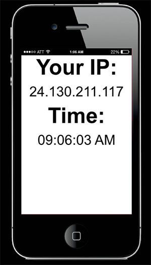

# Interacting with Web Services Asynchronously

If you have background tasks to complete (such as a lengthy computation or waiting for a response from a web service), it is important that you execute them [asynchronously](http://www.i-programmer.info/programming/theory/6040-what-is-asynchronous-programming.html) to avoid locking up the user interface and the rest of your app during execution. The mechanisms for doing this in KinomaJS are *messages* and *handlers.*
 
- Messages asynchronously ask another part of your program or an external web service to complete some task.

- Handlers listen for messages addressed to them, can execute code, can send new messages of their own, and can wait for responses to messages.

For more information on application flow, see the section on flow in the [*KinomaJS Overview*](../../../../../xs6/xsedit/features/documentation/docs/overview/overview.md) document.

## Messages

Applications use messages to communicate with each other, with the shell, and with internet services. KinomaJS messages have the structure of HTTP messages: URL, request headers, request body, response headers, and response body. Messages are always asynchronous, delivering their response through events.

Applications often use messages to organize their own flow. For example, messages are convenient for operations such as going forward and backward from screen to screen and changing part of an application's screen.

Applications running on separate devices can use messages to communicate with each other through the SSDP and HTTP clients and servers in KinomaJS.

> **Note:** More detailed information about messages can be found in the [*KinomaJS Overview*](../../../../../xs6/xsedit/features/documentation/docs/overview/overview.md) and [*KinomaJS JavaScript Reference*](../../../../../xs6/xsedit/features/documentation/docs/javascript/javascript.md) documents.

### Promises

[*Promises*](https://developer.mozilla.org/en-US/docs/Web/JavaScript/Reference/Global_Objects/Promise), one of the many exciting JavaScript 6th Edition (ES6) updates, are designed to avoid what is referred to as [callback hell](https://www.quora.com/What-is-callback-hell). Before KinomaJS was updated to use ES6, only contents and handlers could invoke messages, receiving the message result in the `onComplete` event of their behavior.

```
let GetURL = Content.template($ => ({
    Behavior: class extends Behavior {
        onCreate(content, data) {
            content.invoke(new Message(data), Message.TEXT);
        }
        onComplete(content, message, text) {
            trace(text);
        }
    }
}));
let getURL = new GetURL("http://www.kinoma.com");
```

KinomaJS has extended messages so that they can be invoked directly, returning a promise to receive the message result. `Message.prototype.invoke` returns a promise.

```
let message = new Message("http://www.kinoma.com");
let promise = message.invoke(Message.TEXT);
promise.then(text => { trace(text) });
```
	
The code above can be shortened to this single line:

```
new Message("http://www.kinoma.com").invoke(Message.TEXT).then(text => { trace(text); });
```
	
The argument of `Message.prototype.invoke` is the type of result you want (`Message.JSON`, `Message.TEXT`, or `Message.DOM`). If you pass `undefined`, the promise will resolve with the message itself.

```
let message = new Message("http://www.kinoma.com");
message.invoke().then(message =>
	{ trace(message.responseText) });
```

You can chain messages with `then`. For example, in the following code the first message retrieves the latitude and longitude, and then the second message retrieves the weather forecast.

```
let message = new Message("http://k3.cloud.kinoma.com/api?extAction=GeoIP&extMethod=getRecord")
message.invoke(Message.JSON).then(json => {
    let record = json.result.record;
    let message = new Message("http://api.openweathermap.org/data/2.5/weather?units=imperial&lat="
    	+record.latitude+"&lon="+record.longitude
    	+"&appid=65ec00eff25e94b725325799cde2f404");
    return message.invoke(Message.JSON);
}).then(json => {
	trace("High: "+ json.main.temp_max + "\nLow: " + json.main.temp_min + "\n");
});
```
	
### Example: Interacting with Web Services and Modifying the UI Programmatically 

Here we will call the JSON Test [IP Address API](http://www.jsontest.com/#ip) and [Date & Time API](http://www.jsontest.com/#date) and display the results on the screen. There are certainly better ways to get the date and time in JavaScript, but the point here is to work with web services.

Start by defining the UI.

```
var whiteSkin = new Skin({ fill: "white" });
var titleStyle = new Style({ font: "bold 70px", color:"black" });
var resultStyle = new Style({ font: "45px", color: "black" });
	
var mainColumn = new Column({
   left: 0, right: 0, top: 0, bottom: 0,
   skin: whiteSkin,
   contents:[
      new Label({left: 0, right: 0, height: 70, string: "Your IP:", 
         style: titleStyle}),
      new Label({left: 0, right: 0, height: 70, string: "Loading...", 
         style: resultStyle, name: "ipLabel"}),
      new Label({left: 0, right: 0, height: 70, string: "Time:", 
         style: titleStyle}),
      new Label({left: 0, right: 0, height: 70, string: "Loading...", 
         style: resultStyle, name: "timeLabel"}),
   ]
});
```
	
When the results come back from the web service call, we want to update the second and fourth labels' strings. The easiest way to do this is by using the `name` property of a piece of content; this enables you to find a specific subcontent of a piece of content so that you can make the change directly on it.	

Now tell the application to make the call when it is launched.

```
application.behavior = Behavior({	
   onLaunch: function(application, data){
      application.add(mainColumn);
      new Message("http://ip.jsontest.com/").invoke(Message.JSON).then(json =>
		   { mainColumn.ipLabel.string = json.ip; });
      new Message("http://time.jsontest.com/").invoke(Message.JSON).then(json =>
		   { mainColumn.timeLabel.string = json.time; });
   }
});
```

The ES6 syntax associated with promises is easy to read: you invoke a message and then do something with the returned data. We specify that we are expecting to get JSON data back; this tells KinomaJS to run `JSON.parse` over the text response that comes back.

The final result will look something like what is shown in Figure 1.

**Figure 1.** Output of Web Services Example


	
## Handlers

Handlers receive and respond to messages. A handler is bound to a path. When a message is sent using the path that a handler is bound to, that handler's `onInvoke` function is called asynchronously. 

>**Note:** More detailed information about handlers can be found in the [*KinomaJS Overview*](../../../../../xs6/xsedit/features/documentation/docs/overview/overview.md) and [*KinomaJS JavaScript Reference*](../../../../../xs6/xsedit/features/documentation/docs/javascript/javascript.md) documents.

This code adds a handler to the application and sends a message to trigger it:

```
Handler.bind("/sayHello", {
	onInvoke: function(handler, message){
		trace("Hello!\n");
	},
});
	
new Message("/sayHello").invoke();
```

You can also pass in objects when calling a handler. In the following example, a string is passed in.

```
Handler.bind("/saySomethingAndWait", {
	onInvoke: function(handler, message){
		trace(message.requestObject+"\n");
		handler.wait(100);
	},
	onComplete: function(handler, message) {
		trace("I'm done!\n");
	}
});
	
new MessageWithObject("/saySomethingAndWait", "Hello!").invoke();
```

The argument of `Handler.prototype.wait` is the time (in milliseconds) that the handler should wait before triggering its `onComplete` event. The message invoking the handler is suspended while it waits, and is resumed when the time has elapsed.


## Where to Go Next

Now that you have learned about asynchronous application flow in KinomaJS, the next step is to learn how to break applications up into modules. The next tutorial, [Using Modules for Screens and Transitions](../multiple-screens-modules-transitions/multiple-screens-modules-transitions.md), covers this as well as transitions between multiple screens in a KinomaJS app.

