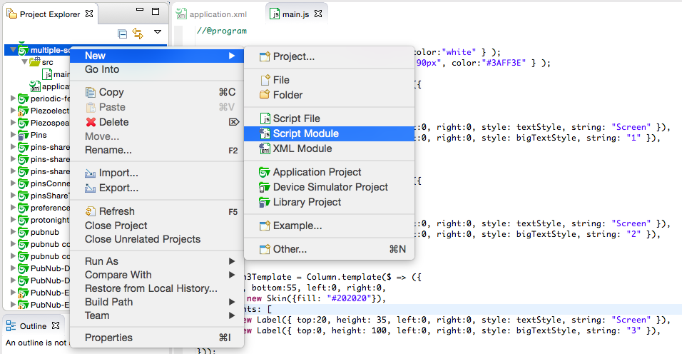
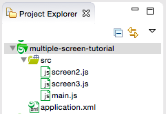

#Using Modules for Screens and Transitions

This tutorial will teach you to build multi-screen applications, split them into modules, and add transitions between screens. It assumes a basic understanding of how to use Kinoma Studio and how to create and customize user interfaces with KinomaJS; if you are not familiar with these topics, please refer to the tutorial [The KinomaJS Containment Hierarchy](../containment-hierarchy/containment-hierarchy.md).

##Multiple Screens

Here we will build a simple app that has multiple screens. Each screen will be defined by a `Container` template that is dynamically instantiated into a `container` object when needed. In the next section we will break each screen out into its own module.

Start by defining three screens in the `main.js` file. 

```
var textStyle = new Style( { font: "30px", color: "white" } );
var bigTextStyle = new Style( { font: "bold 90px", color:"#3AFF3E" } );
	
var Screen1Template = Column.template($ => ({
   left: 0, right: 0, top: 0, bottom: 55,
   skin: new Skin({fill: "#202020"}),
   contents: [
      new Label({  
         left: 0, right: 0, top: 20, height: 35, style: textStyle, 
         string: "Screen" 
      }),
      new Label({ 
         left: 0, right: 0, top: 0, height: 100, style: bigTextStyle, 
         string: "1" 
      }),
   ]
}));
	
var Screen2Template = Column.template($ => ({
   left: 0, right: 0, top: 0, bottom: 55,
   skin: new Skin({fill: "#202020"}),
   contents: [
      new Label({  
         left: 0, right: 0, top: 20, height: 35, style: textStyle, 
         string: "Screen" 
      }),
      new Label({ 
         left: 0, right: 0, top: 0, height: 100, style: bigTextStyle, 
         string: "2" 
      }),
	]
}));
	
var Screen3Template = Column.template($ => ({
   left: 0, right: 0, top: 0, bottom: 55,
   skin: new Skin({fill: "#202020"}),
   contents: [
      new Label({  
         left: 0, right: 0, top: 20, height: 35, style: textStyle, 
         string: "Screen" 
      }),
      new Label({ 
         left: 0, right: 0, top: 0, height: 100, style: bigTextStyle, 
         string: "3" 
      }),
   ]
}));
```

> **Note:** With some optimization, all three templates could easily share a single template. But the purpose of this tutorial is to demonstrate how to use many different screens.

Create a variable named `currentScreen`. This variable will keep track of which screen is currently being displayed so that it can easily be removed. We will start by setting it to an instance of `Screen1Template`.

```
var currentScreen = new Screen1Template();
application.add(currentScreen);
```

In the following example, the behavior of the buttons in a navigation bar contains all the logic to switch from screen to screen.

```
var smallTextStyle = new Style( { font: "20px", color: "white" } );
var NavButton = Container.template($ => ({
   active: true, top: 2, bottom: 2, right: 2, left: 2,
   behavior: Behavior({
      onCreate: function(content){
         this.upSkin = new Skin({
            fill: "transparent", 
	            borders: { left: 1, right: 1, top: 1, bottom: 1 }, 
	            stroke: "white"
            });
            this.downSkin = new Skin({
               fill: "#3AFF3E", 
               borders: { left: 1, right: 1, top: 1, bottom: 1 }, 
               stroke: "white"
            });
            content.skin = this.upSkin;
         },
      onTouchBegan: function(content){
            content.skin = this.downSkin;  // Make button darker while it's being pressed
         },
      onTouchEnded: function(content){
            content.skin = this.upSkin;  // Change button back to being transparent
            application.remove(currentScreen);  // Remove the old screen from the application
            currentScreen = new $.nextScreen;  // Make the new screen
            application.add(currentScreen);  // Add the new screen to the application
         },
      }),
   contents: [
      Label($, { 
         left: 0, right: 0, top: 0, bottom: 0, style: smallTextStyle, 
         string: $.string 
      })
   ]
}));
	
var navBar = new Line({ 
	left: 0, right: 0, bottom: 0, height: 55,
	skin: new Skin({ fill: "black" }),
	contents: [
		new NavButton({ string: 1, nextScreen: Screen1Template }),
		new NavButton({ string: 2, nextScreen: Screen2Template }),
		new NavButton({ string: 3, nextScreen: Screen3Template }),
	]
});
application.add(navBar);
```
	
You now have a navigable app! Run it on a simulator. The video in Figure 1 shows what running it on an iPhone will look like.

**Figure 1.** Running the Multiple Screens Example

<iframe width="100%" height="500" src="https://www.youtube.com/embed/WjnZnIA7dUo?rel=0&amp;vq=hd1080" frameborder="0" allowfullscreen><a href="https://www.youtube.com/embed/WjnZnIA7dUo?rel=0&amp;vq=hd1080">Watch Video</a></iframe>

##Splitting Screens into Modules

It is often desirable to split independent screens into their own modules. This enables multiple programmers to develop screens independently and aids in code readability by splitting up the application into its logical components. In this section, we will divide our application up into three different files: `main.js`, `screen2.js`, and `screen3.js`.

The first step is to create the files. We do this by right-clicking on our `src` folder and selecting **New** > **Script Module**, as shown in Figure 2.

**Figure 2.** Creating a Script Module



Do this twice, creating `screen2.js` and `screen3.js`. Figure 3 shows what the resulting Project Explorer should look like.

**Figure 3.** New Script Modules in Project Explorer



Now take the code that defines screens 2 and 3 and move it out to their respective modules. The two module files will look as shown below.

#####`screen2.js`:

```
//@module
	
exports.Screen = Column.template($ => ({
	top: 0, bottom: 55, left: 0, right: 0, 
	skin: new Skin({fill: "#202020"}),
	contents: [
		new Label({ top: 20, height: 35, left: 0, right: 0, style: textStyle, 
					string: "Screen" }),
		new Label({ top: 0, height: 100, left: 0, right: 0, style: bigTextStyle, 
					string: "2" }),
	]
}));
```	

#####`screen3.js`:

```
//@module
	
exports.Screen = Column.template($ => ({
	top: 0, bottom: 55, left: 0, right: 0, 
	skin: new Skin({fill: "#202020"}),
	contents: [
		new Label({ top: 20, height: 35, left: 0, right: 0, style: textStyle, 
					string: "Screen" }),
		new Label({ top: 0, height: 100, left: 0, right: 0, style: bigTextStyle, 
					string: "3" }),
	]
}));
```

Note that any variable we want to be accessible from the rest of the application--whether a template as here, a function, or any other type of variable--must be exported in the module. Here, we export our template as `exports.Screen` in each module. We can then reference them in `main.js` by requiring the `.js` file, just as we do with built-in libraries.

The new `main.js` looks like this:

```
//@program
	
var SCREEN2 = require("screen2");
var SCREEN3 = require("screen3");
	
textStyle = new Style( { font: "30px", color: "white" } );
bigTextStyle = new Style( { font: "bold 90px", color: "#3AFF3E" } );
	
var Screen1Template = Column.template($ => ({
	top: 0, bottom: 55, left: 0, right: 0, 
	skin: new Skin({fill: "#202020"}),
	contents: [
		new Label({ top: 20, height: 35, left: 0, right: 0, style: textStyle, 
					string: "Screen" }),
		new Label({ top: 0, height: 100, left: 0, right: 0, style: bigTextStyle, 
					string: "1" }),
	]
}));
	
var currentScreen = new Screen1Template();
application.add(currentScreen);
	
var smallTextStyle = new Style( { font: "20px", color:"white" } );
var NavButton = Container.template($ => ({
	active: true, top: 2, bottom: 2, right: 2, left: 2,
	behavior: Behavior({
		onCreate: function(content){
			this.upSkin = new Skin({
				  fill: "transparent", 
				  borders: {left: 1, right: 1, top: 1, bottom: 1}, 
				  stroke: "white"
				});
			this.downSkin = new Skin({
			  fill: "#3AFF3E", 
			  borders: {left: 1, right: 1, top: 1, bottom: 1}, 
			  stroke: "white"
			});
			content.skin = this.upSkin;
		},
		onTouchBegan: function(content){
			content.skin = this.downSkin;
		},
		onTouchEnded: function(content){
			content.skin = this.upSkin;
			application.remove(currentScreen);  // Remove the old screen from the application
			currentScreen = new $.nextScreen;  // Make the new screen
			application.add(currentScreen);  // Add the new screen to the application
		},
	}),
   contents: [
      Label($, { top: 0, bottom: 0, left: 0, right: 0, style: smallTextStyle, 
                 string: $.string })
   ]
}));
	
var navBar = new Line({ bottom: 0, height: 55, left: 0, right: 0,
	skin: new Skin({ fill: "black" }),
	contents: [
		new NavButton({ string: "1", nextScreen: Screen1Template }),
		new NavButton({ string: "2", nextScreen: SCREEN2.Screen }),
		new NavButton({ string: "3", nextScreen: SCREEN3.Screen }),
		
	]
});
application.add(navBar);
```
 
A few items of interest:

- We do not need to redeclare any skins or other variables defined in `main.js` within our modules. Anything declared globally within `main.js` will be available to all modules. This goes for functions as well as normal variables.
 
- To declare a variable globally in `main.js`, you must remove the `var` keyword, because modules are compiled in sloppy mode rather than in strict mode. If you are new to JavaScript or do not know what these terms mean, [the W3Schools description](http://www.w3schools.com/js/js_strict.asp) and [this blog post](https://blog.domenic.me/strict-mode-static-scoping/) explain them well.

- When we use `require` to bring in our new modules, we assign them to a variable name. By convention, module variables are usually ALL CAPS.

- When you want to refer to a variable exported within a module, you simply use the module variable generated by `require` and then reference the property exported. For instance, to use the `exports.Screen` variable from a module we required as `SCREEN1`, we just reference `SCREEN1.Screen`.

##Using Transitions to Move Between Screens

It is often desirable to transition gracefully between multiple screens rather than doing so abruptly. This is accomplished in KinomaJS using *transitions* and `container.run`. Transitions take care of the work of removing the old screen and adding the new screen, which will simplify your code. In this section you will learn how to use some of our pre-made transitions.

Start by downloading this file and saving it into your `src` folder: <a href="../content/transition.js" download>`transition.js`</a>. (This is the JavaScript version of `transition.xml` from the built-in [MobileFramework library](https://github.com/Kinoma/kinomajs/tree/master/kinoma/kpr/libraries/MobileFramework).)

Now create a behavior that runs a new transition every 1800 ms. The following code will cycle through the transitions found in `transition.js`.

```
var TRANSITIONS = require('transitions');
	
var transitioningBehavior = Behavior({
	onCreate: function(container, data) {
		this.numTransitions = 11;
	},
	onDisplayed: function(container) {
		container.interval = 1800;
		container.start();
	},
	onTimeChanged: function(container) {
		container.bubble( "onTriggerTransition" );
	},
	onTriggerTransition: function(container) {
		var toScreen = new NumberedScreen({ 
			fillColor: screenColors[data.index%screenColors.length], 
			transitionNumber: data.index+1 
		});		
		switch ( data.index ) {
			case 0:
				container.run( new TRANSITIONS.CrossFade(), container.last, toScreen, 
					{ duration: 900 } );
				break;
			case 1:
				container.run( new TRANSITIONS.Push(), container.last, toScreen, 
					{ direction: "left", duration: 400 } );
				break;
			case 2:
				container.run( new TRANSITIONS.Push(), container.last, toScreen, 
					{ direction: "right", duration: 400 } );
				break;
			case 3:
				container.run( new TRANSITIONS.Push(), container.last, toScreen, 
					{ direction: "up", easeType: "bounceEaseOut", duration: 600 } );
				break;
			case 4:
				container.run( new TRANSITIONS.Push(), container.last, toScreen, 
					{ direction: "down", easeType: "backEaseIn", duration: 600 } );
				break;
			case 5:
				container.run( new TRANSITIONS.Flip(), container.last, toScreen, 
					{ direction: "left" } );
				break;
			case 6:
				container.run( new TRANSITIONS.Flip(), container.last, toScreen,
					{ direction: "right" } );
				break;
			case 7:
				container.run( new TRANSITIONS.Flip(), container.last, toScreen, 
					{ direction: "up", easeType: "sineEaseOut", duration: 750 } );
				break;
			case 8:
				container.run( new TRANSITIONS.Flip(), container.last, toScreen, 
					{ direction: "down", easeType: "sineEaseOut", duration: 750 } );
				break;
			case 9:
				container.run( new TRANSITIONS.TimeTravel(), container.last, toScreen, 
					{ direction: "forward", easeType: "sineEaseIn", duration: 1000 } );
				break;
			case 10:
				container.run( new TRANSITIONS.TimeTravel(), container.last, toScreen, 
					{ direction: "back", easeType: "sineEaseOut", duration: 1000 } );
				break;
		}
		data.index = (data.index+1)%this.numTransitions;
	},
})
```

Make a template for a screen with a giant number in the middle. This will make it easy to tell when the screen transitions.

```
var hugeLabelStyle = new Style({ 
   color: 'black', font: 'bold 125px', horizontal: 'center', vertical: 'middle', 
});
var NumberedScreen = Container.template($ => ({ 
   left: 0, right: 0, top: 0, bottom: 0, skin: new Skin({ fill: $.fillColor }), 
   contents: [
      Label($, { left: 0, right: 0, style: hugeLabelStyle, 
                 string: $.transitionNumber, }),
   ]
}));
```

Create the main container to run the transitions and the first numbered screen.

```
var data = { index:1 };  // Used to determine which transition to run next
var screenColors = ['#5EFF56', '#537F51', '#85CC82', '#2F7F2B'];  //Used to determine color of numbered screens
var mainScreen = new Container({ 
	left: 0, right: 0, top: 0, bottom: 0, behavior: transitioningBehavior, 
});
var firstScreen = new NumberedScreen({ fillColor: screenColors[0], 
	transitionNumber: 1 });
```
	
Now add the container that runs the transitions to the application and put the first screen inside it.

```
application.add(mainScreen);
mainScreen.add(firstScreen);
```

The video in Figure 4 shows the example application you just made, captioned with the names of the transitions as they run.

**Figure 4.** Running the Transitions Example

<iframe width="100%" height="500" src="https://www.youtube.com/embed/FCGO5SdRgX0?rel=0&amp;vq=hd1080" frameborder="0" allowfullscreen><a href="https://www.youtube.com/embed/FCGO5SdRgX0?rel=0&amp;vq=hd1080">Watch Video</a></iframe>

## Where to Go Next

At this point you are familiar with all the tools you need to start making applications with fantastic user interfaces! You might want to look at the [sample projects](https://github.com/Kinoma/KPR-examples) on GitHub and and learn to get *really* fancy with UI elements.

For advanced UI topics, check out these tutorials:

- [Transforming Content at Runtime](../layers/layers.md)

- [Scrolling Content and Programmatically Adjusting Layout](../advanced-layouts/advanced-layouts.md)

- [Displaying Images and Media](../images-media/images-media.md)