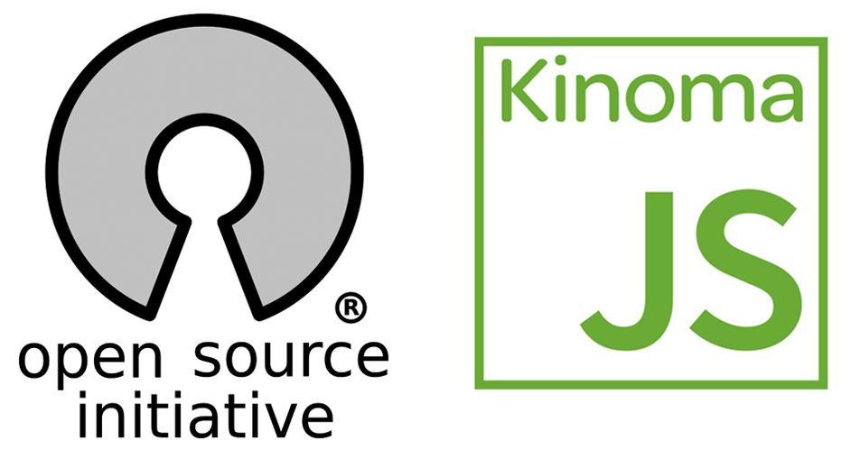

<!-- Version: 160419-CR / Last reviewed: October 2019

This Tech Note is a starting point for your exploration of the KinomaJS code. It gives an overview of what is there, why it is there, how the pieces fit together, and what to expect going forward.
-->

# Introducing the KinomaJS Open Source Implementation

**Peter Hoddie**  
March 2, 2015

The [KinomaJS source code](https://github.com/Kinoma/kinomajs) is large--more than 3,700 files. The project has a long history as a proprietary technology, with portions dating back over a decade. Designed for portability, it has included support for numerous versions of many different operating systems. There is a lot there, and there is some history to navigate through. This Tech Note is a starting point for your exploration of the KinomaJS code. It will not answer every question, but it should give you a feel for what is there, why it is there, how the pieces fit together, and what to expect going forward.

## KPL

The Kinoma Porting Layer (KPL) is the bottom of the KinomaJS stack. It is a very light portability layer, modeled, as much as practical, on POSIX. Because KinomaJS runs on a wide variety of operating systems, the goal is to isolate all direct calls to the host operating in KPL. Some RTOS hosts do not support the full ANSI C library, so it cannot even be safely assumed that functions like `printf` are available. To avoid surprises with the size of types, a portable-type system modeled on that used by QuickTime is used.

KinomaJS uses KPL (which is documented [on GitHub](https://github.com/Kinoma/kinomajs/tree/master/core/kpl/doc)) for Linux builds. However, KPL has not been fully integrated into KinomaJS, so it is not yet used for iOS/Mac OS X, Android, or Windows. For those platforms, the code is conditionally compiled in, primarily in the Fsk portions of the tree. There are a handful of places where this gets messy, particularly [FskWindow](https://github.com/Kinoma/kinomajs/blob/master/core/ui/FskWindow.c). The intention is to fully migrate to KPL, which will clean up parts of the code and also provide an opportunity to prune out support for obsolete operating systems.

## XS Virtual Machine

The XS virtual machine is the implementation of JavaScript for KinomaJS, which is designed and optimized for use on embedded devices. While XS also happens to run very well for mobile applications, it really shines on embedded devices. The design choices are very different for embedded devices, where both RAM and static storage memory are much more limited and CPU performance is considerably less.

For security and portability reasons, the JavaScript engines in a web browser will not allow the programmer to run native code. To get around this, modern browser-based JavaScript engines have sophisticated tools for converting scripts to native code on the fly. When building an embedded device, the developers of the device can safely integrate native functions into the JavaScript engine. XS supports this through its [XS in C](../../xs-in-c) interface. Assuming that the primary developers of the device can use native code when necessary reduces the performance demands on the JavaScript engine, which can be simpler and more streamlined.

XS is based on the JavaScript (ECMAScript) 5th Edition specification. Like every JavaScript engine, it does not completely conform to the specification. For practical purposes, it has proven to be compatible with most 5th Edition scripts.

XS is an interpreted runtime. Scripts are compiled to byte code, which is then executed by the interpreter. The interpreter is written in pure ANSI C. It has no dependencies on the rest of the KinomaJS repository, so it can be used as a standalone JavaScript engine.

The interpreter has an accelerated run loop, which is used for approximately 80% of opcodes executing typical KinomaJS code. When the accelerated run loop cannot handle an opcode, it falls back to the full run loop. The accelerated run loop has optional ARM-native optimizations and uses [threaded code dispatching](http://gcc.gnu.org/onlinedocs/gcc-3.2/gcc/Labels-as-Values.html) to speed opcode processing.

Because scripts on an embedded device do not change, it is practical to pre-compile them to byte code. Pre-compiled byte code is more compact than script code and loads considerably faster. The [`xsc`](https://github.com/Kinoma/kinomajs/tree/master/xs/sources/xsc) command-line tool compiles JavaScript to KinomaJS byte code.

XS has a network debugging protocol, which uses a variation of HTTP with XML payloads. Because it is network-based, remote debugging is supported, which is essential for embedded development. The [Kinoma Studio](http://kinoma.com/develop/studio/) IDE contains a client for the XS debugger protocol.

Internally, XS implements an integer type as an optimization to the JavaScript number. The integer type may be used to store and operate on number values that can be expressed as a 32-bit signed integer. This is handled transparently to scripts, so there is no change in the language or runtime model.

XS has almost no extensions to the standard JavaScript language. The one significant exception is support for a *sandbox.* The sandbox is a way to ensure there are no collisions between properties used by the embedded device implementation and user scripts running in the same VM. It is a bit like having private fields in a C++ class. The sandbox was originally designed to support DRM implementations in JavaScript, though it is no longer used for that. The sandbox is described briefly in the document [*XS*](../../xs). The sandbox is being considered for elimination in the future, which would somewhat simplify the runtime. However, the current Kinoma Platform Runtime (KPR) implementation depends on the sandbox.

## Fsk

The Fsk layer is the fundamental functional layer of KinomaJS. In the source tree, it is contained in [`kinomajs/core/`](https://github.com/Kinoma/kinomajs/tree/master/core). By relying on KPL, the implementation of XS is designed to be fully portable. The core functionality is minimal by most measures, to keep the footprint small. The Fsk layer includes the following functionality:

* Memory

* Lists

* Files

* Strings

* Text format conversion

* Time

* Timer callbacks

* Network (sockets, DNS, HTTP)

* Synchronization primitives

* Threads

* Window system integration

* Events

* Graphics

* Digital media managers

* Instrumentation for debugging

[FskExtensions](https://github.com/Kinoma/kinomajs/blob/master/core/base/FskExtensions.c) implements a simple mechanism for native code plug-ins to the Fsk layer. The Files and Digital media managers use extensions for plug-ins. For example, support for reading files directly from compressed ZIP files is implemented by the [`fsZip`](https://github.com/Kinoma/kinomajs/tree/master/extensions/fsZip) extension.

The Fsk layer is a pure native implementation, with no direct interaction with JavaScript. In KinomaJS, the KPR layer is what binds scripts through XS to the native functionality provided by Fsk; XS is hosted on top of Fsk through bindings implemented in [`xs_fsk.c`](https://github.com/Kinoma/kinomajs/blob/master/xs/sources/xslib/xs_fsk.c).

## Graphics

Graphics is part of the Fsk layer. The [core graphics code](https://github.com/Kinoma/kinomajs/tree/master/core/graphics) is based on an extremely simple model. There are just three primitives: fill rectangle, blit bitmap, and draw text. While this may seem too limited to be useful, it is sufficient for a surprisingly large fraction of applications.

The core contains a full software implementation of these primitives, with support for a wide array of pixel sizes and formats. Text is composited by Fsk graphics. Glyphs are generated by the host OS when running on Mac OS X, iOS, and Windows, or by FreeType when running on Linux or Android.

The core also contains an optional OpenGL ES 2.0 implementation of the core graphics model. Applications render through the APIs provided by [FskPort](https://github.com/Kinoma/kinomajs/blob/master/core/base/FskPort.c), which ensures they get the same results whether using software or OpenGL rendering. The OpenGL implementation has been extensively tested for consistent results against a wide range of GPUs and operating systems.

More complex graphics operations can be implemented using the core graphics primitives. For example, KPR builds advanced text layout capabilities on top of the core text drawing capabilities.

The core graphics code implements visual effects, again both in software and OpenGL. Visual effects include box blur, colorize, erode, dilate, Gaussian blur, inner and outer glow, inner and outer shadow, and shade. The fundamental effects can be combined to render more complex operations.

There is also an implementation of vector graphics based on HTML5 Canvas. The software rendering implementation is complete. Rendering performance is good, though there is room for additional optimizations. An OpenGL ES 2.0 implementation of Canvas is underway but not yet ready for use.

## Media

Digital media support in KinomaJS is based on extensions that plug into relatively simple managers in the core. There are media managers for audio codecs (decode and encode), video codecs (decode and encode), audio filters, media readers (demuxers), media writers (muxers), and media players. KinomaJS contains portable implementations of many of the most commonly used of these. The audio and video codecs are not highly optimized, and even if they were, software implementations cannot compete with hardware-accelerated codec implementations. When possible, KinomaJS uses the audio and video codecs provided by the host platform. This is done today on both iOS and Android.

The [FskMediaPlayer](https://github.com/Kinoma/kinomajs/blob/master/core/managers/FskMediaPlayer.c) manager allows several different media players to coexist in KinomaJS. The current KinomaJS code contains a single media player, [FskMediaPlayerReader](https://github.com/Kinoma/kinomajs/blob/master/kinoma/mediareader/sources/FskMediaPlayerReader.c), which uses FskMediaReader extensions to demux data from files and streams, sequences them, decompresses them with FskAudioDecompress and FskVideoDecompress decoders, and then renders the video through FskPort while playing audio using FskAudio. There are media readers for AMR, ASF, AVI, FLAC, FLV, JPEG web cameras, MP3, MP4/3GPP/QuickTime, MPEG-1, MPEG-2, PCM, RTSP, and WAVE.

>**Note:** In the past, the FskMediaPlayer manager has been used to integrate support for DirectShow, QuickTime, and other proprietary media engines.

FskAudioDecompress implementations are provided for MP3, AAC, and Speex; FskVideoDecompress implementations are provided for MPEG-4 and AVC. In addition, the still image formats JPEG, PNG, BMP, and GIF are also implemented as FskVideoDecompress extensions.

## KPR

The Kinoma Platform Runtime (KPR) is the C code that implements the KinomaJS application framework. It provides the native implementation of the JavaScript objects that KinomaJS applications and shells interact with. There is extensive [documentation](../../../xs6/xsedit/features/documentation/docs/develop/documentation/) for building applications in JavaScript using KinomaJS. The documentation describes in detail the containment hierarchy used to build and render the user interface of applications, and the asynchronous messaging system that is used extensively in KinomaJS for network operations, files, hardware pin access, and communication between different parts of a KinomaJS app.

KPR is designed to run efficiently on top of Fsk and XS. Where possible, it manages JavaScript objects using *volatile host instances* (discussed in the document [*KinomaJS Overview*](../../../xs6/xsedit/features/documentation/docs/develop/documentation/overview/overview.md)) that help reduce the size of the JavaScript memory heap, which reduces the time needed for garbage collection.

KPR has a services mechanism that is used to add new native services. Examples of this in the KinomaJS repository are the Hardware Pins Service used by Kinoma Create to enable applications to script access to Digital, Analog, I2C, and Serial pins, and the Library Service, which provides access to the platform native media libraries on iOS and Android.

>**Note:** In the past, other application runtimes have been built on top of Fsk. The KPS application runtime for the Kinoma Play app for Android, Windows Mobile, and Symbian predated KPR, while building on XS and Fsk.

## XML

XS, Fsk, and the earlier KPS application framework made extensive use of XML. These efforts began before JSON became the de facto standard for data exchange. Because it implements JavaScript 5th Edition, XS supports JSON fully. However, XS also contains a very efficient mechanism called *grammars* for parsing XML documents into JavaScript objects and serializing JavaScript objects back to XML. XS grammars and their patterns are described in the document [*XS*](../../xs).

Given the decline in the use of XML, the intention is to make both the XML grammar and DOM support optional parts of XS in the future. Although there are good uses of XML, it no longer justifies a permanent place in the core.

## Roadmap

KinomaJS is a constantly evolving code base. Future plans include feature enhancements, portability improvements, and some code cleanups. The following list briefly describes the next steps to be taken. This roadmap is not set in stone; your feedback and input will help with refining it to best meet the needs of developers using KinomaJS.

#### XS (JavaScript/ECMAScript)

* ECMAScript 6th Edition

* Runtime performance improvements

* Further reduce runtime memory use

#### KPR

* Update to use ECMAScript 6th Edition features

* Enhance diagnostic support for developers

#### Platforms/Portability

* Enable Windows OS runtime build

* Complete Linux/GTK platform support

* Use KPL to isolate all platform dependencies

* Separate monolithic Android Java bindings into corresponding extensions

* Use Android NDK functions where now available instead of bridging to Java

* Scrub historic platform support

* 64-bit runtime support for all platforms

* iPhone conditionals update to iOS

#### Rendering

* Rewrite FskWindow to simplify runtime and porting

* Formalize OpenGL initialization/termination

* OpenGL-accelerated HTML5 Canvas implementation

#### Documentation

* Software architecture

* Portability coding practices

* More complete document build

# KinomaJS and Open Source Licensing FAQ

**Peter Hoddie**  
July 15, 2015

KinomaJS is available as source code through [a repository on GitHub](https://github.com/Kinoma/kinomajs). The goal in publishing the source code is to allow developers to incorporate KinomaJS into their hardware and software products. The KinomaJS software built by the Kinoma team is provided under the [Apache License Version 2.0](http://www.apache.org/licenses/LICENSE-2.0.html), which provides a great deal of flexibility in the use of KinomaJS. KinomaJS also incorporates software from other authors, who have selected other licenses for their own software.

The Apache License grants you certain rights. When you use those rights, you agree to comply with the obligations stated in the license. For example, the license grants the right to use the KinomaJS source code without paying a license fee, and you agree to inform your customers that your product incorporates KinomaJS. To be clear, this is just one example from the Apache License; the text of the license is the full official set of rules. The licenses applied by the authors of the other software modules incorporated into KinomaJS have their own set of rules. This FAQ provides a high-level overview of how to follow the rules in these licenses.

## Disclaimers

First, please be aware that this FAQ is not formal legal advice.

- The content of this FAQ is offered only as a goodwill service to users of KinomaJS, intended for informational purposes only. Nothing in this FAQ shall be considered as or constitute legal advice, and nothing in this FAQ may be used as a substitute for obtaining legal advice from an attorney licensed or authorized to practice in your jurisdiction. No contents herein are intended to create an attorney-client relationship, and no contents herein shall create an attorney-client relationship. There is no guaranty that the information provided here is accurate, complete, or up to date, and Marvell Semiconductor, Inc. accepts no responsibility for any loss which may arise from access or use of the information provided here.

- The information in this FAQ is only intended to (and can only possibly) give you some assistance in understanding what your obligations might be in distributing applications that incorporate KinomaJS. The rights and responsibilities generated by open source licenses can be complex; if you have additional questions, you should consult an attorney licensed or authorized to practice in your jurisdiction, who is knowledgeable in this area.

## Q & As

### If I use KinomaJS for my own purposes and do not distribute the application, what do I need to do?

If you are using KinomaJS but not distributing it, you may freely use KinomaJS with the rights granted under the [Apache License Version 2.0](http://www.apache.org/licenses/LICENSE-2.0.html). Because you are not distributing KinomaJS in source code or binary form, there are no users or customers of your product to notify of your use of KinomaJS.

### Is there a way to avoid distributing KinomaJS with my product?

If you distribute your product only in source code form, simply provide a link to the [KinomaJS source code repository](https://github.com/Kinoma/kinomajs) instead of including the KinomaJS source code with your source code. Users of your source code can retrieve the KinomaJS source code themselves, so the [Apache License](http://www.apache.org/licenses/LICENSE-2.0.html) redistribution rules do not apply to you (since you are not distributing KinomaJS but only referring users to GitHub).

### What do I have to do to distribute KinomaJS?

If you distribute KinomaJS in source code or binary form, you must comply with relevant licenses that define your rights to KinomaJS. Those are located in the [NOTICE](https://github.com/Kinoma/kinomajs/blob/master/NOTICE) file in the Kinoma GitHub repository.

If you distribute the KinomaJS source code “as is,” with all notices and license information remaining intact and easily accessible to the end user of your product, you are in compliance with the redistribution requirements of the [Apache License](http://www.apache.org/licenses/LICENSE-2.0.html).

If you distribute KinomaJS in executable form (for example, compiled as part of an application), the [Apache License](http://www.apache.org/licenses/LICENSE-2.0.html) requires you to include a copy of the license itself with the attribution notices contained within the [NOTICE](https://github.com/Kinoma/kinomajs/blob/master/NOTICE) file, in a human-readable form. Information about KinomaJS and notifications that are required by third-party open source licenses within KinomaJS has been incorporated into the NOTICE file. The contents of the NOTICE file must be easily accessible to the end user using the application you distribute.

### How should I display the contents of the NOTICE file to the user of my application?

The [Apache License](http://www.apache.org/licenses/LICENSE-2.0.html) is flexible on the actions the user must take to view the contents of the [NOTICE](https://github.com/Kinoma/kinomajs/blob/master/NOTICE) file. The majority of applications incorporate these files into their About or Settings screens, so consider using this familiar model in your application.

The sample application [`license-simple`](https://github.com/Kinoma/KPR-examples/tree/master/license-simple) shows one approach for integrating display of the NOTICE file into a KinomaJS application. This sample is just one possible method of presenting this information; you may develop another method for your application to match your application’s look and feel.

### What do I need to do to distribute an application built with Kinoma Studio?

[Kinoma Studio](http://kinoma.com/develop/studio/) is the integrated development environment (IDE) for KinomaJS. When you use Kinoma Studio to package an application for use on iOS, Android, Mac OS X, or Windows, the resulting application includes a prebuilt copy of the KinomaJS software. That means that any application built for these platforms using Kinoma Studio incorporates a binary of KinomaJS and therefore must comply with the redistribution rules. See the question [What do I have to do to distribute KinomaJS?](#distribute) for details on the redistribution rules.

### If I include other third-party source code in addition to KinomaJS, are there other rules or restrictions on distributing my application?

If the application you build using KinomaJS incorporates other source code (written in any programming language, including C or JavaScript) not written and owned by you, you must confirm that you have permission to use that source code. Use of source code you did not write may carry with it additional obligations which follow from license terms included in that source code or from copyright laws.

### Can I add my own distribution rules or restrictions to my application code?

Yes. However, any additional rules cannot modify, limit, or otherwise interfere with the obligations in any third-party code (including KinomaJS) incorporated in your application.
