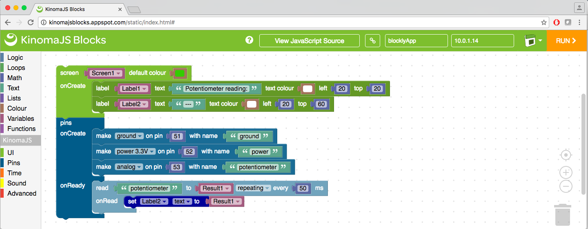
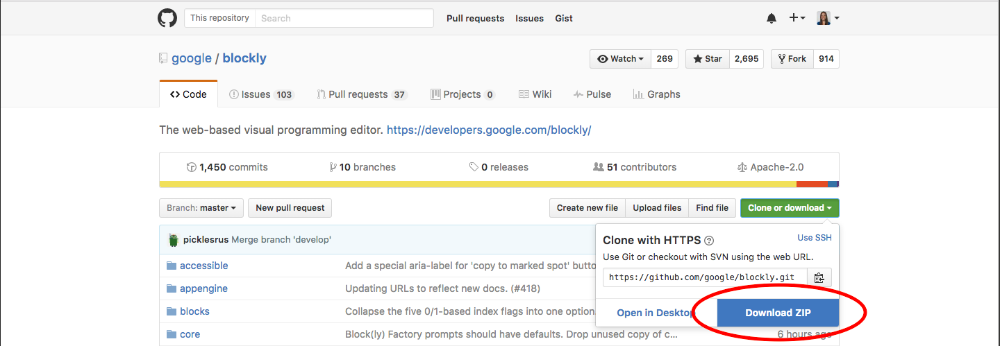

# KinomaJS Blocks

KinomaJS Blocks is a visual code editor designed to help developers build starter projects for Kinoma Create and Kinoma Element.



The project is built on Angular 2(RC7) and runs in a web browser. The [live version](http://kinomajsblocks.appspot.com/static/index.html) is hosted using Google App Engine. Instructions for building and modifying it are provided below.

# Build Instructions

The npm command line tool is required, so make sure you have [Node.js](https://nodejs.org/en/) installed before you begin.

## Starting on the Command Line

1. Navigate to the root `kinomajsblocks` folder.

2. Install dependencies.

	```
	$ npm install
	```

3. Check to confirm that a `typings` folder was created. If not, install it manually.

	```
	$ npm run typings install
	```

4. Install [Bower](https://bower.io/).

	```
	$ npm install -g bower
	```

5. Install [Google Blockly](https://developers.google.com/blockly/).

	```
	$ bower install
	```

## Running Locally

1. Run the scripts task in `gulpfile.js`. This will minify and bundle resources and output them to `tsbuild/dist` and `tsbuild/lib`.

	```
	$ gulp scripts
	```


2. Start a local server and run the application.

	```
	$ npm start
	```

### Notes

The Typescript compiler monitors changes to `app/` and outputs `.js`, and `.js.map` files to `tsbuild/app/`. However, changes will not be reflected in your instance until the scripts task in `gulpfile.js` is run again.

If you are running the app locally and want changes to be reflected immediately upon saving, follow the instructions in the comments of `index.html`. You simply need to comment out the minified files and uncomment the local library dependencies. Note that this will not work when deploying remotely on Google App Engine.

## Running on Google App Engine

1. Download and install the [Python SDK for App Engine](https://cloud.google.com/appengine/docs/python/download).

2. Log into [Google App Engine](https://console.cloud.google.com/appengine) and create an application.

3. Make a local copy of the [blockly library](https://github.com/google/blockly). You can do this using `git` from the command line, or by downloading a ZIP file by clicking **Clone or Download->Download ZIP** on the webpage, as shown in Figure 1.

	```
	$ git clone https://github.com/google/blockly.git
	```

	**Figure 1.** Download ZIP

	

4. Copy the `appengine` folder from the blockly library and make it a standalone folder.

5. Place the entire `kinomajsblocks` project folder inside the standalone `appengine` folder.  

6. Open `app.yaml` and make the following changes:

	- Remove lines 1 and 2 (the ones that specify the `application` name and `version`).

	- Replace the `handlers` section with the following:

		```
		# Redirect for root directory.
		- url: /
		  script: index_redirect.py
		  secure: always

		# robot.txt
		- url: /robots\.txt
		  static_files: robots.txt
		  upload: robots\.txt
		  secure: always

		# Storage API.
		- url: /storage
		  script: storage.py
		  secure: always

		# App Files
		- url: /kinomajsblocks
		  static_dir: kinomajsblocks
		  secure: always
		- url: /kinomajsblocks/media
		  static_dir: /kinomajsblocks/media
		- url: /kinomajsblocks/modules
		  static_dir: /kinomajsblocks/modules
		```
	- Add the following to the `skip_files:` section:

		```
		- ^(.*/)node_modules/(.*/)?
		- ^(.*/)bower_components/(.*/)?
		- ^(.*/)kinomajsblocks/app/(.*/)?
		```

	You may delete or add some others paths/file types, but these are the only necessary changes.

7. Open `index_redirect.py` and change `Location` in line 2 to `/kinomajsblocks/index.html`.

8. Use the gcloud command line tool to deploy your application.

	```
	$ gcloud app deploy app.yaml index.yaml --project <YOUR-APP-ID-HERE>
	```

### Notes

`app/blocklycomponent/storage.service.ts` is a custom implementation of the default `storage.js` (which adds cloud storage functionality) available for Blockly applications. This implementation makes the cloud storage more easily accessible to the KinomaJS Blocks application.
