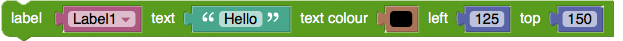
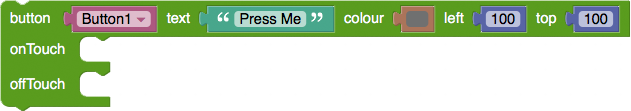
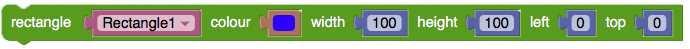
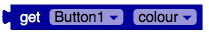
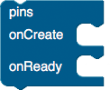
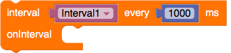
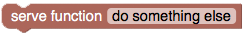

###Toolbox

  
This Menu lets you take and drag blocks from it to your workspace. 

Statement blocks stack on top of each other, and determine order of execution. Value blocks plug into other blocks, and assign values to variables.

###Shadow Blocks

You may see value blocks that are shadowed out. These are simply default values for the corresponding blocks. By altering them, they become "in focus", and are moveable.

###KinomaJS UI Blocks
**Screen Block**

Represents a Container, which you put other screen elements into. Instantiating a new screen block removes the old one. Has property: colour.

**Label Block**

Has properties: text, text-colour, position.

**Button Block**

Statements put into `onTouch` will fire when the button is pressed. Statements put into `offTouch` will fire after the button is no longer being pressed. Has properties: text, colour, position.

**Rectangle Block**

Has properties: text, colour, dimensions, position.

**Picture Block**

Has properties: URL, scale, position.

**Set Block**

Used to change an element’s property value.

**Get Block**

Gets the property value from an element.

###KinomaJS Pins Blocks

**Pin Config Block**

`onCreate` happens on instantiation. Place make pins blocks here to configure them. `onReady` happens after all make pins blocks have finished configuring (usually instantly). Typically read/write pins blocks go here.

**Pins Make Block**

Select from the dropdown to choose the basic pin type. The pin number will set the selected front pin to the pin type (front pins on Kinoma Create go from 51-66 are configurable to any type in the make pins block, with the exception of PWM which are found on back pins numbers 28, 30, and 34). The name you give each pin will be used to call read/write, as well as differentiate it from other pins.

**Pins Read Block**

The name of the read pin is the first value input, repeating will read forever, once will read just one time. The value obtained during the read will be set to the result variable. The number input here is the milliseconds between each read.

**Pins Write Block**

The name of the read pin is the first value input, the second is the value to write. To write to a digital out pin for example, 1 is on, and 0 is off. 

###KinomaJS Time Blocks

**Interval Block**

Statements placed in `onInterval` will be repeated every N milliseconds, based on the number input. Variable stores ID of the interval. Make sure to use a different variable name for each interval you use.

**Clear Interval Block**

Ends an interval, by ID.

**Timeout Block**

Statements placed in onTimeout will run after N milliseconds, based on the number input. Variable stores ID of the timeout. Make sure to change the variable name for every timeout you use.

**Clear TimeOut Block**

Ends a timeout, by ID. Must be called before the end of the timeout to stop its execution.

**Clock Block**

Stores the current time in milliseconds.

**Get Time Block (clock time)**

Retrieves the current time, and subtracts the time recorded when the clock block was started, essentially getting the time since the clock began.

**Using the timers block code in Kinoma Studio:** The timer functions use a non-native module in KinomaJS. Download it <a href="timers.js" download>here</a>. Include the module file in your project to use the setTimeInterval/setTimeOut functions in your project.

###KinomaJS Sound Blocks

**Play Sound Block**

Create an instance of sound that is linked to a sound file.

Assign the Global Sound a volume, and then play the referenced sound object.

**Sound Files**
If you're copying code to studio, and want to use the sound block sound files, you'll need to add the sound files for your project. Download them here:

* <a href="sounds/applause.wav" download>Applause</a>
* <a href="sounds/boing.wav" download>Boing</a>
* <a href="sounds/cat.wav" download>Cat</a>
* <a href="sounds/chicken.wav" download>Chicken</a>
* <a href="sounds/chime_up.wav" download>Chime</a>
* <a href="sounds/dog.wav" download>Dog</a>
* <a href="sounds/dolphin.wav" download>Dolphin</a>
* <a href="sounds/fart.wav" download>Fart</a>
* <a href="sounds/sheep.wav" download>Sheep</a>
* <a href="sounds/yay.wav" download>Hooray</a>

###KinomaJS Advanced Blocks

**Server Block (WebSocket)**

Begin a WebSocket server, where you can “publish” functions to be called remotely.

**Serve Function Block**

Add a function name to be “published”.

**Remote Call Function Block**

Open a WebSocket connection between two devices. Then calls a function made available from one device, from another.

###Tips for using KinomaJS Blocks

**Uses the latest Kinoma Create and Kinoma Studio software:** KinomaJS Blocks uses Kinoma’s implementation of JavaScript 6th Edition, released late October 2015. A [Kinoma Create](../../../create) Software Update with ES6 support is available [here](http://forum.kinoma.com/discussion/502/kinoma-software-update-october-15-2015#latest). [Kinoma Studio](../../studio) has also been updated to support ES6.

**Make sure to turn off debugging password:**​ If you're device is not running the app code, go to Settings > Debugging, then uncheck Require Password if it is checked.

**Using KinomaJS Blocks-generated code:** To modify the KinomaJS code generated with KinomaJS Blocks, select the View JavaScript button then simply copy and paste code into Kinoma Studio. There, you can add functionality not yet supported by KinomaJS Blocks, and you can run the code in a variety of hardware simulators.

**Multiple screen states:** Each screen block will clear the previous application UI. One way to have multiple screen “states” is to encapsulate a screen block inside of a function.

**WebSocket messaging:** When sending functions calls between two devices, note that it is a WebSocket connection. Messaging happens asynchronously, so if both devices are sending and receiving at the same time, there’s no way to ensure one function will execute before the other.

**Using the timers block code in Kinoma Studio:** The timer functions use a non-native module in KinomaJS. Download it <a href="timers.js" download>here</a>. Include the module file in your project to use the setTimeInterval/setTimeOut functions in your project.

**SetTimeInterval Block:** Try to avoid repeatedly drawing screen objects in less than 10 ms. Approximately 30 ms will do the job for any kind of screen animation. Less than 10 ms can lead to screen state flickering (on Kinoma Create).

**Sound + TimeInterval:** If you play a sound on repeat, the sound file will begin again on repeat, even if it has not finished playing. When using a time interval, it is best to repeat on 2-3 seconds (approximately the time length of a sound clip).

**Get/set properties:** Make sure the property you are accessing exists in the object. Setting a non-existent property could potentially throw an error.

**Using Power & Ground pins in a Hardware Simulator:** You do not set up specific pins for power & ground if you are sending your project to a hardware simulator in Kinoma Studio. The Kinoma Studio simulators already have power & ground supplied. If you have configured power & ground pins in a Blockly project and send code to the Kinoma Studio hardware simulator, Kinoma Studio will generate an error.

<!-- ###Using Blockly-generated code
For the UI blocks, the generated JavaScript is written to be modular for the purposes of Blockly, and readable for the purpose of taking the code into Kinoma Studio and modifying it. In part due to the “all global variables” model of Blockly, developers will want to check the quality of the code and its structure before releasing an app for others to use. 

Programming in Kinoma Blockly is an on-ramp to writing KinomaJS code. Kinoma Blockly is not intended as a means to program apps that will ship in final versions of projects or products. Going forward with the development of an application, you will want to refer to KinomaJS documentation on how to write and structure good application UI code. This is also true for the Pins module code, but to a lesser extent. -->

