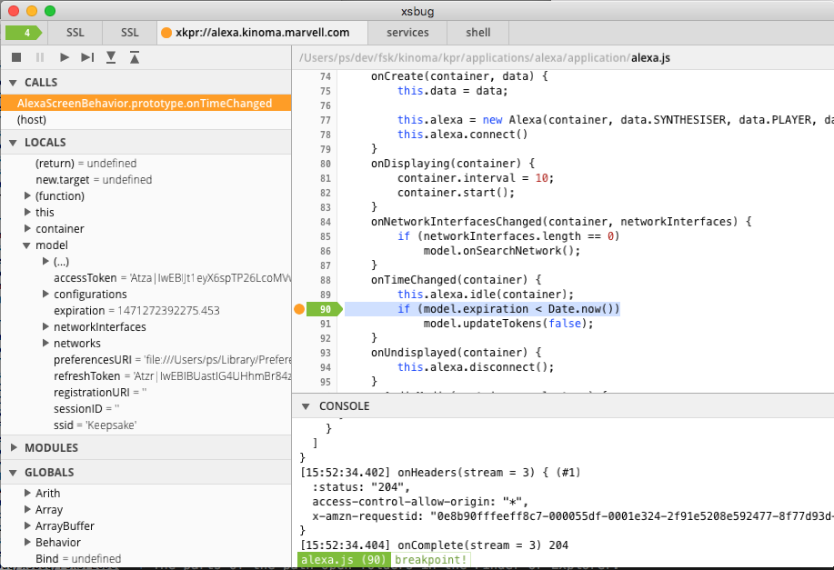
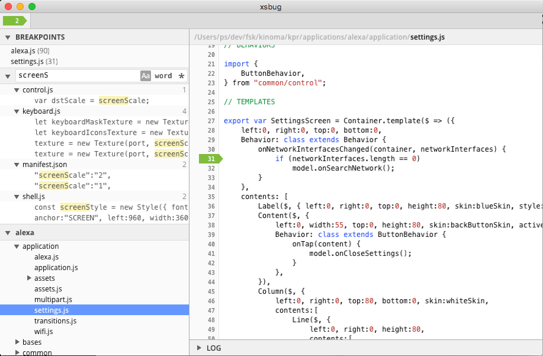
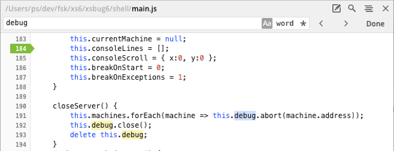
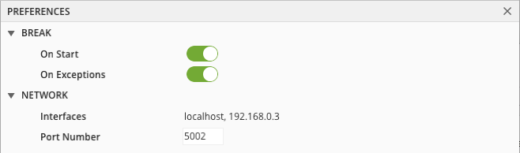

# xsbug

**xsbug** is a full-featured debugger for developers building standalone [KinomaJS](http://kinoma.com/develop/documentation/overview/) applications, shells and tools on all devices running [XS](http://kinoma.com/develop/documentation/xs/). **xsbug** supports over-the-air debugging of concurrent targets running on different devices. Similar to other debuggers, **xsbug** supports setting breakpoints, browsing source code, the call stack and variables.

## Machine tabs

At the top of the window, there are tabs for all XS virtual machines connected to **xsbug**. The orange bullet signifies a "broken" virtual machine. Select the tab to see where and why the virtual machine is broken. Figure 1 shows the machine tab view.

> **Note:** A virtual machine is "broken" when stopped at a breakpoint, `debugger` statement or exception.

**Figure 1.** Machine tab view

The left pane displays:

* The **Kill** , **Break** , **Run** , **Step** , **Step In**   and **Step Out**   buttons. Corresponding menu items and shortcuts are also available in the **Debug** menu to control the virtual machine.
* The **Calls** stack panel. Select a row in this panel to see where the call happened.
* The **Locals**, **Modules** and **Globals** variables panel. Expand rows in these panels to inspect values.

The right panes display:

* The selected file.
* The console. Each virtual machine has its own console.

## Breakpoints Tab

Figure 2. shows the Breakpoints tab view. Select the first tab to browse and search files and folders to set and clear breakpoints. Breakpoints can be edited even when no virtual machines are connected to **xsbug**.

To add files and folders to **xsbug**,
select the **Open File...** and **Open Folder...** items in the **File** menu, or drag and drop files and folders into the **xsbug** window. 

To remove files and folders from **xsbug**, use the **Close**  button in the header of a files and folders panel.

**Figure 2.** Breakpoints tab view

The left pane displays:

* The **Breakpoints** themselves. Tap a row in this panel to see where the breakpoint is. In the header of this panel, there is a **Trash**  button to clear all breakpoints. 
* The **Search** panel can be used to recursively search all the files in all the folders added to **xsbug**. 
* Zero or more files and folders panels. Tap folder rows to browse, select a file row to display the file.

The right pane displays:

* The selected file.
* The **xsbug** log, which merges the output of the consoles of all connected virtual machines. The log survives the disconnection of virtual machines.

## File Pane

Figure 3. shows the File pane. Selecting a row in the **Breakpoints** or **Calls** panels, or selecting a file in a folder panel opens a right pane with source code. 

**Figure 3.** File pane

In the header of the pane:

* Tapping the parts of the path open folders in the Finder or Explorer.
* The **Edit**  button opens the file in its default editor.
* The **Find**  button extends the header with a field to search the file.
* The **Marks**  button displays a menu with the classes, functions and variables defined in the file.
* The **Close**  button closes the file pane. 

## Preferences Pane

Figure 4. shows the Preferences pane. Selecting the **Preferences** item from the **xsbug** menu opens a right pane with preferences panels. 

**Figure 4.** Preferences pane

The **Break** preferences panel toggles the **Break On Start** and **Break On Exceptions** flags for all virtual machines.

The **Network** preferences panel displays the interfaces **xsbug** is listening on, and provides an edit field to change the port number **xsbug** is listening with. The default port number is **5002**. Changing the port number kills all connected virtual machines.

