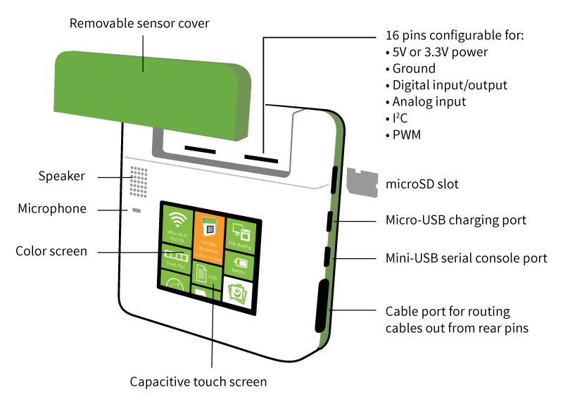
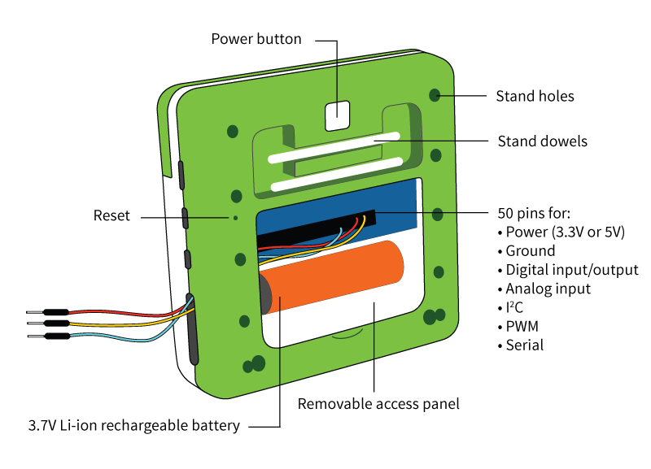
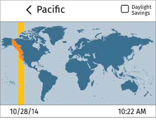
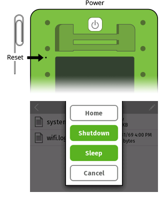
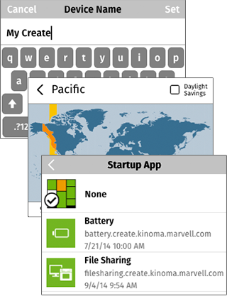
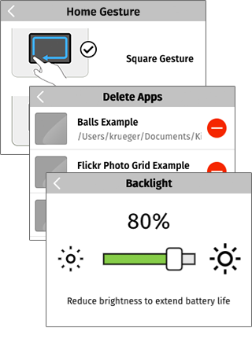
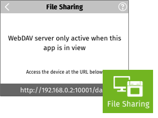
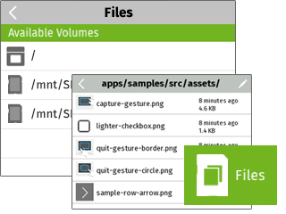
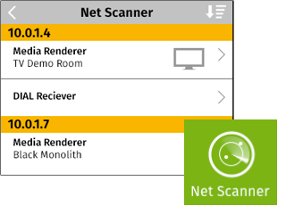
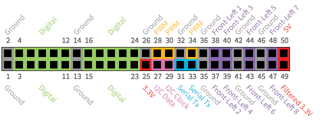

<!-- Version: 160711-CR / Primary author: Chris Krueger / Last reviewed: October 2015

Read this document to learn about and get started with your Kinoma Create.
-->

# Kinoma Create User Guide  

## About Kinoma Create

The most important thing to know about Kinoma Create (shown in Figures 1 and 2) is that it is primarily a 3.3-volt system. If you are new to 3.3V systems or to hardware in general, this means that (unlike with an Arduino or some other boards), you can only send up to 3.3 volts into input pins on the device without doing damage to the pin. The exception to this is the front pins, which can be set to either 3.3V or 5V mode. When in 5V mode, it is safe to input up to 5V into those pins.

**Figure 1.** Kinoma Create Front  

**Figure 2.** Kinoma Create Back  

Download [Kinoma Code](http://kinoma.com/develop/code/). You can try out your own applications in our desktop simulator, build apps for iOS and Android, or run any of our samples (included with Kinoma Code) on your Kinoma Create.

The Kinoma team is ready to support you as you work with your Kinoma Create. The best way to get answers to your questions is to post on the corresponding [Kinoma Forum](http://forum.kinoma.com/).

We want you all to successfully bring your product concepts to life, and we will be here to help you along the way. Enjoy your Kinoma Create!

## Kinoma Create First Run

Take these steps to get going on your Kinoma Create for the first time:

1. Remove the back cover and install the battery.

   

2. Begin charging the device with the supplied charger. 

   **Note:** Kinoma Create has specific requirements for the charging block and cable. Using charging systems other than the one supplied with Kinoma Create may not charge the battery.

   

3. Press the power button on the back of your Kinoma Create. Kinoma Create typically takes 35 seconds to boot.

   

4. Use the Wi-Fi app to add your Kinoma Create to your network.

   

5. Use the Settings app to set the time zone.

   

## Powering Up/Down and Sleep

Once you have started up your Kinoma Create (by pressing the power button and waiting about 35 seconds), a short press will display a menu enabling you to shut down the device, enter sleep mode, or return to the shell (Home), as shown in Figure 3. Also note the reset button on the device; use a paper clip (or similar) to reach it if you need to perform a hard reset.

**Figure 3.** Power and Reset Buttons and Power Button Menu  

If the device is in sleep mode, a short press will wake it up.

## Charging the Internal Battery
Kinoma Create uses a 3.7V, 2600 mAh, Li-ion battery. The battery style is 18650.

Kinoma Create has specific requirements for the charging block and cable. Using charging systems other than the one supplied with Kinoma Create may not charge the battery. The battery power graph is calibrated to the included Tenergy battery.

**Figure 4.** Battery, Cable, and Charging Block  

## Settings App

The Settings app on Kinoma Create lets you set device attributes, update firmware and software, and view device information. If updates are available, an **UPDATE** notification appears; tap it to update.

**Figure 5.** Settings App  

**Name** -- Set the device name if desired (see Figure 6). This is the name that this Kinoma Create will use for network connections, including debugging in the Kinoma Code IDE.

**Time Zone** -- It is important to set the local time zone for apps that use time and date–based APIs (Figure 6). The optional Daylight Savings checkbox needs to be manually updated to match local conditions.

**Startup App** -- For testing purposes, set to launch into a specific app (Figure 6). The default is the Kinoma Create Home, which contains utility and configuration apps.

**Figure 6.** Name, Time Zone, and Startup App Settings  

**Home Gesture** -- Specify the gesture used to force-quit the currently running application and return to Home (see Figure 7).

**Backlight** -- Increase battery life by adjusting the brightness of the screen's backlighting (Figure 7).

**Delete Apps** -- Allows removal of apps that have been installed on Kinoma Create (Figure 7). 

> **Note:** Built-in apps, such as Wi-Fi and Settings, cannot be deleted.

**Figure 7.** Home Gesture, Delete Apps, and Backlight Settings  

**Debugging** -- Set to allow debugging over Wi-Fi and require a password to debug (see Figure 8).

**Kinoma Software** -- Shows the current version number and updates if available.

**Firmware (OS)** -- Shows the current firmware version number and updates if available.

**Set Up SD Card** -- Format and partition an SD to become a bootable file system (Figure 8). For more information, see the section [Setting Up a Bootable SD Card](#setting-up). 

**Clear Caches** -- Clear caches for Kinoma Code, cookies, apps preferences, and HTTP caches (Figure 8).

**MAC Address** -- Shows the MAC address of this Kinoma Create. The MAC address is the unique ID of the device.

**Figure 8.** Debugging, Set Up SD Card, and Clear Caches Settings  

## Built-In Apps
**Battery app** -- Shows the current charge status on the tile, and charging and usage history in the app view. The most current value is at the left.

 = Charging

 = Fully Charged

 = Depleting

 = Fully Depleted

**File Sharing app** -- Allows mounting your Kinoma Create on your PC (Windows and Mac). File Sharing implements the WebDAV protocol.

**Front Pins app** -- The 16 front-facing pins can be targeted by the Front Pins app to support Digital, Analog In, and I2C connections. For more information, see the section [Using Hardware Pins](#using-hardware-pins).

**Files app** -- Provides simple view and management functionality for files on Kinoma Create. It can display PNG and JPEG images, MPEG-4 files, and the first 8 KB of text-based files. Individual files can be deleted.

**Logs app** -- Presents information about the operation of Kinoma Create. Kinoma Create logs pin settings, settings made with the Settings app, system events, and Wi-Fi configurations.

**Samples app** -- Shows current content from the Kinoma GitHub Samples repository. Select samples to download and view on the device. Select **View Source** to view the JavaScript source and other project assets.

**Net Scanner app** -- Shows the SSDP devices on the current network. The app returns the name, URN, UUID, and URL. Services and XML device description are shown if available.

## Setting Up a Bootable SD Card

You can install an SD card and set it up as a bootable volume. As part of the setup process, the latest Kinoma Create system image will download. Once you have created a bootable SD card, you can boot from the SD card and update the firmware on your Kinoma Create. 

**_Important:_** Formatting an SD card as a bootable volume completely erases the contents of the SD card being prepared.

Figure 9 shows the initial screen for **Set Up SD Card** and the screen displayed after you select **Update SD Card**; you will then see a toggle to start from a bootable SD card if present.

**Figure 9.** Set Up SD Card Utility  

## Connecting to a PC

You can connect your Kinoma Create to your PC, via either Micro-USB or Mini-USB, to power it.

If you connect via the Mini-USB port, you can access the serial console. [FTDI drivers](http://www.ftdichip.com/FTDrivers.htm) are required for serial connections over USB.

**Figure 10.** Connecting to a PC 

## Using Hardware Pins

The front and back hardware pins are introduced here; for details on coding with these pins, see the document [_Programming with Hardware Pins for Kinoma Create_](../pins/).

###Front Pins

The 16 pins on the front-facing header can be targeted by the Front Pins app to support Digital, Analog In, and I2C connections. Power can be supplied at 3.3 or 5 volts. Input pins will handle up to 3.3V. The front pins are designed to conveniently fit readily available sensors mounted on breakout boards.

To access the front pins, press up on the sensor cover with your thumbs while holding onto the sides of Kinoma Create.

**Figure 11.** Opening the Sensor Cover 

###Back Pins

The 50 pins on the back header are accessible behind the rear access panel, as shown earlier under [About Kinoma Create](#about-kinoma-create). These pins have dedicated functionality to support Digital, Analog Input, PWM, I2C, and Serial connections. Power can be supplied at 3.3 or 5 volts. Input pins will handle up to 3.3V.

**Figure 12.** Back Pins  

## The Kinoma Create Stand

Kinoma Create includes an adjustable stand. Insert the dowels on the back of your Kinoma Create into the stand holes, to set the stand to the angle desired.

**Figure 13.** Kinoma Create Stand  

## Specifications

- QVGA capacitive touch screen
 
- 800 MHz Marvell ARM SoC
 
- Wi-Fi (802.11b/g)
 
- 128 MB RAM, 16 MB SPI Flash
 
- microSD slot
 
- Speaker and microphone
 
- Wired (USB) and portable power options -- includes 2600 mAh 3.7V Li-ion 18650 rechargeable battery
 
- No breadboard required for many breakout-board-based sensors
 
- Custom, lightweight Linux distribution to support the Kinoma platform

- Digital input/output (20-36, configurable), analog input (0-16, configurable), I2C (1 physical bus and 2 soft buses), UART Serial (1 physical bus), PWM (3)

Recommended operating temperature: -5°C to +50°C (23°F to 122°F)

## Compliance Statements

### FCC Statement

This equipment has been tested and found to comply with the limits for a Class B digital device, pursuant to part 15 of the FCC Rules. These limits are designed to provide reasonable protection against harmful interference in a residential installation. This equipment generates, uses and can radiate radio frequency energy and, if not installed and used in accordance with the instructions, may cause harmful interference to radio communications. However, there is no guarantee that interference will not occur in a particular installation. If this equipment does cause harmful interference to radio or television reception, which can be determined by turning the equipment off and on, the user is encouraged to try to correct the interference by one or more of the following measures:

- Reorient or relocate the receiving antenna.

- Increase the separation between the equipment and receiver.

- Connect the equipment into an outlet on a circuit different from that to which the receiver is connected.

- Consult the dealer or an experienced radio/TV technician for help.

### FCC Radiation Exposure Statement

This equipment complies with FCC RF radiation exposure limits set forth for an uncontrolled environment. This transmitter must not be co-located or operating in conjunction with any other antenna or transmitter. This equipment should be installed and operated with a minimum distance of 20 centimeters between the radiator and your body.

This device complies with Part 15 of the FCC Rules. Operation is subject to the following two conditions: (1) this device may not cause harmful interference, and (2) this device must accept any interference received, including interference that may cause undesired operation.

> ***Caution!*** Any changes or modifications not expressly approved by the party responsible for compliance could void the user's authority to operate the equipment.

### Canada Statement

This device complies with Industry Canada licence-exempt RSS standard(s). Operation is subject to the following two conditions: (1) this device may not cause interference, and (2) this device must accept any interference, including interference that may cause undesired operation of the device.

> Le présent appareil est conforme aux CNR d'Industrie Canada applicables aux appareils radio exempts de licence. L'exploitation est autorisée aux deux conditions suivantes : (1) l'appareil ne doit pas produire de brouillage, et (2) l'utilisateur de l'appareil doit accepter tout brouillage radioélectrique subi, même si le brouillage est susceptible d'en compromettre le fonctionnement.

The device meets the exemption from the routine evaluation limits in section 2.5 of RSS 102 and compliance with RSS-102 RF exposure, users can obtain Canadian information on RF exposure and compliance.

> Le dispositif rencontre l'exemption des limites courantes d'évaluation dans la section 2.5 de RSS 102 et la conformité à l'exposition de RSS-102 rf, utilisateurs peut obtenir l'information canadienne sur l'exposition et la conformité de rf.

This transmitter must not be co-located or operating in conjunction with any other antenna or transmitter. This equipment should be installed and operated with a minimum distance of 20 centimeters between the radiator and your body.

> Cet émetteur ne doit pas être co-placé ou ne fonctionnant en même temps qu'aucune autre antenne ou émetteur. Cet équipement devrait être installé et actionné avec une distance minimum de 20 centimètres entre le radiateur et votre corps.
