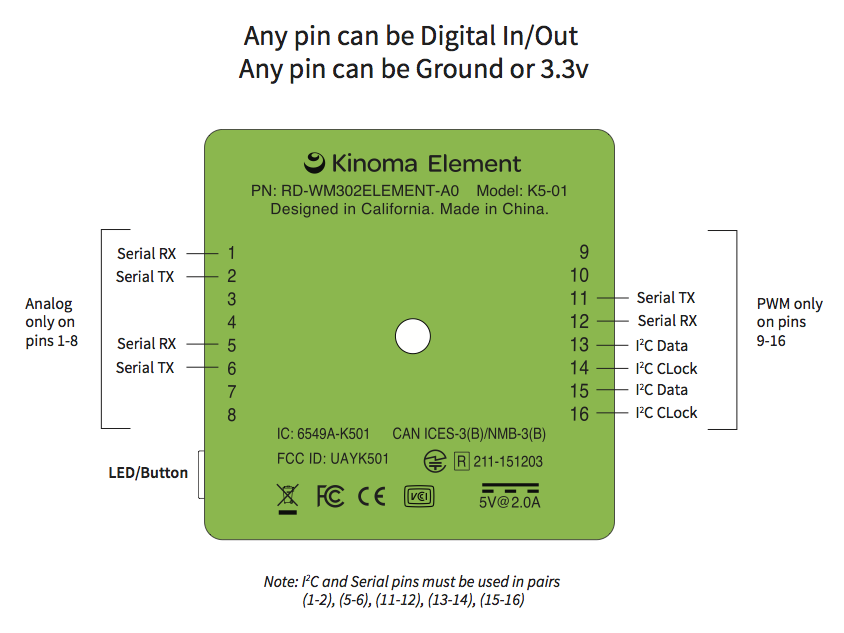

<!--
|     Copyright (C) 2010-2016 Marvell International Ltd.
|     Copyright (C) 2002-2010 Kinoma, Inc.
|
|     Licensed under the Apache License, Version 2.0 (the "License");
|     you may not use this file except in compliance with the License.
|     You may obtain a copy of the License at
|
|      http://www.apache.org/licenses/LICENSE-2.0
|
|     Unless required by applicable law or agreed to in writing, software
|     distributed under the License is distributed on an "AS IS" BASIS,
|     WITHOUT WARRANTIES OR CONDITIONS OF ANY KIND, either express or implied.
|     See the License for the specific language governing permissions and
|     limitations under the License.
-->
#Programming with Hardware Pins for Kinoma Element

This document describes how to program Kinoma Element's hardware pins, and serves as a handy reference to the pin types supported by Kinoma Element.

##About the Pins

Kinoma Element has 16 hardware pins. These pins implement Digital Input/Output, Analog Input, Pulse Width Modulation (PWM), I²C, and Serial Input/Output. 

The pins are divided into left and right groups of 8 pins each. These pins are user configurable using the Front Pins application in Kinoma Code or by using the [Pins module]([pins module](../element-pins-module)) in an application. All pins operate at 3.3 volts.



##Introducing BLL Modules
All hardware pin programming is done in JavaScript. The code for each hardware module (sensor, LED, button, motor, etc) is contained in a JavaScript module called a BLL. BLLs communicate directly with hardware pins. The application communicates with the BLL using the Pins module.

Developers either implement their own BLL to support the hardware modules they have connected to Kinoma Element or use a pre-existing BLL implementation. Sample BLL implementations for common hardware modules are available in our collection of [sample apps](https://github.com/Kinoma/KPR-examples). In addition, the Pins module includes built-in BLLs for each hardware protocol. You can find the source code of the built-in BLLs [here](https://github.com/Kinoma/kinomajs/tree/master/xs6/sources/mc/extensions/pins); they are the files with names of the form **bll_x.js**, where **x** is the name of the relevant hardware protocol (i.e. **bll\_Analog.js** and **bll\_PWM.js**).

> **Note:** "BLL" stands for Blinking Light Library, but a BLL is not limited to blinking an LED; a BLL can be used to interact with all kinds of hardware modules.

## Application Programming with Pins

Applications first configure the BLLs they will use, and then issue single or repeating commands to the BLL. The Pins module is used to send configuration and commands from the application to BLLs.

The call to `Pins.configure` lists each BLL the application uses together with the pins that each BLL uses to communicate to its hardware module.

The following code configures the hardware pins to work with BLLs named `buttonBLL` and `ledBLL`. The BLL code is stored in files named `buttonBLL.js` and `ledBLL.js`. The second argument of `Pins.configure` is a callback function that is invoked whether or not the configuration is successful.

```
Pins.configure({
	greenButton: {
		require: "buttonBLL",
		pins: {
			button: { pin: 1 },
			power: { pin: 2 },
			ground: { pin: 3 },
		}
	},
	redLED: {
		require: "ledBLL",
		pins: {
			led: { pin: 8 },
			ground: { pin: 9 },
		}
	}
}, success => {
	if (success)
		trace("Configured pins.\n");
	else
		trace("Failed to configure pins.\n");
});
```

Applications assign a unique name to each hardware module in the configuration. In the preceding example, the button BLL is named `greenButton` and the LED BLL is named `redLED`. The application uses these names to send commands to the corresponding hardware module.

> **Note:** In this pins configuration data example, the names `greenButton` and `redLED` are defined by the application. The `require` and `pins` properties are defined by the Hardware Pins Service. The value of the `require` property is the name of the BLL file corresponding to the hardware module. The names of the properties inside the `pins` objects (that is, `led` and `button`) are defined by each individual BLL.

While not evident from the application code, the button BLL uses a Digital Input pin, and the LED BLL uses a Digital Output pin. By convention, the pin numbering is specified in the application code and the BLL defines the type of pins (Digital Input, Digital Output, I<sup>2</sup>C, Serial, and so on) that are used. The next section covers how to specify the pin type.

The LED BLL is bound to pins 8-9 and the button BLL to pins 1-3, as defined in the `pins` object.

Once the pins are configured, an application can send invoke BLL functions using the `Pins.invoke` function. The following commands turn the LED on and off.

	Pins.invoke("/redLED/write", 1);
	Pins.invoke("/redLED/write", 0);

Applications retrieve values from BLLs in a similar way: calling `Pins.invoke` with the name of the target hardware module and the name of the command in the path. A callback function is also passed in, which will be called with the value returned.

	Pins.invoke("/greenButton/get", value => {
		trace("Button value: " + value + "\n");
	});
	
> **Note:** The format of the value returned from the BLL is determined by the author of the BLL. In the preceding example, the type of the returned value is `Number`, but it may be any valid JavaScript object. 

Applications establish repeated polling of a hardware module at a specified interval using the `Pins.repeat` function. The following example polls the button at 50-millisecond intervals.

	Pins.repeat("/greenButton/get", 50, value => {
		trace("Button value: " + value + "\n");
	});

Full documentation of the Pins module can be found [here](../element-pins-module).

## BLL Programming with Pins

As mentioned earlier, a BLL is a JavaScript module that communicates directly with hardware pins. The BLL is configured by the application, which communicates with the BLL exclusively using the Pins module.

All BLLs must export three objects:

1. A `pins` object which defines the types of pins it uses. 
2. A `configure` function which initializes each of the objects by calling their `init` function
2. A `close` function which is called automatically when the host application exits and is typically used to close the objects used to communicate with pins

In addition, you can define and export additional functions required to work with the module to interact with the sensors.

###Simple Example
Here is the `pins` export corresponding to `ledBLL` as introduced earlier:

```
exports.pins = {
	led: { type: "Digital", direction: "output" },
	ground: { type: "Ground" }
};
```

Here is the `pins` export corresponding to `buttonBLL` as introduced earlier:

```
exports.pins = {
	button: { type: "Digital", direction: "input" }
	power: { type: "Power" },
	ground: { type: "Ground" }
};
```

When `Pins.configure` is called, the configuration data provided by the application (highlighted in <span class="app-defined">green</span> below) is merged with the properties of the `pins` object exported by the BLL (highlighted in <span class="bll-defined">blue</span>) to arrive at the following complete configurations:

<pre><code>redLED_configuration = {
	<span class="bll-defined">led</span>: { <span class="bll-defined">type</span>: "Digital", <span class="app-defined">pin</span>: 8, <span class="bll-defined">direction</span>: "output" },
	<span class="bll-defined">ground</span>: { <span class="bll-defined">type</span>: "Ground", <span class="app-defined">pin</span>: 9 }
}

greenButton_configuration = {
	<span class="bll-defined">button</span>: { <span class="bll-defined">type</span>: "Digital", <span class="app-defined">pin</span>: 1, <span class="bll-defined">direction</span>: "input" },
	<span class="bll-defined">power</span>: { <span class="bll-defined">type</span>: "Power", <span class="app-defined">pin</span>: 2 },
	<span class="bll-defined">ground</span>: { <span class="bll-defined">type</span>: "Ground", <span class="app-defined">pin</span>: 3 }
}</code></pre>
	
The appropriate BLLs are then loaded using the `require` function, and JavaScript objects to communicate with the hardware pins are instantiated. In this example, it instantiates two Digital pin objects, one configured as an input and the other as an output. The input is bound to pin 1 and the output to pin 8. These JavaScript objects are assigned to the module using the property names given by the BLL (`led` and `button` in this example).

Once the objects are instantiated and bound, the `configure` function of each BLL is called. The `configure` function must initialize each of the objects by calling the object's `init` function, and it can do any additional work required by the BLL. Note that power and ground pins do not need to be initialized.

	exports.configure = function() {
		this.led.init();
	}

	exports.configure = function() {
		this.button.init();
	}
	
The BLL also defines a `close` function, which is called automatically when the host application exits. The `close` function typically closes the objects used to communicate with pins, as follows:

	exports.close = function() {
		this.led.close();
	}

	exports.close = function() {
		this.button.close();
	}
	
The BLL author may also define additional functions required to work with the module. Here are sample `read` and `write` functions for the `led` and `button` objects:

	exports.read = function() {
		return this.button.read();
	}

	exports.write = function(value) {
		this.led.write(value ? 1 : 0);
	}


## Hardware Pins Reference 

This section describes the pins data format that an application uses to configure a BLL. The configuration data defines the type of each pin and the pin number used. For each type, the reference section begins by showing the full pin configuration data. Data in <span class="bll-defined">blue</span> is defined by the BLL; data in <span class="app-defined">green</span>, by the application. The API calls supported for each pin type are then described.

> **Note:** The object for each pin type has an `init` function that reserves any hardware resources required by the object, and a `close` function to release the resources used by the object. The object will not operate properly until the `init` function is called.

###Digital
#####Pins object
<pre><code>{<span class="bll-defined">type</span>: "Digital", <span class="app-defined">pin</span>: 2, <span class="bll-defined">direction</span>: "input"};
{<span class="bll-defined">type</span>: "Digital", <span class="app-defined">pin</span>: 3, <span class="bll-defined">direction</span>: "output"};</code></pre>
	
####API Calls
**digital.read()** — Returns `0` or `1`, or `undefined` if the read fails. This is used both to retrieve the value of an input pin, or the value being output on an output pin.

**digital.write(value)** — Value must be either `0` or `1`

**digital.direction** — Value is either `"input"` or `"output"`. Note `direction` is a property, not a function. This property can be read or written in order to change the direction.

###Analog

####Pins object

<pre><code>{<span class="bll-defined">type</span>: "Analog", <span class="app-defined">pin</span>: 3};</code></pre>

> Note that Analog is only available on pins 1-8.

####API Calls
**analog.read()** — Returns a floating point value from 0 to 1.0


###PWM

####Pins object

<pre><code>{<span class="bll-defined">type</span>: "PWM", <span class="app-defined">pin</span>: 9};</code></pre>

> Note that PWM is only available on pins 9-16. All PWMs can be active simultaneously.

####API Calls
**pwm.write(value[, period])** -- Without *period*, sets the duty cycle (percentage of time spent 'high') to *value* (a floating-point value between 0 and 1.0). The PWM frequency is 50Hz (period 20ms).

When the *period* argument is specified, sets the PWM output pulse width to *value* and the period (cycle duration, or 1/*frequency*) to *period*. Pulse width and period are specified in milliseconds. Pulse width and period can also be specified as an array, for example `pwm.write([width, period])`

```
this.pwm.write(0.5); // 50% duty cycle
this.pwm.write(0.5, 5); // 0.5ms pulse width, 5ms period (10% @ 200Hz)
this.pwm.write([0.5, 5]); // same as above
```
The minimum pulse width is 0.00002ms (20ns).  The maximum frequency is 5kHz (a period of .2ms, or 200µs). Very long periods (> 1 hour) are supported.


###Serial

####Pins object

<pre><code>{<span class="bll-defined">type</span>: "Serial", <span class="app-defined">rx</span>: 1, <span class="app-defined">tx</span>: 2, <span class="bll-defined">baud</span>: 38400};</code></pre>


> Note that RX/TX pins must be used in adjacent pairs. The three options are 1/2, 5/6, and 12/11. In addition, if the serial device is read-only or write-only, the unused pin property, `rx` or `tx`, may be excluded from the pin configuration data.

####API Calls
**serial.read(type)** — Reads data from the serial input. Pass "Chunk" for the type parameter to return the data in a Chunk, "String" to return a string, "Array" to return an array of integer character codes between 0 and 255, and “charCode” to return a single character code as an integer. Note that the data returned in a String must be valid UTF-8 data; if the data read is not valid UTF-8, an exception is thrown. All types of read except `charCode` return all data that is immediately available on the input.

**serial.read(type, maximumBytes)** — Same as `serial.read(type)` but no more than *maximumBytes* are read. This call does not block, so only immediately available bytes are returned. This is not supported for type `charCode` which returns either 1 or 0 bytes.

**serial.read(type, maximumBytes, msToWait)** — Same as `serial.read(type, maximumBytes)` but waits up to *msToWait* milliseconds for *maximumBytes* to arrive.

**serial.write(value, …)** — Writes all arguments to the output. Values can be of type Chunk, String, Array of character codes, or numbers (character codes from 0 to 255). The following writes a message, followed by a carriage return, line feed, and null.

```
var crlf = new Chunk(2);
crlf[0] = 13;
crlf[1] = 10;
this.serial.write("Hello, world.", [crlf, 0]);
```

###I²C

####Pins object
<pre><code>{<span class="bll-defined">type</span>: "I2C", <span class="app-defined">sda</span>: 13, <span class="app-defined">clock</span>: 14, <span class="bll-defined">address</span>: 0x36};</code></pre>

> Note: The address property is the I²C slave address.  The data sheet for some I²C devices specifies different slave addresses for read and write, differing only in the least significant bit. If this is the case, use the most significant 7 bits for the slave address here.
> 
> Also note that SDA/SCL pins must be used in adjacent pairs. The two options are 13/14 and 15/16.

####API Calls

**i2c.readByte()** — Reads one byte <!--(Linux: read)-->

**i2c.readBlock(count, format)** - Reads the number of bytes specified by *count*. Pass `"Chunk"` for the *format* parameter to return the data in a Chunk, or `"Array"` to return an array of integer character codes between 0 and 255. <!--(Linux: read)-->

**i2c.readByteDataSMB(register)** — Reads 1 byte from the specified register. <!--(Linux: i2c\_smbus\_read\_byte\_data)-->

**i2c.readWordDataSMB(register)** — Reads 2 bytes from the specified register. <!--(Linux: i2c\_smbus\_read\_word\_data)-->

**i2c.readBlockDataSMB(register, count, type)** — Reads *count* bytes starting at the specified register. ass `"Chunk"` for the *format* parameter to return the data in a Chunk, or `"Array"` to return an array of integer character codes between 0 and 255. <!--(Linux: i2c\_smbus\_read\_i2c\_block\_data)-->

**i2c.writeByte(value)** — Writes one byte. <!--(Linux: write)-->

**i2c.writeBlock(value...)** - writes the values provided. The value(s) are treated in the same way as `serial.write()`. <!--(Linux: write)-->

**i2c.writeByteDataSMB(register, value)** — Writes 1 byte to the specified register. <!--(Linux: i2c\_smbus\_write\_byte\_data)-->

**i2c.writeWordDataSMB(register, value)** — Writes 2 bytes to the specified register. <!--(Linux: i2c\_smbus\_write\_word\_data)-->

**i2c.writeBlockDataSMB(register, value...)** — Writes up to 32 bytes starting at the specified register. The value(s) are treated in the same way as `serial.write()`. <!--(Linux: i2c\_smbus\_write\_i2c\_block\_data)-->

<!-- untested -->
**i2c.writeQuickSMB(value)** — Sends the low bit of `value` using the I²C `write_quick` command. <!--(Linux: i2c\_smbus\_write\_quick)-->

**i2c.processCallSMB(register, value)** — Writes 2 bytes to specified register. After the write completes, reads 2 bytes, and returns the resulting data word.
