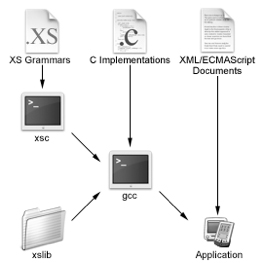

<!--
|     Copyright (C) 2010-2016 Marvell International Ltd.
|     Copyright (C) 2002-2010 Kinoma, Inc.
|
|     Licensed under the Apache License, Version 2.0 (the "License");
|     you may not use this file except in compliance with the License.
|     You may obtain a copy of the License at
|
|      http://www.apache.org/licenses/LICENSE-2.0
|
|     Unless required by applicable law or agreed to in writing, software
|     distributed under the License is distributed on an "AS IS" BASIS,
|     WITHOUT WARRANTIES OR CONDITIONS OF ANY KIND, either express or implied.
|     See the License for the specific language governing permissions and
|     limitations under the License.
-->
<!-- Version: 151215-CR / Primary author: Patrick Soquet / Last reviewed: ?

This document describes the XS toolkit.
-->

# XS

## About This Document

<!--Use the following paragraph as the intro to this document on Kinoma's Documentation page.-->

This document describes XS, a toolkit designed by Kinoma for developing standards-based, networked, interactive multimedia applications or command-line tools for various devices.

XS is built on the [XML standard](http://www.w3.org/xml/core/#Publications) and the [ECMAScript standard](http://www.ecma-international.org/publications/standards/ecma-262.htm). This document assumes that readers are already familiar with those standards (although it reviews some of their basic concepts).

This document is organized into the following sections:

* [Introduction to XS](#Introduction) provides background information that is important to understanding XS, along with examples to help orient you to its capabilities.

* [Packages](#Packages), [Property Elements](#Property-Elements), and [Patterns](#Patterns) introduce and illustrate the various elements of XS.

* [XS Reference](#XS-Reference) provides complete details on all the elements of XS (including the command-line tool part of it, `xsc`).

* A [Glossary](#Glossary) includes all the terms defined in this document.
 
### Licensing Information

This document is part of the XS runtime library, `xslib`. `xslib` is free software; you can redistribute it or modify it under the terms of the GNU Lesser General Public License as published by the Free Software Foundation—either version 2 of the License or (at your option) any later version.

`xslib` is distributed in the hope that it will be useful, but without any warranty—without even the implied warranty of merchantability or fitness for a particular purpose. See the GNU Lesser General Public License for more details.

You should have received a copy of the GNU Lesser General Public License along with `xslib`; if not, write to:

>Free Software Foundation, Inc.  
59 Temple Place, Suite 330  
Boston, MA 02111-1307 USA

##Introduction to XS

XS is a toolkit, consisting of a runtime library and a command-line tool, that is designed for developing standards-based, networked, interactive multimedia applications (GUI-based runtimes) or command-line tools for various devices. Developers define the applications in XML and ECMAScript and build tools or runtimes in C to process and interpret such documents.

###XS Overview

By design, XML is "just" a markup language and ECMAScript is "just" a scripting language. XML processors and ECMAScript interpreters—for instance, James Clark’s [expat](http://www.jclark.com/xml/expat.html) and Mozilla’s [JavaScript](http://www.mozilla.org/js/)—expect to be used by tools and runtimes through C calls and callbacks. The tools and runtimes are semantically in charge; they are obviously responsible for determining what works and what does not. In contrast to most XML and ECMAScript libraries, XS was not designed for a specific application or domain; rather, its purpose is to help build tools and runtimes for any desired application or domain.

####Grammars

XS enables applications to be defined in XML documents with ECMAScript embedded in the XML, with the ECMAScript invoking functions defined in an XS *grammar*. XS grammars bind XML descriptions, ECMAScript behaviors, and C interfaces.

Also an XML document with embedded ECMAScript, a grammar defines ECMAScript objects and their properties (including functions). An XS grammar is source code (stored in a file with a `.xs` extension) and therefore must be compiled before it can be executed. The XS command-line tool `xsc` compiles grammars into XS bytecode, which is executed by the XS virtual machine that is contained within `xslib`.

The output of compiling a grammar includes a framework of ECMAScript prototypes and a template-based parser and serializer, thereby supporting the two programming techniques relevant to ECMAScript and XML: respectively, programming with prototypes and programming with templates.

It is possible to define ECMAScript objects and their properties using only ECMAScript source code (without XML), but an XS grammar provides a more structured way to define them. The structure provided by XML makes the ECMAScript code more readable and easier to maintain, which benefits large software projects written in ECMAScript.

In addition, an XS grammar can access features of the XS virtual machine that are not available to pure ECMAScript code. Most significantly, the grammar can use native code—that is, C code—to implement some or all of the function properties of an ECMAScript object. This enables an application developed in XS to invoke native code for performance reasons or when there is no way to take those actions in pure ECMAScript. For example, in an XML document defining an audio application, there can be ECMAScript that calls a function defined in the XS grammar to play back audio, with that function in turn calling a function implemented in C. (The C interface of `xslib`, XS in C, is described in the document [*XS in C*](../xs-in-c).)

>**Note:** The XS virtual machine extends ECMAScript in other ways, as shown later.

####Building an Application

Figure 1 illustrates how the different parts of XS enter into building an application. The core of `xslib` is of course an XML processor and an ECMAScript interpreter. The `xsc` command (like `yacc` and `antlr`) transforms grammars into C code, data, and interfaces, which are then compiled by `gcc` and linked with C implementations and `xslib` to build applications. There is also a debugger, named `xsbug`.

**Figure 1**. Building an Application

In addition to building applications, XS supports building libraries that can be dynamically linked at runtime.

###XML and ECMAScript Review

XML and ECMAScript are well-known standards, but in order to understand XS, it is useful to review some of their basic concepts.

####XML

An XML document is a tree of nodes consisting of elements, attributes, text, and processing instructions (PIs). The document begins with an XML declaration and has one and only one root, which is an element node. An element node has a name and can contain element, attribute, text, and PI nodes. Attribute and PI nodes have a name and contain one text node. In the following example, the root is an element node named `person`, which has an attribute named `xmlns` attached to it and an element node named `fullname` contained within it.

	<?xml version="1.0" encoding="UTF-8"?>
	<person xmlns="http://marvell.com/person#1">
		<fullname>Bob Smith</fullname>
	</person>
	
Like all markup languages, XML always has to be transformed into something else to make sense for a particular application. A significant part of the work on XML has been related to such transformations; for instance, [XSL](http://www.w3.org/style/xsl/) applies templates to XML documents to convert them to other XML documents.

	<xsl:template match:person>
		

			<xsl:value-of select="fullname"/>
		

	</xsl:template>
	
####ECMAScript

ECMAScript is an object-oriented language for implementing application logic and control. In ECMAScript, common value types include:

* The primitive types undefined, null, boolean, number, and string.

* Other types that are based on built-in object types: date, regular expression function, array, and object. Arrays contain items that are values accessed by index, whereas objects contain properties, which are values accessed by name. 

The following example of an ECMAScript object has seven properties, each having a different type of value.

	gObject = {
		pBoolean: true,
		pNumber: 101,
		pRegexp: /[0-9]+/,
		pString: "hello",
		pFunction: function() { trace("hello") },
		pArray: [ "item 0", "item 1" ],
		pObject: { /* and so on */ }
	}
	
ECMAScript is a prototype-based language. An object can inherit properties from another object, which can inherit from another object, and so on; the inheriting object is the *instance*, and the object from which it inherits is the *prototype*.

The `new` operator invokes a *constructor* to build an instance. A constructor is a function that has a `prototype` property, the value of which becomes the prototype for the instances that the constructor builds. In other words, the function’s `prototype` property determines what kind of object is created when the constructor is invoked.

The following example defines a function named `P` that becomes a constructor when the `prototype` property is assigned to it in the second line. (By convention, the name of a constructor is always capitalized in ECMAScript.) The example sets the prototype for the instances the constructor builds to an (unnamed) object that has a single property (`p`), and then invokes `P` to build an instance (`i`). The instance inherits the `p` property from the prototype; as indicated in the comment on the last line, the value of the instance’s property by that name is that same as it is in the prototype.

	function P() {}
	P.prototype = { p: 0 }
	
	i = new P()
	trace(i.p)  // 0

###Simple Examples

Before moving on to the details about XS, it is helpful to look at some simple examples, starting with an example of invoking a function defined in an ECMAScript object (showing how the object would be defined in an XS grammar in contrast with ECMAScript by itself). Building on that example, two more follow: creating an instance of an object by invoking a constructor, and finally invoking a function that calls native code. The details behind what is shown here are explained in later sections, but these examples provide a context that will make it much easier to understand those details.

####Invoking a Function

Using only ECMAScript, a simple object, `tax`, can be built as follows:

	tax = new Object()
	tax.percent = 0.10   // 10%
	tax.calculate = function(amount) {
		return amount * this.percent
	}

This object has the properties `percent` (a tax rate) and `calculate` (a function that calculates a tax based on that rate and an input amount). In an XS grammar, the same object looks like this:

	<?xml version="1.0" encoding="UTF-8"?>
	<package>
		<object name="tax">
			<number name="percent" value="0.10">   <!-- 10% -->
      		<function name="calculate" params="amount">
         		return amount * this.percent
      		</function>
		</object>
	</package>
	
Whether the object was created using only ECMAScript or using an XS grammar, the function is called in ECMAScript in the same way:

	var amount = 19.95
	var total = amount + tax.calculate(amount)

####Invoking a Constructor

It is often useful to create instances of objects in ECMAScript, by invoking a constructor. In our ongoing example, defining a constructor enables instances of the `tax` object to be created with different tax rates rather than be hard-coded to a single rate.

The following ECMAScript code defines the `tax` object as in the preceding section except that it does not set a `tax.percent` value; instead, a constructor is defined, named `Tax`, that has `tax` as its prototype and accepts a parameter, `rate`, whose value is assigned to the `percent` property.

	tax = new Object()
	tax.calculate = function(amount) {
		return amount * this.percent
	}

	function Tax(rate) {
		this.percent = rate
	}
	Tax.prototype = tax
	
The same object and constructor can be declared in an XS grammar as follows:

	<?xml version="1.0" encoding="UTF-8"?>
	<package>
		<object name="tax">
			<number name="percent"/>
			<function name="calculate" params="amount">
				return amount * this.percent
			</function>
		</object>
		<function name="Tax" params="rate" prototype="tax">
			this.percent = rate
		</function>
	</package>
	
Comparing the XS grammar version with the ECMAScript version, note these differences:

* In the XS grammar, the prototype of the `Tax` constructor is declared using the `prototype` attribute of the `function` element that defines the constructor; in the ECMAScript, the prototype is assigned with an assignment statement. This example illustrates one of the benefits of using an XS grammar: In the ECMAScript version, the Tax function and the assignment of its prototype could become separated over time with changes to the source, potentially obscuring the fact that `Tax` is a constructor for the `tax` object rather than a static function. In the XS grammar, the XML document structure ensures that the function and the prototype assignment are always together.

* The `percent` property is defined for the `tax` object in the XS grammar, but not in the ECMAScript. This is purely by convention. The `percent` property can be added in the ECMAScript version with `tax.percent = 0`, and the XS grammar version will function even if the `number` element for `percent` is removed. The difference in style stems from the fact that the ECMAScript is code, without any structure beyond the syntax of ECMAScript, whereas the XS grammar is a formal declaration of the object and its properties, somewhat analogous to the declaration of a C++ object in a header file. Because `percent` is a property of the object, it is natural to declare it explicitly in the XS grammar. This makes it readily apparent to readers of the source file that the `tax` object has a `percent` property, without their having to read the ECMAScript code for the `Tax` constructor and `tax.calculate` function.

Finally, here is an example of invoking the constructor in ECMAScript to instantiate tax objects (in this case creating instances named `californiaTax` and `newHampshireTax`):

	var californiaTax = new Tax(0.0725)
	var newHampshireTax = new Tax(0)

	var amount = 19.95
	trace("CA tax $" + californiaTax.calculate(amount) + "\n")
	trace("NH tax $" + newHampshireTax.calculate(amount) + "\n")
	
####Calling Native Code

Now suppose that the execution of the `tax.calculate` function is too slow. To increase its performance, it will be rewritten in C.

ECMAScript code cannot explicitly reference native code, so this example is shown only using an XS grammar.

	<?xml version="1.0" encoding="UTF-8"?>
	<package>
		<object name="tax">
			<function name="calculate" params="amount" 
				c="xs_tax_calculate"/>
		</object>
		<function name="Tax" params="rate" prototype="tax">
			this.percent = rate
		</function>
	</package>
	
This grammar replaces the ECMAScript implementation of `tax.calculate` shown earlier with a reference to the native C function `xs_tax_calculate`. The implementation of the C function is contained in a C source code file, as illustrated in the following example. (Details about how C code interacts with the XS virtual machine are provided in the *[XS in C](../xs-in-c)* document.)

	#include "xs.h"

	void xs_tax_calculate(xsMachine *the)
	{
		xsNumberValue tax, amount, result;     // double

		// Get parameters from XS virtual machine.
		tax = xsToNumber(xsArg(0));
		amount = xsToNumber(xsGet(xsThis, xsID("rate")));

		// Perform calculation.
		result = tax * amount;

		// Return result to XS virtual machine.
		xsResult = xsNumber(result);
	}
	
The implementation of `tax.calculate` is now in C instead of ECMAScript, but there is no change in how the function is invoked by client code. To client code, there is no detectable difference. Because the implementation of the function is hidden from the caller, the author of a grammar can change the implementation language of any function from ECMAScript to C (or vice versa) at any time during development without disturbing client code.

###Framework

XS builds a set of ECMAScript prototypes from a grammar; these functionally related prototypes form a *framework* that defines the global scope of the application. Elements in the XS grammar define ECMAScript entities in the framework as follows:

* For most ECMAScript properties, `name` and `value` attributes of the XS element (for example, the `number` element in the example under [Invoking a Function](#Invoking-Function)) become the name and value of the ECMAScript property. A default value is supplied in the absence of a `value` attribute. 

* The `object` element, an XS element corresponding to an ECMAScript object, contains XS elements (for example, the `number` and `function` elements under [Invoking a Function](#Invoking-Function)) that become the properties of the ECMAScript object (the `percent` and `calculate` properties, in the example).

* The `function` element, an XS element corresponding to an ECMAScript function, contains the text that becomes the sequence of instructions that make up the ECMAScript function (for example, the text `return amount * this.percent` in the `calculate` function under [Invoking a Function](#Invoking-Function)).

* An XS `function` element that has a `prototype` attribute corresponds to an ECMAScript constructor; the `prototype` attribute specifies the object to be used as the prototype for instances created when the constructor is invoked (via a `new` operation).

In ECMAScript the hierarchy of prototypes is defined implicitly through constructors, whereas in all other prototype-based languages the hierarchy is defined explicitly; XS allows not only implicit declaration through constructors but also explicit definition of the prototype hierarchy. Adding a `prototype` attribute to an XS `object` element defines the prototype for that object—that is, which object it inherits properties from. By default, all objects in ECMAScript share a common prototype named `Object`.

###Parser and Serializer

The ECMAScript standard does not provide support for serializing objects—converting them to a standard form for storing them externally—or (in the other direction) parsing an object’s serialized form to instantiate the object. XS augments the ECMAScript standard by supporting XML as the serialized form for objects and building a parser and a serializer from a grammar: the parser transforms an XML document into ECMAScript instances, and the serializer does the reverse.

XS elements have a name that is an ECMAScript identifier, and can optionally have a *pattern* that identifies a corresponding element or attribute in an XML document; the result is a template that provides a mapping between ECMAScript and XML. In other words, the XS grammar defines the schema of an XML document.

Once grammars are compiled by the `xsc` command and linked with `xslib`, the parser and serializer are available in ECMAScript and C. In ECMAScript, the global object `xs` has the property `parse` for converting an XML document (in the form of an ECMAScript string) to an ECMAScript instance, and the property `serialize` for doing the reverse. The ECMAScript instance will typically include other instances attached to it as properties.

	root = xs.parse(xml)
	xml = xs.serialize(root)

In C, there are macros to convert an XML document to an ECMAScript instance and vice versa from and to a C buffer or a C stream; see the [*XS in C*](../xs-in-c) document for details.

These capabilities of XS eliminate the need for most applications to work with XML directly. XML parsing and serialization code is tedious to write and maintain, and can be quite error prone. By using the facilities provided by XS, programmers can more quickly build reliable applications that work with XML documents. Several oversimplified but useful examples follow; details on the various elements they illustrate are provided later in this document.

####A Simple Mapping

The following example shows an XML document along with how the corresponding ECMAScript object and its properties might be defined in XS.

**XML document:**

	<person xmlns="http://marvell.com/person#1">
		<fullname>Bob Smith</fullname>
		<address>
			<street>5488 Marvell Lane</street>
			<city>Santa Clara</city>
			<state>CA</state>
		</address>
	</person>
	
**XS object:**

	<object name="human">
		<string name="fullname"/>
		<object name="address"/>
			<string name="street"/>
			<string name="city"/>
			<string name="state"/>
		</object>
	</object>

To describe to the XS runtime how to map between the XML document and an ECMAScript object, the XS grammar needs to include `pattern` attributes in the definition of the object and its properties. The `pattern` attributes use a small subset of the [XPath syntax](http://www.w3.org/tr/xpath) to identify the target node in the XML document.

**XS grammar:**

	<package>
		<namespace uri="http://marvell.com/person#1"/>
		<object name="human" pattern="/person">
			<string name="fullname" pattern="fullname"/>
			<object name="address">
				<string name="street" pattern="street"/>
				<string name="city" pattern="city"/>
				<string name="state" pattern="state"/>
			</object>
		</object>
	</package>
	
Suppose that this grammar is compiled with `xsc` and linked at runtime, and that the string `xmlDocument` contains the preceding XML document. As shown below, you could use `xs.parse` to create an instance of the `human` object with properties taken from the XML document, and then manipulate the instance like any ECMAScript object (for example, change or delete its properties).

	aHuman = xs.parse(xmlDocument)
	aHuman.address.state = "NH"	

The XML document is parsed from the root to the leaves. When the pattern of an XS element matches an XML node, the parser converts the node to the corresponding ECMAScript. In this example, the parser starts with the XML root (the `person` element), sees that it is matched by the `human` object’s "`/person`" pattern (where the slash means "root"), and converts it to an instance of the `human` object. Upon encountering the XML fullname node, the parser sees that it is matched by the pattern of the `human` object’s string element named `fullname`, and converts it to a similarly named property of the `human` object—and so on, until all the leaves of the XML document have been parsed.

You could serialize the resulting instance to XML as follows:

	
	serialized = xs.serialize(aHuman)
	trace(serialized + "\n")
	
ECMAScript instances are serialized recursively from the root to the leaves. When the name of an XS element matches an ECMAScript property, the serializer converts the matched ECMAScript property to an XML node. The result of the serialization in this case would be an XML document semantically equivalent to the one shown earlier (but with `CA` replaced by `NH` if you changed the `state` property).

####Mapping Between Different Structures

The structure of the ECMAScript object does not have to have a one-to-one correspondence with the structure of the XML document. For example, consider the following XML document and XS grammar (which are like those in the preceding section except for adding the person’s title).

**XML document:**

	<?xml version="1.0" encoding="UTF-8"?>
	<person xmlns="http://marvell.com/person#1">
		<fullname title="Mr.">Bob Smith</fullname>
		<address>
			<street>5488 Marvell Lane</street>
			<city>Santa Clara</city>
			<state>CA</state>
		</address>
	</person>
	
**XS grammar:**

	<package>
		<namespace uri="http://marvell.com/person#1"/>
		<object name="human" pattern="/person">
			<string name="fullname" pattern="fullname"/>
			<string name="title" pattern="fullname/@title"/>
      		<object name="address">
         		<string name="street" pattern="street"/>
         		<string name="city" pattern="city"/>
         		<string name="state" pattern="state"/>
      		</object>
		</object>
	</package>
	
In the XML document, the `title` attribute is a child of the `fullname` node, but in the grammar the `fullname` and `title` properties of the ECMAScript object are peers, both properties of the `human` object. If this grammar is used to parse the document, the resulting instance will have the structure specified in the grammar.

####Inheriting Patterns

Patterns are inherited along the prototype chain, just like properties. Continuing with our ongoing example, suppose an XS grammar defines an object named `educatedHuman` that has the `human` object as its prototype.

**XS grammar:**

	<package>
		<namespace uri="http://marvell.com/person#1"/>
		<object name="educatedHuman" prototype="human"
			pattern="/educatedPerson">
			<object name="education" pattern="education">
				<number name="graduationYear" pattern="graduatedYear"/>
				<string name="school" pattern="school"/>
			</object>
		</object>
	</package>
	
This grammar can be used to parse the following XML document, which includes a `fullname` element, because `educatedHuman` inherits the `fullname` property and pattern along with all the other properties and patterns defined for the `human` object.

**XML document:**

	<?xml version="1.0" encoding="UTF-8"?>
	<educatedPerson xmlns="http://marvell.com/person#1">
		<fullname>Frances Walker</fullname>
		<education>
			<graduatedYear>1992</graduatedYear>
			<school>Eastern Illinois State</school>
		</education>
	</educatedPerson>
	
####Mapping Lists to Arrays

It is common for an XML document to contain a list of elements, which can be parsed to instantiate an `array` object. For example, the following XML document is a start at an address book, consisting of a list of two people.

**XML document:**

	<?xml version="1.0" encoding="UTF-8"?>
	<addressBook xmlns="http://marvell.com/addressBook#1">
		<person xmlns="http://marvell.com/person#1">
			<fullname title="Mr.">Bob Smith</fullname>
      		<address>
         		<street>5488 Marvell Lane</street>
         		<city>Santa Clara</city>
         		<state>CA</state>
      		</address>
		</person>
		<educatedPerson xmlns="http://marvell.com/person#1>
			<fullname title="Ms.">Frances Walker</fullname>
			<address>
				<street>975 Paradise Way</street>
				<city>Mountain View</city>
				<state>CA</state>
			</address>
			<education>
				<graduatedYear>1992</graduatedYear>
				<school>Eastern Illinois State</school>
			</education>
		</educatedPerson>
	</addressBook>
	
Given the grammars previously defined for `human` and `educatedHuman`, the following grammar can be used to parse the address book.

**XS grammar:**

	<package>
		<namespace uri="http://marvell.com/person#1"/>
		<array name="addresses" xmlns="http://marvell.com/addressBook#1"
			contents="human" pattern="/addressBook"/>
	</package>
	
####Instantiating Objects with Functions

Objects instantiated from grammars are ordinary ECMAScript objects, and as such they may contain functions. For example, the following grammar adds a `function` element to the grammar shown in the section [Mapping Between Different Structures](#Mapping-Between-Different-Structures) for the `human` object.

**XS grammar:**

	<package>
		<namespace uri="http://marvell.com/person#1"/>
		<object name="human" pattern="/person">
     		<string name="fullname" pattern="fullname"/>
      		<string name="title" pattern="fullname/@title"/>
      		<object name="address">
         		<string name="street" pattern="street"/>
         		<string name="city" pattern="city"/>
         		<string name="state" pattern="state"/>
      		</object>
      		<function name="print">
         		trace(this.title + " " + this.fullname + "\n")
         		trace(this.street + "\n")
         		trace(this.city + ", " + this.state + "\n")
      		</function>
		</object>
	</package>
	
Assuming that `xmlDocument` contains an XML document like the one shown in the earlier section, you could invoke the `print` function after instantiating the object.

**ECMAScript:**

	aHuman = xs.parse(xmlDocument)
	aHuman.print()

The output would be:

`Mr. Bob Smith`  
`5488 Marvell Lane`  
`Santa Clara, CA`

In this example, the `print` function derives solely from the XS grammar; however, functions can alternatively be defined in the XML document using ECMAScript, as illustrated by the following grammar (which adds `pattern="altOutput"` to the `function` element) and XML document (which adds an `altOutput` element). When the document is parsed, the function is compiled and associated with the corresponding property of the instantiated object.

**XS grammar:**

	<package>
		<namespace uri="http://marvell.com/person#1"/>
		<object name="human" pattern="/person">
			<string name="fullname" pattern="fullname"/>
			<string name="title" pattern="fullname/@title"/>
      		<object name="address">
				<string name="street" pattern="street"/>
         		<string name="city" pattern="city"/>
         		<string name="state" pattern="state"/>
      		</object>
      		<function name="print" pattern="altOutput">
         		trace(this.title + " " + this.fullname + "\n")
         		trace(this.street + "\n")
         		trace(this.city + ", " + this.state + "\n")
      		</function>
		</object>
	</package>
	
**XML document:**

	<?xml version="1.0" encoding="UTF-8"?>
	<person xmlns="http://marvell.com/person#1">
		<fullname title="Ms.">Frances Walker</fullname>
		<address>
      		<street>975 Paradise Way</street>
      		<city>Mountain View</city>
      		<state>CA</state>
		</address>
		<altOutput>
      		trace("Ms. France Walker\n")
      		trace("Moved; no forwarding address")
		</altOutput>
	</person>
	
###Sandbox

Normally, to provide useful features or fixes—for instance, to update an application on a device—part of the distributed code needs to be trusted. The mechanism to secure the distribution of trusted code depends on the platform and usually relies on encryption and signature. However, there is no requirement to have trusted code if the code is executed in a *sandbox*: an environment that is restricted in such a way that it prevents untrusted code from harming the device. The sandbox for XS application scripts includes all the standard features defined in the ECMAScript specification plus additional features as defined and permitted by the XS grammar.

####Framework and Scripts

At the core of `xslib` there is an ECMAScript interpreter: text nodes of XML documents can be scripts to be executed, and there are macros in C to execute a script from a C stream (see the [*XS in C*](../xs-in-c) document for details).

Most ECMAScript interpreters run in a framework developed with a separate language, such as C or C++, and the framework decides which features are available to application scripts (by defining only the permitted functions, variables, and so on). In other words, all ECMAScript code is executed in an implicitly defined sandbox, and nothing defined in the framework is excluded from the sandbox.

In XS, however, the framework itself is mainly developed with ECMAScript, and grammars define which properties are visible or invisible to application scripts with the `script` attribute (`true` by default, set to `false` for invisible properties). Properties visible to scripts are part of the sandbox—the programming interface between the framework and scripts. In the following example, the `read` and `count` properties are visible to scripts, but the `password` property is not.

**XS grammar:**

	<object name="filesystem">
		<function name="read">
			return "from grammar"
		</function>
		<number name="count" value=0/>
		<string name="password" value="fpass" script="false"/>
	</object>

**ECMAScript:**

	trace(filesystem.read())     // from grammar (visible)
	trace(filesystem.count)      // 0 (visible)
	trace(filesystem.password)   // undefined (invisible)

The `xslib` library extends the specification of the `Object` prototype to allow the framework to test whether a property can be used by scripts, with `Object.prototype.isScriptable`.

**XS grammar:**

	<function name="test">
		if (this.isScriptable("f"))
			trace("f can be used by scripts")
	</function>
	
####Runtime Properties

Since ECMAScript allows the creation of properties at runtime, a script could, with or without intent, create a property that would clash with a property that the framework has made invisible to scripts.

To avoid dependencies between the framework and scripts beyond their programming interface, XS allows scripts to create runtime properties, but they are invisible to the framework. It is therefore possible for an instance to have two properties with the same name, one that is invisible to scripts and one that is (by default) invisible to the framework.

The grammar in the following example defines the `count` (visible) and `password` (invisible) properties as in the preceding section’s example, but in this case the script creates a runtime property having the same name as the framework’s invisible property.

**XS grammar:**

	<object name="filesystem">
		<number name="count" value=0/>
		<string name="password" value="fpass" script="false"/>
	</object>

**ECMAScript:**

	filesystem.count = "10"         // The count property is shared.
	filesystem.password = "spass"   // filesystem has two password properties.
	
The runtime property named `password` that is created by the script in this example is invisible to the framework by default; however, `xslib` extends the specification of the `Object` prototype to allow the framework to use properties just as if it were a script. The framework may, for instance, want to initialize properties at runtime that are meaningful only to scripts. The value of `Object.prototype.sandbox` is a handle that allows the framework to get, set, delete, enumerate, and call runtime properties created by scripts.

**XS grammar:**

	<function name="test" params="it">
		trace(it.sandbox.password)
		it.sandbox.password = "goo"
		delete it.sandbox.password
		for (var i in it.sandbox)
			trace(it.sandbox[i])
	</function>

There is an equivalent macro in C; see the [*XS in C*](../xs-in-c) document for details.

####Runtime Calls

So `xslib` can execute code either outside the sandbox (framework code) or inside the sandbox (script code). Through function or constructor properties, framework code can call script code and vice versa.

The global object `xs` has a `script` property that enables framework code to test at runtime whether it has been called by script code (directly or indirectly). The result of the test is a number:

* 0 means called by framework code.

* 1 means called directly by script code.

* A value greater than 1 means called indirectly by script code (that is, the script code called framework code that called the code making the test).

**XS grammar:**

	<function name="test">
		if (xs.script())
			trace("called by script code")
		else
			trace("called by framework code")
	</function>
	
There is an equivalent macro in C; see the [*XS in C*](../xs-in-c) document for details.

##Packages

The root element of an XS grammar is the `package` element. The `package` element can contain the other elements listed in Table 1, as described in this section, and property elements, which are discussed in [the next section](#Property-Elements). Complete details on all the elements a grammar may contain can be found in the section [XS Reference](#XS-Reference).

**Table 1.** Elements Within a `package` Element 

<table class="normalTable">
  <tbody>
    <tr>
      <th scope="col">Element</th>
      <th scope="col">Description</th>
    </tr>
    <tr>
      <td><code>package</code></td>
      <td>The root element of a grammar</td>
    </tr> 
    <tr>
      <td><code>namespace</code></td>
      <td>Defines a namespace for patterns in the package</td>
    </tr> 
    <tr>
      <td><code>import</code></td>
      <td>Imports a package</td>
    </tr> 
    <tr>
      <td><code>patch</code></td>
      <td>Modifies, adds to, or removes properties from an object in an imported package</td>
    </tr> 
    <tr>
      <td><code>program</code></td>
      <td>Specifies code to execute when the package is initialized</td>
    </tr> 
    <tr>
      <td><code>target</code></td>
      <td>Conditionally includes specified elements in the grammar</td>
    </tr>   
  </tbody>
</table>

###Defining Namespaces

A package can use the `namespace` element to define namespaces for patterns. The `namespace` element binds a prefix to a URI with its `prefix` and `uri` attributes. In the absence of the `prefix` attribute, the `namespace` element defines the default namespace.

In an XML document, the default namespace does not apply to attribute nodes. Similarly, in an XS grammar, the default namespace for patterns does not apply to patterns that match attribute nodes.

The parser uses the `uri` attribute of the `namespace` element to match the URI of the namespace of XML documents. The serializer uses the `prefix` and `uri` attributes to declare namespaces and qualify names of attributes, elements, and PIs.

In the following example, the namespace defined by the second `namespace` element refers to SMIL (the [Synchronized Multimedia Integration Language](http://www.w3.org/audiovideo/)), hence the comment regarding animated vector graphics.

**Grammar:**

	<package>
		<namespace uri="http://www.w3.org/2001/svg/"/>
		<namespace prefix="smil" uri="http://www.w3.org/2001/SMIL20/"/>
		<!-- animated vector graphics -->
	</package>
	
###Importing Other Packages

A package can import another package with the `import` element. An imported package can import another package, and so on, but a package cannot import itself, directly or indirectly.

The `import` element has a `link` attribute whose value is `static` (the default) or `dynamic`. The `xsc` command links implementations of all statically imported packages together. Dynamically imported packages are only interfaces and are linked at runtime (via the `xsLink` macro in XS in C; see the [*XS in C*](../xs-in-c) document for details).

**Grammar:**

	<package>
    	<import href="stream.xs" link="dynamic"/>
		<import href="soap.xs"/>
	</package>
	
###Patching Other Packages

A package can use the `patch` element to change an object (specified with the `prototype` attribute) in an imported package. The `patch` element can add, remove, or modify properties. It changes both the framework and the templates used by the parser and the serializer.

In the following example, the property named `a` in the `patch` element is added to the imported `foo` object, the property named `b` is removed from it, and the property named `c` is replaced by the property by that name in the `patch` element.

**Grammar with package to be patched:**

	<!-- main.xs -->
	<package>
		<object name="foo">
			<string name="b" pattern="@b"/>
			<string name="c" pattern="@c"/>
		</object>
	</package>

**Grammar with package that patches:**

	<!-- change.xs -->
	<package>
		<import href="main.xs" link="dynamic"/>
		<patch prototype="foo">
      		<string name="a" pattern="@aa"/>  <!-- added -->
      		<undefined name="b"/>             <!-- removed -->
      		<string name="c" pattern="@cc"/>  <!-- modified -->
		</patch>
	</package>
	
###Specifying Initialization Code

Using the `program` element, a package can specify a sequence of ECMAScript instructions or a C function to execute when the package is initialized. The sequence of instructions can be in the package itself or located in a separate file indicated by the `href` attribute. The C function is specified by the `c` attribute.

**Grammar:**

	<package>
    	<program>
			trace("wow");
		</program>
		<program href="wow.s"/>
		<program c="Wow"/>
	</package>
	
###Defining Build Targets

The `target` element, in combination with the `–t` option of `xsc`, allows part of an XS grammar to be included in a build or excluded from a build. It has a `name` attribute that can be a boolean expression with `!`, `&&`, `||`, and parentheses.

The `target` element can contain `patch` and `program` elements, as well as property elements (like `function`; see the next section), but it cannot contain `import` or `namespace` elements.

**Grammar:**

	<!—- use xsc -t EDITOR to build the editor -->
	<package>
		<target name="EDITOR">
			<function name="save" params="document" c="save"/>
		</target>
	</package>
	

##Property Elements

In addition to the elements introduced in the preceding section, a `package` element in XS may contain **property elements**, which do the following:

* They prototype ECMAScript properties, thereby creating the framework.

* Through patterns, they serve as templates that map to ECMAScript properties, for use by the parser (instantiating ECMAScript properties from XML nodes) and the serializer (converting XML nodes to ECMAScript properties). Stated another way for the sake of brevity, these elements parse and serialize ECMAScript properties.

The property elements are summarized in the Table 2. All but the trivial `null` and `undefined` elements are discussed further in this section.

**Table 2.** Property Elements

<table class="normalTable">
  <tbody>
    <tr>
      <th scope="col">Property Element</th>
      <th scope="col">Description</th>
    </tr>
    <tr>
      <td><code>object</code></td>
      <td>Prototypes, parses, and serializes an ECMAScript <code>object</code> property from and to an element node</td>
    </tr> 
    <tr>
      <td><code>function</code></td>
      <td>Prototypes, parses, and serializes an ECMAScript <code>function</code> property from and to a text node</td>
    </tr> 
    <tr>
      <td><code>boolean</code>, <code>date</code>, <code>number</code>, <code>regexp</code>, <code>string</code></td>
      <td>Prototype, parse, and serialize ECMAScript literal properties from and to text nodes</td>
    </tr> 
    <tr>
      <td><code>custom</code></td>
      <td>Prototypes, parses, and serializes an ECMAScript property from and to a text node, using custom <code>parse</code> and <code>serialize</code> functions</td>
    </tr> 
    <tr>
      <td><code>array</code></td>
      <td>Prototypes, parses, and serializes an ECMAScript <code>array</code> property from and to an element node</td>
    </tr>
    <tr>
      <td><code>reference</code></td>
      <td>Prototypes, parses, and serializes any ECMAScript property by reference</td>
    </tr>
    <tr>
      <td><code>null</code></td>
      <td>Prototypes an ECMAScript <code>null</code> property</td>
    </tr> 
    <tr>
      <td><code>undefined</code></td>
      <td>Prototypes an ECMAScript <code>undefined</code> property</td>
    </tr>    
  </tbody>
</table>

All property elements have the attributes listed in Table 3.

**Table 3.** Attributes of Property Elements

<table class="normalTable">
  <tbody>
    <tr>
      <th scope="col">Attribute</th>
      <th scope="col">Description</th>
    </tr>
    <tr>
      <td><code>name</code></td>
      <td>The name of the ECMAScript property that the element prototypes and instantiates. If the property element is a child of the <code>package</code> element, the name attribute specifies the <code>name</code> of a global ECMAScript property.</td>
    </tr> 
    <tr>
      <td><code>delete</code>, <code>enum</code>, <code>set</code></td>
      <td>Boolean values that determine the settings of the <code>DontDelete</code>, <code>DontEnum</code>, and <code>ReadOnly</code> attributes, respectively, of the ECMAScript property. By default each of these values is inherited from the prototype of the instance that owns the property; if there is no prototype, the default value is <code>true</code>, which means the property can be deleted, enumerated, or set.</td>
    </tr> 
    <tr>
      <td><code>script</code></td>
      <td>A boolean value that determines whether the ECMAScript property is visible to scripts. By default this value is inherited from the prototype of the instance that owns the property; if there is no prototype, the default value is <code>true</code>, which means the property can be used by scripts.</td>
    </tr> 
    <tr>
      <td><code>pattern</code></td>
      <td>The pattern to be matched in an XML document, for use by the parser or serializer. By default this value is inherited from the prototype of the instance that owns the property; if there is no prototype, the default value is the empty string, which means the property is neither parsed nor serialized.</td>
    </tr> 
  </tbody>
</table>

###Format of Examples

In the following discussions of XS property elements (and in the discussions of patterns in [the next section](#Patterns)), examples fall under these headings:

* **Grammar:** the grammar itself

* **Prototype:** the ECMAScript instructions corresponding to what the grammar prototypes

* **XML document:** an XML document that conforms to the grammar (present only if applicable)

* **Instance:**  the ECMAScript expression corresponding to what the grammar instantiates from the XML document when the document is parsed (present only if applicable)

The grammar and XML document are examples of code in XML and ECMAScript. For the sake of terseness, the XML declarations and the `package` elements are omitted.

The prototype and instance are provided only to explain what the grammar prototypes and instantiates. They are not examples of code; sometimes they are just comments because ECMAScript has no corresponding instructions or expressions.

###Objects

The `object` element is the main building block of XS. It is the only property element that can contain other property elements.

**Grammar:**

	<object name="envelope" pattern="/Envelope">
		<object name="header" pattern="Header"/>
		<object name="body" pattern="Body"/>
	</object>

**Prototype:**

	envelope = { header: {}, body: {} }

**XML document:**

	<Envelope>
		<Header></Header>
		<Body></Body>
	</Envelope>

**Instance:**

	{  /* proto: envelope */
		header: { /* proto: envelope.header */ },
		body: { /* proto: envelope.body */ }
	} 

###Functions and Constructors

The `function` element is a property element that prototypes an ECMAScript `function` property and contains the sequence of ECMAScript instructions to execute when the function is called.

When the `function` element instantiates an ECMAScript property, the text node of the matched node becomes the sequence of ECMAScript instructions to execute when the function is called.

The `params` attribute specifies the parameters of the function, if any.

**Grammar:**

	<function name="onClick" params="where, when" pattern="/click">
		trace("onClick " + where + " " + when)
	</function>

**Prototype:**

	onClick = function(where, when) {
		trace("onClick " + where + " " + when)
	}
	
**XML document:**

	<click>
		this.goToEnd()
	</click>
	
**Instance:**

	function(where, when) {
		this.goToEnd()
	}
	
The serializer converts the body of the function to a text node. Nothing is serialized if the `function` property is owned by a prototype instead of an instance.

A `function` element can have a `prototype` attribute (thereby making it a constructor) that contains the name of an `object` property element. When invoked via the `new` operator, the constructor builds an instance of that prototype.
 
Some applications developed with XS may be tools for editing objects, including function instances, and so may require access to the source code of functions. The `Function` constructor creates function instances, and `xslib` extends the specification of the `Function` prototype to allow the arguments and the body of the function to be retrieved (as strings), with `Function.prototype.arguments` and `Function.prototype.body`, respectively. The `arguments` and `body` properties cannot be deleted, enumerated, or set.
 
In the following example, the `Page` function is a constructor for the `page` object. It has a `body` parameter, and it uses the `Function` constructor to compile that parameter into an ECMAScript function. It then assigns the resulting function to the `onClick` property of the instance it is constructing. The ECMAScript within the grammar’s `program` element invokes the `Page` constructor (with `new`) and passes a `trace` statement as the body of the function instance to be created.

**Grammar:**

	<object name="page">
		<function name="onClick" params="where, when"/>
	</object>
	<function name="Page" params="body" prototype="page">
		this.onClick = new Function(this.onClick.arguments, body)
	</function>
	<program>
		aPage = new Page("trace('onClick ' + where + ' ' + when)"))
	</program>
	
###Host Objects, Functions, and Constructors

An application that uses `xslib` is a host in ECMAScript terminology. A host object is a special kind of object with data that can be directly accessed only in C. A *host function* is a special kind of function whose implementation is in C rather than ECMAScript, and a *host constructor* is a constructor whose implementation is in C. Host objects, functions, and constructors are used to provide system features to applications. See the [*XS in C*](../xs-in-c) document for details.

The `object` element prototypes a host object if it has a `c` attribute. The `c` attribute contains the name of C function to execute when the object is destroyed by the garbage collector.

Similarly, the `function` element prototypes a host function if it has a `c` attribute. The `c` attribute contains the name of a C function to execute when the function is called. If it has a `c` attribute, the `function` element must be an empty element. If it also has a `prototype` attribute, the element prototypes a host constructor.

**Grammar:**

	<object name="window" c="DestroyWindow">
		<function name="close" params="" c="CloseWindow"/>
		<function name="move" params="x, y" c="MoveWindow"/>
		<function name="resize" params="w, h" c="ResizeWindow"/>
		<function name="setTitle" params="s" c="SetWindowTitle"/>
	</object>

**Prototype:**

	window = { 
		/* data: host data */
		/* close: host function */
		/* move: host function */
		/* resize: host function */
		/* setTitle: host function */
	}
	
###Getters and Setters

If the name of a `function` element within a prototype begins with the word `get` or `set`, the `function` element prototypes a getter or a setter. The rest of the `function` element’s name becomes the name of the property. The getter is executed when the property is accessed, and the setter is executed when the property is assigned.

**Grammar:**

	<object name="screen">
		<function name="get width" c="ScreenGetWidth"/>
		<function name="get height" c="ScreenGetHeight"/>
	</object>
	<function name="Screen" prototype="screen"/>
	<program>
		var s = new Screen();
		trace("width=" + s.width);
		trace("height=" + s.height);
	</program>
	
**Prototype:**

	screen = { 
		/* get width: native function */
		/* get height: native function */
	}
	Screen = function() {}
	Screen.prototype = screen
	var s = new Screen();
	trace("width=" + s.width);
	trace("height=" + s.height);
	
###Literal Property Elements

This section discusses *literal property elements*: elements that prototype, parse, and serialize ECMAScript literal properties from and to XML text nodes.

<!--From CR: The Chunks document pointed to in the extracted note below is out of date. The latest version (in Word) could be converted to Markdown; however, I'm told that chunks are being deprecated, hence my leaving the following out altogether.
 
>**Note:** A literal property element based on an XS extension to ECMAScript (the chunk object) that enables access to binary data is described in the *XS Chunks* document [on GitHub](https://github.com/kinoma/kinomajs/tree/master/xs/doc).-->

####Value-Type Elements

The value-type elements have a `value` attribute that contains the value of the ECMAScript property prototyped by the element; Table 4 lists these elements and the default values.

**Table 4.** Value-Type Elements

<table class="normalTable">
  <tbody>
    <tr>
      <th scope="col">Element</th>
      <th scope="col">Default Value</th>
    </tr>
    <tr>
      <td><code>boolean</code></td>
      <td><code>false</code></td>
    </tr> 
    <tr>
      <td><code>date</code></td>
      <td><code>01 Jan 1970 00:00:00 GMT</code></td>
    </tr> 
    <tr>
      <td><code>number</code></td>
      <td><code>0</code></td>
    </tr> 
    <tr>
      <td><code>regexp</code></td>
      <td><code>//</code></td>
    </tr>
    <tr>
      <td><code>string</code></td>
      <td>Empty string</td>
    </tr> 
   </tbody>
</table>

When the element instantiates an ECMAScript property, the text node of the matched node becomes the value of the ECMAScript property.

**Grammar:**

	<object name="user" pattern="/user"/>
		<string name="name" value="anonymous" pattern="@name"/>
		<boolean name="nice" pattern="@nice"/>
		<number name="age" value="-1" pattern="age"/>
		<regexp name="selection" pattern="selection"/>
	</object>

**Prototype:**

	user = {
		name: "anonymous",
		nice: false,
		age: -1,
		selection: //
	}

**XML document:**

	<user name="Flore" nice="true">
		<age>9</age>
	</user>

**Instance:**

	{  /* proto: user */
		name: "Flore",
		nice: true,
		age: 9
	}
	
The serializer calls the `toString` function on the value to convert it to a text node. Nothing is serialized if the literal property is owned by a prototype instead of an instance.

####Custom Element

The `custom` element is a special kind of literal property element. Its `io` attribute contains the name of an `object` property element. The parser calls the `parse` property of the `io` object to convert both the text node of the `value` attribute for the prototyped property and the text node of the matched node for the instantiated property.

**Grammar:**

	<object name="colorIO">
    	<function name="parse" params="text" c="colorIOParse"/>
		<function name="serialize" params="color" c="colorIOSerialize"/>
	</object>
	<custom name="color" value="#000000" pattern="/color" io="colorIO"/>
	
**Prototype:**

	color = { r: 0, g: 0, b: 0 }
	
**XML document:**

	
	<color>#FF8000</color>

**Instance:**

	{ r: 255, g: 128, b: 0 }
 
The serializer calls the `serialize` property of the `io` object to convert the value to a text node. Nothing is serialized if the `custom` property is owned by the prototype instead of an instance.

###Arrays

The `array` element is a property element that prototypes, parses, and serializes an ECMAScript `array` property from and to an XML element node.

The `contents` attribute contains the names of other property elements that will be used to prototype, parse, and serialize items of the ECMAScript `array` property.

**Grammar:**

	<object name="family" pattern="/Family">
		<string name="member" pattern="Member"/>
		<array name="members" contents="family.member" pattern="."/>
	</object>

**Prototype:**

	family = { member = "", members = [] }

**XML document:**

	<Family>
		<Member>Flore</Member>
		<Member>Veronique</Member>
		<Member>Patrick</Member>
	</Family>

**Instance:**

	{  /* proto: family */
		members = [ "Flore", "Veronique", "Patrick" ]
	}
	
To serialize the items of the `array` property, the serializer iterates from 0 to the length of the `array` property. Nothing is serialized if the `array` property is owned by the prototype instead of an instance or if the `array` property is empty. 

###References

The `reference` element is a property element that prototypes, parses, and serializes any ECMAScript property by reference.
 
The `contents` attribute contains the names of other property elements that will be used to prototype, parse, and serialize the ECMAScript property.

**Grammar:**

	<object name="speaker" pattern="speaker">
		<number name="volume" pattern="@volume"/>
	</object>
	<object name="stereo" pattern="/stereo">
		<reference name="left" contents="speaker" pattern="left"/>
		<reference name="right" contents="speaker" pattern="right"/>
	</object>

**Prototype:**

	speaker = { volume: 0 }
	stereo = { left: speaker, right: speaker }

**XML document:**

	<stereo>
		<left>
			<speaker volume="10"/>
		</left>
		<right>
			<speaker/>
		</right>
	</stereo>

**Instance:**

	{  /* proto: stereo */
		left: { /* proto: speaker */ volume: 10 },
		right: { /* proto: speaker */ }
	}
	
###Inheritance and Conformance

An `object` element can have a `prototype` attribute, which must be the identifier of another `object` element, its prototype.
 
An `object` element inherits from its prototype, which means it implicitly contains the properties of its prototype. The element overrides an inherited property if it explicitly contains a property element with the same name.

In addition, an `object` element conforms to its prototype, which means it can be contained by the `array` or `reference` elements that contain its prototype, the prototype of its prototype, and so on.
 
A prototype can inherit from and conform to another prototype, and so on, but a prototype cannot inherit from and conform to itself, directly or indirectly.

**Grammar:**

	<array pattern="items" contents="item" pattern="/items"/>

	<object name="item">
		<number name="x" pattern="@left"/>
		<number name="y" pattern="@top"/>
		<number name="width" pattern="@width"/>
		<number name="height" pattern="@height"/>
	</object>

	<object name="box" prototype="item" pattern="box">
		<custom name="color" pattern="@color" c="ParseColor"/>
	</object>

	<object name="img" prototype="item" pattern="img">
		<string name="uri" pattern="@src"/>
	</object>
	
**Prototype:**

	items = []
	item = { x: 0, y: 0, width: 0, height: 0 }
	box = { /* proto: item */ color: undefined }
	img = { /* proto: item */ uri: "" }
	
**XML document:**

	<items>
		<box color="#808080" width="320" height="240">
		
	</items>

**Instance:**

	[
		{  /* proto: box */
			color: { r: 128, g: 128, b: 128 },
			width: 320, height: 240
		},
		{  /* proto: img */
			url: "a.png",
			x: 80, y: 60, width: 160, height: 120
		}
	]
	

##Patterns

As described in the section [Parser and Serializer](#Parser-Serializer), patterns in a grammar are used by the parser and serializer to provide a mapping between ECMAScript instances and XML documents. Patterns use a small subset of [XPath](http://www.w3.org/TR/xpath); this subset has been selected to allow you to stream XML documents instead of requiring you to load them in their entirety to access their nodes randomly.

Table 5 summarizes the pattern syntax and what each form of pattern would match in an XML document; further details and examples are provided in the sections that follow.

**Table 5.** Pattern Syntax

<table class="normalTable">
  <tbody>
    <tr>
      <th scope="col">Pattern</th>
      <th scope="col">Matches</th>
    </tr>
    <tr>
      <td><code>/<i>root</i></code></td>
      <td>The root of the XML tree</td>
    </tr>
    <tr>
      <td><code><i>element</i></code></td>
      <td>An element node</td>
    </tr>
    <tr>
      <td><code>@<i>attribute</i></code></td>
      <td>An attribute node</td>
    </tr>
    <tr>
      <td><code>?<i>instruction</i></code></td>
      <td>A PI node</td>
    </tr>
    <tr>
      <td><code>.</code></td>
      <td>The current node</td>
    </tr>
    <tr>
      <td><code><i>element1</i>/<i>element2</i>/@<i>attribute</i></code></td>
      <td>A node further down in the XML tree</td>
    </tr>
    <tr>
      <td>Empty pattern</td>
      <td>No node</td>
    </tr>
  </tbody>
</table>

###Root Pattern

The `pattern` attribute matches the root of the XML tree if it starts with slash (`/`). Only `object` elements can have a root pattern.
 
The XS grammar must have an `object` element with a root pattern to match the root of the XML document. However, such an object can still be part of the contents of an `array` or `reference` element; the root pattern is then used like an element pattern (without the slash).

**Grammar:**

	<object name="smil" pattern="/smil">
		<object name="head" pattern="head"/>
		<object name="body" pattern="body"/>
	</object>

**Prototype:**

	smil = { head: {}, body: {} }

**XML document:**

	<smil>
		<head>
		</head>
		<body>
		</body>
	</smil>

**Instance:**

	{ head: {}, body: {} }

###Element Pattern

The `pattern` attribute matches an element node if it starts with a letter. All property elements can have an element pattern.

**Grammar:**

	<object name="page" pattern="/page">
		<number name="width" pattern="width"/>
		<number name="height" pattern="height"/>
	</object>
	
**Prototype:**

	page = { width: 0, height: 0 }

**XML document:**

	<page>
		<width>320</width>
		<height>240</height>
	</page>

**Instance:**

	{ width: 320, height: 240 }
	
###Attribute Pattern

The `pattern` attribute matches an attribute node if it starts with an at sign (`@`). Only literal property elements can have an attribute pattern.

**Grammar:**

	<object name="user">
		<string name="name" pattern="@name"/>
	</object>
	<array name="users" contents="user" pattern="/users"/>

**Prototype:**

	user = { name: "" }
	users = [];

**XML document:**

	<users>
		<user name="Flore"/>
	</users>

**Instance:**

	[
		{  /* proto: user */
			name: "Flore"
		},
	]
	
###Processing Instruction (PI) Pattern

The `pattern` attribute matches a PI node if it starts with a question mark (`?`). Only literal property elements can have a PI pattern.

**Grammar:**

	<object name="command">
		<function name="execute" pattern="?execute"/>
	</object>
	<array name="commands" contents="command" pattern="/commands"/>

**Prototype:**

	command = { execute: function() {} }
	commands = [];

**XML document:**

	<commands>
		<command>
			<?execute debugger?>
		</command>
	</commands>

**Instance:**

	[
		{   /* proto: command */
			execute: function() {debugger }
		},
	]
	
###Current Pattern

The `pattern` attribute matches the current node if it is a dot (`.`). All property elements can use the current pattern.

The current pattern is useful for inserting `object`, `array`, or `reference` elements in the absence of relevant nodes.

**Grammar:**

	<string name="item" pattern="item"/>
	<object name="collection" pattern="/collection">
		<array name="items" contents="item" pattern="."/>
	</object>
	
**Prototype:**

	item = ""
	collection = { items: [] }
	
**XML document:**

	<collection>
		<item>Flore</item>
		<item>Patrick</item>
		<item>Veronique</item>
	</collection>
	
**Instance:**

	{ items: [ "Flore", "Patrick", "Veronique" ] }
	
###Nested Pattern

Element, attribute, and PI patterns can be paths to match nodes further down in the XML tree. These nested patterns are useful for skipping irrelevant nodes.

**Grammar:**

	<object name="page" pattern="/page">
		<number name="width" pattern="head/layout/@width"/>
		<number name="height" pattern="head/layout/@height"/>
	</object>

**Prototype:**

	page = { width: 0, height: 0 }
	
**XML document:**

	<page>
		<head>
			<layout width="320" height="240"/>
		</head>
	</page>
	
**Instance:**
	
	{ width: 320, height: 240 }

###Empty Pattern

The `pattern` attribute matches no node if it is empty. All property elements can have an empty pattern.

The empty pattern is useful for cancelling an inherited pattern.

**Grammar:**

	<object name="user">
		<string name="name" pattern="@name"/>
	</object>
	<object name="self" prototype="user">
		<string name="name" pattern="" value="self"/>
	</object>
	<array name="users" contents="user" pattern="/users"/>
	
**Prototype:**

	user = { name: "" }
	self = { name: "self" }
	users = [];
	
**XML document:**

	<users>
		<user name="Flore"/>
		<self/> <!-- no name attribute allowed-->
	</users>
	
**Instance:**

	[
		{  /* proto: user */
			name: "Flore"
		},
		{  /* proto: self */
		}
	]
	

##XS Reference

This section provides complete details on property names, patterns, and elements in XS, as well as on the `xsc` command.

###Property Names

Property names are ECMAScript identifiers. They can be used by ECMAScript expressions and instructions in XML documents.
 
Like ECMAScript, XS does not scope identifiers by package. All identifiers share the global scope. Object properties can be used to structure the global scope.

Nested property names can be referenced in the `contents` and `prototype` attributes with the ECMAScript dot notation.

###Patterns

Patterns are like paths. If a pattern begins with a slash (`/`), it is an absolute path and is matched from the root; otherwise, it is a relative path and is matched from the current node. A pattern consisting of a dot (`.`) means the current node, and `"foo"` means the element node with the name `foo`.

Patterns have two special forms: `"@foo"` means the attribute node with the name `foo` and `"?foo"` means the PI node with the name `foo`.

A grammar can define several `object` elements with root patterns that would match the same XML document. But if several property elements have patterns that would match the same node of an XML document, the grammar is ambiguous.

Property elements with a pattern can be nested or referenced by property elements without a pattern; in that case their pattern is useless.

###XS Elements

This section describes (in alphabetical order) all of the XS elements in detail.

* Under **Attributes**, all the attributes of the element are listed along with an indication of whether they are required, optional, or inherited from the prototype of the instance that owns the property. If optional and a default value applies, or if inherited but there is no prototype, the default value that is used is shown.

* **Elements** indicates which elements, if any, this element can contain.

* **Text** indicates what text, if any, the element can (or must) contain.

<!--From CR: The Chunks document pointed to in the extracted note below is out of date. The latest version (in Word) could be converted to Markdown; however, I'm told that chunks are being deprecated, hence my leaving the following out altogether.

>**Note:** The `xs:chunk` element, a literal property element based on an XS extension to ECMAScript that enables access to binary data, is described in the *XS Chunks* document [on GitHub](https://github.com/kinoma/kinomajs/tree/master/xs/doc).-->

####xs:array

A property element that prototypes, parses, and serializes an ECMAScript `array` property from and to an element node

#####Attributes

| | | |
| --- | --- | --- |
| `name` | required | |

> The name of the property that the element prototypes and instantiates. If the property element is a child of the `package` element, this attribute specifies the name of a global ECMAScript property.

| | | |
| --- | --- | --- |
| `contents` | required | |

> The names of other property elements that will be used to prototype, parse, and serialize the items of the array. Names are separated by commas.

| | | |
| --- | --- | --- |
| `delete` | inherited | default=`true` |

| | | |
| --- | --- | --- |
| `enum` | inherited | default=`true` |

| | | |
| --- | --- | --- |
| `set` | inherited | default=`true` |

> Boolean values that determine the settings of the `DontDelete`, `DontEnum`, and `ReadOnly` attributes, respectively, of the property.

| | | |
| --- | --- | --- |
| `script` | inherited | default=`true` |

> A boolean value that determines whether the property can be used by scripts; if `false`, the property can only be used by grammars.

| | | |
| --- | --- | --- |
| `pattern` | inherited | default=empty pattern |

> The pattern of an element node. If the pattern is empty, the property is neither parsed nor serialized.

#####Elements

None 

#####Text

None

####xs:boolean

A property element that prototypes, parses, and serializes an ECMAScript `boolean` property from and to a text node

#####Attributes

| | | |
| --- | --- | --- |
| `name` | required | |

> The name of the property that the element prototypes and instantiates. If the property element is a child of the `package` element, this attribute specifies the name of a global ECMAScript property.

| | | |
| --- | --- | --- |
| `value` | optional | default=`false` |

> The value of the property. 

| | | |
| --- | --- | --- |
| `delete` | inherited | default=`true` |

| | | |
| --- | --- | --- |
| `enum` | inherited | default=`true` |

| | | |
| --- | --- | --- |
| `set` | inherited | default=`true` |

> Boolean values that determine the settings of the `DontDelete`, `DontEnum`, and `ReadOnly` attributes, respectively, of the property.

| | | |
| --- | --- | --- |
| `script` | inherited | default=`true` |

> A boolean value that determines whether the property can be used by scripts; if `false`, the property can only be used by grammars.

| | | |
| --- | --- | --- |
| `pattern` | inherited | default=empty pattern |

> The pattern of a node that contains a text node. If the pattern is empty, the property is neither parsed nor serialized; otherwise, the text node becomes the value of the property and vice versa.

#####Elements

None 

#####Text

None

####xs:custom

A property element that prototypes, parses, and serializes an ECMAScript property from and to a text node with custom `parse` and `serialize` functions

#####Attributes

| | | |
| --- | --- | --- |
| `io` | required | |

> The name of an object with a `parse` function that converts a text node to a value and a `serialize` function that converts a value to a text node.

| | | |
| --- | --- | --- |
| `name` | required | |

> The name of the property that the element prototypes and instantiates. If the property element is a child of the `package` element, this attribute specifies the name of a global ECMAScript property. 

| | | |
| --- | --- | --- |
| `value` | optional | default=empty string |

> The value of the property, once converted by the `parse` function of the `io` object.

| | | |
| --- | --- | --- |
| `delete` | inherited | default=`true` |

| | | |
| --- | --- | --- |
| `enum` | inherited | default=`true` |

| | | |
| --- | --- | --- |
| `set` | inherited | default=`true` |

> Boolean values that determine the settings of the `DontDelete`, `DontEnum`, and `ReadOnly` attributes, respectively, of the property.

| | | |
| --- | --- | --- |
| `script` | inherited | default=`true` |

> A boolean value that determines whether the property can be used by scripts; if `false`, the property can only be used by grammars.

| | | |
| --- | --- | --- |
| `pattern` | inherited | default=empty pattern |

> The pattern of a node that contains a text node. If the pattern is empty, the property is neither parsed nor serialized; otherwise, the text node becomes the value of the property and vice versa (using the `io` object’s `parse` and `serialize` functions, respectively).

#####Elements

None 

#####Text

None

####xs:date

A property element that prototypes, parses, and serializes an ECMAScript `date` property from and to a text node

#####Attributes

| | | |
| --- | --- | --- |
| `name` | required | |

> The name of the property that the element prototypes and instantiates. If the property element is a child of the `package` element, this attribute specifies the name of a global ECMAScript property.

| | | |
| --- | --- | --- |
| `value` | optional | default=`"01 Jan 1970 00:00:00 GMT"` |

> The value of the property.

| | | |
| --- | --- | --- |
| `delete` | inherited | default=`true` |

| | | |
| --- | --- | --- |
| `enum` | inherited | default=`true` |

| | | |
| --- | --- | --- |
| `set` | inherited | default=`true` |

> Boolean values that determine the settings of the `DontDelete`, `DontEnum`, and `ReadOnly` attributes, respectively, of the property.

| | | |
| --- | --- | --- |
| `script` | inherited | default=`true` |

> A boolean value that determines whether the property can be used by scripts; if `false`, the property can only be used by grammars.

| | | |
| --- | --- | --- |
| `pattern` | inherited | default=empty pattern |

> The pattern of a node that contains a text node. If the pattern is empty, the property is neither parsed nor serialized; otherwise, the text node becomes the value of the property and vice versa.

#####Elements

None 

#####Text

None

####xs:function

A property element that prototypes, parses, and serializes an ECMAScript `function` property from and to a text node

#####Attributes

| | | |
| --- | --- | --- |
| `name` | required | |

> The name of the property that the element prototypes and instantiates. If the name begins with the word `get` or `set`, the function is a getter or a setter and the rest of the name is the name of the property. If the property element is a child of the `package` element, this attribute specifies the name of a global ECMAScript property.

| | | |
| --- | --- | --- |
| `params` | optional | default=empty string |

> The parameters of the function. Parameter names are separated by commas.

| | | |
| --- | --- | --- |
| `c` | optional | |

> The name of a C function to execute when the function is called. If the c attribute is present, the `xs:function` element prototypes and instantiates a host function, and must be empty.

| | | |
| --- | --- | --- |
| `delete` | inherited | default=`true` |

| | | |
| --- | --- | --- |
| `enum` | inherited | default=`true` |

| | | |
| --- | --- | --- |
| `set` | inherited | default=`true` |

> Boolean values that determine the settings of the `DontDelete`, `DontEnum`, and `ReadOnly` attributes, respectively, of the property.

| | | |
| --- | --- | --- |
| `script` | inherited | default=`true` |

> A boolean value that determines whether the property can be used by scripts; if `false`, the property can only be used by grammars.

| | | |
| --- | --- | --- |
| `prototype` | optional | default=`Object.prototype` |

> The name of an `object` property element. When invoked by the `new` operator, the function creates an instance of the prototype.

| | | |
| --- | --- | --- |
| `pattern` | inherited | default=empty pattern |

> The pattern of a node that contains a text node. If the pattern is empty, the property is neither parsed nor serialized; otherwise, the text node becomes the sequence of ECMAScript instructions to execute when the function is called.

#####Elements

None 

#####Text

None if the `c` attribute is present, otherwise the sequence of ECMAScript instructions to execute when the function is called.

####xs:import

Imports a package

#####Attributes

| | | |
| --- | --- | --- |
| `href` | required | |

> The URI of the package to import. Importation is transitive but acyclic.

| | | |
| --- | --- | --- |
| `link` | optional | default=`static` |

> If the `link` attribute is `static`, code is generated to define the properties of the package. If the `link` attribute is `dynamic`, no code is generated; the properties are assumed to be available at runtime.

#####Elements

None 

#####Text

None

####xs:namespace

Defines a namespace for patterns in the package

#####Attributes

| | | |
| --- | --- | --- |
| `uri` | required | |

> The URI to bind to the prefix for patterns in the package.

| | | |
| --- | --- | --- |
| `prefix` | optional | default=empty string |

> The prefix to bind to the URI for patterns in the package. If the `prefix` attribute is empty, the `xs:namespace` element defines the default namespace.

#####Elements

None 

#####Text

None

####xs:null

A property element that prototypes an ECMAScript `null` property

#####Attributes

| | | |
| --- | --- | --- |
| `name` | required | |

> The name of the property that the element prototypes. If the property element is a child of the `package` element, this attribute specifies the name of a global ECMAScript property.

| | | |
| --- | --- | --- |
| `delete` | inherited | default=`true` |

| | | |
| --- | --- | --- |
| `enum` | inherited | default=`true` |

| | | |
| --- | --- | --- |
| `set` | inherited | default=`true` |

> Boolean values that determine the settings of the `DontDelete`, `DontEnum`, and `ReadOnly` attributes, respectively, of the property.

| | | |
| --- | --- | --- |
| `script` | inherited | default=`true` |

> A boolean value that determines whether the property can be used by scripts; if `false`, the property can only be used by grammars.

#####Elements

None 

#####Text

None

####xs:number

A property element that prototypes, parses, and serializes an ECMAScript `number` property from and to a text node

#####Attributes

| | | |
| --- | --- | --- |
| `name` | required | |

> The name of the property that the element prototypes and instantiates. If the property element is a child of the `package` element, this attribute specifies the name of a global ECMAScript property.

| | | |
| --- | --- | --- |
| `value` | optional | default=`0` |

> The value of the property.

| | | |
| --- | --- | --- |
| `delete` | inherited | default=`true` |

| | | |
| --- | --- | --- |
| `enum` | inherited | default=`true` |

| | | |
| --- | --- | --- |
| `set` | inherited | default=`true` |

> Boolean values that determine the settings of the `DontDelete`, `DontEnum`, and `ReadOnly` attributes, respectively, of the property.

| | | |
| --- | --- | --- |
| `script` | inherited | default=`true` |

> A boolean value that determines whether the property can be used by scripts; if `false`, the property can only be used by grammars.

| | | |
| --- | --- | --- |
| `pattern` | inherited | default=empty pattern |

> The pattern of a node that contains a text node. If the pattern is empty, the property is neither parsed nor serialized; otherwise, the text node becomes the value of the property and vice versa.

#####Elements

None 

#####Text

None

####xs:object

A property element that prototypes, parses, and serializes an ECMAScript `object` property from and to an element node

#####Attributes

| | | |
| --- | --- | --- |
| `name` | required | |

> The name of the property that the element prototypes and instantiates. If the property element is a child of the `package` element, this attribute specifies the name of a global ECMAScript property.

| | | |
| --- | --- | --- |
| `delete` | inherited | default=`true` |

| | | |
| --- | --- | --- |
| `enum` | inherited | default=`true` |

| | | |
| --- | --- | --- |
| `set` | inherited | default=`true` |

> Boolean values that determine the settings of the `DontDelete`, `DontEnum`, and `ReadOnly` attributes, respectively, of the property.

| | | |
| --- | --- | --- |
| `script` | inherited | default=`true` |

> A boolean value that determines whether the property can be used by scripts; if `false`, the property can only be used by grammars.

| | | |
| --- | --- | --- |
| `c` | optional | |

> The name of a C function to execute when the object is destroyed by the garbage collector. If the c attribute is present, the `xs:object` element prototypes and instantiates a host object.

| | | |
| --- | --- | --- |
| `prototype` | optional | default=`Object.prototype` |

> The name of another `object` property. The `object` property inherits from its prototype and conforms to its prototype. Inheritance and conformance are transitive but acyclic.

| | | |
| --- | --- | --- |
| `pattern` | inherited | default=empty pattern |

> The pattern of an element node. If the pattern is empty, the property is neither parsed nor serialized; otherwise, the element node becomes the value of the property and vice versa.

#####Elements

Zero or more `property`, `program`, or `target` elements

#####Text

None

####xs:package

The root element of an XS grammar

#####Attributes

None

#####Elements

Zero or more `import`, `namespace`, `patch`, `program`, `target`, and property elements

#####Text

None

####xs:patch

Contains property elements to modify, remove from, or add to an object in an imported package

#####Attributes

| | | |
| --- | --- | --- |
| `prototype` | required | |

> The name of the `object` element to change.

#####Elements

Zero or more property elements, which are compared by name with the elements of the `prototype` object and consequently patch the imported object as follows: For names that match, the property definition in the `xs:patch` element replaces the definition in the `prototype` object; use the `undefined` element to remove a property. Property elements with names that do not match names in the `prototype` object are added to the `prototype` object.

#####Text

None

####xs:program

Specifies a sequence of ECMAScript instructions or a C function to execute when the package is initialized

#####Attributes

| | | |
| --- | --- | --- |
| `href` | optional | |

> The URI of a file that contains the sequence of ECMAScript instructions to execute. If this attribute is present, the `xs:program` element must be an empty element without the c attribute.

| | | |
| --- | --- | --- |
| `c` | optional | |

> The name of a C function to execute. If this attribute is present, the `xs:program` element must be an empty element without the `href` attribute.

#####Elements

None

#####Text

None if the `c` or `href` attribute is present, otherwise the sequence of ECMAScript instructions to execute

####xs:reference

A property element that prototypes, parses, and serializes any ECMAScript property by reference

#####Attributes

| | | |
| --- | --- | --- |
| `name` | required | |

> The name of the property that the element prototypes and instantiates. If the property element is a child of the `package` element, this attribute specifies the name of a global ECMAScript property.

| | | |
| --- | --- | --- |
| `contents` | required | |

> The names of other property elements that will be used to prototype, parse, and serialize the property. Names are separated by commas.

| | | |
| --- | --- | --- |
| `delete` | inherited | default=`true` |

| | | |
| --- | --- | --- |
| `enum` | inherited | default=`true` |

| | | |
| --- | --- | --- |
| `set` | inherited | default=`true` |

> Boolean values that determine the settings of the `DontDelete`, `DontEnum`, and `ReadOnly` attributes, respectively, of the property.

| | | |
| --- | --- | --- |
| `script` | inherited | default=`true` |

> A boolean value that determines whether the property can be used by scripts; if `false`, the property can only be used by grammars.

| | | |
| --- | --- | --- |
| `pattern` | inherited | default=empty pattern |

> The pattern of an element node. If the pattern is empty, the property is neither parsed nor serialized; otherwise, the element node becomes the value of the property and vice versa.

#####Elements

None

#####Text

None

####xs:regexp

A property element that prototypes, parses, and serializes an ECMAScript `regexp` property from and to a text node

#####Attributes

| | | |
| --- | --- | --- |
| `name` | required | |

> The name of the property that the element prototypes and instantiates. If the property element is a child of the `package` element, this attribute specifies the name of a global ECMAScript property.

| | | |
| --- | --- | --- |
| `value` | optional | default=`//` |

> The value of the property.

| | | |
| --- | --- | --- |
| `delete` | inherited | default=`true` |

| | | |
| --- | --- | --- |
| `enum` | inherited | default=`true` |

| | | |
| --- | --- | --- |
| `set` | inherited | default=`true` |

> Boolean values that determine the settings of the `DontDelete`, `DontEnum`, and `ReadOnly` attributes, respectively, of the property.

| | | |
| --- | --- | --- |
| `script` | inherited | default=`true` |

> A boolean value that determines whether the property can be used by scripts; if `false`, the property can only be used by grammars.

| | | |
| --- | --- | --- |
| `pattern` | inherited | default=empty pattern |

> The pattern of a node that contains a text node. If the pattern is empty, the property is neither parsed nor serialized; otherwise, the text node becomes the value of the property and vice versa.

#####Elements

None

#####Text

None

####xs:string

A property element that prototypes, parses, and serializes an ECMAScript `string` property from and to a text node

#####Attributes

| | | |
| --- | --- | --- |
| `name` | required | |

> The name of the property that the element prototypes and instantiates. If the property element is a child of the `package` element, this attribute specifies the name of a global ECMAScript property. 

| | | |
| --- | --- | --- |
| `value` | optional | default=empty string |

> The value of the property.

| | | |
| --- | --- | --- |
| `delete` | inherited | default=`true` |

| | | |
| --- | --- | --- |
| `enum` | inherited | default=`true` |

| | | |
| --- | --- | --- |
| `set` | inherited | default=`true` |

> Boolean values that determine the settings of the `DontDelete`, `DontEnum`, and `ReadOnly` attributes, respectively, of the property.

| | | |
| --- | --- | --- |
| `script` | inherited | default=`true` |

> A boolean value that determines whether the property can be used by scripts; if `false`, the property can only be used by grammars.

| | | |
| --- | --- | --- |
| `pattern` | inherited | default=empty pattern |

> The pattern of a node that contains a text node. If the pattern is empty, the property is neither parsed nor serialized; otherwise, the text node becomes the value of the property and vice versa.

#####Elements

None

#####Text

None

####xs:target

Includes the elements it contains in the grammar if its `name` attribute evaluates to true

#####Attributes

| | | |
| --- | --- | --- |
| `name` | required | |

> A boolean expression with names, `!`, `&&`, `||`, and parentheses. Names that match a `–t` option of `xsc` are true.

#####Elements

Zero or more `patch`, `program`, and property elements.

#####Text

None

####xs:undefined

A property element that prototypes an ECMAScript `undefined` property

#####Attributes

| | | |
| --- | --- | --- |
| `name` | required | |

> The name of the property that the element prototypes. If the property element is a child of the `package` element, this attribute specifies the name of a global ECMAScript property.

| | | |
| --- | --- | --- |
| `delete` | inherited | default=`true` |

| | | |
| --- | --- | --- |
| `enum` | inherited | default=`true` |

| | | |
| --- | --- | --- |
| `set` | inherited | default=`true` |

> Boolean values that determine the settings of the `DontDelete`, `DontEnum`, and `ReadOnly` attributes, respectively, of the property.

| | | |
| --- | --- | --- |
| `script` | inherited | default=`true` |

> A boolean value that determines whether the property can be used by scripts; if `false`, the property can only be used by grammars.

#####Elements

None

#####Text

None

####xsc Command

The following is a summary of the parameters and options of the `xsc` command. Italics denote variables in the syntax.

*`file`*`.xs` 

>The file containing the grammar to build. All grammars that are statically imported by the grammar are also built.

`-b`

>Binary. Instead of generating bytecode into a `.c` file, `xsc` generates it into a binary file with a `.xsb` extension.

`-d`

>Debug. `xsc` generates bytecode to allow `xsbug` to follow the execution in the source code.

`-i` *`directory`*

>Input. Directory in which to search for imported grammars. There can be several `–i` options.

`-o` *`directory`*

>Output. Directory in which to create the `.c`, `.h`, and `.xsb` files.

`-t` *`name`*

>Target. Name to be matched by `target` elements to include the elements they contain. There can be several `–t` options.

`-v`

>Verbose.

## Glossary

##### constructor

In ECMAScript, a function that has a `prototype` property and that the `new` operator invokes to build an instance. The value of the prototype `property` becomes the prototype of the instances that the constructor builds.

##### ECMAScript

An object-oriented, prototype-based language for implementing application logic and control.

##### framework

In XS, a set of ECMAScript prototypes built from a grammar, thereby defining the global scope of the application.

##### grammar 

In XS, an XML document (with a `.xs` extension) with ECMAScript embedded in it. The grammar defines ECMAScript objects and their properties (including functions).

##### host

In ECMAScript terminology, an application that uses `xslib`.

##### host constructor

In XS, a constructor whose implementation is in C rather than ECMAScript.

##### host function

In XS, a function whose implementation is in C rather than ECMAScript.

##### host object

In XS, an object with data that can be directly accessed only in C.

##### instance

An object that inherits properties from another object, which is called its *prototype*.

##### literal property element

A property element that prototypes and instantiates an ECMAScript literal property. The literal property elements are `boolean`, `date`, `number`, `regexp`, `string`, and `custom`.

##### package

In XS, the root element of a grammar.

##### parser

In XS, an entity that is built from a grammar to transform an XML document into ECMAScript instances.

##### pattern

An optional attribute of an XS element that identifies a corresponding element or attribute in an XML document. The result is a template that provides a mapping between ECMAScript and XML.

##### PI

Processing instruction; a type of node in an XML document.

##### property

In ECMAScript, a value accessed by name within an object (in contrast to an item accessed by index within an array); in XS in C, a slot accessed by index within an object (just as an item is accessed by index within an array).

##### property element

Any of a number of XS elements that prototype, parse, or serialize ECMAScript properties; any XS element other than `package`, `import`, `namespace`, `patch`, `program`, and `target`.

##### prototype

An object from which another object (called an *instance*) inherits properties.

##### sandbox

An environment that is restricted to prevent untrusted code from harming the device on which the code is running. The sandbox for XS application scripts includes the standard features defined in the ECMAScript specification plus additional features as defined and permitted by the XS grammar.

##### serializer 

In XS, an entity that is built from a grammar to transform ECMAScript instances into an XML document.

##### XML

Extensible Markup Language; a markup language, designed for Web documents, that enables the creation of customized tags. An XML document is a tree of nodes consisting of elements, attributes, text, and processing instructions (PIs).

##### XS

A toolkit, consisting of a runtime library and a command-line tool, that is designed for developing standards-based, networked, interactive multimedia applications (GUI-based runtimes) or command-line tools for various devices. See also [**xslib**](#xslib) and [**xsc**](#xsc).

##### XS in C

The C interface of `xslib`.

##### xsbug

The XS debugger, used to debug grammars, their scripts, and patterns.

##### xsc

The command-line tool part of XS. It compiles grammars into XS bytecode, which is executed by the XS virtual machine that is contained within `xslib`.

##### xslib

The runtime library part of XS.
