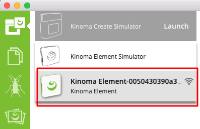
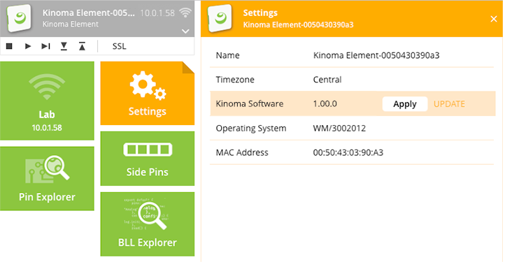
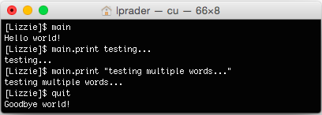
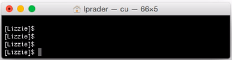

#Kinoma Element Quick Start Guide

This document is a guide to quickly getting started writing apps for Kinoma Element. This guide will get your started with HTTP requests, sensors, and timers. The reference documentation for this tutorial is the [Programmer's Guide to Kinoma Element](../element/). Additional sample applications can be found in our [GitHub repository](https://github.com/Kinoma/KPR-examples) and inside the Samples section of the Kinoma Code IDE.

**It is important to update your Kinoma Element when setting up to get new functionality and performance improvements.**

If you have any questions, please post them on our [forum](http://forum.kinoma.com/)!

##Device set up
Before you begin, you'll need to get your device ready for development. There are two ways to do this:

**Option 1. (Recommended)** Install and open the [Kinoma Code](../../code/) IDE and set up your Kinoma Element with the instructions below.

**Option 2.** Use telnet or the USB console to connect to the command line interface of Kinoma Element. These are described in the [Programmer's Guide to Kinoma Element](../element/). Once connected, connect Kinoma Element to your preferred Wi-Fi network using the `connect` command and then update to the latest firmware by typing `update`.

###Setting up your device in Kinoma Code

<!--From KO: Paragraphs before change:

Note: Kinoma Code is OS X only at this time. Windows users should use the command line interface. Linux and Windows versions of Kinoma Code are coming soon.

**Step 1:** Connect your Kinoma Element to a power supply.

**Step 2:** If Kinoma Element is on but there are no known Wi-Fi networks available, it boots into access point mode. If the Kinoma Element is running in access point mode the status light will either be blinking or steady white. When in access point mode the Wi-Fi network name is the hostname of the device. If no hostname has been set, the name is based on its MAC address and is of the form "Kinoma Element-xxxxxx".  **Connect your computer to the same network as the Kinoma Element.**   
Note: If you have an early version Kinoma Element with Firmware .9xxx see this [support article](
http://forum.kinoma.com/discussion/680/new-element-update-from-0-99-7-to-2-0-0-fails) on updating to the current firmware.

-->

Before you attempt to perform the initial update in Kinoma Code, check the firmware version of your device by following the instructions in [step 1 of this forum post](http://forum.kinoma.com/discussion/685/issues-with-first-firmware-update). If you're on version 0.9* the following steps will not work in the current version of Kinoma Code. Instead you should follow the instructions in the post.

> **Note:** Kinoma Code is only available for OS X and Windows at this time. A Linux version is coming soon.

**Step 1:** Connect your Kinoma Element to a power supply.

**Step 2:** If Kinoma Element is on but there are no known Wi-Fi networks available, it boots into access point mode. If the Kinoma Element is running in access point mode the status light will either be blinking or steady white. When in access point mode the Wi-Fi network name is the hostname of the device. If no hostname has been set, the name is based on its MAC address and is of the form “Kinoma Element-xxxxxx”. **Connect your computer to the same network as the Kinoma Element.**


**Step 3:** After switching to the Kinoma Element's access point mode network select your device from the list of target devices in Kinoma Code.



**Step 4:** Open the Wi-Fi app and select your preferred Wi-Fi network. The device will disappear from the list of target devices until you connect your computer to the network you just selected. When the Kinoma Element reboots and is able to connect to a known network it's status light will run steady green or white.


**Step 5:** Once you returned to your preferred Wi-Fi network, select your device again, go into the settings app and update your device. It is important to keep your Kinoma Element up to date to get the latest features and improvements.



##Kinoma Element status lights
These status light colors are for Kinoma Element Software 1.0 and above. Please make sure your Kinoma Element is up to date.


##Starting a new project in Kinoma Code

To start your first project, follow the steps shown in the video below.

<iframe width="100%" height="500" src="https://www.youtube.com/embed/ucj_t7JG-qE?rel=0&amp;vq=hd720" frameborder="0" allowfullscreen>
<a href="https://www.youtube.com/embed/9Upf9sTB3Es?rel=0&amp;vq=hd720">Watch Video</a>
</iframe>

Here is the object used in the sample application.json file:

```json
{ 
	"id": "test",
	"title":"my-first-app",
	"Element": {
		"main":"main"
	}
}
```

##Writing applications
###Application Framework
Kinoma Element has an optional, built-in application framework for you to use. A simple application's main.js file might look something like this:

```
let main = {
	onLaunch(){
		trace("Hello ");
		this.print("world!");
	},
	print(word) {
		trace(word+"\n");
	},
};
	
export default main;
```

This will simply print "Hello world!" when the application is run.

You are not strictly required to use this framework. For example, your main.js file could simply contain the following line:

```
trace("Hello world!\n")
```
	
"Hello world!" will be printed when this application is run, just as it was in the previous example.

####Calling Functions from the Command Line
> Note: The Kinoma Element Command Line Interface (CLI) is available over telnet and USB. See the Command Line Interface section of the [Programmer's Guide to Kinoma Element](../element/) for more details.

You can call functions defined in your application from the command line if you use the built-in application framework.  For example, say you have a file main.js that contains the following code:

```
let main = {
	onLaunch(){
		trace("Hello world!\n");
	},
	print(word) {
		trace(word+"\n");
	},
	onQuit(){
		trace("Goodbye world!\n");
	}
};
	
export default main;
```
	
To start the the application, which in turn calls `onLaunch`, simply type `main`. If your file was named something other than main.js, such as test.js, you would type `test`. 

To exit the application, which in turn calls `onQuit`, simply type `quit`. 

You can call other functions, such as the print function defined above, by typing `main.print testing...`. This calls print with the argument "testing..." If the input is a string and you want to pass in multiple words, put everything in quotes, i.e. `main.print "testing multiple words..."



###Timers

If you're familiar with JavaScript you may have used the `setTimeout` and `setInterval` functions. If not, a description of them can be found [here](http://www.w3schools.com/js/js_timing.asp). These functions can be used on Kinoma Element using the timer module.

####setTimeout

Here is a sample application that uses `setTimeout`.

```
let main = {
    onLaunch(){
        trace("Starting!\n");
        setTimeout(this.finish, 1000);
	
    },
    finish() {
    	trace("Finished.\n");
    }
};
	
export default main;
```
	
Running this application in the USB console looks like this:



<!-- not sure if gif is helpful at all or just obnoxious... -->

####setInterval
	
Here is a sample application that uses `setInterval` and `clearInterval`.

```
let count = 0;
let testInterval;
	
let main = {
    onLaunch(){
        trace("Starting!\n");
        testInterval = setInterval(this.count, 1000);
	
    },
    count() {
    	if (++count < 4) {
    		trace(count+"\n");
    	} else {
    		clearInterval(testInterval);
    		trace("Done.\n");
    	}
    	
    }
};
	
export default main;
```
	
Running this application in the USB console looks like this:


<!-- again, not sure if gif is helpful at all or just obnoxious... -->

###Adding Sensors
Kinoma Element has 16 hardware pins that work with a wide range of off-the-shelf sensors. These pins implement:

- Digital Input/Output
- Analog Input
- PWM 
- I2C 
- Serial Input/Output

####BLLs

All hardware pin programming is done in JavaScript. The code for each hardware module (sensor, LED, button, motor, etc.) is contained in a JavaScript module called a BLL. You can implement your own BLL to support the hardware modules you want to connect to your Kinoma Element or use pre-existing BLL implementations.

> Note: BLL is an acronym for Blinking Light Library. A BLL is not limited to blinking an LED. A BLL can be used to interact with all kinds of hardware modules.

For more details on creating BLLs and interacting with hardware, see the [Pins Module](../element-pins-module/) and [BLL Programming](../element-bll/) documentation.

####The Pins Module

The [Pins module](https://github.com/Kinoma/kinomajs/blob/master/xs6/sources/mc/extensions/pins/pins.js) is used to configure and interact with sensors by making calls to BLLs. To use it, you'll need to import the Pins object from the module by adding this line to the top of your main.js file:

```
import Pins from "pins";
```

You can then make calls to `Pins.configure`, `Pins.invoke`, and so on as detailed in the [Programmer's Guide to Kinoma Element](../element/).
		
The following is a sample main.js file for a Kinoma Element attached to a digital button (like [these from Adafruit](https://www.adafruit.com/products/1010)): 

```
import Pins from "pins";
	
let main = {
	onLaunch(){
		Pins.configure({
			power: {pin: 9, type: "Power"},
			ground: {pin: 10, type: "Ground"},
			button: {pin: 11, type: "Digital", direction: "input"}
		}, success => {
			if (success) {
				Pins.repeat("/button/read", 1000 , result => {
				    if (result) {
				        trace("Pressed\n");
				    } else {
				        trace("Unpressed\n");
				    }
				}); 
			} else {
				trace("Failed to configure button\n");
			}
		});
	},
	onQuit(){}
};
	
export default main;
```

This application does the following:

- Configures power, ground, and digital pins using built-in BLL modules. The source code of these modules can be found [here](https://github.com/Kinoma/kinomajs/tree/master/xs6/sources/mc/extensions/pins) in the files bll\_Digital.js, bll\_Ground.js, and bll\_Power.js.
- Reads the button's value every 1000ms
- Prints whether the button is being pressed or not every time it is read

<iframe width="100%" height="500" src="https://www.youtube.com/embed/V-DlgAEa4N8?rel=0&amp;vq=hd720" frameborder="0" allowfullscreen>
<a href="https://www.youtube.com/embed/V-DlgAEa4N8?rel=0&amp;vq=hd720">Watch Video</a>
</iframe>

###HTTP Communication
Kinoma Element can be used as an HTTP client or an HTTP server. Examples of both follow.

####HTTPClient

To communicate with web services, use the HTTPClient module. Here is a sample application that calls the [IP Address API at JSON Test](http://www.jsontest.com/#ip):

```
import HTTPClient from "HTTPClient";
let url = "http://ip.jsontest.com/";
let request = new HTTPClient(url); 
	
request.onDataReady = response => { 
    if (request.statusCode == 200) {
    	let responseObject = JSON.parse(String.fromArrayBuffer(response));
    	trace(`Your IP address: ${responseObject.ip}\n`);
    } else {
    	trace(`Error: ${request.statusCode}\n`);
    }	
};
request.start(); // send the request
```
	
Note that the example above first converts the response (an array buffer) to a string, then uses `JSON.parse` to convert the string to an object. This is the way to convert an `ArrayBuffer` to a JSON object.
	
####HTTPServer

To create an HTTP server and handle incoming requests, you use the HTTPServer module. You must use the built-in application framework and bind the server to the exported object to avoid the server being garbage collected.

Here is an example that simply replies to a request with the text in the request's body:

```
import HTTPServer from "HTTPServer";
	
let main = {
	onLaunch() {
		let server = new HTTPServer({port: 80}); 
		this.server = server; //binds the server to the exported main object
		server.onRequest = request => {
			request.response("text/plain", `Text received: ${String.fromArrayBuffer(request.content)}`); 
		}
	}
}

export default main;
```

The server URL is of the form http://[element-ip-address]:[port], for example http://1.2.3.4:80

<iframe width="100%" height="500" src="https://www.youtube.com/embed/vkpXQOzQ9cI?rel=0&amp;vq=hd720" frameborder="0" allowfullscreen>
<a href="https://www.youtube.com/embed/vkpXQOzQ9cI?rel=0&amp;vq=hd720">Watch Video</a>
</iframe>

> The app used to test HTTP requests in the video above is [Postman](http://www.getpostman.com/).

####Sample Apps
See the [element-http-client](https://github.com/Kinoma/KPR-examples/tree/master/element-http-client) and [element-http-server](https://github.com/Kinoma/KPR-examples/tree/master/element-http-server) sample apps for an example of making two Kinoma Element devices communicate with each other.
	
###WebSockets

####WebSocket server

Setting up a WebSocket server on Kinoma Element is also very easy. The WebSocket standard only defines a JavaScript client API for WebSockets. KinomaJS extends the standard WebSocket API so you can also create a WebSocket server in JavaScript. To do so you must include the WebSocket module.

```
import {WebSocketServer} from "websocket";
```
	
Then you can create a WebSocketServer object. 9300 is an open port on Kinoma Hardware, so you can do this using this line:

```
let wsServer = new WebSocketServer(9300);
```
	
Then you need to define what happens when a client requests a connection and messages are received. You do so by adding an `onconnect` and `onmessage` function. In the `onconnect` function below, the connection instance is passed as the connection argument. This is a WebSocket object.

```
let clients = []; //array to store clients
	
wsServer.onconnect = (connection, options) => { 
	clients.push(connection); //adds client to array
	connection.onmessage = msg => {
		let data = msg.data;
		//do something with data
	}
}
```

You can also define an `onerror` function. This would be placed in the `onconnect` function above.

```
conn.onerror = e => {
	trace(JSON.stringify(e)+"\n"); // log error
}
```

<!--From KO: Original paragraph is deleted:
		
See [this tutorial](../../develop/hack/hardware-browser-communication/) for a sample app that uses WebSockets to communicate between a web browser and Kinoma Element.

-->
