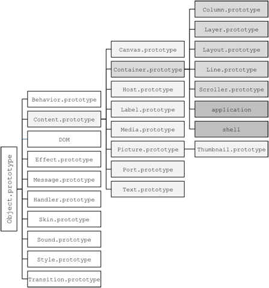

<!-- Version: 160815-CR / Primary author: Patrick Soquet / Last reviewed: December 2015 by Mike Jennings; August 2016 partial review by Patrick and edit per Lizzie Prader

This document is a detailed reference for the objects in the KinomaJS JavaScript (ECMAScript) API.
-->

#KinomaJS JavaScript Reference

## About This Document

This document provides details on the objects that define the KinomaJS API. The companion document [*KinomaJS Overview*](../overview/) introduces KinomaJS along with much more information that this document assumes you are already familiar with (including a Glossary of terms used in this document).

## Inheritance Hierarchy

Figure 1 summarizes the inheritance hierarchy for the objects described in this document. The `content` objects (leaves of the containment hierarchy) are shown in light gray, the `container` objects (branches of the containment hierarchy) in gray, and the `application` and `shell` objects (roots of the containment hierarchy) in dark gray.

**Figure 1.** KinomaJS Inheritance Hierarchy



## Global Properties

These properties of the KinomaJS global object can be used anywhere in an application or shell.

#####`encodeBase64(string)`

| | | |
| --- | --- | --- |
| `string` | `string` | required |

> The string to encode

| | | |
| --- | --- | --- |
| Returns | `string` | |

> The encoded string

#####`getEnvironmentVariable(name)`

| | | |
| --- | --- | --- |
| `name` | `string` | required |

> The name of the environment variable

| | | |
| --- | --- | --- |
| Returns | `string` | |

> The value of the specified environment variable, or `undefined` if it does not exist

#####`include(path)`

| | | |
| --- | --- | --- |
| `path` | `string` | required |

> The path of the script to execute as a program

Executes the program referenced by the `path` string in the current scope

#####`mergeURI(base, url)`

| | | |
| --- | --- | --- |
| `base` | `string` | required |

> The base URL

| | | |
| --- | --- | --- |
| `url` | `string` | required |

> The URL to merge with the base URL

| | | |
| --- | --- | --- |
| Returns | `string` | |

> The merged URL

#####`parseQuery(query)`

| | | |
| --- | --- | --- |
| `query` | `string` | required |

> The query string to parse

| | | |
| --- | --- | --- |
| Returns | `object` | |

> A query object whose property names and values are the names and values of the specified query string

#####`parseURI(url)`

| | | |
| --- | --- | --- |
| `url` | `string` | required |

> The URL to parse

| | | |
| --- | --- | --- |
| Returns | `object` | |

> An object with string properties corresponding to the parts of the URL: `scheme`, `user`, `password`, `authority`, `path`, `name`, `query`, or `fragment`
                     
`require(path)`

| | | |
| --- | --- | --- |
| `path` | `string` | required |

> The path of the script to execute as a program

Executes the script referenced by the `path` string and returns the exported programming interface of the module. For more information, see the [Common JS Modules specification](http://wiki.commonjs.org/wiki/Modules/1.1).

#####`screenScale`

| | | |
| --- | --- | --- |
| `screenScale` | `number` | read only |

>The display scale, as 1, 1.5, or 2

#####`serializeQuery(query)`

| | | |
| --- | --- | --- |
| `query` | `object` | required |

> The query object to serialize

| | | |
| --- | --- | --- |
| Returns | `string` | |

> A query string whose names and values are the names and values of the properties of the specified query object

#####`serializeURI(parts)`

| | | |
| --- | --- | --- |
| `parts` | `object` | required |

> The parts of the URL to serialize, as an object with `scheme`, `user`, `password`, `authority`, `path`, `name`, `query`, or `fragment` string properties

| | | |
| --- | --- | --- |
| Returns | `string` | |

> A URL built from properties of the `parts` parameter

#####`setEnvironmentVariable(name, value)`

| | | |
| --- | --- | --- |
| `name` | `string` | required |

> The name of the environment variable

| | | |
| --- | --- | --- |
| `value` | `string` | required |

> The value of the environment variable

Changes the value of the specified environment variable, creating it if it does not exist

#####`touches`

| | | |
| --- | --- | --- |
| `touches` | `object` | read only |

> The current touch samples, as an object with properties indexed by touch identifier. Each property is an array of samples, where each sample is an object with `x`, `y`, and `ticks` number properties corresponding to the most recent global position and time. To avoid overwhelming the application with events, the `onTouchMoved` event is not triggered on each touch point change. Touch move events are typically limited to the display refresh rate--for example, 60 times a second. To access any touch samples that occur between `onTouchMoved` events, behaviors use the `touches` global property.

<!--From CR: Example below (and maybe some of the details above) should be moved out of this Ref doc into the Overview doc.-->

```
function onTouchMoved(content, id, x, y, ticks) {
	var samples = touches[id];
	var sample = samples[samples.length - 1];
	// x == sample.x;
	// y == sample.y;
	// ticks == sample.ticks;
}
```

## KinomaJS Object Reference
This section provides details on the objects that define the KinomaJS API. For each object, the following information is presented if relevant:

- **Coordinates** -- For `content` objects only; details regarding how the object uses its coordinates for layout

- **Object Description** -- Descriptions of the object's value properties and function properties; also, for the global `application` and `shell` objects, an indication of the prototype from which the object inherits and whether the object is sealed and/or volatile

- **Constructor Description** -- A description of the object's constructor(s)

- **Dictionary** -- Present when additional information is needed regarding the dictionary passed to the object's dictionary-based constructor; describes the properties that the dictionary may contain. Dictionary parameters set properties having the same name (unless noted otherwise) in the created instance.

- **Prototype Description** -- The prototype from which this object's prototype inherits; whether instances of the object are sealed and/or volatile; and descriptions of any properties specific to this object's prototype

<!--From CR re the following: Currently no event returns a value. If that changes, event descriptions may end in a "Returns:" line and the following will be restored here: "If a return value is indicated, it is required unless noted otherwise."-->

- **Events** -- Descriptions of the events that the object triggers

The following conventions are used in this section:

* **Default values** -- Value properties or parameters that are required are indicated as such. Unless noted otherwise, the default values for properties or parameters are 0, `false`, and `undefined` for types `number`, `boolean`, and `string`, respectively.
   
* **Pixels** -- Most properties or parameters that designate pixels are in logical pixels. The descriptions explicitly mention when such numbers are in physical pixels.
   
* **"read only"** -- All properties defined by KinomaJS can be read, but only some can be set; properties that cannot be set are designated as "read only."
   
* **"this"** -- In property descriptions, "this" followed by a reference to the type of object under discussion (for example, "this container" in the "Container Object" section) refers to the object of that type that owns or inherits the property being accessed.

>**Note:** This reference section refers to chunks, but use of chunks has been deprecated.


### Application Object

Applications run in their own virtual machine. When the shell creates a `host` object, the runtime creates a virtual machine and its `application` object and then executes the application's main script, specified by the `url` parameter of the `Host` constructor. The application's main script usually assigns a behavior to the `application` object and builds a containment hierarchy.

#### Coordinates

The `application` object always has the position and size of the `host` object that hosts the application.

#### Object Description

Object inherits from `Container.prototype`.

Object is sealed.

#####`application`

| | | |
| --- | --- | --- |
| `application` | `object` | read only |

> For application scripts, there is only one `application` object, which is the value of the `application` global property and is the root of the containment hierarchy.

> For shell scripts, there is no `application` object; the value of the `application` global property is `null`.

#####`application.di`

| | | |
| --- | --- | --- |
| `application.di` | `string` | read only |

> This application's reverse identifier--for example, `com.kinoma.guide`

<!--From Peter re the following: Overview doc needs to introduce discovery and give an example of `type`.-->

#####`application.discover(type)`

| | | |
| --- | --- | --- |
| `type` | `string` | required |

> The type of services to discover on the local network

Causes this application to trigger `onDiscovered` events when KinomaJS signals that services of the specified type have appeared or disappeared on the network.

#####`application.forget(type)`

| | | |
| --- | --- | --- |
| `type` | `string` | required |

> The type of services to discover on the local network

Causes this application not to trigger `onDiscovered` events when KinomaJS signals that services of the specified type have appeared or disappeared on the network

#####`application.id`

| | | |
| --- | --- | --- |
| `application.id` | `string` | read only |

> This application's identifier--for example, `guide.kinoma.com`. It is used as the authority in a URL with the `xkpr` scheme.

#####`application.purge()`

Garbage-collects the virtual machine of this application

#####`application.shared`

| | | |
| --- | --- | --- |
| `application.shared` | `boolean` | |

<!--From Peter: The following info deleted here should be covered in the Overview doc:

The service uses SSDP to advertise its location, type, and UUID, and uses an HTTP server to dispatch messages to handler objects (or, if no handlers match, to the application object).-->

> If `true`, this application is shared as a service on the network. Set to `true` or `false` to turn the service on or off.

#####`application.url`

| | | |
| --- | --- | --- |
| `application.url` | `string` | read only |

> The URL of this application's main script

#####`application.uuid`

| | | |
| --- | --- | --- |
| `application.uuid` | `string` | read only |
 
> This application's persistent universal unique identifier (UUID). KinomaJS automatically creates this value the first time an application is launched on a given device.

#### Events

Same as for `container` object (see [Events](#container-object-events) in the section [Container Object](#container-object)), plus:

#####`onDiscovered(services)`

| | | |
| --- | --- | --- |
| `services` | `object` | |

> The currently available services, as an array of objects with `location`, `type`, and `uuid` string properties

This event is triggered when KinomaJS determines that services the `application` object has requested to discover have appeared or disappeared on the network.

#####`onInvoke(application, message)`

| | | |
| --- | --- | --- |
| `application` | `object` | |

> The `application` object

| | | |
| --- | --- | --- |
| `message` | `object` | |

> The received `message` object

This event is triggered when the application receives a message that does not match any of its handlers.

#####`onLaunch(application)`

| | | |
| --- | --- | --- |
| `application` | `object` | |

> The `application` object

This event is triggered when the shell calls the `launch` function of the `host` object that hosts the application.

#####`onQuit(application)`

| | | |
| --- | --- | --- |
| `application` | `object` | |

> The `application` object

This event is triggered when the shell calls the `quit` function of the `host` object that hosts the application.

### Behavior Object

The `behavior` object contains functions corresponding to events triggered by a `content` or `handler` object. A `content` or `handler` object checks whether its behavior, which can be any object, owns or inherits a function property with the name of the event, and if so calls that function, passing itself as the first parameter.

#### Constructor Description

<!--From CR: I've assumed that the following applies to all the constructors below; correct?-->

These constructors are provided only to trigger the `onCreate` event; applications and shells can define their own constructors for `behavior` objects.

<!--From CR: Please verify that ALL constructor parameters (below AND THROUGHOUT) are marked "required" that should be.

Patrick replied: "The dictionary parameter is required for Behavior and Behavior.template." I've made those changes below, but is `Behavior` really the only object for which the dictionary is required? (It's not shown as required anywhere else.)-->

<!--From CR: Please also review `Handler.bind(path, behavior)`-->

#####`Behavior(dictionary)`

| | | |
| --- | --- | --- |
| `dictionary` | `object` | required |

> An object with properties to initialize the result

| | | |
| --- | --- | --- |
| Returns | `object` | |

> A `behavior` instance, an object that inherits from `Behavior.prototype`

#####`Behavior(trigger, ...)`

| | | |
| --- | --- | --- |
| `trigger` | `object` | required |

> The `content` or `handler` object that will reference the result

| | | |
| --- | --- | --- |
| `...` | `*` | |

> Zero or more extra parameters

| | | |
| --- | --- | --- |
| Returns | `object` | |

> A `behavior` instance, an object that inherits from `Behavior.prototype`

#####`Behavior.template(dictionary)`

| | | |
| --- | --- | --- |
| `dictionary` | `object` | required |

> An object with properties to initialize the prototype of the result

| | | |
| --- | --- | --- |
| Returns | `function` | |

> A constructor that creates instances of a prototype that inherits from `Behavior.prototype`. The result can also be used as a dictionary-based constructor and provides a `template` function.

#### Prototype Description

Prototype inherits from `Object.prototype`.

#####`Behavior.prototype.onCreate(trigger, ...)`

| | | |
| --- | --- | --- |
| `trigger` | `object` | required |

> The `content` or `handler` object that will reference the result

| | | |
| --- | --- | --- |
| `...` | `*` | |

> Zero or more extra parameters

The parameters of the `onCreate` event are the parameters of the `Behavior` constructor. This function does nothing by default; a behavior can use it to initialize its properties, for example.

### Canvas Object

The `canvas` object is a `content` object that delegates drawing to a script in its behavior that draws using the HTML 2D Canvas API specified by the W3C. It provides a 2D context conforming to the [HTML Canvas 2D Context specification](http://www.w3.org/TR/2dcontext/) (which defines the `2d` context type, whose API is implemented using the `CanvasRenderingContext2D` interface).

#### Coordinates

The measured width and measured height of a `canvas` object are 0.

#### Constructor Description

#####`Canvas(dictionary)`

| | | |
| --- | --- | --- |
| `dictionary` | `object` | |

> An object with properties to initialize the result. The dictionary is the same as for the `content` object (see [Dictionary](#content-dictionary) in the section [Content Object](#content-object)).

| | | |
| --- | --- | --- |
| Returns | `object` | |

> A `canvas` instance, an object that inherits from `Canvas.prototype`

#####`Canvas(coordinates)`

| | | |
| --- | --- | --- |
| `coordinates` | `object` | |

> The coordinates of the result, as an object with `left`, `width`, `right`, `top`, `height`, or `bottom` number properties, specified in pixels

| | | |
| --- | --- | --- |
| Returns | `object` | |

> A `canvas` instance, an object that inherits from `Canvas.prototype`

#####`Canvas.template(anonymous)`

| | | |
| --- | --- | --- |
| `anonymous` | `function` | |

> A function that returns an object with properties to initialize the instances that the result creates

| | | |
| --- | --- | --- |
| Returns | `function` | |

> A constructor that creates instances of `Canvas.prototype`. The `prototype` property of the result is `Canvas.prototype`. The result also provides a `template` function.

#### Prototype Description

Prototype inherits from `Content.prototype`.

Instances are sealed and volatile.

#####`Canvas.prototype.getContext(id)`

| | | |
| --- | --- | --- |
| `id` | `string` | required |

> The identifier of the rendering context; must be `2d`

| | | |
| --- | --- | --- |
| Returns | `object` | |

> A 2D rendering context, an object that conforms to the `CanvasRenderingContext2D` interface except that the `image` parameter of the `createPattern` and `drawImage` functions must be a `canvas`, `picture`, or `texture` instance

####Events

Same as for `content` object (see [Events](#content-object-events) in the section [Content Object](#content-object))

### Column Object

The `column` object is a `container` object that arranges its contents vertically.

#### Coordinates

The measured height of a `column` object is the sum of the vertical extents of its contents.

The `top` and `bottom` coordinates of the column's contents are treated as vertical gaps between the contents.

The column distributes the difference between its fitted height and its measured height among its contents according to their `top` and `bottom` coordinates.

Horizontally, a `column` object measures itself and arranges its contents like a `container` object (see [Coordinates](#container-object-coordinates) in the section [Container Object](#container-object)).

#### Constructor Description

#####`Column(dictionary)`

| | | |
| --- | --- | --- |
| `dictionary` | `object` | |

> An object with properties to initialize the result. The dictionary is the same as for the `container` object (see [Dictionary](#container-dictionary) in the section [Container Object](#container-object)).

| | | |
| --- | --- | --- |
| Returns | `object` | |

> A `column` instance, an object that inherits from `Column.prototype`

#####`Column(coordinates, skin, style)`

| | | |
| --- | --- | --- |
| `coordinates` | `object` | |

> The coordinates of the result, as an object with `left`, `width`, `right`, `top`, `height`, or `bottom` number properties, specified in pixels

| | | |
| --- | --- | --- |
| `skin` | `object` | |

> The skin of the result, as a `skin` instance

| | | |
| --- | --- | --- |
| `style` | `object` | |

> The style of the result, as a `style` instance

| | | |
| --- | --- | --- |
| Returns | `object` | |

> A `column` instance, an object that inherits from `Column.prototype`

#####`Column.template(anonymous)`

| | | |
| --- | --- | --- |
| `anonymous` | `function` | |

> A function that returns an object with properties to initialize the instances that the result creates

| | | |
| --- | --- | --- |
| Returns | `function` | |

> A constructor that creates instances of `Column.prototype`. The `prototype` property of the result is `Column.prototype`. The result also provides a `template` function.

#### Prototype Description

Prototype inherits from `Container.prototype`.

Instances are sealed and volatile.

#### Events

Same as for `container` object (see [Events](#container-object-events) in the section [Container Object](#container-object))

<a id="container-object"></a>
### Container Object

The `container` object is a `content` object that can contain other `content` objects. In a container, `content` objects are stored in a doubly linked list. The `content` objects can also be accessed by index or by name using JavaScript bracket notation.

<a id="container-object-coordinates"></a>
####Coordinates

The measured width of a `container` object is the maximum horizontal extent of its contents.

Horizontally, a `container` object arranges its contents according to their `left` and `right` coordinates:

* If both are defined, the content stretches horizontally with the container. The fitted width of the content equals the fitted width of the container minus the value of the content's `left` and `right` coordinates.

* If only `left` is defined, the content sticks to the left of the container.

* If only `right` is defined, the content sticks to the right of the container.

* If both are undefined, the content sticks to the horizontal center of the container.

The measured height of a `container` object is the maximum vertical extent of its contents.

Vertically, a `container` object arranges its content s according to their `top` and `bottom` coordinates:

* If both are defined, the content stretches vertically with the container. The fitted height of the content equals the fitted height of the container minus the value of the content's `top` and `bottom` coordinates.

* If only `top` is defined, the content sticks to the top of the container.

* If only `bottom` is defined, the content sticks to the bottom of the container.

* If both are undefined, the content sticks to the vertical middle of the container.

#### Constructor Description

#####`Container(dictionary)`

| | | |
| --- | --- | --- |
| `dictionary` | `object` | |

> An object with properties to initialize the result (see [Dictionary](#container-dictionary) below for details)

| | | |
| --- | --- | --- |
| Returns | `object` | |

> A `container` instance, an object that inherits from `Container.prototype`

#####`Container(coordinates, skin, style)`

| | | |
| --- | --- | --- |
| `coordinates` | `object` | |

> The coordinates of the result, as an object with `left`, `width`, `right`, `top`, `height`, or `bottom` number properties, specified in pixels

| | | |
| --- | --- | --- |
| `skin` | `object` | |

> The skin of the result, as a `skin` instance

| | | |
| --- | --- | --- |
| `style` | `object` | |

> The style of the result, as a `style` instance

| | | |
| --- | --- | --- |
| Returns | `object` | |

> A `container` instance, an object that inherits from `Container.prototype`

#####`Container.template(anonymous)`

| | | |
| --- | --- | --- |
| `anonymous` | `function` | |

> A function that returns an object with properties to initialize the instances that the result creates

| | | |
| --- | --- | --- |
| Returns | `function` | |

> A constructor that creates instances of `Container.prototype`. The `prototype` property of the result is `Container.prototype`. The result also provides a `template` function.

<a id="container-dictionary"></a>
#### Dictionary

Same as for `content` object (see [Dictionary](#content-dictionary) in the section [Content Object](#content-object)), plus:

| | | |
| --- | --- | --- |
| `backgroundTouch` | `boolean` | |

> If `true`, this container receives any touch events that are received by its contents; that is, it will trigger touch events when one of its contents has been touched.

<!--From CR re the following: Nothing is said anywhere else about clipping (and Mike has commented that he thinks more info is needed)--perhaps cover it in the Overview doc?-->

| | | |
| --- | --- | --- |
| `clip` | `boolean` | |

> If `true`, this container clips its contents.

<!--From CR: Is there a technical reason that an array of objects is type `array` in a dictionary (such as below) but type `object` for properties/parameters in all other contexts (such as for onDiscovered)?

Also, the type in the second column should not be in the code font if being used as a generic term; please advise if any should be changed. The current types that appear there are `number`, `boolean`, `string`, `object`, and (new in this draft) `function` and 'array`.-->

| | | |
| --- | --- | --- |
| `contents` | `array` | |

> An array of the `content` objects in this container

#### Prototype Description

Prototype inherits from `Content.prototype`.

Instances are sealed and volatile.

#####`Container.prototype.add(content)`

| | | |
| --- | --- | --- |
| `content` | `object` | required |

> The `content` object to add. It must be unbound; that is, its container must be `null`.

Adds the specified `content` object to this container. The `content` object becomes the last `content` object in this container.

#####`Container.prototype.backgroundTouch`

| | | |
| --- | --- | --- |
| `Container.prototype.backgroundTouch` | `boolean` | |

> If `true`, this container also receives any touch events that are received by its contents; that is, it will trigger touch events when one of its contents has been touched. If the container or any of its contents captures the touch events (by calling `captureTouch`), touch events will be delivered exclusively to the capturing object until after the corresponding `onTouchEnded` event is triggered.

#####`Container.prototype.clip`

| | | |
| --- | --- | --- |
| `Container.prototype.clip` | `boolean` | |

> If `true`, this container clips its contents.

#####`Container.prototype.distribute(id, ...)`

| | | |
| --- | --- | --- |
| `id` | `string` | required |

> The name of the event to trigger

| | | |
| --- | --- | --- |
| `...` | `*` | |

> Zero or more extra parameters

Causes this container and all `content` objects downward in the containment hierarchy to trigger an event named by the value of `id`. The order of traversal is depth first. Traversal halts when one of the triggered event-handling functions returns `true`. Note that the first parameter of a distributed event is the `content` object that triggers the event, not this container. Additional parameters, if any, of the event are the extra parameters of the `distribute` function.

#####`Container.prototype.empty(start, stop)`

| | | |
| --- | --- | --- |
| `start` | `number` | |

> The starting index

| | | |
| --- | --- | --- |
| `stop` | `number` | |

> The stopping index (`this.length` by default)

Removes `content` objects from this container, starting at index `start` and stopping at index `stop`. If `start` or `stop` is less than 0, it is an offset from `this.length`.

#####`Container.prototype.first`

| | | |
| --- | --- | --- |
| `Container.prototype.first` |`object` | read only |

The first `content` object in this container, or `null` if this container is empty

#####`Container.prototype.firstThat(id, ...)`

| | | |
| --- | --- | --- |
| `id` | `string` | required |

> The name of the event to trigger

| | | |
| --- | --- | --- |
| `...` | `*` | |

> Zero or more extra parameters

Causes all `content` objects in this container to trigger an event named by the value of `id`. The order of traversal is from the first to the last. Traversal halts when a distributed event returns `true`. Note that the first parameter of a distributed event is the `content` object that triggers the event, not this container. Additional parameters, if any, of the event are the extra parameters of the `firstThat` function.

#####`Container.prototype.insert(content, before)`

| | | |
| --- | --- | --- |
| `content` | `object` | required |

> The `content` object to insert. Its container must be `null`.

| | | |
| --- | --- | --- |
| `before` | `object` | required |

> The `content` object before which to insert. Its container must be this container.

Inserts one `content` object before another in this container as specified by the parameters

#####`Container.prototype.last`

| | | |
| --- | --- | --- |
| `Container.prototype.last` |`object` | read only |

> The last `content` object in this container, or `null` if this container is empty

#####`Container.prototype.lastThat(id, ...)`

| | | |
| --- | --- | --- |
| `id` | `string` | required |

> The name of the event to trigger

| | | |
| --- | --- | --- |
| `...` | `*` | |

> Zero or more extra parameters

Causes all `content` objects in this container to trigger an event named by the value of `id`. The order of traversal is from the last to the first. Traversal halts when a distributed event returns `true`. Note that the first parameter of a distributed event is the `content` object that triggers the event, not this container. Additional parameters, if any, of the event are the extra parameters of the `lastThat` function.

#####`Container.prototype.length`

| | | |
| --- | --- | --- |
| `Container.prototype.length` |`number` | read only |

> The number of `content` objects in this container

#####`Container.prototype.remove(content)`

| | | |
| --- | --- | --- |
| `content` | `object` | required |

> The `content` object to remove. Its container must be this container.

Removes the specified `content` object from this container

#####`Container.prototype.replace(content, by)`

| | | |
| --- | --- | --- |
| `content` | `object` | required |

> The `content` object to replace. Its container must be this container.

| | | |
| --- | --- | --- |
| `by` | `object` | required |

> The replacing `content` object. It must be unbound; that is, its container must be `null`.

Replaces one `content` object with another in this container as specified by the parameters

#####`Container.prototype.run(transition, ...)`

| | | |
| --- | --- | --- |
| `transition` | `object` | required |

> The `transition` object to run

| | | |
| --- | --- | --- |
| `...` | `*` | |

> Zero or more extra parameters

Runs the specified `transition` object in this container, binding that object to this container for the duration of the transition. The extra parameters are passed to the `onBegin` and `onEnd` functions of the `transition` object. The container triggers the `onTransitionBeginning` event before the transition starts and the `onTransitionEnded` event after the transition ends.

#####`Container.prototype.swap(content0, content1)`

| | | |
| --- | --- | --- |
| `content0, content1` | `object` | required |

> The `content` objects to swap. The container of both objects must be this container.

<!--From Mike Jennings re the following: Presumably it changes the index and re-lays-out the container's contents?  Does that trigger any events?-->

Swaps the specified `content` objects in this container

#####`Container.prototype.transitioning`

| | | |
| --- | --- | --- |
| `Container.prototype.transitioning` | `boolean` | read only |

> If `true`, this container is running a `transition` object.

<a id="container-object-events"></a>

####Events

Same as for `content` object (see [Events](#content-object-events) in the section [Content Object](#content-object)), plus:

#####`onTransitionBeginning(container)`

| | | |
| --- | --- | --- |
| `container` | `object` | |

> The `container` object that triggered the event

This event is triggered when a `transition` object starts in the specified `container` object.

#####`onTransitionEnded(container)`

| | | |
| --- | --- | --- |
| `container` | `object` | |

> The `container` object that triggered the event

This event is triggered when a `transition` object ends in the specified `container` object.

<a id="content-object"></a>

### Content Object

Applications and shells use `content` objects for graphical parts of their user interface, such as buttons, icons, sliders, switches, and tabs.

<a id="content-object-coordinates"></a>
#### Coordinates

If a `content` object has a skin that references a texture without using tiles, the measured width and measured height of the `content` object are the width and height of its `skin` object; otherwise, the measured width and measured height of the `content` object are 0.

#### Constructor Description

#####`Content(dictionary)`

| | | |
| --- | --- | --- |
| `dictionary` | `object` | |

> An object with properties to initialize the result (see [Dictionary](#content-dictionary) below for details)

| | | |
| --- | --- | --- |
| Returns | `object` | |

> A `content` instance, an object that inherits from `Content.prototype`

#####`Content(coordinates, skin, style)`

| | | |
| --- | --- | --- |
| `coordinates` | `object` | |

> The coordinates of the result, as an object with `left`, `width`, `right`, `top`, `height`, or `bottom` number properties, specified in pixels

| | | |
| --- | --- | --- |
| `skin` | `object` | |

> The skin of the result, as a `skin` instance

| | | |
| --- | --- | --- |
| `style` | `object` | |

> The style of the result, as a `style` instance

| | | |
| --- | --- | --- |
| Returns | `object` | |

> A `content` instance, an object that inherits from `Content.prototype`

#####`Content.template(anonymous)`

| | | |
| --- | --- | --- |
| `anonymous` | `function` | |

> A function that returns an object with properties to initialize the instances that the result creates

| | | |
| --- | --- | --- |
| Returns | `function` | |

> A constructor that creates instances of `Content.prototype`. The `prototype` property of the result is `Content.prototype`. The result also provides a `template` function.

<a id="content-dictionary"></a>
#### Dictionary

| | | |
| --- | --- | --- |
| `active` | `boolean` | |

> If `true`, this content can be touched; that is, it triggers touch events.

| | | |
| --- | --- | --- |
| `behavior` | `object` | |

> This content's `behavior` object. When this content triggers an event, it calls the corresponding function property of its behavior, if any.

| | | |
| --- | --- | --- |
| `bottom` | `number` | |

> This content's `bottom` coordinate, in pixels (setting `bottom` in the created instance's `coordinates` property)

| | | |
| --- | --- | --- |
| `duration` | `number` | |

> This content's duration, in milliseconds. This content triggers the `onFinished` event when its clock is running and its time equals its duration.

| | | |
| --- | --- | --- |
| `exclusiveTouch` | `boolean` | |

> If `true`, this content always captures touches; that is, `captureTouch` is implicitly invoked on `onTouchDown` for this content. Setting `exclusiveTouch` to `true` is equivalent to calling `captureTouch` in response to the `onTouchDown` event.

| | | |
| --- | --- | --- |
| `fraction` | `number` | |

> This content's fraction--that is, the ratio of its time to its duration

| | | |
| --- | --- | --- |
| `height` | `number` | |

> This content's height, in pixels (setting `height` in the created instance's `coordinates` property)

| | | |
| --- | --- | --- |
| `interval` | `number` | |

> The time between ticks of this content's clock--that is, number of milliseconds between triggering the `onTimeChanged` events of the content's behavior when its clock is running.

> ***Important:*** Do not use this property for high frame-rate animation. Instead, use the object's clock.

| | | |
| --- | --- | --- |
| `left` | `number` | |

> This content's `left` coordinate, in pixels (setting `left` in the created instance's `coordinates` property)

| | | |
| --- | --- | --- |
| `name` | `string` | |

> This content's name

| | | |
| --- | --- | --- |
| `right` | `number` | |

> This content's `right` coordinate, in pixels (setting `right` in the created instance's `coordinates` property)

| | | |
| --- | --- | --- |
| `skin` | `object` | |

> This content's skin, as a `skin` instance

| | | |
| --- | --- | --- |
| `state` | `number` | |

> This content's state. If this content's skin defines states, setting the state changes the appearance of this content.

| | | |
| --- | --- | --- |
| `style` | `object` | |

> This content's style, as a `style` instance

| | | |
| --- | --- | --- |
| `time` | `number` | |

> This content's time, in milliseconds. When its time is set, this content triggers the `onTimeChanged` event.

| | | |
| --- | --- | --- |
| `top` | `number` | |

> This content's `top` coordinate, in pixels (setting `top` in the created instance's `coordinates` property)

| | | |
| --- | --- | --- |
| `variant` | `number` | |

> This content's variant. If this content's skin defines variants, setting the variant changes the appearance of this content.

| | | |
| --- | --- | --- |
| `width` | `number` | |

> This content's width, in pixels (setting `width` in the created instance's `coordinates` property)

#### Prototype Description

Prototype inherits from `Object.prototype`.

Instances are sealed and volatile.

#####`Content.prototype.active`

| | | |
| --- | --- | --- |
| `Content.prototype.active` | `boolean` | |

> If `true`, this content can be touched; that is, it triggers touch events.

#####`Content.prototype.behavior`

| | | |
| --- | --- | --- |
| `Content.prototype.behavior` | `object` | |

> This content's `behavior` object or `null` (the default). When this content triggers an event, it calls the corresponding function property of its behavior, if any.

#####`Content.prototype.bounds`

| | | |
| --- | --- | --- |
| `Content.prototype.bounds` | `object` | |

> This content's global position and size, as an object with `x`, `y`, `width`, and `height` number properties, specified in pixels. If this content is unbound, the getter returns `undefined` and the setter is ignored.

#####`Content.prototype.bubble(id, ...)`

| | | |
| --- | --- | --- |
| `id` | `string` | required |

> The name of the event to trigger

| | | |
| --- | --- | --- |
| `...` | `*` | |

> Zero or more extra parameters

Causes this content and all `container` objects upward in the containment hierarchy to trigger an event named by the value of `id`. The bubbling halts when a bubbled event returns `true`. Note that the first parameter of a bubbled event is the `container` object that triggers the event, not this content. Additional parameters, if any, of a bubbled event are the extra parameters of the `bubble` function.

#####`Content.prototype.cancel()`

Cancels the messages invoked by this content, if any

#####`Content.prototype.captureTouch(id, x, y, ticks)`

| | | |
| --- | --- | --- |
| `id` | `number` | required |

> The identifier of the touch

| | | |
| --- | --- | --- |
| `x, y` | `number` | required |

> The global position of the touch, in pixels

| | | |
| --- | --- | --- |
| `ticks` | `number` | required |

> The global time of the touch

Causes this content to capture the touch named `id`, meaning that only this content will trigger the remaining `onTouchMoved` and `onTouchEnded` events related to that touch. Other `content` objects concerned with the captured touch trigger the `onTouchCancelled` event when the `captureTouch` function is called.

#####`Content.prototype.container`

| | | |
| --- | --- | --- |
| `Content.prototype.container` | `object` | read only |

> This content's container, or `null` if this content is unbound--that is, if it has no container

#####`Content.prototype.coordinates`

| | | |
| --- | --- | --- |
| `Content.prototype.coordinates` | `object` | |

> This content's coordinates, as an object with `left`, `width`, `right`, `top`, `height`, or `bottom` number properties, specified in pixels

#####`Content.prototype.delegate(id, ...)`

| | | |
| --- | --- | --- |
| `id` | `string` | required |

> The name of the event to trigger

| | | |
| --- | --- | --- |
| `...` | `*` | |

> Zero or more extra parameters

Causes this content to trigger an event named by the value of `id`. The first parameter of the delegated event is this content. Additional parameters, if any, of the delegated event are the extra parameters of the `delegate` function.

#####`Content.prototype.duration`

| | | |
| --- | --- | --- |
| `Content.prototype.duration` | `number` | |

> This content's duration, in milliseconds. This content triggers the `onFinished` event when its clock is running and its time equals its duration.

#####`Content.prototype.exclusiveTouch`

| | | |
| --- | --- | --- |
| `Content.prototype.exclusiveTouch` | `boolean` | |

> If `true`, this content always captures touches; that is, `captureTouch` is implicitly invoked on `onTouchDown` for this content. Setting `exclusiveTouch` to `true` is equivalent to calling `captureTouch` in response to the `onTouchDown` event.

#####`Content.prototype.focus()`

Focuses this content so that it triggers keyboard events. Only one `content` object at a time is focused.

#####`Content.prototype.focused`

| | | |
| --- | --- | --- |
| `Content.prototype.focused` | `boolean` | read only |

> If `true`, this content is the current focus; that is, it triggers keyboard events. Note that keyboard events bubble. The default focus is the `application` object.

#####`Content.prototype.fraction`

| | | |
| --- | --- | --- |
| `Content.prototype.fraction` | `number` | |

> This content's fraction--that is, the ratio of its time to its duration. If the duration is 0, the getter returns `undefined` and the setter is ignored. This content triggers the `onTimeChanged` event when its fraction is set.

#####`Content.prototype.height`

| | | |
| --- | --- | --- |
| `Content.prototype.height` | `number` | |

> This content's height, in pixels

#####`Content.prototype.hit(x, y)`

| | | |
| --- | --- | --- |
| `x, y` | `number` | required |

> The global position to test, in pixels

| | | |
| --- | --- | --- |
| Returns | `boolean` | |

> If `true`, this content is bound and contains the position.

#####`Content.prototype.index`

| | | |
| --- | --- | --- |
| `Content.prototype.index` | `number` | read only |

> The index of this content in its container, or –1 if this content is unbound

#####`Content.prototype.interval`

| | | |
| --- | --- | --- |
| `Content.prototype.interval` | `number` | |

> The time between ticks of this content's clock--that is, number of milliseconds between triggering the `onTimeChanged` events of the content's behavior when its clock is running.

> ***Important:*** Do not use this property for high frame-rate animation. Instead, use the object's clock.

#####`Content.prototype.invoke(message, type)`

| | | |
| --- | --- | --- |
| `message` | `object` | required |

> The `message` object to invoke

| | | |
| --- | --- | --- |
| `type` | `string` | |

> The type of the result that this content expects (`Message.CHUNK`, `Message.DOM`, `Message.JSON`, or `Message.TEXT`)

Invokes the specified `message` object. If `type` is specified, this content will eventually trigger the `onComplete` event.

#####`Content.prototype.moveBy(x, y)`

| | | |
| --- | --- | --- |
| `x, y` | `number` | required |

> The deltas by which to move this content, in pixels

Moves this content as specified by the parameters. If the content's coordinates constrain its position, the `moveBy` function ignores the corresponding horizontal or vertical deltas.

#####`Content.prototype.multipleTouch`

| | | |
| --- | --- | --- |
| `Content.prototype.multipleTouch` | `boolean` | |

> If `true`, this content handles multiple touches. Note that `multipleTouch` is `false` by default.

#####`Content.prototype.name`

| | | |
| --- | --- | --- |
| `Content.prototype.name` | `string` | |

> This content's name

#####`Content.prototype.next`

| | | |
| --- | --- | --- |
| `Content.prototype.next` | `object` | read only |

> The next `content` object of this content's container; `null` if this content is the last `content` object of this content's container or if this content has no container

#####`Content.prototype.position`

| | | |
| --- | --- | --- |
| `Content.prototype.position` | `object` | |

> This content's global position, as an object with `x` and `y` number properties, specified in pixels. If this content is unbound, the getter returns `undefined` and the setter is ignored.

#####`Content.prototype.previous`

| | | |
| --- | --- | --- |
| `Content.prototype.previous` | `object` | read only |

> The previous `content` object in this content's container; `null` if this content is the first `content` object of this content's container or if this content has no container

#####`Content.prototype.running`

| | | |
| --- | --- | --- |
| `Content.prototype.running` | `boolean` | read only |

> If `true`, this content's clock is running.

#####`Content.prototype.size`

| | | |
| --- | --- | --- |
| `Content.prototype.size` | `object` | |

> This content's size, as an object with `width` and `height` number properties, specified in pixels

#####`Content.prototype.sizeBy(width, height)`

| | | |
| --- | --- | --- |
| `width, height` | `number` | required |

> The deltas by which to size this content, in pixels

Sizes this content as specified by the parameters. If this content's coordinates constrain its size, the `sizeBy` function ignores the corresponding horizontal or vertical deltas.

#####`Content.prototype.skin`

| | | |
| --- | --- | --- |
| `Content.prototype.skin` | `object` | |

> This content's skin, as a `skin` instance or `null` (the default)

#####`Content.prototype.start()`

Starts this content's clock

#####`Content.prototype.state`

| | | |
| --- | --- | --- |
| `Content.prototype.state` | `number` | |

> This content's state. If this content's skin defines states, setting the state changes the appearance of this content.

> A `content` object can change its `state` property to match the data it represents. Applications and shells map symbolic states (such as `disabled`, `enabled`, or `highlighted`) to `state` numbers. The `skin` object uses such numbers to change the appearance of `content` objects.

#####`Content.prototype.stop()`

Stops this content's clock

#####`Content.prototype.style`

| | | |
| --- | --- | --- |
| `Content.prototype.style` | `object` | |

> This content's style, as a `style` instance or `null` (the default)

#####`Content.prototype.time`

| | | |
| --- | --- | --- |
| `Content.prototype.time` | `number` | |

> This content's time, in milliseconds. When its time is set, this content triggers the `onTimeChanged` event.

#####`Content.prototype.variant`

| | | |
| --- | --- | --- |
| `Content.prototype.variant` | `number` | |

> This content's variant. If this content's skin defines variants, setting the variant changes the appearance of this content.

> A `content` object can change its `variant` property to match the data it represents. Applications and shells map symbolic variants (such as `on` or `off`) to `variant` numbers. The `skin` object uses such numbers to change the appearance of `content` objects.

#####`Content.prototype.visible`

| | | |
| --- | --- | --- |
| `Content.prototype.visible` | `boolean` | |

> If `true` (the default), this content is visible.

#####`Content.prototype.wait(time)`

| | | |
| --- | --- | --- |
| `time` | `number` | required |

> The time to wait, in milliseconds

When the specified time has elapsed, this content triggers the `onComplete` event.

#####`Content.prototype.width`

| | | |
| --- | --- | --- |
| `Content.prototype.width` | `number` | |

> This content's width, in pixels

#####`Content.prototype.x` / `y`

| | | |
| --- | --- | --- |
| `Content.prototype.x` | `number` | |
| `Content.prototype.y` | `number` | |

>This content's global position. If this content is unbound, the getters return `undefined` and the setters are ignored.

<a id="content-object-events"></a>
####Events

The following standard events are triggered by `content` objects. Applications and shells can also trigger custom events using the `bubble`, `delegate`, `distribute`, `firstThat`, and `lastThat` functions.

#####`onComplete(content, message, data)`

| | | |
| --- | --- | --- |
| `content` | `object` | |

> The `content` object that triggered the event

| | | |
| --- | --- | --- |
| `message` | `object` | |

> The completed `message` object

| | | |
| --- | --- | --- |
| `data` | `...` | |

> The result of the message, as a DOM document, JSON object, chunk, or string, depending on the invocation type (or `null` if the object specified by `message` failed)

This event is triggered upon completion of the specified `message` object invoked by the specified `content` object.

#####`onCreate(content, data, context)`

| | | |
| --- | --- | --- |
| `content` | `object` | |

> The `content` object that triggered the event

| | | |
| --- | --- | --- |
| `data, context  ` | `object` | |

> The parameters of the constructor of the `content` object that references or contains the behavior

This event is triggered when the behavior is constructed.

#####`onDisplayed(content)`

| | | |
| --- | --- | --- |
| `content` | `object` | |

> The `content` object that triggered the event

This event is triggered when the specified `content` object becomes visible.

#####`onDisplaying(content)`

| | | |
| --- | --- | --- |
| `content` | `object` | |

> The `content` object that triggered the event

This event is triggered after the specified `content` object is added to the containment hierarchy and has been measured and fitted, but before it is visible to the user. This is the first event the object receives after its coordinates have been computed.

#####`onFinished(content)`

| | | |
| --- | --- | --- |
| `content` | `object` | |

> The `content` object that triggered the event

This event is triggered when the specified `content` object is running and its time equals its duration.

#####`onFocused(content)`

| | | |
| --- | --- | --- |
| `content` | `object` | |

> The `content` object that triggered the event

This event is triggered when the specified `content` object becomes the focus.

#####`onKeyDown(content, key, modifiers, count, ticks)`  

`onKeyUp(content, key, modifiers, count, ticks)`

| | | |
| --- | --- | --- |
| `content` | `object` | |

> The `content` object that triggered the event

| | | |
| --- | --- | --- |
| `key` | `string` | |

> The typed character

| | | |
| --- | --- | --- |
| `modifiers` | `number` | |

> The modifier key or keys pressed: 0 for none, 1 for the shift key, 2 for the control key, 4 for the option key. When more then one modifier key is pressed, the values are combined using logical OR.

| | | |
| --- | --- | --- |
| `count` | `number` | |

> How many times this key was pressed starting from the `onKeyDown` event: 1 for the initial key press, 2 for the first automatic repeat, and so on.

| | | |
| --- | --- | --- |
| `ticks` | `number` | |

> The global time of the event

These events are triggered when characters are typed and the `content` object is focused.

#####`onTimeChanged(content)`

| | | |
| --- | --- | --- |
| `content` | `object` | |

> The `content` object that triggered the event

This event is triggered when the time of the specified `content` object changes.

#####`onTouchBegan(content, id, x, y, ticks)`

`onTouchCancelled(content, id)`
  
`onTouchEnded(content, id, x, y, ticks)` 
 
`onTouchMoved(content, id, x, y, ticks)`  

| | | |
| --- | --- | --- |
| `content` | `object` | |

> The `content` object that triggered the event

| | | |
| --- | --- | --- |
| `id` | `number` | |

<!--From Peter re the following: We should explain that id == index of the touch and the value of the first touch (0 or 1?)-->

> The identifier of the touch

| | | |
| --- | --- | --- |
| `x, y` | `number` | |

> The global coordinates of the event, in pixels

| | | |
| --- | --- | --- |
| `ticks` | `number` | |

> The global time of the event

These events are triggered when the specified `content` object is active and touched.

### DOM Object

The `DOM` object enables applications and shells to parse and serialize XML strings to and from XML document objects conforming to the W3C [Document Object Model (DOM) Level 2 Core Specification](http://www.w3.org/TR/DOM-Level-2-Core).

#### Object Description

#####`DOM.implementation`

| | | |
| --- | --- | --- |
| `DOM.implementation` | `object` | read only |

> An object conforming to the `DOMImplementation` interface that enables creating XML document objects with the `createDocument` function

#####`DOM.parse(string)`

| | | |
| --- | --- | --- |
| `string` | `string` | required |

> The string to parse

| | | |
| --- | --- | --- |
| Returns | `object` | |

> An XML document object

#####`DOM.serialize(document)`

| | | |
| --- | --- | --- |
| `document` | `object` | required |

> The XML document object to serialize

| | | |
| --- | --- | --- |
| Returns | `string` | |

> An XML string

### Effect Object

Applications and shells assign effects to modify the appearance of images associated with `layer`, `picture`, `thumbnail`, and `texture` instances.

#### Constructor Description

#####`Effect()`

| | | |
| --- | --- | --- |
| Returns | `object` | |

> An `effect` instance, an object that inherits from `Effect.prototype`

The created instance applies no effects and so does not modify the image. Use the properties of `Effect.prototype` to configure the result.

####Prototype Description

Prototype inherits from `Object.prototype`.

Instances are sealed and volatile.

#####`Effect.prototype.colorize(color, opacity)`

| | | |
| --- | --- | --- |
| `color` | `string` | |

> The colorization color, in [CSS3 color syntax](http://www.w3.org/TR/css3-color/#colorunits) (`gray` by default)

| | | |
| --- | --- | --- |
| `opacity` | `number` | |

> The colorization opacity, as a number between 0 (transparent) and 1 (opaque). The default value is 1.

Colorizes the image

#####`Effect.prototype.gaussianBlur(x, y)`

| | | |
| --- | --- | --- |
| `x, y` | `number` | |

> The deviations of the Gaussian filter (1 by default)

Blurs the image

#####`Effect.prototype.gray(dark, lite)`

| | | |
| --- | --- | --- |
| `dark` | `string` | |

> The dark color, in [CSS3 color syntax](http://www.w3.org/TR/css3-color/#colorunits) (`black` by default)

| | | |
| --- | --- | --- |
| `lite` | `string` | |

> The light color, in [CSS3 color syntax](http://www.w3.org/TR/css3-color/#colorunits) (`white` by default)

Converts color in the image to monochrome. Pixels are converted to gray and the result is used to interpolate between the dark and light colors.

#####`Effect.prototype.innerGlow(color, opacity, blur, radius)`

| | | |
| --- | --- | --- |
| `color` | `string` | |

> The glow color, in [CSS3 color syntax](http://www.w3.org/TR/css3-color/#colorunits) (`white` by default)

| | | |
| --- | --- | --- |
| `opacity` | `number` | |

> The glow opacity, as a number between 0 (transparent) and 1 (opaque). The default value is 1.

| | | |
| --- | --- | --- |
| `blur` | `number` | |

> The glow softness (1 by default)

| | | |
| --- | --- | --- |
| `radius` | `number` | |

> The glow radius inward from the boundary, in pixels (1 by default)

Applies a glow to the inner boundary of the image

#####`Effect.prototype.innerHilite(color, opacity, blur, x, y)`

| | | |
| --- | --- | --- |
| `color` | `string` | |

> The highlight color, in [CSS3 color syntax](http://www.w3.org/TR/css3-color/#colorunits) (`white` by default)

| | | |
| --- | --- | --- |
| `opacity` | `number` | |

> The highlight opacity, as a number between 0 (transparent) and 1 (opaque). The default value is 1.

| | | |
| --- | --- | --- |
| `blur` | `number` | |

> The highlight softness (2 by default)

| | | |
| --- | --- | --- |
| `x, y` | `number` | |

> The highlight offsets relative to the boundary, in pixels (2 by default)

Applies a highlight to the inner boundary of the image

#####`Effect.prototype.innerShadow(color, opacity, blur, x, y)`

| | | |
| --- | --- | --- |
| `color` | `string` | |

> The shadow color, in [CSS3 color syntax](http://www.w3.org/TR/css3-color/#colorunits) (`black` by default)

| | | |
| --- | --- | --- |
| `opacity` | `number` | |

> The shadow opacity, as a number between 0 (transparent) and 1 (opaque). The default value is 1.

| | | |
| --- | --- | --- |
| `blur` | `number` | |

> The shadow softness (2 by default)

| | | |
| --- | --- | --- |
| `x, y` | `number` | |

> The shadow offsets relative to the boundary, in pixels (2 by default)

Applies a shadow to the inner boundary of the image

#####`Effect.prototype.mask(texture)`

| | | |
| --- | --- | --- |
| `texture` | `object` | required |

> The mask, as a `texture` instance

Masks the image

#####`Effect.prototype.outerGlow(color, opacity, blur, radius)`

| | | |
| --- | --- | --- |
| `color` | `string` | |

> The glow color, in [CSS3 color syntax](http://www.w3.org/TR/css3-color/#colorunits) (`white` by default)

| | | |
| --- | --- | --- |
| `opacity` | `number` | |

> The glow opacity, as a number between 0 (transparent) and 1 (opaque). The default value is 1.

| | | |
| --- | --- | --- |
| `blur` | `number` | |

> The glow softness (1 by default)

| | | |
| --- | --- | --- |
| `radius` | `number` | |

> The glow radius outward from the boundary, in pixels (1 by default)

Applies a glow to the outer boundary of the image

#####`Effect.prototype.outerHilite(color, opacity, blur, x, y)`

| | | |
| --- | --- | --- |
| `color` | `string` | |

> The highlight color, in [CSS3 color syntax](http://www.w3.org/TR/css3-color/#colorunits) (`white` by default)

| | | |
| --- | --- | --- |
| `opacity` | `number` | |

> The highlight opacity, as a number between 0 (transparent) and 1 (opaque). The default value is 1.

| | | |
| --- | --- | --- |
| `blur` | `number` | |

> The highlight softness (2 by default)
 
| | | |
| --- | --- | --- |
| `x, y` | `number` | |

> The highlight offsets relative to the boundary, in pixels (2 by default)

Applies a highlight to the outer boundary of the image

#####`Effect.prototype.outerShadow(color, opacity, blur, x, y)`

| | | |
| --- | --- | --- |
| `color` | `string` | |

> The shadow color, in [CSS3 color syntax](http://www.w3.org/TR/css3-color/#colorunits) (`black` by default)

| | | |
| --- | --- | --- |
| `opacity` | `number` | |

> The shadow opacity, as a number between 0 (transparent) and 1 (opaque). The default value is 1.

| | | |
| --- | --- | --- |
| `blur` | `number` | |

> The shadow softness (2 by default)

| | | |
| --- | --- | --- |
| `x, y` | `number` | |

> The shadow offsets relative to the boundary, in pixels (2 by default)

Applies a shadow to the outer boundary of the image

#####`Effect.prototype.shade(texture)`

| | | |
| --- | --- | --- |
| `texture` | `object` | required |

> The shade's matte, as a `texture` instance

Shades the image

### Handler Object

Applications and shells have a set of active `handler` objects to respond to received `message` objects. A `handler` object has a behavior and a path. When its path matches the path of the invoked `message` object's URL, the `handler` object triggers the `onInvoke` event.

#### Constructor Description

#####`Handler(path)`

| | | |
| --- | --- | --- |
| `path` | `string` | |

> The path of the result

| | | |
| --- | --- | --- |
| Returns | `object` | |

> A `handler` instance, an object that inherits from `Handler.prototype`

#####`Handler.bind(path, behavior)`

| | | |
| --- | --- | --- |
| `path`| `object`| |

> The path of the `handler` object

| | | |
| --- | --- | --- |
| `behavior`| `object`| |

> The behavior of the `handler` object

Creates a `handler` object with `path`, assigns its behavior with `behavior`, and puts the handler into the set of active `handler` objects.

#####`Handler.get(path)`

| | | |
| --- | --- | --- |
| `path` | `string` | |

> The path of the `handler` object to get

| | | |
| --- | --- | --- |
| Returns | `object` | |

> The `handler` object whose path matches the `path` string, if found in the set of active `handler` objects (or `undefined` if not found)
 
#####`Handler.put(handler)`

| | | |
| --- | --- | --- |
| `handler` | `object` | |

> The `handler` object to put

Puts the specified object into the set of active `handler` objects

#####`Handler.remove(handler)`

| | | |
| --- | --- | --- |
| `handler` | `object` | |

> The `handler` object to remove

Removes the specified object from the set of active `handler` objects

#### Prototype Description

Prototype inherits from `Object.prototype`.

Instances are sealed and volatile.

#####`Handler.prototype.behavior`

| | | |
| --- | --- | --- |
| `Handler.prototype.behavior` | `object` | |

> This handler's `behavior` object or `null` (the default). When this handler triggers an event, it calls the corresponding function property of its behavior, if any.

#####`Handler.prototype.invoke(message, type)`

| | | |
| --- | --- | --- |
| `message` | `object` | required |

> The `message` object to invoke

| | | |
| --- | --- | --- |
| `type` | `string` | |

> The type of the result that this handler expects (`Message.CHUNK`, `Message.DOM`, `Message.JSON`, or `Message.TEXT`)

Invokes the specified `message` object. The message invoking this handler is suspended, and is resumed upon completion of the invoked message. If `type` is specified, this handler will eventually trigger the `onComplete` event; otherwise, this handler will never trigger the `onComplete` event, and the message invoking this handler will complete.

#####`Handler.prototype.message`

| | | |
| --- | --- | --- |
| `Handler.prototype.message` | `object` | read only |

> The `message` object invoking this handler

#####`Handler.prototype.path`

| | | |
| --- | --- | --- |
| `Handler.prototype.path` | `string` | read only |

> This handler's path

#####`Handler.prototype.redirect(url, mime)`

| | | |
| --- | --- | --- |
| `url` | `string` | required |

> The URL to redirect to

| | | |
| --- | --- | --- |
| `mime` | `string` | |

> The MIME type as indicated by the URL

Redirects the invoking `message` object

#####`Handler.prototype.wait(time)`

| | | |
| --- | --- | --- |
| `time` | `number` | required |

> The time to wait in milliseconds

When the specified time has elapsed, this handler triggers the `onComplete` event. The message invoking this handler is suspended, and is resumed when the time has elapsed.

####Events

The following standard events are triggered by `handler` objects. Applications and shells can also trigger custom events using the `bubble`, `delegate`, `distribute`, `firstThat`, and `lastThat` functions.

#####`onCancel(handler, message)`

| | | |
| --- | --- | --- |
| `handler` | `object` | |

> The `handler` object that triggered the event

| | | |
| --- | --- | --- |
| `message` | `object` | |

> The cancelled `message` object

This event is triggered when the `message` invoking the specified `handler` object is cancelled.

#####`onComplete(handler, message, data)`

| | | |
| --- | --- | --- |
| `handler` | `object` | |

> The `handler` object that triggered the event

| | | |
| --- | --- | --- |
| `message` | `object` | |

> The completed `message` object

| | | |
| --- | --- | --- |
| `data` | `...` | |

> The result of the message, as a DOM document, JSON object, chunk, or string, depending on the invocation type (or `null` if the object specified by `message` failed)

This event is triggered upon completion of the specified `message` object invoked by the specified `handler` object.

#####`onInvoke(handler, message)`

| | | |
| --- | --- | --- |
| `handler` | `object` | |

> The `handler` object that triggered the event

| | | |
| --- | --- | --- |
| `message` | `object` | |

> The received `message` object

### Host Object

The `host` object is the `content` object that a shell creates to host an application. Applications and shells run in separate virtual machines; they communicate using messages because the application and shell have no direct reference to each other.

#### Coordinates

Horizontally and vertically, a `host` object measures itself the way a `content` object does (see [Coordinates](#content-object-coordinates) in the section [Content Object](#content-object)).

#### Constructor Description

#####`Host(coordinates, url, id)`

| | | |
| --- | --- | --- |
| `coordinates` | `object` | |

> The coordinates of the result, as an object with `left`, `width`, `right`, `top`, `height`, or `bottom` number properties, specified in pixels

| | | |
| --- | --- | --- |
| `url` | `string` | |

> The URL of the application's main script. It must be a file URL.

| | | |
| --- | --- | --- |
| `id` | `string` | |

> The identifier of the application

| | | |
| --- | --- | --- |
| Returns | `object` | |

> A `host` instance, an object that inherits from `Host.prototype`

#### Prototype Description

Prototype inherits from `Content.prototype`.

Instances are sealed and volatile.

#####`Host.prototype.debugger()`

Causes the virtual machine of the hosted application to break in the debugger

#####`Host.prototype.debugging`

| | | |
| --- | --- | --- |
| `Host.prototype.debugging` | `boolean` | |

> If `true`, the virtual machine of the hosted application is debugging. Set to `true` or `false` to turn debugging on or off.

#####`Host.prototype.di`

| | | |
| --- | --- | --- |
| `Host.prototype.di` | `string` | read only |

> The reverse identifier of the hosted application--for example, `com.kinoma.guide`

#####`Host.prototype.id`

| | | |
| --- | --- | --- |
| `Host.prototype.id` | `string` | read only |

> The identifier of the hosted application--for example, `guide.kinoma.com`

#####`Host.prototype.launch()`

Launches the hosted application, which then triggers the `onLaunch` event

#####`Host.prototype.profiling`

| | | |
| --- | --- | --- |
| `Host.prototype.profiling` | `boolean` | |

> If `true`, the virtual machine of the hosted application is profiling. Set to `true` or `false` to turn profiling on or off.

#####`Host.prototype.purge()`

Garbage-collects the virtual machine of the hosted application

#####`Host.prototype.quit()`

Quits the hosted application, which triggers the `onQuit` event

#####`Host.prototype.trace(string)`

| | | |
| --- | --- | --- |
| `string` | `string` | |

> The string to trace

Traces the specified string in the virtual machine of the hosted application

#####`Host.prototype.url`

| | | |
| --- | --- | --- |
| `Host.prototype.url` | `string` | read only |

> The URL of the hosted application's main script
 
#### Events

Same as for `content` object (see [Events](#content-object-events) in the section [Content Object](#content-object))

### Label Object

The `label` object is a `content` object that renders a string on a single line with a single style. The string is truncated if it does not fit the bounds of the `label` object. 

#### Coordinates

The measured width and measured height of a `label` object are the width and height of the `label` object's string rendered with its style.
 
#### Constructor Description

#####`Label(dictionary)`

| | | |
| --- | --- | --- |
| `dictionary` | `object` | |

> An object with properties to initialize the result (see [Dictionary](#label-dictionary) below for details)

| | | |
| --- | --- | --- |
| Returns | `object` | |

> A `label` instance, an object that inherits from `Label.prototype`

#####`Label(coordinates, skin, style, string)`

| | | |
| --- | --- | --- |
| `coordinates` | `object` | |

> The coordinates of the result, as an object with `left`, `width`, `right`, `top`, `height`, or `bottom` number properties, specified in pixels

| | | |
| --- | --- | --- |
| `skin` | `object` | |

> The skin of the result, as a `skin` instance

| | | |
| --- | --- | --- |
| `style` | `object` | |

> The style of the result, as a `style` instance

| | | |
| --- | --- | --- |
| `string` | `string` | |

> The string of the result

| | | |
| --- | --- | --- |
| Returns | `object` | |

> A `label` instance, an object that inherits from `Label.prototype`

#####`Label.template(anonymous)`

| | | |
| --- | --- | --- |
| `anonymous` | `function` | |

> A function that returns an object with properties to initialize the instances that the result creates

| | | |
| --- | --- | --- |
| Returns | `function` | |

> A constructor that creates instances of `Label.prototype`. The `prototype` property of the result is `Label.prototype`. The result also provides a `template` function.

<a id="label-dictionary"></a>
#### Dictionary

Same as for `content` object (see [Dictionary](#content-dictionary) in the section [Content Object](#content-object)), plus:

| | | |
| --- | --- | --- |
| `editable` | `boolean` | |

> If `true`, users can edit this label's string. KinomaJS will display a virtual keyboard as necessary.

| | | |
| --- | --- | --- |
| `hidden` | `boolean` | |

> If `true`, this label's string is hidden to users, such as when a password is entered.

| | | |
| --- | --- | --- |
| `selectable` | `boolean` | |

> If `true`, users can select this label's string.

| | | |
| --- | --- | --- |
| `string` | `string` | |

> This label's string

 
#### Prototype Description

Prototype inherits from `Content.prototype`.

Instances are sealed and volatile.

#####`Label.prototype.editable`

| | | |
| --- | --- | --- |
| `Label.prototype.editable` | `boolean` | |

> If `true`, users can edit this label's string. KinomaJS will display a virtual keyboard as necessary.

#####`Label.prototype.hidden`

| | | |
| --- | --- | --- |
| `Label.prototype.hidden` | `boolean` | |

> If `true`, this label's string is hidden to users, such as when a password is entered.

#####`Label.prototype.hitOffset(x, y)`

| | | |
| --- | --- | --- |
| `x, y` | `number` | required |

> The local position to test, in pixels

| | | |
| --- | --- | --- |
| Returns | `number` | |

> The offset of the character that contains the local position in this label's string

#####`Label.prototype.insert(string)`

| | | |
| --- | --- | --- |
| `string` | `string` | required |

> The string to insert

Replaces this label's selection with the inserted string. It adds the inserted string length to the offset of this label's selection and sets the length of this label's selection to 0.

#####`Label.prototype.length`

| | | |
| --- | --- | --- |
| `Label.prototype.length` | `number` | read only |

> The number of characters in this label's string
    
#####`Label.prototype.select(offset, length)`

| | | |
| --- | --- | --- |
| `offset` | `number` | required |

> The number of characters before the selection

| | | |
| --- | --- | --- |
| `length` | `number` | required |

> The number of characters in the selection

Changes this label's selection as specified by the parameters

#####`Label.prototype.selectable`

| | | |
| --- | --- | --- |
| `Label.prototype.selectable` | `boolean` | |

> If `true`, users can select this label's string.

#####`Label.prototype.selectionBounds`

| | | |
| --- | --- | --- |
| `Label.prototype.selectionBounds` | `object` | read only |

> The local position and size of this label's selection, as an object with `x`, `y`, `width`, and `height` number properties, specified in pixels

#####`Label.prototype.selectionLength`

| | | |
| --- | --- | --- |
| `Label.prototype.selectionLength` | `number` | read only |

> The number of characters in this label's selection

#####`Label.prototype.selectionOffset`

| | | |
| --- | --- | --- |
| `Label.prototype.selectionOffset` | `number` | read only |

> The number of characters before this label's selection

#####`Label.prototype.string`

| | | |
| --- | --- | --- |
| `Label.prototype.string` | `string` | |

> This label's string

#### Events

Same as for `content` object (see [Events](#content-object-events) in the section [Content Object](#content-object))  

### Layer Object

The `layer` object is a `container` object that caches its contents in a bitmap. It is commonly used by transitions to temporarily cache and animate parts of the containment hierarchy.

The `layer` object has a transformation matrix that is computed from its properties in the following order: origin, corners projection, scale, rotation, skew, and translation.

#### Coordinates

Horizontally and vertically, a `layer` object measures itself and fits its contents the way a `container` object does (see [Coordinates](#container-object-coordinates) in the section [Container Object](#container-object)).

#### Constructor Description

#####`Layer(dictionary)`

| | | |
| --- | --- | --- |
| `dictionary` | `object` | |

> An object with properties to initialize the result (see [Dictionary](#layer-dictionary) below for details)

| | | |
| --- | --- | --- |
| Returns | `object` | |

> A `layer` instance, an object that inherits from `Layer.prototype`

#####`Layer(coordinates)`

| | | |
| --- | --- | --- |
| `coordinates` | `object` | |

> The coordinates of the result, as an object with `left`, `width`, `right`, `top`, `height`, or `bottom` number properties, specified in pixels

| | | |
| --- | --- | --- |
| Returns | `object` | |

> A `layer` instance, an object that inherits from `Layer.prototype`

<a id="layer-dictionary"></a>
#### Dictionary

Same as for `content` object (see [Dictionary](#content-dictionary) in the section [Content Object](#content-object)), plus:

| | | |
| --- | --- | --- |
| `acceleration` | `boolean` | |

> If `true` (the default), the layer becomes an OpenGL texture on platforms that use OpenGL.

| | | |
| --- | --- | --- |
| `alpha` | `boolean` | |

> If `true` (the default), the layer uses an alpha channel. Set to `false` to optimize transitions when all layer pixels are opaque.

| | | |
| --- | --- | --- |
| `blocking` | `boolean` | |

> If `true` (the default), this layer blocks touch events.

#### Prototype Description

Prototype inherits from `Container.prototype`.

Instances are sealed and volatile.

#####`Layer.prototype.attach(content)`

| | | |
| --- | --- | --- |
| `content` | `object` | required |

> The `content` object to attach

Binds the layer to the content hierarchy by replacing the specified `content` object in the content's container with this layer and adding the `content` object to this layer. The layer's bitmap is updated with the `content` object and is updated whenever the content changes.

#####`Layer.prototype.blocking`

| | | |
| --- | --- | --- |
| `Layer.prototype.blocking` | `boolean` | |

> If `true` (the default), this layer blocks touch events.

#####`Layer.prototype.capture(content)`

| | | |
| --- | --- | --- |
| `content` | `object` | required |

> The `content` object to use to update this layer's bitmap. This content must be bound.

Updates this layer's bitmap with the specified `content` object. This layer must be unbound. The `capture` function is used to render a `content` object into a bitmap that is not part of the containment hierarchy--for example, to create a JPEG file of the `content` object's image.

#####`Layer.prototype.corners`

| | | |
| --- | --- | --- |
| `Layer.prototype.corners` | `object` | |

> This layer's corners projection, as an array of four objects with `x` and `y` number properties, specified in pixels


#####`Layer.prototype.detach()`

| | | |
| --- | --- | --- |
| Returns | `object` | |

> The detached `content` object

Unbinds this layer from the content hierarchy by removing the first `content` object from this layer and replacing this layer in its container with the removed `content` object.

#####`Layer.prototype.effect`

| | | |
| --- | --- | --- |
| `Layer.prototype.effect` | `object` | |

> This layer's effect, as an `effect` instance or `null` (the default)

#####`Layer.prototype.opacity`

| | | |
| --- | --- | --- |
| `Layer.prototype.opacity` | `number` | |

> This layer's opacity, as a number from 0 (transparent) to 1 (opaque). The default value is 1.

#####`Layer.prototype.origin`

| | | |
| --- | --- | --- |
| `Layer.prototype.origin` | `object` | |

> This layer's origin, as an object with `x` and `y` number properties, specified in pixels

#####`Layer.prototype.rotation`

| | | |
| --- | --- | --- |
| `Layer.prototype.rotation` | `number` | |

> This layer's rotation, in degrees

#####`Layer.prototype.scale` / `skew`

| | | |
| --- | --- | --- |
| `Layer.prototype.scale` | `object` | |  
| `Layer.prototype.skew` | `object` | |

> This layer's scale or skew, as an object with `x` and `y` number properties, specified in pixels

#####`Layer.prototype.subPixel`

| | | |
| --- | --- | --- |
| `Layer.prototype.subPixel` | `boolean` | |

> If `true`, this layer is rendered with sub-pixel precision.

#####`Layer.prototype.transformTouch(x, y)`

| | | |
| --- | --- | --- |
| `x, y ` | `number` | required |

> The global position to transform, in pixels     

| | | |
| --- | --- | --- |
| Returns | `object` | |

> The specified global position transformed by the inverse of this layer's transformation matrix. It is an object with `x` and `y` number properties, specified in pixels.   

#####`Layer.prototype.translation`

| | | |
| --- | --- | --- |
| `Layer.prototype.translation` | `object` | |

> This layer's translation, as an object with `x` and `y` number properties, specified in pixels

#### Events

Same as for `container` object (see [Events](#container-object-events) in the section [Container Object](#container-object)).

### Layout Object

The `layout` object is a `container` object that delegates positioning and sizing of its contents to a script in its behavior.

#### Coordinates

When its width is measured, the `layout` object triggers the `onMeasureHorizontally` event, and the behavior can modify the measured width of the `layout` object or the coordinates of its contents. If its behavior does not handle the `onMeasureHorizontally` event, the `layout` object works horizontally like a container (see [Coordinates](#container-object-coordinates) in the section [Container Object](#container-object)).

When its height is measured, the `layout` object triggers the `onMeasureVertically` event, and the behavior can modify the measured height of the `layout` object or the coordinates of its contents. If its behavior does not handle the `onMeasureVertically` event, the `layout` object works vertically like a container (see [Coordinates](#container-object-coordinates) in the section [Container Object](#container-object)).

#### Constructor Description

#####`Layout(dictionary)`

| | | |
| --- | --- | --- |
| `dictionary` | `object` | |

> An object with properties to initialize the result. The dictionary is the same as for the `container` object (see [Dictionary](#container-dictionary) in the section [Container Object](#container-object)).

| | | |
| --- | --- | --- |
| Returns | `object` | |

> A `layout` instance, an object that inherits from `Layout.prototype`

#####`Layout(coordinates, skin, style)`

| | | |
| --- | --- | --- |
| `coordinates` | `object` | |

> The coordinates of the result, as an object with `left`, `width`, `right`, `top`, `height`, or `bottom` number properties, specified in pixels 

| | | |
| --- | --- | --- |
| `skin` | `object` | |

> The skin of the result, as a `skin` instance

| | | |
| --- | --- | --- |
| `style` | `object` | |

> The style of the result, as a `style` instance

| | | |
| --- | --- | --- |
| Returns | `object` | |

> A `layout` instance, an object that inherits from `Layout.prototype`

#### Prototype Description

Prototype inherits from `Container.prototype`.

Instances are sealed and volatile.

#### Events

Same as for `container` object (see [Events](#container-object-events) in the section [Container Object](#container-object)), plus:

#####`onMeasureHorizontally(layout, width)`

| | | |
| --- | --- | --- |
| `layout` | `object` | |

> The `layout` object that triggered the event

| | | |
| --- | --- | --- |
| `width` | `number` | |

> The measured width of the `layout` object, in pixels

| | | |
| --- | --- | --- |
| Returns | `number` | |

> The width of the `layout` object, in pixels

This event is triggered when the width of the `layout` object is measured.

#####`onMeasureVertically(layout, height)`

| | | |
| --- | --- | --- |
| `layout` | `object` | |

> The `layout` object that triggered the event

| | | |
| --- | --- | --- |
| `height` | `number` | |

> The measured height of the `layout` object, in pixels

| | | |
| --- | --- | --- |
| Returns | `number` | |

> The height of the `layout` object, in pixels

This event is triggered when the height of the `layout` object is measured.

<!--From CR: Mike Jennings would like to see `line` aliased as `row`; he says `line` confuses newbies. Please consider and either incorporate result(here and in the other core KinomaJS docs) or delete this comment.-->

### Line Object

The `line` object is a `container` object that arranges its contents horizontally.

#### Coordinates

The measured width of a `line` object is the sum of the horizontal extents of its contents.

The `left` and `right` coordinates of the line's contents are treated as horizontal gaps between the contents.

The line distributes the difference between its fitted width and its measured width among its contents according to their `left` and `right` coordinates.

Vertically, a `line` object measures itself and arranges its contents like a `container` object (see [Coordinates](#container-object-coordinates) in the section [Container Object](#container-object)).

#### Constructor Description

#####`Line(dictionary)`

| | | |
| --- | --- | --- |
| `dictionary` | `object` | |

> An object with properties to initialize the result. The dictionary is the same as for the `container` object (see [Dictionary](#container-dictionary) in the section [Container Object](#container-object)).

| | | |
| --- | --- | --- |
| Returns | `object` | |

> A `line` instance, an object that inherits from `Line.prototype`

#####`Line(coordinates, skin, style)`

| | | |
| --- | --- | --- |
| `coordinates` | `object` | |

> The coordinates of the result, as an object with `left`, `width`, `right`, `top`, `height`, or `bottom` number properties, specified in pixels

| | | |
| --- | --- | --- |
| `skin` | `object` | |

> The skin of the result, as a `skin` instance

| | | |
| --- | --- | --- |
| `style` | `object` | |

> The style of the result, as a `style` instance

| | | |
| --- | --- | --- |
| Returns | `object` | |

> A `line` instance, an object that inherits from `Line.prototype`

#####`Line.template(anonymous)`

| | | |
| --- | --- | --- |
| `anonymous` | `function` | |

> A function that returns an object with properties to initialize the instances that the result creates

| | | |
| --- | --- | --- |
| Returns | `function` | |

> A constructor that creates instances of `Line.prototype`. The `prototype` property of the result is `Line.prototype`. The result also provides a `template` function.

#### Prototype Description

Prototype inherits from `Container.prototype`.

Instances are sealed and volatile.

#### Events

Same as for `container` object (see [Events](#container-object-events) in the section [Container Object](#container-object))

### Media Object

The `media` object is a `content` object that plays an audio or video stream; for audio, it can also display the album art, if any. The stream is referenced by a URL, which commonly uses the `file`, `http`, or `https` scheme. Applications sometimes use a URL with the `xkpr` scheme, which redirects to a URL for the media data after applying application logic.

#### Coordinates

The measured width and measured height of a `media` object are the width and height of the object's audio or video stream. For audio, the width and height of the album art's image are used.

#### Constructor Description

#####`Media(dictionary)`

| | | |
| --- | --- | --- |
| `dictionary` | `object` | |

> An object with properties to initialize the result (see [Dictionary](#media-dictionary) below for details)

| | | |
| --- | --- | --- |
| Returns | `object` | |

> A `media` instance, an object that inherits from `Media.prototype`

#####`Media(coordinates, url, mime)`

| | | |
| --- | --- | --- |
| `coordinates` | `object` | |

> The coordinates of the result, as an object with `left`, `width`, `right`, `top`, `height`, or `bottom` number properties, specified in pixels

| | | |
| --- | --- | --- |
| `url` | `string` | |

> The URL of the audio or video stream. If there is no `url` parameter, the object returned is a placeholder, waiting for its `load` function to be called or for its `url` property to be set.

| | | |
| --- | --- | --- |
| `mime` | `string` | |

> The MIME type of the audio or video stream. If there is no `mime` parameter, the stream is sniffed to detect its MIME type.

| | | |
| --- | --- | --- |
| Returns | `object` | |

> A `media` instance, an object that inherits from `Media.prototype`

#####`Media.canPlayAudio(mime)`

| | | |
| --- | --- | --- |
| `mime` | `string` | |

> A MIME type corresponding to an audio codec--for example, `x-audio-codec/aac`

| | | |
| --- | --- | --- |
| Returns | `boolean` | |

> If `true`, an audio codec is available for the specified MIME type.

#####`Media.canPlayVideo(mime)`

| | | |
| --- | --- | --- |
| `mime` | `string` | |

> A MIME type corresponding to a video codec--for example, `x-video-codec/avc`

| | | |
| --- | --- | --- |
| Returns | `boolean` | |

> If `true`, a video codec is available for the specified MIME type.

#####`Media.FAILED` / `PAUSED` / `PLAYING` / `WAITING`

| | | |
| --- | --- | --- |
| `Media.FAILED` | `number` | |
| `Media.PAUSED` | `number` | |
| `Media.PLAYING` | `number` | |
| `Media.WAITING` | `number` | |

The values of `Media.prototype.state`

#####`Media.template(anonymous)`

| | | |
| --- | --- | --- |
| `anonymous` | `function` | |

> A function that returns an object with properties to initialize the instances that the result creates

| | | |
| --- | --- | --- |
| Returns | `function` | |

> A constructor that creates instances of `Media.prototype`. The `prototype` property of the result is `Media.prototype`. The result also provides a `template` function.

<a id="media-dictionary"></a>
#### Dictionary

Same as for `content` object (see [Dictionary](#content-dictionary) in the section [Content Object](#content-object)), plus:

| | | |
| --- | --- | --- |
| `aspect` | `string` | |

> This media's aspect, as `draw`, `fill`, `fit`, or `stretch`

<!--From CR: The `media` object has no `mime` property per se (according to the next section), so what does this set in the created instance? (Ditto later for `picture` object)

Patrick's reply: The MIME property is a hint for the media object to select a codec to play audio/video, for instance “audio/mp3” is a hint to use the MP3 codec. It is only an optional hint because the media object can often check the data to select a codec.

His reply implies that there is in fact a `mime` property, so should it be added in the next section? (Ditto for `picture` object.)-->

| | | |
| --- | --- | --- |
| `mime` | `string` | |

> The MIME type of the audio or video stream

| | | |
| --- | --- | --- |
| `url` | `string` | |

> This media's URL. Setting the URL loads the audio or video stream referenced by the URL into this media; setting it to `null` unloads this media.

#### Prototype Description

Prototype inherits from `Content.prototype`.

Instances are sealed and volatile.

#####`Media.prototype.album`

| | | |
| --- | --- | --- |
| `Media.prototype.album` | `string` | read only |

> This media's album title

#####`Media.prototype.artist`

| | | |
| --- | --- | --- |
| `Media.prototype.artist` | `string` | read only |

> This media's artist

#####`Media.prototype.aspect`

| | | |
| --- | --- | --- |
| `Media.prototype.aspect` | `string` | |

> This media's aspect, as `draw`, `fill`, `fit`, or `stretch`

#####`Media.prototype.bitRate`

| | | |
| --- | --- | --- |
| `Media.prototype.bitRate` | `number` | read only |

> This media's bit rate

#####`Media.prototype.insufficientBandwidth`

| | | |
| --- | --- | --- |
| `Media.prototype.insufficientBandwidth` | `boolean` | read only |

> If `true`, there is not enough bandwidth to play this media.

#####`Media.prototype.load(url, mime)`

| | | |
| --- | --- | --- |
| `url` | `string` | required |

> The URL of the audio or video stream
 
| | | |
| --- | --- | --- |
| `mime` | `string` | |

> The MIME type of the audio or video stream. If there is no `mime` parameter, the stream is sniffed to detect its MIME type.

Loads the audio or video stream referenced by the URL into this media

#####`Media.prototype.progress`

| | | |
| --- | --- | --- |
| `Media.prototype.progress` | `number` | read only |

> A number between 0 and 1 when this media is buffering

#####`Media.prototype.ready`

| | | |
| --- | --- | --- |
| `Media.prototype.ready` | `boolean` | read only |

> If `true`, this media is ready to be played.

#####`Media.prototype.seekableFrom`

| | | |
| --- | --- | --- |
| `Media.prototype.seekableFrom` | `number` | read only |

> The time this media can be seeked from, in milliseconds

#####`Media.prototype.seekableTo`

| | | |
| --- | --- | --- |
| `Media.prototype.seekableTo` | `number` | read only |

> The time this media can be seeked to, in milliseconds

#####`Media.prototype.seeking`

| | | |
| --- | --- | --- |
| `Media.prototype.seeking` | `boolean` | |

> If `true`, this media is seeking.

#####`Media.prototype.title`

| | | |
| --- | --- | --- |
| `Media.prototype.title` | `string` | read only |

> This media's title

#####`Media.prototype.url`

| | | |
| --- | --- | --- |
| `Media.prototype.url` | `string` | |

> This media's URL. Setting the URL loads the audio or video stream referenced by the URL into this media; setting it to `null` unloads this media.

#####`Media.prototype.volume`

| | | |
| --- | --- | --- |
| `Media.prototype.volume` | `number` | |

> This media volume, as a number between 0 and 1

#### Events

Same as for `content` object (see [Events](#content-object-events) in the section [Content Object](#content-object)), plus:

#####`onLoaded(media)`

| | | |
| --- | --- | --- |
| `media` | `object` | |

> The `media` object that triggered the event

This event is triggered when the specified `media` object is ready to play its audio or video stream.

#####`onMetadataChanged(media)`

| | | |
| --- | --- | --- |
| `media` | `object` | |

> The `media` object that triggered the event

This event is triggered when the specified `media` object's metadata changes.

#####`onStateChanged(media)`

| | | |
| --- | --- | --- |
| `media` | `object` | |

> The `media` object that triggered the event

This event is triggered when the specified `media` object's state changes.

### Message Object

The `message` object has the structure of an HTTP message: URL, request headers and body, response headers and body. Messages support the standard `file`, `http`, and `https` schemes to access files and web services. The default scheme, `xkpr`, enables applications and shells to use `message` objects to communicate with each other and to deliver messages to themselves. The default authority is the identifier of the application or shell in which the message is created.

Message delivery is always asynchronous.

#### Constructor Description

#####`Message(url)`

| | | |
| --- | --- | --- |
| `url` | `string` | required |

> The URL of the message

| | | |
| --- | --- | --- |
| Returns | `object` | |

> A `message` instance, an object that inherits from `Message.prototype`

The `url` parameter is merged with the default scheme and the default authority.

#####`Message.broadcast(message)`

| | | |
| --- | --- | --- |
| `message` | `object` | required |

> The `message` object to broadcast

Broadcasts the specified `message` object to all applications and shells. The scheme of the `message` object's URL must be `xkpr`.

#####`Message.CHUNK` / `DOM` / `JSON` / `TEXT`

| | | |
| --- | --- | --- |
| `Message.CHUNK` | `string` | |
| `Message.DOM` | `string` | |
| `Message.JSON` | `string` | |
| `Message.TEXT` | `string` | |

The values of the `type` parameter of the `invoke` function of `content` and `handler` objects

#####`Message.URI(url)`

| | | |
| --- | --- | --- |
| `url` | `string` | required |

> The URL to merge

| | | |
| --- | --- | --- |
| `Returns` | `string` | |

> The `url` parameter merged with the default scheme and the default authority

#### Prototype Description

Prototype inherits from `Object.prototype`.

Instances are sealed.

#####`Message.prototype.authority`

| | | |
| --- | --- | --- |
| `Message.prototype.authority` | `string` | read only |

> The authority of this message's URL

#####`Message.prototype.clearRequestHeader(name)`

| | | |
| --- | --- | --- |
| `name` | `string` | required |

> The name of the header to clear

Removes the header named `name` from the headers of this message's request, or does nothing if no such header exists

#####`Message.prototype.clearResponseHeader(name)`

| | | |
| --- | --- | --- |
| `name` | `string` | required |

> The name of the header to clear

Removes the header named `name` from the headers of this message's response, or does nothing if no such header exists

#####`Message.prototype.error`

| | | |
| --- | --- | --- |
| `Message.prototype.error` | `number` | |

<!--From Peter re the following: Where do we define system codes? (CR: Nowhere in the core KinomaJS docs)-->

> This message's error, as a system code

#####`Message.prototype.fragment`

| | | |
| --- | --- | --- |
| `Message.prototype.fragment` | `string` | read only |

> The fragment of this message's URL
 
#####`Message.prototype.getRequestHeader(name)`

| | | |
| --- | --- | --- |
| `name` | `string` | required |

> The name of the header to get

| | | |
| --- | --- | --- |
| Returns | `string` | |

> The value of the header named `name` in the headers of this message's request

#####`Message.prototype.getResponseHeader(name)`

| | | |
| --- | --- | --- |
| `name` | `string` | required |

> The name of the header to get

| | | |
| --- | --- | --- |
| Returns | `string` | |

> The value of the header named `name` in the headers of this message's response

#####`Message.prototype.method`

| | | |
| --- | --- | --- |
| `Message.prototype.method` | `string` | |

> This message's method, as an HTTP method such as `GET`, `HEAD`, or `PUT`

#####`Message.prototype.name` / `password` / `path` / `query`

| | | |
| --- | --- | --- |
| `Message.prototype.name` | `string` | read only |
| `Message.prototype.password` | `string` | read only |
| `Message.prototype.path` | `string` | read only |
| `Message.prototype.query` | `string` | read only |

The name, password, path, and query of this message's URL

#####`Message.prototype.requestChunk`

| | | |
| --- | --- | --- |
| `Message.prototype.requestChunk` | `object` | |

> The body of this message's request, as a chunk (or `undefined` if no body)

#####`Message.prototype.requestText`

| | | |
| --- | --- | --- |
| `Message.prototype.requestText` | `string` | |

> The body of this message's request, as a string

#####`Message.prototype.responseChunk`

| | | |
| --- | --- | --- |
| `Message.prototype.responseChunk` | `object` | |

> The body of this message's response, as a chunk (or `undefined` if no body)

#####`Message.prototype.responseText`

| | | |
| --- | --- | --- |
| `Message.prototype.responseText` | `string` | |

> The body of this message's response, as a string

#####`Message.prototype.scheme`

| | | |
| --- | --- | --- |
| `Message.prototype.scheme` | `string` | read only |

> The scheme of this message's URL

#####`Message.prototype.setRequestCertificate()`

| | | |
| --- | --- | --- |
| | | |

<!--From CR: Please supply description below.-->

Description to come

#####`Message.prototype.setRequestHeader(name, value)`

| | | |
| --- | --- | --- |
| `name` | `string` | required |

> The name of the request header to set

| | | |
| --- | --- | --- |
| `value` | `string` | required |

> The value to set

Changes the value of the header named `name` in the headers of this message's request, creating a header if no such header exists

#####`Message.prototype.setResponseHeader(name, value)`

| | | |
| --- | --- | --- |
| `name` | `string` | required |

> The name of the header to set

| | | |
| --- | --- | --- |
| `value` | `string` | required |

> The value to set

Changes the value of the header named `name` in the headers of this message's response, creating a header if no such header exists

#####`Message.prototype.status`

| | | |
| --- | --- | --- |
| `Message.prototype.status` | `number` | |

> This message's status, as an HTTP status such as 200 or 404

#####`Message.prototype.url`

| | | |
| --- | --- | --- |
| `Message.prototype.url` | `string` | read only |

> This message's URL

#####`Message.prototype.user`

| | | |
| --- | --- | --- |
| `Message.prototype.user` | `string` | read only |

> The user of this message's URL

<a id="picture-object"></a>
### Picture Object

The `picture` object is a `content` object that displays images referenced by a URL with the standard `file`, `http`, or `https` scheme. For a URL with the `xkpr` scheme, the behavior of the corresponding `handler` object must redirect to a URL with one of the standard schemes.

The `picture` object has a transformation matrix that is computed from its properties in the following order: origin, corners projection, scale, rotation, skew, and translation.

#### Coordinates

The measured width and measured height of a `picture` object are the width and height of the object's image.

#### Constructor Description

#####`Picture(dictionary)`

| | | |
| --- | --- | --- |
| `dictionary` | `object` | |

> An object with properties to initialize the result (see [Dictionary](#picture-dictionary) below for details)

| | | |
| --- | --- | --- |
| Returns | `object` | |

> A `picture` instance, an object that inherits from `Picture.prototype`

#####`Picture(coordinates, url, mime)`

| | | |
| --- | --- | --- |
| `coordinates` | `object` | |

> The coordinates of the result, as an object with `left`, `width`, `right`, `top`, `height`, or `bottom` number properties, specified in pixels

| | | |
| --- | --- | --- |
| `url` | `string` | |

> The URL of the image. If there is no `url` parameter, the object returned is a placeholder, waiting for its `load` function to be called or for its `url` property to be set.

| | | |
| --- | --- | --- |
| `mime` | `string` | |

> The MIME type of the image. If there is no `mime` parameter, the image is sniffed to detect its MIME type.                      

| | | |
| --- | --- | --- |
| Returns | `object` | |

> A `picture` instance, an object that inherits from `Picture.prototype`

#####`Picture.template(anonymous)`

| | | |
| --- | --- | --- |
| `anonymous` | `function` | |

> A function that returns an object with properties to initialize the instances that the result creates

| | | |
| --- | --- | --- |
| Returns | `function` | |

> A constructor that creates instances of `Picture.prototype`. The `prototype` property of the result is `Picture.prototype`. The result also provides a `template` function.

<a id="picture-dictionary"></a>
#### Dictionary

Same as for `content` object (see [Dictionary](#content-dictionary) in the section [Content Object](#content-object)), plus:

| | | |
| --- | --- | --- |
| `aspect` | `string` | |

> This picture's aspect, as `draw`, `fill`, `fit`, or `stretch`

| | | |
| --- | --- | --- |
| `effect` | `object` | |

> This picture's effect, as an `effect` instance or `null` (the default)

| | | |
| --- | --- | --- |
| `mime` | `string` | |

> The MIME type of the image

| | | |
| --- | --- | --- |
| `url` | `string` | |

> This picture's URL. Setting this URL loads the image referenced by the URL into this picture; setting it to `null` unloads this picture.

#### Prototype Description

Prototype inherits from `Content.prototype`.

Instances are sealed and volatile.

#####`Picture.prototype.aspect`

| | | |
| --- | --- | --- |
| `Picture.prototype.aspect` | `string` | |

> This picture's aspect, as `draw`, `fill`, `fit`, or `stretch`

#####`Picture.prototype.corners`

| | | |
| --- | --- | --- |
| `Picture.prototype.corners` | `object` | |

> This picture's corners projection, as an array of four objects with `x` and `y` number properties

#####`Picture.prototype.crop`

| | | |
| --- | --- | --- |
| `Picture.prototype.crop` | `object` | |

> This picture's crop, as an object with `x`, `y`, `width`, and `height` number properties, specified in pixels, or `null` (the default). The crop is the area of the image that this picture displays. The crop position and size are in physical pixels of the image.

#####`Picture.prototype.effect`

| | | |
| --- | --- | --- |
| `Picture.prototype.effect` | `object` | |

> This picture's effect, as an `effect` instance or `null` (the default)

#####`Picture.prototype.load(url, mime)`

| | | |
| --- | --- | --- |
| `url` | `string` | required |

> The URL of the image

| | | |
| --- | --- | --- |
| `mime` | `string` | |

> The MIME type of the image. If there is no `mime` parameter, the image is sniffed to detect its MIME type.

Loads the image referenced by the specified URL into this picture. Loading an image is always asynchronous.

#####`Picture.prototype.opacity`

| | | |
| --- | --- | --- |
| `Picture.prototype.opacity` | `number` | |

> This picture's opacity, as a number between 0 (transparent) and 1 (opaque). The default value is 1.

#####`Picture.prototype.origin`

| | | |
| --- | --- | --- |
| `Picture.prototype.origin` | `object` | |

> This picture's origin, as an object with `x` and `y` number properties, specified in pixels

#####`Picture.prototype.ready`

| | | |
| --- | --- | --- |
| `Picture.prototype.ready` | `boolean` | read only |

> If `true`, this picture is ready to be displayed.

#####`Picture.prototype.rotation`

| | | |
| --- | --- | --- |
| `Picture.prototype.rotation` | `number` | |

> This picture's rotation, in degrees

#####`Picture.prototype.scale` / `skew`

| | | |
| --- | --- | --- |
| `Picture.prototype.scale` | `object` | |
| `Picture.prototype.skew` | `object` | |

> This picture's scale or skew, as an object with `x` and `y` number properties, specified in pixels

#####`Picture.prototype.subPixel`

| | | |
| --- | --- | --- |
| `Picture.prototype.subPixel` | `boolean` | |

> If `true`, this picture is rendered with sub-pixel precision.

#####`Picture.prototype.transformTouch(x, y)`

| | | |
| --- | --- | --- |
| `x, y` | `number` | required |

> The global position to transform, in pixels

| | | |
| --- | --- | --- |
| Returns | `object` | |

> The global position transformed by the inverse of this picture's transformation matrix, as an object with `x` and `y` number properties, specified in pixels

#####`Picture.prototype.translation`

| | | |
| --- | --- | --- |
| `Picture.prototype.translation` | `object` | |

> This picture's translation, as an object with `x` and `y` number properties, specified in pixels 

#####`Picture.prototype.url`

| | | |
| --- | --- | --- |
| `Picture.prototype.url` | `string` | |

> This picture's URL. Setting this URL loads the image referenced by the URL into this picture; setting it to `null` unloads this picture.

####Events

Same as for `content` object (see [Events](#content-object-events) in the section [Content Object](#content-object)), plus:

#####`onLoaded(picture)`

| | | |
| --- | --- | --- |
| `picture` | `object` | |

> The `picture` object that triggered the event

This event is triggered when the specified `picture` object is ready to display its image.

### Port Object

The `port` object is a `content` object that delegates drawing to a script in its behavior that draws using simple KinomaJS graphics commands.

The `port` object has a clip rectangle (initially the bounds of the `port` object) and an opacity that affect all drawing, and a transformation matrix that affects drawing of images. The transformation matrix is computed from the port's properties in the following order: origin, corners projection, scale, rotation, skew, and translation.

Note that when `picture` or `texture` instances are used to render images in a `port` object, the `port` object uses only the pixels of the image, ignoring most properties of those instances, including their crop, opacity, scale, and transformation matrix.

#### Coordinates

The measured width and measured height of a `port` object are 0.

#### Constructor Description

#####`Port(dictionary)`

| | | |
| --- | --- | --- |
| `dictionary` | `object` | |

> An object with properties to initialize the result. The dictionary is the same as for the `container` object (see [Dictionary](#container-dictionary) in the section [Container Object](#container-object)).

| | | |
| --- | --- | --- |
| Returns | `object` | |

> A `port` instance, an object that inherits from `Port.prototype`

#####`Port(coordinates)`

| | | |
| --- | --- | --- |
| `coordinates` | `object` | |

> The coordinates of the result, as an object with `left`, `width`, `right`, `top`, `height`, or `bottom` number properties, specified in pixels


| | | |
| --- | --- | --- |
| Returns | `object` | |

> A `port` instance, an object that inherits from `Port.prototype`

#####`Port.template(anonymous)`

| | | |
| --- | --- | --- |
| `anonymous` | `function` | |

> A function that returns an object with properties to initialize the instances that the result creates

| | | |
| --- | --- | --- |
| Returns | `function` | |

> A constructor that creates instances of `Port.prototype`. The `prototype` property of the result is `Port.prototype`. The result also provides a `template` function.

#### Prototype Description

Prototype inherits from `Content.prototype`.

Instances are sealed and volatile.

#####`Port.prototype.corners`

| | | |
| --- | --- | --- |
| `Port.prototype.corners` | `object` | |

> This port's current corners projection, as an array of four objects with `x` and `y` number properties, specified in pixels  

#####`Port.prototype.drawImage(image, x, y, width, height, sx, sy, sw, sh)`

| | | |
| --- | --- | --- |
| `image` | `object` | required |

> The image to draw, as a `picture` or `texture` instance

| | | |
| --- | --- | --- |
| `x, y, width, height` | `number` | required |

> The destination area--the local position and size of the area to copy pixels to, in pixels                

| | | |
| --- | --- | --- |
| `sx, sy, sw, sh` | `number` | |

> The source area--the position and size of the area to copy pixels from, in pixels. The default is the entire image.  

Draws the image. The source area of the image is stretched to cover the destination area.

#####`Port.prototype.drawLabel(string, x, y, width, height)`

| | | |
| --- | --- | --- |
| `string` | `string` | required |

> The string to draw

| | | |
| --- | --- | --- |
| `x, y, width, height` | `number` | required |

> The local position and size of the area in which to draw, in pixels

Draws the string the way a `label` instance would, with the style of this port

#####`Port.prototype.drawText(string, x, y, width, height)`

| | | |
| --- | --- | --- |
| `string` | `string` | required |

> The string to draw

| | | |
| --- | --- | --- |
| `x, y, width, height` | `number` | required |

> The local position and size of the area in which to draw, in pixels

Draws the string the way a `text` instance would, with the style of this port

#####`Port.prototype.fillColor(color, x, y, width, height)`

| | | |
| --- | --- | --- |
| `color` | `string` | required |

> The fill color, in [CSS3 color syntax](http://www.w3.org/TR/css3-color/#colorunits)

| | | |
| --- | --- | --- |
| `x, y, width, height` | `number` | required |

> The local position and size of the area to fill, in pixels

Fills the area with the color

#####`Port.prototype.fillImage(image, x, y, width, height, sx, sy, sw, sh)`

| | | |
| --- | --- | --- |
| `image` | `object` | required |

> The filling image, as a `picture` or `texture` instance

| | | |
| --- | --- | --- |
| `x, y, width, height` | `number` | required |

> The destination area--the local position and size of the area to copy pixels to, in pixels

| | | |
| --- | --- | --- |
| `sx, sy, sw, sh` | `number` | |

> The source area--the position and size of the area to copy pixels from, in pixels. The default is the entire image.

Fills the area with the image. The source area of the image is repeated to cover the destination area.

#####`Port.prototype.intersectClip(x, y, width, height)`

| | | |
| --- | --- | --- |
| `x, y, width, height` | `number` | required |

> The local position and size of the area to clip, in pixels

Intersects the current clip rectangle with the area

#####`Port.prototype.invalidate()`

Invalidates this port, which triggers the `onDraw` event

#####`Port.prototype.measureImage(image)`

| | | |
| --- | --- | --- |
| `image` | `object` | required |

> The image to measure, as a `picture` or `texture` instance

| | | |
| --- | --- | --- |
| Returns | `object` | |

> The size of the image, as an object with `width` and `height` number properties, specified in pixels

#####`Port.prototype.measureLabel(string)`

| | | |
| --- | --- | --- |
| `string` | `string` | required |

> The string to measure

Measures the string the way a `label` instance would, with the style of this port

#####`Port.prototype.measureText(string, width)`

| | | |
| --- | --- | --- |
| `string` | `string` | required |

> The string to measure

| | | |
| --- | --- | --- |
| `width` | `number` | required |

> The width to fit the string into, in pixels

Measures the string the way a `text` instance would, with the style of this port

#####`Port.prototype.opacity`

| | | |
| --- | --- | --- |
| `Port.prototype.opacity` | `number` | |

> This port's opacity, as a number between 0 (transparent) and 1 (opaque)

#####`Port.prototype.origin`

| | | |
| --- | --- | --- |
| `Port.prototype.origin` | `object` | |

> This port's origin, as an object with `x` and `y` number properties

#####`Port.prototype.popClip()`

Restores the current clip rectangle from this port's clip rectangles stack

#####`Port.prototype.pushClip()`

Saves this port's current clip rectangle to this port's clip rectangles stack

#####`Port.prototype.rotation`

| | | |
| --- | --- | --- |
| `Port.prototype.rotation` | `number` | |

> This port's rotation, in degrees

#####`Port.prototype.scale` / `skew`

| | | |
| --- | --- | --- |
| `Port.prototype.scale` | `object` | |
| `Port.prototype.skew` | `object` | |

This port's scale or skew, as an object with `x` and `y` number properties

#####`Port.prototype.transformTouch(x, y)`

| | | |
| --- | --- | --- |
| `x, y` | `number` | required |

> The global position to transform, in pixels

| | | |
| --- | --- | --- |
| Returns | `object` | |

> The global position transformed by the inverse of this port's transformation matrix, as an object with `x` and `y` number properties, specified in pixels 

#####`Port.prototype.translation`

| | | |
| --- | --- | --- |
| `Port.prototype.translation` | `object` | |

> This port's translation, as an object with `x` and `y` number properties, specified in pixels

#### Events

Same as for `content` object (see [Events](#content-object-events) in the section [Content Object](#content-object)), plus:

#####`onDraw(port, x, y, width, height)`

| | | |
| --- | --- | --- |
| `port` | `object` | |

> The `port` object that triggered the event

| | | |
| --- | --- | --- |
| `x, y, width, height` | `number` | |

> The local position and size of the area to draw, in pixels

This event is triggered when the specified `port` object needs to update the area.

### Scroller Object

The `scroller` object is a `container` object that scrolls its first `content` object horizontally and vertically.

#### Coordinates

The measured width and measured height of a `scroller` object are the horizontal and vertical extents of the `scroller` object's first `content` object.

#### Constructor Description

#####`Scroller(dictionary)`

| | | |
| --- | --- | --- |
| `dictionary` | `object` | |

> An object with properties to initialize the result (see [Dictionary](#scroller-dictionary) below for details)

| | | |
| --- | --- | --- |
| Returns | `object` | |

> A `scroller` instance, an object that inherits from `Scroller.prototype`  

#####`Scroller(coordinates, skin, style)`

| | | |
| --- | --- | --- |
| `coordinates` | `object` | |

> The coordinates of the result, as an object with `left`, `width`, `right`, `top`, `height`, or `bottom` number properties, specified in pixels

| | | |
| --- | --- | --- |
| `skin` | `object` | |

> The skin of the result, as a `skin` instance

| | | |
| --- | --- | --- |
| `style` | `object` | |

> The style of the result, as a `style` instance         

| | | |
| --- | --- | --- |
| Returns | `object` | |

> A `scroller` instance, an object that inherits from `Scroller.prototype`

#####`Scroller.template(anonymous)`

| | | |
| --- | --- | --- |
| `anonymous` | `function` | |

> A function that returns an object with properties to initialize the instances that the result creates

| | | |
| --- | --- | --- |
| Returns | `function` | |

> A constructor that creates instances of `Scroller.prototype`. The `prototype` property of the result is `Scroller.prototype`. The result also provides a `template` function.

<a id="scroller-dictionary"></a>
#### Dictionary

Same as for `container` object (see [Dictionary](#container-dictionary) in the section [Container Object](#container-object)), plus:

| | | |
| --- | --- | --- |
| `loop` | `boolean` | |

> If `true`, this scroller loops its first `content` object--for example, to display credits or tickers.

#### Prototype Description

Prototype inherits from `Container.prototype`.

Instances are sealed and volatile.

#####`Scroller.prototype.constraint`

| | | |
| --- | --- | --- |
| `Scroller.prototype.constraint` | `object` | read only |

> The constrained scroll offsets of this scroller, as an object with `x` and `y` number properties. The scroll offsets when this scroller is tracking may be different from the constrained scroll offsets.

#####`Scroller.prototype.loop`

| | | |
| --- | --- | --- |
| `Scroller.prototype.loop` | `boolean` | |

> If `true`, this scroller loops its first `content` object--for example, to display credits or tickers.

#####`Scroller.prototype.reveal(bounds)`

| | | |
| --- | --- | --- |
| `bounds` | `object` | required |

> The local position and size of the area to reveal, as an object with `x`, `y`, `width`, and `height` properties, specified in pixels

Scrolls this scroller to reveal the specified area

#####`Scroller.prototype.scroll`

| | | |
| --- | --- | --- |
| `Scroller.prototype.scroll` | `object` | |

> The scroll offsets of this scroller, as an object with `x` and `y` number properties, specified in pixels

#####`Scroller.prototype.scrollBy(dx, dy)`

| | | |
| --- | --- | --- |
| `dx, dy` | `number` | required |

> The deltas by which to scroll this scroller, in pixels

Adds the deltas to the scroll offsets of this scroller

#####`Scroller.prototype.scrollTo(x, y)`

| | | |
| --- | --- | --- |
| `x, y` | `number` | required |

> The offsets to which to scroll this scroller, in pixels

Changes the scroll offsets of this scroller

#####`Scroller.prototype.tracking`

| | | |
| --- | --- | --- |
| `Scroller.prototype.tracking` | `boolean` | |

> If `true`, this scroller is tracking. When tracking, the scroller does not constrain its scroll offsets.

#### Events

Same as for `container` object (see [Events](#container-object-events) in the section [Container Object](#container-object)), plus:

#####`onScrolled(scroller)`

| | | |
| --- | --- | --- |
| `scroller` | `object` | |

> The `scroller` object that triggered the event

This event is triggered when the specified `scroller` object scrolls.


### Shell Object

Shells run in their own virtual machine. The manifest that configures a project specifies a URL for the shell's main script. When launched, the runtime creates a virtual machine and its `shell` object and then executes the shell's main script, which usually assigns a behavior to the `shell` object and builds a containment hierarchy.

<!--From Peter re the following paragraph: Revisit this terminology after completing the corresponding section in the Overview-->

Most manifests specify two main scripts for shells: one for the device shell (the shell used to profile and run the project on the device itself) and one for the desktop mockup shell (the shell used to develop and debug the project on Mac OS or Windows).

#### Coordinates

The `shell` object always has the size of the display screen (device shell) and the size of the window (desktop mockup shell). The position of the `shell` object is always `{ x:0, y:0 }`.

#### Object Description

Object inherits from `Container.prototype`.

Object is sealed.

#####`shell`

| | | |
| --- | --- | --- |
| `shell` | `object` | read only |

> For shell scripts, there is only one `shell` object, which is the value of the `shell` global property and is the root of the containment hierarchy.

> For application scripts, there are no `shell` objects; the value of the `shell` global property is `null`.

#####`shell.alert(icon, title, message)`

| | | |
| --- | --- | --- |
| `icon` | `string` | |

> The icon of the alert box to display, as `about`, `note`, or `stop`

| | | |
| --- | --- | --- |
| `title` | `string` | |

> The title of the alert box

| | | |
| --- | --- | --- |
| `message` | `string` | |

> The message of the alert box

*(Desktop mockup shells only)* Displays an alert box

#####`shell.debugging`

| | | |
| --- | --- | --- |
| `shell.debugging` | `boolean` | |

> If `true`, the virtual machine of this shell is connected to the debugger. Set to `true` or `false` to turn debugging on or off.

#####`shell.discover(type)`

| | | |
| --- | --- | --- |
| `type` | `string` | required |

> The type of services to discover on the local network

Causes this shell to trigger `onDiscovered` events when KinomaJS signals that services of the specified type have appeared or disappeared on the local network

#####`shell.forget(type)`

| | | |
| --- | --- | --- |
| `type` | `string` | required |

> The type of services to forget on the local network

Causes this shell not to trigger `onDiscovered` events when KinomaJS signals that services of the specified type have appeared or disappeared on the local network

#####`shell.id`

| | | |
| --- | --- | --- |
| `shell.id` | `string` | read only |

> This shell's identifier: `shell`. It is used as the authority in a URL with the `xkpr` scheme.

#####`shell.keyDown(key, modifiers, count, ticks)`
  
`shell.keyUp(key, modifiers, count, ticks)`
 
| | | |
| --- | --- | --- |
| `content` | `object` | |

> The `content` object that triggered the event

| | | |
| --- | --- | --- |
| `key` | `string` | |

> The typed character

| | | |
| --- | --- | --- |
| `modifiers` | `number` | |

> The modifier key or keys pressed: 0 for none, 1 for the shift key, 2 for the control key, 4 for the option key

| | | |
| --- | --- | --- |
| `count` | `number` | |

> How many times the character was automatically repeated (1 or greater)

Simulates a key-down or key-up event; used by desktop mockup shells to implement virtual keyboards.

#####`shell.menus`

| | | |
| --- | --- | --- |
| `shell.menus` | `object` | |

<!--From Patrick re the following description: "(TBD: the JSON description)"-->

> *(Desktop mockup shells only)* This shell's menus

#####`shell.profiling`

| | | |
| --- | --- | --- |
| `shell.profiling` | `boolean` | |

> If `true`, the virtual machine of this shell is profiling. Set to `true` or `false` to turn profiling on or off.

#####`shell.purge()`

Garbage-collects the virtual machine of this shell

#####`shell.quit()`

Quits the runtime

#####`shell.shared`

| | | |
| --- | --- | --- |
| `shell.shared` | `boolean` | |

> If `true`, this shell is shared as a service on the local network. Set to `true` or `false` to turn the service on or off.

#####`shell.touchMode`

| | | |
| --- | --- | --- |
| `shell.touchMode` | `boolean` | |

> *(Desktop mockup shells only)* If `true`, this shell is simulating a touch device with a touch pad.

#####`shell.updateMenus()`

*(Desktop mockup shells only)* Updates this shell's menus

`shell.url`

| | | |
| --- | --- | --- |
| `shell.url` | `string` | read only |

> The URL of this shell's script

#####`shell.uuid`

| | | |
| --- | --- | --- |
| `shell.uuid` | `string` | read only |

> This shell's persistent universal unique identifier (UUID); used as a service UUID for SSDP

#####`shell.windowState`

| | | |
| --- | --- | --- |
| `shell.windowState` | `object` | |

> *(Desktop mockup shells only)* The state of this shell's window

#####`shell.windowTitle`

| | | |
| --- | --- | --- |
| `shell.windowTitle` | `string` | |

> *(Desktop mockup shells only)* The title of this shell's window

#### Events

Same as for `container` object (see [Events](#container-object-events) in the section [Container Object](#container-object)", plus:

#####`onDiscovered(services)`

| | | |
| --- | --- | --- |
| `services` | `object` | |

> The currently available services, as an array of objects with `location`, `type`, and `uuid` string properties

This event is triggered when KinomaJS signals that services that the `shell` object has requested to discover have appeared or disappeared on the network.

#####`onInvoke(shell, message)`

| | | |
| --- | --- | --- |
| `shell` | `object` | |

> The `shell` object

| | | |
| --- | --- | --- |
| `message` | `object` | |

> The received `message` object

This event is triggered when the shell receives a message that does not match to any of its handlers.

#####`onQuit(shell)`

| | | |
| --- | --- | --- |
| `shell` | `object` | |

> The `shell` object

<!--From Peter: What is the second paragraph of the following description trying to tell me? (CR: Maybe he meant the second sentence.)-->

This event is triggered when the runtime quits. A shell implementation typically calls the `quit` function of the `host` objects in its containment hierarchy, so that active applications will receive the `onQuit` event.

### Skin Object

The `skin` object defines the appearance of `content` objects. It can draw or fill `content` objects with portions of `texture` objects or fill or stroke `content` objects with colors.

#### Constructor Description

#####`Skin(dictionary)`

| | | |
| --- | --- | --- |
| `dictionary` | `object` | |

> An object with properties to initialize the result (see [Dictionary](#skin-dictionary) below for details)

| | | |
| --- | --- | --- |
| Returns | `object` | |

> A `skin` instance, as an object that inherits from `Skin.prototype`

#####`Skin(texture, bounds, variants, states, tiles, margins)`

| | | |
| --- | --- | --- |
| `texture` | `object` | required |

> The texture of the result, as a `texture` object

| | | |
| --- | --- | --- |
| `bounds` | `object` | required |

> The portion of the `texture` object to extract, as an object with `x`, `y`, `width`, and `height` number properties, specified in pixels

| | | |
| --- | --- | --- |
| `variants` | `number` | |

> This skin's horizontal offset between variants, in pixels

| | | |
| --- | --- | --- |
| `states` | `number` | |

> This skin's vertical offset between states, in pixels

| | | |
| --- | --- | --- |
| `tiles` | `object` | |

> An object with `left`, `right`, `top`, or `bottom` number properties, specified in pixels. If defined, the result is a 1-part, 3-part, or 9-part pattern. The default is no tiles.

| | | |
| --- | --- | --- |
| `margins` | `object` | |

> An object with `left`, `right`, `top` or `bottom` number properties, specified in pixels. If defined, margins are rendered outside the `content` objects. The default is no margins.

| | | |
| --- | --- | --- |
| Returns | `object` | |

> A `skin` instance, as an object that inherits from `Skin.prototype`

#####`Skin(fill, borders, stroke)`

| | | |
| --- | --- | --- |
| `fill` | `string` or `array` | |

> The color(s) to fill `content` objects with, as a string or an array of strings in [CSS3 color syntax](http://www.w3.org/TR/css3-color/#colorunits). The `state` property of the `content` object using the skin determines the index of the array; if `state` is not an integer, colors from surrounding states are blended. If specified as one string instead of an array, it is treated as an array with a single item. The default fill color is `transparent`.

| | | |
| --- | --- | --- |
| `borders` | `object` | |

> The borders to stroke `content` objects with, as an object with `left`, `right`, `top`, or `bottom` number properties, specified in pixels. The default is no borders.

| | | |
| --- | --- | --- |
| `stroke` | `string` or `array` | |

> The color(s) to stroke `content` objects with, as a string or an array of strings in [CSS3 color syntax](http://www.w3.org/TR/css3-color/#colorunits). The `state` property of the `content` object using the skin determines the index of the array; if `state` is not an integer, colors from surrounding states are blended. If specified as one string instead of an array, it is treated as an array with a single item. The default stroke color is `transparent`.

| | | |
| --- | --- | --- |
| Returns | `object` | |

> A `skin` instance, an object that inherits from `Skin.prototype`

#####`Skin.template(anonymous)`

| | | |
| --- | --- | --- |
| `anonymous` | `function` | |

> A function that returns an object with properties to initialize the instances that the result creates

| | | |
| --- | --- | --- |
| Returns | `function` | |

> A constructor that creates instances of `Skin.prototype`. The `prototype` property of the result is `Skin`. The result also provides a `template` function.

<a id="skin-dictionary"></a>
#### Dictionary

<!--From CR: Please verify the all "(... only)" qualifications below and in the Prototype Description section are correct.

Also, re `aspect` below: Prototype Description section does not include `Skin.prototype.aspect`; should it? If not, then what property does the following set?-->

| | | |
| --- | --- | --- |
| `aspect` | `string` | |

> *(Texture skins only)* This skin's aspect, as `draw`, `fill`, `fit`, or `stretch`

| | | |
| --- | --- | --- |
| `borders` | `object` | |

> *(Color skins only)* The borders to stroke `content` objects with, as an object with `left`, `right`, `top`, or `bottom` number properties, specified in pixels. The default is no borders.

| | | |
| --- | --- | --- |
| `fill` | `string` or `array` | |

> *(Color skins only)* The color(s) to fill `content` objects with, as a string or an array of strings in [CSS3 color syntax](http://www.w3.org/TR/css3-color/#colorunits) (setting the `fill` property of the created instance). The `state` property of the `content` object using the skin determines the index of the array; if `state` is not an integer, colors from surrounding states are blended. If specified as one string instead of an array, it is treated as an array with a single item. The default fill color is `transparent`.

| | | |
| --- | --- | --- |
| `margins` | `object` | |

> *(Texture skins only)* This skin's margins, as an object with `left`, `right`, `top`, or `bottom` number properties, specified in pixels. If defined, margins are rendered outside the `content` objects. The default is no margins.

| | | |
| --- | --- | --- |
| `states` | `number` | |

> *(Texture skins only)* This skin's vertical offset between states, in pixels

| | | |
| --- | --- | --- |
| `stroke` | `string` or `array` | |

> *(Color skins only)* This skin's stroke color(s), as a string or an array of strings in [CSS3 color syntax](http://www.w3.org/TR/css3-color/#colorunits) (setting the `stroke` property of the created instance). The `state` property of the `content` object using the skin determines the index of the array; if `state` is not an integer, colors from surrounding states are blended. If specified as one string instead of an array, it is treated as an array with a single item. The default stroke color is `transparent`.

| | | |
| --- | --- | --- |
| `texture` | `object` | |

> *(Texture skins only)* This skin's texture, as a `texture` object

| | | |
| --- | --- | --- |
| `tiles` | `object` | |

> *(Texture skins only)* This skin's tiles, as an object with `left`, `right`, `top`, or `bottom` number properties, specified in pixels

| | | |
| --- | --- | --- |
| `variants` | `number` | |

> *(Texture skins only)* This skin's horizontal offset between variants, in pixels

| | | |
| --- | --- | --- |
| `x, y, width, height` | `number` | |

> *(Texture skins only)* The portion of the `texture` object to extract, in pixels (setting the created instance's `bounds`, `width`, and `height` properties)

#### Prototype Description

Prototype inherits from `Object.prototype`.

Instances are sealed and volatile.

#####`Skin.prototype.borders`

| | | |
| --- | --- | --- |
| `Skin.prototype.borders` | `object` | read only |

> *(Color skins only)* This skin's borders, as an object with `left`, `right`, `top`, and `bottom` number properties, specified in pixels

#####`Skin.prototype.bounds`

| | | |
| --- | --- | --- |
| `Skin.prototype.bounds` | `object` | read only |

> *(Texture skins only)* The portion of the `texture` object to extract, as an object with `x`, `y`, `width`, and `height` number properties, specified in pixels

#####`Skin.prototype.fill`

| | | |
| --- | --- | --- |
| `Skin.prototype.fill` | `object` | read only |

> *(Color skins only)* This skin's fill color(s), as an array of strings in [CSS3 color syntax](http://www.w3.org/TR/css3-color/#colorunits) (or `null` if this skin uses a `texture` object) 

#####`Skin.prototype.height`

| | | |
| --- | --- | --- |
| `Skin.prototype.height` | `number` | read only |

> *(Texture skins only)* This skin's height, in pixels

#####`Skin.prototype.margins`

| | | |
| --- | --- | --- |
| `Skin.prototype.margins` | `object` | read only |

> *(Texture skins only)* This skin's margins, as an object with `left`, `right`, `top`, and `bottom` number properties, specified in pixels

#####`Skin.prototype.states`

| | | |
| --- | --- | --- |
| `Skin.prototype.states` | `number` | read only |

> *(Texture skins only)* This skin's vertical offset between states, in pixels

#####`Skin.prototype.stroke`

| | | |
| --- | --- | --- |
| `Skin.prototype.stroke` | `object` | read only |

> *(Color skins only)* This skin's stroke color(s), as an array of strings in [CSS3 color syntax](http://www.w3.org/TR/css3-color/#colorunits)

#####`Skin.prototype.texture`

| | | |
| --- | --- | --- |
| `Skin.prototype.texture` | `object` | read only |

> *(Texture skins only)* This skin's texture, as a `texture` object (or `null` if this skin uses colors)  

#####`Skin.prototype.tiles`

| | | |
| --- | --- | --- |
| `Skin.prototype.tiles` | `object` | read only |

> *(Texture skins only)* This skin's tiles, as an object with `left`, `right`, `top`, and `bottom` number properties, specified in pixels

#####`Skin.prototype.variants`

| | | |
| --- | --- | --- |
| `Skin.prototype.variants` | `number` | read only |

> *(Texture skins only)* This skin's horizontal offset between variants, in pixels

#####`Skin.prototype.width`

| | | |
| --- | --- | --- |
| `Skin.prototype.width` | `number` | read only |

> *(Texture skins only)* This skin's width, in pixels

### Sound Object

The `sound` object is an asset that references an audio file, used to play a short sound in response to user interface actions.

#### Constructor Description

#####`Sound(url)`

| | | |
| --- | --- | --- |
| `url` | `string` | required |

> The URL of the audio file. It must be a file URL.

| | | |
| --- | --- | --- |
| Returns | `object` | |

> A `sound` instance, an object that inherits from `Sound.prototype`

#####`Sound.volume`

| | | |
| --- | --- | --- |
| `Sound.volume` | `number` | |

The volume of `sound` objects, as a number between 0 and 1

#### Prototype Description

Prototype inherits from `Object.prototype`.

Instances are sealed and volatile.

#####`Sound.prototype.play()`

Plays this sound


### Style Object

The `style` object defines the appearance of strings in `label` and `text` objects. Styles can be inherited from those of containing objects.

#### Constructor Description

#####`Style(dictionary)`

| | | |
| --- | --- | --- |
| `dictionary` | `object` | |

> An object with properties to initialize the result (see [Dictionary](#style-dictionary) below for details)

| | | |
| --- | --- | --- |
| Returns | `object` | |

> A `style` instance, an object that inherits from `Style.prototype`

<!--From CR: I realize we don't want to "go backwards," but IMO the description of the original constructor should be fleshed out below, for consistency with all other object reference sections (also, the overview of constructors in Patrick's Tech note says "For compatibility, the original KinomaJS constructors are used when there are no arguments, when there are multiple arguments, or when there is a single argument that is not an object").

Patrick's reply: "Yes, please remove the historical style constructors." Then shouldn't the Tech Note be changed not to refer to them? I've left the following in for now.-->

#####`Style(colors, ...)`

| | | |
| --- | --- | --- |
| `colors` | `object` | |

> This style's color(s), as an array of strings in [CSS3 color syntax](http://www.w3.org/TR/css3-color/#colorunits)

| | | |
| --- | --- | --- |
| `...` | `type` | |

> Explanation of additional parameters to come

| | | |
| --- | --- | --- |
| Returns | `object` | |

> A `style` instance, an object that inherits from `Style.prototype`

#####`Style.template(anonymous)`

| | | |
| --- | --- | --- |
| `anonymous` | `function` | |

> A function that returns an object with properties to initialize the instances that the result creates

| | | |
| --- | --- | --- |
| Returns | `function` | |

> A constructor that creates instances of `Style.prototype`. The `prototype` property of the result is `Style`. The result also provides a `template` function.

<a id="style-dictionary"></a>
#### Dictionary

| | | |
| --- | --- | --- |
| `bottom` | `number` | |

> *(Text styles only)* This style's bottom margin, in pixels (setting `bottom` in the created instance's `margins` property)

| | | |
| --- | --- | --- |
| `color` | `string` or `array` | |

> This style's color(s), as a string or an array of strings in [CSS3 color syntax](http://www.w3.org/TR/css3-color/#colorunits) (setting the created instance's `colors` property). The `state` property of the `content` object using the style determines the index of the array; if `state` is not an integer, colors from surrounding states are blended. If specified as one string instead of an array, it is treated as an array with a single item. The default color is `transparent`.

| | | |
| --- | --- | --- |
| `font` | `string` | |

> This style's font, as a string specifying *font-weight, font-size,* and/or *font-family* (all optional, but always in that order) as in [CSS font syntax](http://www.w3.org/TR/CSS21/fonts.html)--for example, `bold 18px Arial`. Other CSS font properties, such as *font-variant,* are not currently supported.

>- *font-family* must be a single family name. Generic family names (such as `sans-serif`) are not currently supported.

>- If *font-size* is defined, it also sets this style's `size` property. Specifying *line-height* with *font-size* is not currently supported. 

| | | |
| --- | --- | --- |
| `horizontal` | `string` | |

> This style's horizontal alignment, as `left`, `center` (the default), `right`, or `justify` (setting the created instance's `horizontalAlignment` property)

| | | |
| --- | --- | --- |
| `indentation` | `number` | |

> *(Text styles only)* This style's indentation--the indentation of the first line of a block, in pixels

| | | |
| --- | --- | --- |
| `leading` | `number` | |

> *(Text styles only)* This style's line height, or "leading"--the distance between lines of a block, in pixels (setting `top` in the created instance's `lineHeight` property). If 0 or unspecified, it is automatically calculated. Use a negative value to force a distance even if lines overlap.

| | | |
| --- | --- | --- |
| `left` | `number` | |

> *(Text styles only)* This style's left margin, in pixels (setting `left` in the created instance's `margins` property)

| | | |
| --- | --- | --- |
| `lines` | `number` | |

> *(Text styles only)* This style's line count--the maximum number of lines in a block (setting the created instance's `lineCount` property). If 0 or unspecified, all lines that fit in the container are included in it.

| | | |
| --- | --- | --- |
| `right` | `number` | |

> *(Text styles only)* This style's right margin, in pixels (setting `right` in the created instance's `margins` property)

| | | |
| --- | --- | --- |
| `size` | `number` | |

> This style's font size, in pixels

| | | |
| --- | --- | --- |
| `top` | `number` | |

> This style's top margin, in pixels (setting `top` in the created instance's `margins` property)

| | | |
| --- | --- | --- |
| `vertical` | `number` | |

> *(Label styles only)* This style's vertical alignment, as `top`, `middle` (the default), or `bottom` (setting the created instance's `verticalAlignment` property)

<a id="style-prototype"></a>
#### Prototype Description

Prototype inherits from `Object.prototype`.

Instances are sealed and volatile.

#####`Style.prototype.colors`

| | | |
| --- | --- | --- |
| `Style.prototype.colors` | `object` | read only |

> This style's color(s), as an array of strings in [CSS3 color syntax](http://www.w3.org/TR/css3-color/#colorunits). The `state` property of the `content` object using the style determines the index of the array; if `state` is not an integer, colors from surrounding states are blended. The default color is `transparent`.

#####`Style.prototype.font`

| | | |
| --- | --- | --- |
| `Style.prototype.font` | `string` | |

> This style's font, as a string specifying *font-weight, font-size,* and/or *font-family* (all optional, but always in that order) as in [CSS font syntax](http://www.w3.org/TR/CSS21/fonts.html)--for example, `bold 18px Arial`. Other CSS font properties, such as *font-variant,* are not currently supported.

>- *font-family* is a single family name; if the constructor specified multiple family names, this will be the matching font face found by the application. Generic family names (such as `sans-serif`) are not currently supported.

>- If *font-size* is defined, it also sets this style's `size` property. Specifying *line-height* with *font-size* is not currently supported. 

#####`Style.prototype.horizontalAlignment`

| | | |
| --- | --- | --- |
| `Style.prototype.horizontalAlignment` | `string` | |

> This style's horizontal alignment, as `left`, `center` (the default), `right`, or `justify`

#####`Style.prototype.indentation`

| | | |
| --- | --- | --- |
| `Style.prototype.indentation` | `number` | |

> *(Text styles only)* This style's indentation--the indentation of the first line of a block, in pixels

#####`Style.prototype.lineCount`

| | | |
| --- | --- | --- |
| `Style.prototype.lineCount` | `number` | |

> *(Text styles only)* This style's line count--the maximum number of lines in a block

#####`Style.prototype.lineHeight`

| | | |
| --- | --- | --- |
| `Style.prototype.lineHeight` | `number` | |

> *(Text styles only)* This style's line height (or "leading")--the distance between lines of a block, in pixels. If `0` or unspecified, it is automatically calculated. 

#####`Style.prototype.margins`

| | | |
| --- | --- | --- |
| `Style.prototype.margins` | `object` | |

> *(Text styles only)* This style's margins, as an object with `left`, `right`, `top`, and `bottom` number properties, specified in pixels

#####`Style.prototype.measure(string)`

| | | |
| --- | --- | --- |
| `string` | `string` | required |

> The string to measure

| | | |
| --- | --- | --- |
| Returns | `object` | |

> The size of the string rendered with this style (and any inherited styles, if this style is attached to a `content` object), as an object with `width` and `height` properties, specified in pixels

#####`Style.prototype.size`

| | | |
| --- | --- | --- |
| `Style.prototype.size` | `number` | |

> This style's font size, in pixels. Setting this property also sets the font size in this style's `font` property string.

#####`Style.prototype.verticalAlignment`

| | | |
| --- | --- | --- |
| `Style.prototype.verticalAlignment` | `string` | |

> *(Label styles only)* This style's vertical alignment, as `top`, `middle` (the default), or `bottom`, specified in pixels

### Text Object

The `text` object is a `content` object that renders a string on multiple lines with multiple styles. There are three ways to modify the string of a `text` object. An application typically uses only one of these approaches for a specific `text` object.

* Set the `string` property. This replaces the full string.

* Set selection of the `text` object using the `select` function and using the `insert` function to add characters. This replaces the selected part of the string.

* Build the string with blocks and spans, between calls to the `begin` and `end` functions. This appends characters to the string. This method provides the most control, since each span can have a different style.

#### Coordinates

The measured width of a `text` object is 0\. The measured height is the height of the `text` object's string rendered with its style in the fitted width of the `text` object.

#### Constructor Description

#####`Text(dictionary)`

| | | |
| --- | --- | --- |
| `dictionary` | `object` | |

> An object with properties to initialize the result (see [Dictionary](#text-dictionary) below for details)

| | | |
| --- | --- | --- |
| Returns | `object` | |

> A `text` instance, an object that inherits from `Text.prototype`

#####`Text(coordinates, skin, style, string)`

| | | |
| --- | --- | --- |
| `coordinates` | `object` | |

> The coordinates of the result, as an object with `left`, `width`, `right`, `top`, `height`, or `bottom` number properties, specified in pixels

| | | |
| --- | --- | --- |
| `skin` | `object` | |

> The skin of the result, as a `skin` instance

| | | |
| --- | --- | --- |
| `style` | `object` | |

> The style of the result, as a `style` instance

| | | |
| --- | --- | --- |
| `string` | `string` | |

> The string of the result

| | | |
| --- | --- | --- |
| Returns | `object` | |

> A `text` instance, an object that inherits from `Text.prototype`

#####`Text.template(anonymous)`

| | | |
| --- | --- | --- |
| `anonymous` | `function` | |

> A function that returns an object with properties to initialize the instances that the result creates

| | | |
| --- | --- | --- |
| Returns | `function` | |

> A constructor that creates instances of `Text.prototype`. The `prototype` property of the result is `Text`. The result also provides a `template` function.

<a id="text-dictionary"></a>
#### Dictionary

Same as for `content` object (see [Dictionary](#content-dictionary) in the section [Content Object](#content-object)), plus:

<!--From CR: Please incorporate the feedback from Mike in my reply email to him (cc'ed to Patrick) dated Dec 3, here and in whatever other docs are affected; also, please eventually note here which of the created instance's properties are set where not obvious (i.e., where they don't have the exact same name)-->

| | | |
| --- | --- | --- |
| `blocks` | `array` | |

> An array of blocks, where a block is an object with the following properties:
  
   >- `behavior` -- An object or `null` (the default). When this text is active and the block is touched, the block calls the corresponding function properties of its behavior.

   >- `style` -- A `style` instance or `null` (the default). 

   >- `string` -- A string. 

>Instead of a `string` property, a block can have a `spans` property, which is an array of spans or wraps. Like a block, a span is an object with `behavior`, `style`, and `string` properties. A wrap is an object with the following properties:
 
<!--From CR: I've elaborated below to make up for the lack of any mention of wrap in the Overview doc; what I added here comes from the XML Ref doc (where, note, the wrap element in inside a block, not a span).-->
  
   >- `content` (required) -- The `content` object to insert inside the paragraph
  
   >- `align` -- The alignment of the `content` object in the paragraph, as a string: `left` or `right` to float; `top`, `middle` (the default), or `bottom` for inline

| | | |
| --- | --- | --- |
| `editable` | `boolean` | |

> If `true`, users can edit this text's string. KinomaJS will display a virtual keyboard if necessary.

| | | |
| --- | --- | --- |
| `hidden` | `boolean` | |

> If `true`, this text's string is hidden to users, such as when a password is entered.

| | | |
| --- | --- | --- |
| `selectable` | `boolean` | |

> If `true`, the user can select this text's string.

| | | |
| --- | --- | --- |
| `string` | `string` | |

> This text's string. Setting this string creates one block containing one span that uses this text's style.                            

#### Prototype Description

Prototype inherits from `Content.prototype`.

Instances are sealed and volatile.

#####`Text.prototype.begin()`

Starts the process of defining the string and styles of this text using blocks and spans. The string is reset to empty. The `begin` function must be called before `beginBlock` or `beginSpan`. After defining the string and styles, call `end`.

#####`Text.prototype.beginBlock(style, behavior)`

| | | |
| --- | --- | --- |
| `style` | `object` | required |

> The style of the block, as a `style` instance

| | | |
| --- | --- | --- |
| `behavior` | `object` | |

> The behavior of the block

Creates and opens a new block. The `begin` function must have been already called without a corresponding `end`. There cannot be another block already open.

#####`Text.prototype.beginSpan(style, behavior)`

| | | |
| --- | --- | --- |
| `style` | `object` | required |

> The style of the span, as a `style` instance

| | | |
| --- | --- | --- |
| `behavior` | `object` | |

> The behavior of the span

Creates and opens a new span. There must be an open block. There cannot be another open span.

#####`Text.prototype.concat(string)` 
 
`Text.prototype.concat(content, align)`

| | | |
| --- | --- | --- |
| `string` | `string` | required |

> The string to concatenate

| | | |
| --- | --- | --- |
| `content` | `object` | required |

> The `content` object to concatenate

| | | |
| --- | --- | --- |
| `align` | `string` | |

> The alignment of the specified `content` object, as `left`, `right`, `top`, `middle` (the default), or `bottom`. If the alignment is `left` or `right`, the `content` object floats to the left or the right of this text; otherwise, the `content` object is inline.

Concatenates the specified string or `content` object to this text. There must be an open span.

#####`Text.prototype.editable`

| | | |
| --- | --- | --- |
| `Text.prototype.editable` | `boolean` | |

> If `true`, users can edit this text's string. KinomaJS will display a virtual keyboard if necessary.

#####`Text.prototype.end()`

Completes the process of building this text's string and styles using blocks and spans; must be called after `begin` and before this text can be measured, fit, or rendered

#####`Text.prototype.endBlock()`

Closes the open block

#####`Text.prototype.endSpan()`

Closes the open span

#####`Text.prototype.format(description)`

| | | |
| --- | --- | --- |
| `description` | `object` | required |

<!--From Patrick re the following paragraph: (TBD)-->

> A description

Creates a structure based on the `description` parameter. When this text is bound, it formats the newly created structure.

#####`Text.prototype.hitOffset(x, y)`

| | | |
| --- | --- | --- |
| `x, y` | `number` | required |

> The local position to test, in pixels

| | | |
| --- | --- | --- |
| Returns | `number` | |

> The offset of the character in this text that contains the local position

#####`Text.prototype.insert(text)`

| | | |
| --- | --- | --- |
| `string` | `string` | required |

> The string to insert

Replaces this text's selection with the inserted string. It adds the inserted string length to the selection's offset and sets the selection's length to 0.

#####`Text.prototype.length`

| | | |
| --- | --- | --- |
| `Text.prototype.length` | `number` | read only |

> The number of characters in this text's string

#####`Text.prototype.select(offset, length)`

| | | |
| --- | --- | --- |
| `offset` | `number` | required |

> The number of characters before the selection  

| | | |
| --- | --- | --- |
| `length` | `number` | required |

> The number of characters in the selection. A length of 0 makes the selection an insertion point.

Changes this text's selection as specified by the parameters

#####`Text.prototype.selectable`

| | | |
| --- | --- | --- |
| `Text.prototype.selectable` | `boolean` | |

> If `true`, users can select this text's string

#####`Text.prototype.selectionBounds`

| | | |
| --- | --- | --- |
| `Text.prototype.selectionBounds` | `object` | read only |

> The local position and size of this text's selection, as an object with `x`, `y`, `width`, and `height` number properties, specified in pixels

#####`Text.prototype.selectionLength`

| | | |
| --- | --- | --- |
| `Text.prototype.selectionLength` | `number` | read only |

> The number of characters in this text's selection

#####`Text.prototype.selectionOffset`

| | | |
| --- | --- | --- |
| `Text.prototype.selectionOffset` | `number` | read only |

> The number of characters before this text's selection

#####`Text.prototype.string`

| | | |
| --- | --- | --- |
| `Text.prototype.string` | `string` | |

> This text's string. Setting this string creates one block containing one span that uses this text's style.

#### Events

Same as for `content` object (see [Events](#content-object-events) in the section [Content Object](#content-object))  

### Texture Object

The `texture` object is an asset that references an image file. Applications and shells use `texture` objects in defining `skin` objects.

#### Constructor Description

#####`Texture(url, scale)`

| | | |
| --- | --- | --- |
| `url` | `string` | required |

> The URL of the image file. It must be a file URL.

| | | |
| --- | --- | --- |
| `scale` | `number` | |

> The display scale of the image file, as 1 (the default), 1.5, or 2

| | | |
| --- | --- | --- |
| Returns | `object` | |

> A `texture` instance, an object that inherits from `Texture.prototype`
 
#### Prototype Description

Prototype inherits from `Object.prototype`.

Instances are sealed and volatile.

#####`Texture.prototype.effect`

| | | |
| --- | --- | --- |
| `Texture.prototype.effect` | `object` | |

> This texture's effect, as an `effect` instance or `null` (the default)

#####`Texture.prototype.height`

| | | |
| --- | --- | --- |
| `Texture.prototype.height` | `number` | read only |

> This texture's height, in physical pixels           

#####`Texture.prototype.scale`

| | | |
| --- | --- | --- |
| `Texture.prototype.scale` | `number` | read only |

> This texture's scale, as 1, 1.5, or 2

#####`Texture.prototype.size`

| | | |
| --- | --- | --- |
| `Texture.prototype.size` | `object` | read only |

> This texture's size in physical pixels, as an object with `width` and `height` number properties

#####`Texture.prototype.width`

| | | |
| --- | --- | --- |
| `Texture.prototype.width` | `number` | read only |

> This texture's width, in physical pixels

### Thumbnail Object

The `thumbnail` object is a basically a `picture` object, but unlike a `picture` object it starts loading its image when drawn instead of when created. KinomaJS maintains a thumbnails cache for `thumbnail` objects, so recently loaded images are immediately available.

#### Coordinates

The measured width and measured height of a `thumbnail` object are the width and height of the `thumbnail` object's image.

#### Constructor Description

#####`Thumbnail(dictionary)`

| | | |
| --- | --- | --- |
| `dictionary` | `object` | |

> An object with properties to initialize the result. The dictionary is the same as for the `picture` object (see [Dictionary](#picture-dictionary) in the section [Picture Object](picture-object)).

| | | |
| --- | --- | --- |
| Returns | `object` | |

> A `thumbnail` instance, an object that inherits from `Thumbnail.prototype`

#####`Thumbnail(coordinates, url, mime)`

| | | |
| --- | --- | --- |
| `coordinates` | `object` | |

> The coordinates of the result, as an object with `left`, `width`, `right`, `top`, `height`, or `bottom` number properties, specified in pixels

| | | |
| --- | --- | --- |
| `url` | `string` | |

> The URL of the image. If there is no `url` parameter, the object returned is a placeholder, waiting for its `load` function to be called or for its `url` property to be set.

| | | |
| --- | --- | --- |
| `mime` | `string` | |

> The MIME type of the image. If there is no `mime` parameter, the image is sniffed to detect its MIME type.

| | | |
| --- | --- | --- |
| Returns | `object` | |

> A `thumbnail` instance, an object that inherits from `Thumbnail.prototype`

#####`Thumbnail.clear(url)`

| | | |
| --- | --- | --- |
| `url` | `string` | |

> The URL of an image

Removes the image referenced by the URL from the thumbnails cache

#####`Thumbnail.template(anonymous)`

| | | |
| --- | --- | --- |
| `anonymous` | `function` | |

> A function that returns an object with properties to initialize the instances that the result creates

| | | |
| --- | --- | --- |
| Returns | `function` | |

> A constructor that creates instances of `Thumbnail.prototype`. The `prototype` property of the result is `Thumbnail`. The result also provides a `template` function.

#### Prototype Description

Prototype inherits from `Picture.prototype`.

Instances are sealed and volatile.

#### Events

Same as for `content` object (see [Events](#content-object-events) in the section [Content Object](#content-object)), plus:

#####`onLoaded(thumbnail)`

| | | |
| --- | --- | --- |
| `thumbnail` | `object` | |

> The thumbnail that triggered the event

This event is triggered when the specified `thumbnail` object is ready to display its image.

### Transition Object

The `transition` object is used to animate modifications of the containment hierarchy. Applications and shells define their own constructors for `transition` objects, which inherit from `Transition.prototype` and override the `onBegin`, `onEnd`, and `onStep` functions.

#### Constructor Description

#####`Transition(duration)`

| | | |
| --- | --- | --- |
| `duration` | `number` | |

> The duration of the result, in milliseconds (250 by default)

| | | |
| --- | --- | --- |
| Returns | `object` | |

> A `transition` instance, an object that inherits from `Transition.prototype`

#### Prototype Description

Prototype inherits from `Object.prototype`.

#####`Transition.prototype.duration`

| | | |
| --- | --- | --- |
| `Transition.prototype.duration` | `number` | read only |

> The duration of the transition, in milliseconds

#####`Transition.prototype.onBegin(container, ...)` 

| | | |
| --- | --- | --- |
| `container` | `object` | required |

> The `container` object that is running the transition

| | | |
| --- | --- | --- |
| `...` | `*` | |

> Zero or more extra parameters

Invoked when this transition starts. The extra parameters are the extra parameters of the call to the `run` function that bound this transition to the specified `container` object.

#####`Transition.prototype.onEnd(container, ...)`

| | | |
| --- | --- | --- |
| `container` | `object` | required |

> The `container` object that is running the transition

| | | |
| --- | --- | --- |
| `...` | `*` | |

> Zero or more extra parameters 

Invoked when this transition ends. The extra parameters are the extra parameters of the call to the `run` function that bound this transition to the specified `container` object.

#####`Transition.prototype.onStep(fraction)`

| | | |
| --- | --- | --- |
| `fraction` | `number` | required |

> The ratio of the time elapsed and the duration of this transition

Called while this transition is running; called at least twice (with a `fraction` parameter of 0 and 1) and at most at the display refresh rate--for example, 60 times a second
