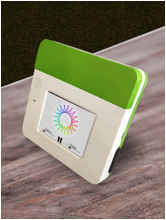
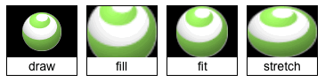

<!-- Version: 160812-CR / Primary author: Patrick Soquet / Last reviewed: December 2015 by Mike Jennings; partial review by Patrick in August 2016

<b>Read me first!</b> This document introduces core concepts of KinomaJS, our framework for developing JavaScript applications that run on Kinoma Create, iOS, Android, and desktops.
-->

# KinomaJS Overview

## About This Document

KinomaJS is a runtime environment for delivering applications on a wide range of consumer electronic products. The primary programming interface to KinomaJS is an JavaScript API of global constructors, functions, and objects that define the *containment hierarchy*, *appearance*, *behavior*, and *flow* of applications and shells. KinomaJS also supports an optional XML document format. This document introduces KinomaJS, its JavaScript API and XML format, and important related concepts; all developers using KinomaJS should read it before moving on to the other KinomaJS-related documents mentioned within.

This document assumes you already know basic JavaScript and XML concepts, including JavaScript constructors, objects, functions, properties, getters, and setters, and XML documents, elements, and attributes. In particular, note that a "`foo` instance" is an object created with `new Foo` (where `Foo` is a constructor in JavaScript), and a "`foo` object" is an object whose prototype is, directly or indirectly, `Foo.prototype`. 

This document is organized as follows:

- [About KinomaJS](#about-kinomajs) expands on the preceding brief introduction to KinomaJS.
 
- [Documents and Files](#documents-and-files) describes how to define the source code and assets used to build applications and shells.
 
- [User Interface Containment Hierarchy](#ui-containment) describes how to define the structure of the user interface with *contents*, *containers*, and *templates*.
 
- [Appearance](#appearance) describes how to define the look of the user interface with *textures*, *skins*, *styles*, and *effects*.
 
- [Behavior](#behavior) describes how to define the feel of the user interface with *behaviors*, *events*, *animation*, and *transitions*.

- [Flow](#flow) describes how to define the logic of applications and shells with *messages* and *handlers*.

- [Glossary](#glossary) is a glossary of terms defined and used in this document.


<a id="about-kinomajs"></a>
## About KinomaJS

*KinomaJS* is a runtime environment for delivering applications on a wide range of consumer electronic products. The primary programming interface to KinomaJS is a JavaScript API of global constructors, functions, and objects that define the *containment hierarchy*, *appearance*, *behavior*, and *flow* of applications and shells. The source code of applications and shells is made up of programs and modules.

KinomaJS also supports an XML document format. JavaScript is the fundamental programming language of KinomaJS and is required for implementing applications and shells, whereas use of the XML document format is optional.

Once you are familiar with the information in this overview document, you can move on to the corresponding reference documents, [*KinomaJS JavaScript Reference*](../javascript/) and [*KinomaJS XML Reference*](../xml/), as needed.

The KinomaJS JavaScript API and XML format can be used without any additional modules; however, they are typically used in combination with frameworks--companion modules that target a specific category of device. These frameworks provide default containment hierarchies, appearances, behaviors, and flows. 

<!--From CR: The preceding paragraph used to end with the sentence below, no longer relevant since KinomaJS Touch is now defunct; I'm leaving it in a comment in case relevant to some other framework yet to be described. (Search for "framework" to see places where some other specific framework might be mentioned as an example.)

For example, *KinomaJS Touch* is a set of modules that provide a framework for applications and shells intended for use on mobile touch-screen phones and tablets.
-->

<a id="documents-and-files"></a>
## Documents and Files

A KinomaJS application consists of several files, which include:

- Source code for programs and modules in JavaScript

- Optionally, XML documents

- Assets in JPEG or PNG image files, for the application's appearance

Most applications also include a framework that targets a specific device category.

To package, deploy, run, and debug all the files that make up an application, you can use the Kinoma Studio development environment or the `kprconfig` command-line tool.

<!--From CR: Per Peter, I'm not yet editing the following section, except for minor copyediting and one suggestion. (He wrote: "The terminology here still needs to untangled. I started but never got done.")-->

<a id="applications-shells"></a>
### Applications, Shells, Devices, and Simulators

When designing, implementing, debugging, and testing an application for a mobile or embedded device, it is often more convenient to work on a computer rather than on the target device. KinomaJS uses simulators to run KinomaJS applications on a computer to quickly test and share ideas.

<!--From CR re the following: Show architecture in a diagram, ideally in the preceding section?-->

In the KinomaJS architecture, there is a shell between the KinomaJS framework and the application. The shell hosts the application. A shell can be quite simple. For example, the following shell hosts and launches a single application, filling the screen:

```
var url = mergeURI(shell.url, "./main");
var id = "connect.kinoma.com";
var host = new Host({ left: 0, top: 0, right: 0, bottom: 0 }, url, id);
shell.add(host);
host.launch();
```

Shells may support multiple applications--for example, to provide a development environment or a multi-application switcher.

<!--From Peter re the following: This is a poor example as it overlaps the simulator/device shell.-->

Shells provide the application access to the unique capabilities of the host device, such as sensors on an embedded device.

<!--From CR: Please add reference to Figure 1 in the following paragraph (e.g., "Figure 1 shows ...") and add appropriate caption to the figure. 

Also, Can you combine them into one image? When viewed via Kinoma Code they will be stacked vertically.-->

A shell may provide support for implementing a particular style of application. But device shells, and especially mockup shells, usually define an environment for running applications--for instance, by providing screen contexts or sensor abstractions. 

**Figure 1.**   

 
 

A programming environment like Kinoma Studio provides default shells. But KinomaJS enables you to build your own shells, with the same programming interface as applications.

Note that, for the sake of robustness, applications and shells run in separate JavaScript virtual machines and communicate through a `host` object and using messages.

### Programs and Modules

Applications and shells are made up of JavaScript programs and modules.

<!--From CR: Change "fifth edition" below, in view of ES6? (Likewise where mentioned in Glossary)-->

- A *program* in KinomaJS is a JavaScript program (strictly speaking, an ECMAScript program) as specified by the ECMA-262 fifth edition standard. A common example of a program is the `.js` document used by web browsers. A program can include both other programs and modules.

- A *module* in KinomaJS is a JavaScript module as specified by [CommonJS](http://wiki.commonjs.org/wiki/Modules/1.1). When a module is used by an application or shell, it is said to be "required" in the terminology of CommonJS. A module can require other modules.

Each module is loaded only once in a given KinomaJS virtual machine. This improves performance and keeps memory use to a minimum. In the examples in the next two subsections, the `SharedBehaviors` module will be loaded only once by `App`.

#### JavaScript Files

Programs and modules are JavaScript source code files. They are compiled and interpreted at runtime during development and debugging. When a release is packaged, JavaScript source code files are compiled to a binary format to minimize load time and avoid distributing source code.

Programs are loaded using the global KinomaJS function `include`; modules are loaded using the CommonJS-defined global function `require`.

##### App.js

```
//@program
var CB = require("SharedBehaviors");
var SB = require("AppBehaviors.xml");
include("AppAssets.js");
```

##### AppBehaviors.js

```
//@module
var CB = require("SharedBehaviors");
```

<br>
The `//@program` and `//@module` comments at the beginning of the text files are necessary when compiling KinomaJS program and module text files into program and module binary files. The comments tell the compiler the document kind.

> **Note:** The file extension is optional in the parameter to the `require` and `include` functions. This allows the same code to work for both source code and compiled binary files; see the section [Paths](#path) for details.

#### XML Documents

KinomaJS parses XML documents to generate JavaScript programs and modules. As with JavaScript files, the parsing is done either at runtime, to make it easy to build and debug applications, or at compile time, to package release builds of applications. 

In KinomaJS XML documents, the root is either a program or module. 

##### AppBehaviors.xml

```xml
<module>   
	<require path="SharedBehaviors" id="CB"/>
</module>
```

##### App.xml

```xml
<program>   
	<require path="SharedBehaviors" id="CB"/>   
	<require path="AppBehaviors.xml" id="SB"/>   
	<include path="AppAssets.js"/>
</program>
```

<br>
The `id` attribute of the `require` element defines the identifier that programs or modules use to access properties exported by the module.

<a id="path"></a>
#### Paths

KinomaJS launches applications and shells by loading a program. The path of that program is the URL of the application or shell. KinomaJS uses these URLs when resolving relative paths. 

Applications and shells search for programs and modules based on the value of the `path` parameter of the `require` and `include` functions or the `path` attribute of the `require` and `include` elements. 

- If the value begins with `./` or `../`, it is a relative path. Inside a program, the path is relative to the URL of the application or shell; inside a module, the path is relative to the URL of the module.

- If the value begins with `/`, it is an absolute path. The root of an absolute path depends on the runtime environment. In some environments, there are multiple roots for absolute paths; in that case, KinomaJS searches each root to resolve the path. 

- Otherwise, the value is tried as a relative path and then, if the program or module is not found, as an absolute path.In the earlier examples, the application loads the `./SharedBehaviors` module if it exists or the `/SharedBehaviors` module if not.

If the value of the `path` parameter or attribute does not include an extension, the runtime tries the following extensions, in this order:

1. `.jsb` -- A JavaScript program or module binary file

2. `.js` -- A JavaScript program or module text file

3. `.xml` -- An XML program or module document

> **Note:** Applications and shells can mix JavaScript and XML document files in their programs and modules.

### XML Document Elements

KinomaJS XML documents are an alternate, sometimes more convenient, way to describe certain parts of the JavaScript language and KinomaJS JavaScript API. This section describes how these parts of the JavaScript language and CommonJS modules are expressed in KinomaJS XML documents. Note, the use of KinomaJS XML documents is optional.

#### Scripts

The `script` element contains JavaScript source code for programs and modules. For example, the following two files are equivalent.

##### Now.xml

```xml
<program>
	<script>      
		var now = Date.now();  
	</script>
</program>
```

##### Now.js

```
//@program
var now = Date.now();
```

#### Functions

The `function` element defines a JavaScript function. The body of the element contains the source code of the function. The `id` attribute is the identifier of the function, and the `params` attribute contains the identifiers of the parameters, if any. For example, the following two files are equivalent.

##### When.xml

```xml
<program>
	<function id="when" params="date">      
		return Date.now() - date;   
	</function>
</program>
```

##### When.js

```
//@program
var when = function(date) {
	return Date.now() - date;
}
```

#### Variables

The `variable` element defines a JavaScript variable. The `id` attribute is the identifier of the variable and the `value` attribute is its initial value. For example, the following two files are equivalent.

##### Zero.xml

```xml
<program>
	<variable id="zero" value="0"/>   
	<variable id="name" value="'zero'"/>
</program>
```

##### Zero.js

```
//@program
var zero = 0;
var name = "zero";
```

#### Classes

Classes are a common abstraction in many programming languages, but the JavaScript specification implemented by KinomaJS does not define support for classes. Instead, it uses constructors and prototypes to inherit properties. For example, the following JavaScript code defines constructor `A` with object `a` as its prototype, and constructor `B` with object `b` as its prototype, with object `b` inheriting the properties of object `a`.

```
//@program
var A = function(it) {
	this.a = it;
};
A.prototype = Object.create(Object.prototype, {
	a: {
		value: 0 
	},
});
var B = function(it) {
	A.call(this, it);
};
B.prototype = Object.create(A.prototype, {
	b: { 
		get: function() {
			return this.a;
		},
		set: function(it) {
			this.a = it;
		}
	},
	c: {
		value: function(it) {
		}
	}
});
```

In XML, the `class`, `constructor`, `field`, `getter`, `setter`, and `method` elements define JavaScript constructors and prototypes. The `constructor`, `getter`, `setter`, and `method` elements are similar to the `function` element, and the `field` element is similar to the `variable` element. For example, the following XML document is equivalent to the JavaScript code above.

```xml
<program>
	<class id="A">
		<constructor params="it">
			this.a = it;
		</constructor>
		<field id="a" value="0"/>
	</class>
	<class id="B" like="A">
		<constructor params="it">
			A.call(this, it);
		</constructor>
		<getter id="b">
			return a;
		</getter>
		<setter id="b" params="it">
			this.a = it;
		</setter>
		<method id="c" params="it">
		</method>
	</class>
</program>
```

#### Private and Public

JavaScript CommonJS modules use the `exports` variable to make properties public. Properties of a module that are not added to the `exports` variable are private and so cannot be accessed by programs and other modules..

```
//@module
var private_state = 0;
var public_state = exports.public_state = 1;
```

In KinomaJS XML documents, `variable` and `function` elements within a `module` element are public by default and so are automatically added to the `exports` variable. To hide variables and functions, enclose them in a `private` element. For example, the following XML document is equivalent to the JavaScript code above.

```xml
<module>
	<private>
		<variable id="private_state" value="0"/>
	</private>
	<variable id="public_state" value="1"/>
<module>
```

<a id="ui-containment"></a>
## User Interface Containment Hierarchy

The structure of a KinomaJS application's user interface is defined by its *containment hierarchy*. The containment hierarchy consists of `content` objects and `container` objects. Applications and shells dynamically create and modify the containment hierarchy to control what is displayed on the screen. 

### Contents and Containers

The containment hierarchy is a tree of objects in which branches are `container` objects and leaves are `content` objects. For applications, the root of the tree is the `application` object; for shells, the root of the tree is the `shell` object. 

##### JavaScript

In JavaScript, applications and shells use constructors to define `content` and `container` objects. The `content` and `container` objects are attached to the containment hierarchy using the `add`, `insert`, and `replace` functions, and are detached from the containment hierarchy using the `remove` and `replace` functions.

```
var container = new Container({ width: 320, height:240 });
var content = new Content({ width: 160, height:120 });
container.add(content);
application.add(container);
```

##### XML

XML includes elements--collectively called *content elements* and *container elements*--that correspond to various types of `content` and `container` objects and describe a branch of the containment hierarchy.

```xml
<container id="Foo" width="320" height="240"/>
	<content width="160" height="120"/>
</container>
```	

Content and container elements create constructors--for example, the `Content` and `Container` constructors for the `content` and `container` elements; they do not create `content` and `container` objects. This is a subtle but important distinction. Because they create constructors, the branch of the containment hierarchy defined by content and container elements may be used multiple times by the application or shell.

To create the `content` and `container` objects defined by `content` and `container` elements, applications and shells use the JavaScript `new` operator.

```xml
<script>
	application.add(new Foo());
</script>
```

#### Types of Contents and Containers

<!--From CR: The following details about the indicated objects are provided only in the JavaScript Ref doc but ideally would also be introduced in this doc:

• picture, layer: transformation matrix
• picture, media: use sound object instead for a short sound in response to UI actions
• thumbnail: thumbnails cache
• port: clip rectangle; transformation matrix; that ports ignore most properties of picture or texture instances used to draw or fill images in ports
-->

KinomaJS provides several types of specialized contents and containers; Tables 1 and 2 briefly describe these types (and in some cases indicate where related information can be found in this document).

**Table 1.** Content Types

<table class="normalTable">
  <tbody>
    <tr>
      <th scope="col">Type</th>
      <th scope="col">Description</th>
    </tr>
    <tr>
      <td>Label</td>
      <td>Renders a string on a single line with a single style; see <a href="#strings-and-styles">Strings and Styles</a></td>
    </tr>
    <tr>
      <td>Text</td>
      <td>Renders a string on multiple lines with multiple styles; see <a href="#strings-and-styles">Strings and Styles</a></td>
    </tr>
    <tr>
      <td>Picture</td>
      <td>Displays an image and starts loading when created; see <a href="#redirection-handlers">Redirection Handlers</a></td>
    </tr>
    <tr>
      <td>Thumbnail</td>
      <td>Displays an image and starts loading when drawn; see <a href="#redirection-handlers">Redirection Handlers</a></td>
    </tr>
    <tr>
      <td>Media</td>
      <td>Plays an audio or video stream (and can display album art for audio); see <a href="#redirection-handlers">Redirection Handlers</a></td>
    </tr>
    <tr>
      <td>Port</td>
      <td>Delegates drawing to a script in its behavior that draws using simple graphics commands</td>
    </tr>
    <tr>
      <td>Canvas</td>
      <td>Delegates drawing to a script in its behavior that draws using the HTML 2D Canvas API specified by the W3C</td>
    </tr>
    <tr>
      <td>Host</td>
      <td>Created by a shell to host an application; see <a href="#applications-shells">Applications, Shells, Devices, and Simulators</a></td>
    </tr>
  </tbody>
</table>

**Table 2.** Container Types

<table class="normalTable">
  <tbody>
    <tr>
      <th scope="col">Type</th>
      <th scope="col">Description</th>
    </tr>
    <tr>
      <td>Scroller</td>
      <td>Scrolls its first content horizontally, vertically, or both</td>
    </tr>
    <tr>
      <td>Line</td>
      <td>Arranges its contents horizontally</td>
    </tr>
    <tr>
      <td>Column</td>
      <td>Arranges its contents vertically</td>
    </tr>
    <tr>
      <td>Layer</td>
      <td>Caches its contents in a bitmap; see <a href="#transitions">Transitions</a></td>
    </tr>
    <tr>
      <td>Layout</td>
      <td>Delegates positioning and sizing of its contents to a script in its behavior</td>
    </tr>
  </tbody>
</table>

In JavaScript, each type of content and container has a corresponding constructor with specific parameters and a prototype with specific properties. See the [*KinomaJS JavaScript Reference*](../javascript/) document for details.

<!--From CR: Exception to "each type" below: there is no layer element. Please allow for that here (or in the XML Ref doc, if wrong there).-->

In XML, each type of content and container has a corresponding element with a specific tag and specific attributes. See the [*KinomaJS XML Reference*](../xml/) document for details.

#### Accessing Contents 

KinomaJS provides several ways to traverse the containment hierarchy. This section gives examples of each. The examples assume the following code has been executed:

```
var myContainer = new Container;
var myContent = new Content;
myContainer.add(myContent);
```

Contents always reference their container.

```
// myContent.container == myContainer;
```

Contents are stored in a doubly linked list. This linked list is the most efficient way to iterate over the container's contents.

```
// myContent == myContainer.first;
// myContent == myContainer.last;
// null == myContent.next;
// null == myContent.previous;
```

Contents have indexes and can be accessed as an indexed property.

```
// myContent.index == 0;
// myContent == myContainer[0];
```

Contents can optionally have a name and be accessed through their name.

```
myContent.name = "WOW";
// myContent == myContainer["WOW"];
// myContent == myContainer.WOW;
// true == "WOW" in myContainer;
// true == myContainer.hasOwnProperty("WOW");
```

The property created by a `content` object's name on its container is read-only.

<!--From Mike Jennings re the following code: descriptor.writable and descriptor.value are undefined, not false.  I'm not sure if the distinction is important.-->

```
// false == myContainer.propertyIsEnumerable("WOW");
var descriptor = Object.getOwnPropertyDescriptor(myContainer, "WOW");
// myContent == descriptor.value;
// false == descriptor.configurable;
// false == descriptor.enumerable;
// false == descriptor.writable;
```

The property created by a `content` object's name on its container never overrides built-in properties of the container.

```
myContent.name = "x";
// myContent != myContainer.x; // x is already a coordinate property
```

To avoid name conflicts between KinomaJS-defined property names and script-defined content item names, using a naming convention is recommended--for example, all capital letters or an underscore (_) prefix.

#### Sealed Contents and Containers

All `content` and `container` objects are *sealed* using the built-in JavaScript `Object.seal` function. Scripts cannot add or delete properties of a sealed object. For example, the following script will throw an exception:

```
var item = new Content;
item.initialized = true;
```

KinomaJS seals `content` and `container` objects to optimize runtime performance and minimize memory use. The remainder of this section provides background on this important design choice.

The containment hierarchy of most real-world applications contains a large number of `content` and `container` objects. For example, a single scrolling list of 100 cells, with each cell using five content items to draw, requires 500 content items. Once the hierarchy is created, application scripts never again directly access the majority of these content items. Maintaining all these content items in the JavaScript heap uses significant memory for the lifetime of the objects. The larger number of objects in the JavaScript heap causes the JavaScript garbage collector to run more slowly.

By sealing the content items, KinomaJS can manage the content items solely in native C code, where they use less memory and have no impact on the JavaScript garbage collector. JavaScript objects that reference a native object are called *host instances*. Content items are called *volatile host instances* because they can be garbage-collected from the JavaScript heap but still persist as native objects. 

When a volatile host instance is referenced by JavaScript code, the instance is recreated on demand. Consider the following code:

```
function build() {
	var item = new Content;
	application.add(content);
}
build();
```

After the function `build` returns, there is no global reference to `item`, making it eligible to be garbage-collected. When the following code is later executed, KinomaJS automatically recreates `item` from the native object if it has been garbage-collected.

```
var item = application.first;
```

<!--From Peter: I'm not satisfied with the next section yet, but I haven't found a way to turn the explanations around to make it simpler. There are some concepts - like horizontal and vertical extent - that are so abstract that real-world examples are tough to come up with.-->

### Coordinates

The *coordinates* of contents determine their position and size relative to their container.

<!--From Mike Jennings: It is important to emphasize (in several places) that left right top and bottom are relative to their containers and that they are distances. The term "coordinates" is overloaded. In most uses in KinomaJS, they behave as CSS margins but in other cases (such as touch events) they behave as actual x-y coordinates as one might expect. This creates all manner of havoc with newbies, who expect to specify a 300x210 container with a 10-pixel margin with top:10, left:10, right:310, bottom:230 when they should be using top:10, bottom:10, left:10, right:10.  You end up with a tall skinny container, off to the left. I think a big part of the problem is the term "coordinates," which usually evokes a graph. If we're trying to appeal to web developers, it should be called "margins."-->

##### JavaScript

Coordinates are the first parameter of all content constructors. The coordinates parameter is an object with `left`, `width`, `right`, `top`, `height`, and `bottom` properties, all of which can be `undefined`. 

```
new Content({ left: 10, right: 10, top: 20, bottom: 20 });
```

The `top` and `left` coordinates are relative to the top left of the content's container; the `bottom` and `right` coordinates, to the bottom right of the content's container.

A value of 0 for the `bottom` coordinate indicates that the bottom of the content is the same as the bottom of its container. Content with `left`, `right`, `top`, and `bottom` values of 0 fills the bounds of its container. Content with `width` and `height` values of 10 and `top` and `left` values of 1 has dimensions of 10 by 10 and is inset from the top left of its container by 1.

##### XML

Coordinates are defined by the `left`, `width`, `right`, `top`, `height`, and `bottom` attributes of content elements. All of these attributes are `undefined` by default.

```xml
<content left="10" right="10, top="20" bottom="20"/>
```	

#### Measure and Fit

<!--From Mike Jennings: I have read this many times over the last couple years and I have never really understood it. It seems important to know but I don't have a clear idea of when I need to use this information or how.-->

KinomaJS uses both the coordinates and the intrinsic properties of contents to lay out the containment hierarchy.

All contents have a *measured* width and *measured height*, which are the default width and height computed by the content itself. KinomaJS measures the containment hierarchy tree from the leaves to the root.

- If the `width` coordinate is defined, it overrides the measured width of the content.

- The *horizontal extent* of the content is the sum of its measured width, the value of its `left` coordinate if defined, and the value of its `right` coordinate if defined. 

- If the `height` coordinate is defined, it overrides the measured height of the content.

- The *vertical extent* of the content is the sum of its measured height, the value of its `top` coordinate if defined, and the value of its `bottom` coordinate if defined.

All contents have a *fitted width* and *fitted height*, which are the width and height of the content computed by its container. KinomaJS fits the containment hierarchy tree from the root to the leaves.

- If both `left` and `right` coordinates are defined, the content stretches horizontally with its container, and the fitted width of the content depends on the fitted width of its container; otherwise, the fitted width equals the measured width.

- If both `top` and `bottom` attributes are defined, the content stretches vertically with its container, and the fitted height of the content depends on the fitted height of its container; otherwise, the fitted height equals the measured height.

Once layout is complete--that is, after contents have been measured and fitted--scripts determine the position and size of contents by getting properties.

```
var x = content.x, y = content.y;
var w = content.width, h = content.height;
var p = content.position;   // p.x, p.y
var s = content.size;       // s.width, s.height
var b = content.bounds;     // b.x, b.y, b.width, b.height
```

<!--From CR: To me, it makes more sense to delete the next section and say instead that such details are provided in the Ref doc (unless this info is critical to know before reading on in the Overview); meanwhile, however, I've done some editing to make the two docs more consistent. Your thoughts?-->

#### Coordinates by Type

Contents and containers interpret their coordinates according to their type; see Table 3.

**Table 3.** Coordinates by Type
 
<table class="normalTable">
  <tbody>
    <tr>
      <td><b>Object</b> </td>
      <td><b>Coordinates</b> </td>
    </tr>
    <tr>
      <td><code>content</code> </td>
      <td>If the content has a skin that references a texture without using tiles, the measured width and measured height are the width and height of the skin; otherwise, the measured width and measured height are 0.</td>
    </tr>
    <tr>
      <td><code>label</code> </td>
      <td>The measured width and measured height are the width and height of the label's string rendered with its style.</td>
    </tr>
    <tr>
      <td><code>text</code> </td>
      <td>The measured width is 0. The measured height is the height of the text's string rendered with its style in the fitted width of the text.</td>
    </tr>
    <tr>
      <td><code>picture</code> </td>
      <td>The measured width and measured height are the width and height of the picture's image.</td>
    </tr>
    <tr>
      <td><code>thumbnail</code> </td>
      <td>The measured width and measured height are the width and height of the thumbnail's image.</td>
    </tr>
    <tr>
      <td><code>media</code> </td>
      <td>The measured width and measured height are the width and height of the media's audio or video stream. For audio, the width and height of the album art's image are used.</td>
    </tr>
    <tr>
      <td><code>port</code> </td>
      <td>The measured width and measured height are 0.</td>
    </tr>
    <tr>
      <td><code>canvas</code> </td>
      <td>The measured width and measured height are 0.</td>
    </tr>
    <tr>
      <td><code>host</code> </td>
      <td>Same as <code>content</code></td>
    </tr>
    <tr>
      <td><code>container</code> </td>
      <td>The measured width is the maximum horizontal extent of the container's contents.<br> <br>
      Horizontally, the container arranges its contents according to their <code>left</code> and <code>right</code> coordinates:
        <br><ul>
          <li>If both are defined, the content stretches horizontally with the container. The fitted width of the content equals the fitted width of the container minus the value of the content's <code>left</code> and <code>right</code> coordinates.</li>
		  <li> If only <code>left</code> is defined, the content sticks to the left of the container.</li>
		  <li> If only <code>right</code> is defined, the content stick to the right of the container.</li>
		  <li> If both are <code>undefined</code>, the content sticks to the horizontal center of the container.</li>
		</ul>
        The measured height is the maximum vertical extent of the container's contents.<br><br>
        Vertically, the container arranges its contents according to their <code>top</code> and <code>bottom</code> coordinates:<br>
        <ul>
          <li>If both are defined, the content stretches vertically with the container. The fitted height of the content equals the fitted height of the container minus the value of the content's <code>top</code> and <code>bottom</code> coordinates.</li>
          <li> If only <code>top</code> is defined, the content sticks to the top of the container.</li>
          <li> If only <code>bottom</code> is defined, the content sticks to the bottom of the container.</li>
          <li>If both are <code>undefined</code>, the content sticks to the vertical middle of the container.</li>
        </ul>
       </td>
    </tr>
    <tr>
      <td><code>scroller</code> </td>
      <td>The measured width and measured height are the horizontal and vertical extent of the scroller's first content. </td>
    </tr>
    <tr>
      <td><code>line</code> </td>
      <td>The measured width is the sum of the horizontal extents of the line's contents.<br><br>
        The <code>left</code> and <code>right</code> coordinates of the line's contents are treated as horizontal gaps between the contents.<br><br>
        The difference between the fitted width and measured width is distributed among contents that define both <code>left</code> and <code>right</code> coordinates.<br><br>
        Vertically, a line measures and arranges its contents like a container.</td>
    </tr>
    <tr>
      <td><code>column</code> </td>
      <td>The measured height is the sum of the vertical extents of the column's contents.<br><br>
        The <code>top</code> and <code>bottom</code> coordinates of the column's contents are treated as vertical gaps between the contents.<br><br>
        The column distributes the difference between the fitted height and measured height among its contents according to their <code>top</code> and <code>bottom</code> coordinates.<br><br>
        Horizontally, a column measures and arranges its contents like a container.</td>
    </tr>
    <tr>
      <td><code>layer</code> </td>
      <td>Same as <code>container</code> </td>
    </tr>
    <tr>
      <td><code>layout</code> </td>
      <td>When its width is measured, the layout triggers the <code>onMeasureHorizontally</code> event and the behavior can modify the measured width of the layout or the coordinates of its contents. If the layout's behavior does not handle the <code>onMeasureHorizontally</code> event, the horizontal behavior of the layout is the same as a container.<br><br>
        When its height is measured, the layout triggers the <code>onMeasureVertically</code> event and the behavior can modify the measured height of the layout or the coordinates of its contents. If the layout's behavior does not handle the <code>onMeasureVertically</code> event, the vertical behavior of the layout is the same as a container.</td>
    </tr>
  </tbody>
</table>


#### Constraints

The coordinates of an object define implicit constraints on its position and size. For example, centered content cannot move.

```
var content = new Content({ width: 320, height: 240 });
application.add(content);
content.moveBy(10, 0);  // Nothing happens
```

To change the constraints, change the `coordinates` property.

```
content.coordinates = { 
	left: 0, 
	width: 320, 
	height: 240 
};
```

#### Unbound and Bound Contents

Contents that are not attached to the containment hierarchy are called *unbound contents*; contents attached to the containment hierarchy, *bound contents*. Unbound contents do not participate in layout. They are neither measured nor fitted; consequently, their position and size are `undefined` and cannot be changed.

In the following example, `before` will be `undefined` and `after` will be an object with `x` and `y` properties whose values depend on the size of the application or shell.

```
var content = new Content({ width: 320, height: 240 });
var before = content.position;
application.add(content);
var after = content.position;
```

When creating or modifying the containment hierarchy, applications usually perform many add, insert, remove, replace, or swap operations. It would be inefficient for KinomaJS to measure and fit the containment hierarchy after each individual modification. Instead, KinomaJS defers layout until the position or size of the object is needed--for example, to display it.

### Templates

*Templates* are a tool to build a hierarchy of `content` and `container` instances from JavaScript objects, such as those instantiated from JSON. Templates reduce the script code needed to instantiate contents associated with data. Templates are usually defined in KinomaJS XML documents for use by scripts in applications and shells, but they may also be created in JavaScript.

In a KinomaJS XML document, a template is defined by a hierarchy of content and container elements and by the `iterate`, `scope`, and `select` instruction elements. Recall that the container and content elements define a JavaScript constructor with an identifier corresponding to the value of the element's `id` attribute.

The constructor has one parameter, `$`, which applications and shells use to pass data to the template. In their attributes, content and container elements use `$` to access data properties. The `$` parameter is referred to as "the data" or "the instantiating data."

```xml
<container id="Header" left="0" right="0" top="0" height="40">
	<content left="0" variant="$.icon" skin="iconSkin"/>
	<label left="40" right="0" string="$.title"/>
</container>
```

The outer element, here the `container` element, defines the template and so requires an `id` attribute to establish the identifier of its constructor. The inner elements, here the `content` and `label` elements, extend the template and cannot have an `id` attribute.

Applications and shells call the generated constructor with data to instantiate `content` and `container` objects. 

```xml
<script>
	var data = {
		icon: FRENCH,
		title: "Hello"
	};
	application.add(new Header(data));
</script>
```

The data passed to the constructor may have any prototype. It can be any JavaScript object--for example, a DOM or JSON object retrieved from an internet service.

In JavaScript, applications and shells can create constructors that provide the same functionality as the templates defined in KinomaJS XML documents. For example, the following JavaScript code defines a constructor equivalent to the XML document above.

```
var Header = function($) {
	Container.call(this, {left: 0, right: 0, top: 0, height: 40});
	var content = new Content({ left: 0 }, iconSkin);
	content.variant = $.icon;
	this.add(content);
	var label = new Label({ left: 40, right: 0 });
	label.string = $.title;
	this.add(label);
};
Header.prototype = Container.prototype;
```

#### Expressions

The values of most attributes of content and container elements are JavaScript expressions that are evaluated when the template is instantiated. This makes it possible to use `$`, as well as other JavaScript variables, in attributes.

Because attribute values are JavaScript expressions, string constants require special handling. To use a constant string in the value of an attribute, enclose the value in single quote marks.

```xml
<label string="'Press Back once more to exit.'"/>
```

To facilitate localization, the use of an expression referencing a global string is recommended in place of string constants.

```xml
<script>
	var STRINGS = {
		exit: "Press Back once more to exit."
	};
</script>
<label string="STRINGS.exit"/>
```

#### Reuse

Templates can use other templates. The template to reuse is specified by the `like` attribute. 

```xml
<container id="Screen" left="0" right="0" top="0" bottom="0">
	<container like="Header"/>
	<text left="0" right="0" top="40" bottom="0" string="$.means"/>
</container>
<script>
	var data = {
		icon: FRENCH,
	 	title: "Hello",
	 	means: "Bonjour"
		};
	var screen = new Screen(data)
	application.add(screen);
</script>
```

The value of the `like` attribute of an element having a particular tag must refer to another element having that same tag; in this example, the value of the `like` attribute of the `container` element must refer to another `container` element. 

The attributes of the element that uses a template override the attributes of the element that defines the template.

```xml
<container like="Header" height="44"/>
```

#### Instructions

Templates may contain instructions by using `iterate`, `scope`, and `select` elements to control how the template applies the instantiating data. 

The `iterate` element creates a list of contents from an array in the instantiating data. For example, this element can fill in a table with data retrieved from an internet service. The contents of the `iterate` element are repeated for each item in the array specified by the `on` attribute. In the following example, the `label` element is repeated for each array item.

```xml
<column id="List" left="0" right="0">
	<iterate on="$.items">
		 <label left="0" right="0" string="$"/>
	 </iterate>
</column>
<script>
	var data = {
		items: [ "one", "two", "three" ]
	};
	application.add(new List(data));
</script>
```

Inside the `iterate` element, the current array item becomes the value of `$`; the instantiating data remains accessible through `$$`. The `on` attribute must evaluate to an array.

The `scope` element focuses the data on a specific object within the instantiating data. It is useful when reusing templates with the `like` attribute, and as a shortcut for working with a subset of the instantiating data. In the following example, the `scope` element focuses the data to the `header` object to reuse the `Header` template.

```xml
<container id="Screen" left="0" right="0" top="0" bottom="0">
	<scope with="$.header">
		<container like="Header"/>
	</scope>
	<text left="0" right="0" top="40" bottom="0" string="$.means"/>
</container>
<script>
	var data = {
		header: {
			icon: FRENCH,
			title: "Hello"
		},
		means: "Bonjour"
	};
	application.add(new Screen(data));
</script>
```

The `with` attribute in the `scope` element must evaluate to an object. This object becomes the value of `$`, and the instantiating data is accessible through `$$`.

The `select` element conditionally includes other elements--`label` elements, in the following example--based on the boolean value of the JavaScript expression in the `on` attribute. 

```xml
<line id="Item" left="0" right="0">
	<select on="'first' in $">
		<label left="0" right="0" string="$.first"/>
	</select>
	<select on="'last' in $">
		<label left="0" right="0" string="$.last"/>
	</select>
</line>
<script>
	application.add(new Item({ first: "Jane" }));
	application.add(new Item({ first: "John", last: "Doe" }));
	application.add(new Item({ last: "Doe" }));
</script>
```

#### Anchors

*Anchors* are shortcuts used by KinomaJS applications and shells to directly access specific contents and containers in a containment hierarchy instantiated from a template. Scripts use the anchor to access objects to modify while the application is running--for example, to change the label of a string, disable a button, or add lines to a column in a table.

Each content element can have an optional `anchor` attribute. When the template is instantiated, a reference to the created `content` object is assigned to a property of the instantiating data; the identifier of the property is the value of the `anchor` attribute.

In the following example, the `label` content corresponding to the `title` property of the instantiating data has an anchor named `TITLE`. After the containment hierarchy is instantiated from the template, the string of the `TITLE` label is changed.

```xml
<container id="Header" left="0" right="0" top="0" height="40">
	<content left="0" variant="$.icon" skin="iconSkin"/>
	<label left="40" right="0" string="$.title" anchor="TITLE"/>
</container>
<script>
	var data = {
		icon: FRENCH,
		title: "Hello"
	};
	application.add(new Header(data));
	data.TITLE.string = "Bonjour";
</script>
```

The template creates the reference to the anchor in the instantiating data, but it is the responsibility of the application to delete the references when they are no longer needed--for example, when the content is unbound.

<a id="appearance"></a>
## Appearance

KinomaJS applications and shells uses textures, skins, styles, and effects to define the *appearance* of the user interface.

- *Textures* are image assets, often PNG or JPEG images. A single texture can contain multiple images, for both runtime efficiency and convenience in editing during development. 

- *Skins* describe the appearance of colors and images in the user interface, by defining either colors to fill or stroke contents with or portions of a texture to draw or fill contents with.
 
- *Styles* describe how to render strings, and include font, font size, and text color properties. 

- *Effects* describe how to modify the appearance of textures, pictures, thumbnails, and layers. 

Most contents can contain or reference skins and styles.

KinomaJS provides both JavaScript and XML interfaces for creating textures, skins, styles, and effects. In JavaScript, they are objects created with the `Texture`, `Skin`, `Style`, and `Effect` constructors; in KinomaJS XML documents, the `texture`, `skin`, `style`, and `effect` elements create the corresponding JavaScript objects. This section's examples are in XML; the corresponding JavaScript constructors are documented in the [*KinomaJS JavaScript Reference*](../javascript/) document.

### Display Scale

KinomaJS applications run on a wide range of devices with widely varying displays, in terms of both the pixel dimensions and the pixel density. Because pixel density affects both layout and rendering, it can be challenging and tedious to implement well. KinomaJS uses the idea of display scale to simplify the proper handling of different pixel densities by applications and shells.

KinomaJS defines coordinates and font sizes in *logical pixels*, which are automatically mapped to *physical pixels* at runtime. The ratio of the physical pixel density to the logical pixel density of the display is called the *display scale*. In KinomaJS, the most common display scales are:

- 1 (physical and logical pixels the same size)

- 1.5 (1.5 physical pixels per logical pixel)

- 2 (2 physical pixels per logical pixel)

KinomaJS renders the user interface at the pixel density of the physical display to show text, pictures, and video at full resolution.

### Textures

Textures associate an image asset with an ID that is used to reference the texture from XML and from JavaScript as a global variable. In XML, the `small`, `medium`, and `large` attributes correspond to display scales 1, 1.5, and 2, respectively.

```xml
<texture id="splashTexture" small="splashscreen.jpg">
```

A single texture can reference up to three image assets, one for each display scale.

```xml
<texture id="sampleIconTexture">
	small="SmallIcons.png"
	medium="MediumIcons.png"
	large="LargeIcons.png"
</texture>
```

<!--From CR re the following: sampleIconSkin is not shown in the example.-->

Here `sampleIconTexture` references an icon strip and `sampleIconSkin` extracts icons with 40x40 logical pixels.

- `SmallIcons.png` contains icons with 40x40 physical pixels.

- `MediumIcons.png` contains icons with 60x60 physical pixels.

- `LargeIcons.png` contains icons with 80x80 physical pixels.

For programs, the values of the `small`, `medium`, and `large` attributes are merged with the URL of the application or, for modules, with the URL of the module.

KinomaJS loads only the image asset required for the target display scale. However, it is not necessary to provide small, medium, and large textures. If a texture does not include an image asset that matches the display scale, a larger or smaller image asset (in that order) will be loaded and scaled.

### Skins

Skins describe the appearance of colors and images in the user interface of applications and shells, by defining either portions of a texture to draw or fill contents with or colors to fill or stroke contents with. Skins bind part or all of a texture to an identifier that is used by contents to render their appearance. Skins are a convenient tool for defining the look of an application or shell independently of the assets and rendering code.

#### Variants and States

Skins can reference a part of a texture. It is often convenient to store several icons or other user interface elements in a single image.

The following example creates three skins from `iconTexture`. The image asset `icons.png` is shown in Figure 2.

**Figure 2.** Texture for Three Skins


```xml
<texture id="iconTexture" small="icons.png">
<skin id="OK" texture="iconTexture"
	x="0" y="0" width="40" height="40">
<skin id="CANCEL" texture="iconTexture"
	x="40" y="0" width="40" height="40">
<skin id="SEARCH" texture="iconTexture"
	x="80" y="0" width="40" height="40">
```

Contents use the `skin` property or attribute to select the skin to render.

```xml
<content skin="OK" x="10" y="30">
```

*Variants* may be used as a shortcut for creating several skins from the same texture. The variants must all have the same width and height and must be in a row. The three `skin` elements above can be combined into a single `skin` element using the `variants` element, as follows:

```xml
<skin id="iconSkin" texture="iconTexture"
		x="0" y="0" width="40" height="40">
	<variants offset="40" names="OK,CANCEL,SEARCH"/>
</skin>
```

Contents render a variant by specifying the variant in addition to the skin.

```xml
<content skin="iconSkin" variant="OK" x="10" y="30">
```

A single user interface element may have several different appearances at runtime--for example, enabled, disabled, and selected. The *states* of a skin represent these different appearances. The states must all have the same width and height and must be in a column in the skin's texture. A single skin containing both variants and states is a two-dimensional grid in which the states are columns and the variants are rows. 

The following example creates three skins (as variants), each with three states, from `iconGridTexture`. The `states` element names the different states. The image asset `icongrid.png` is shown in Figure 3.

**Figure 3.** Texture for Three Variants and Three States


```xml
<texture id="iconGridTexture" small="icongrid.png">
<skin id="iconGridSkin" texture="iconGridTexture"
		x="0" y="0" width="40" height="40">
	<variants offset="40" names="OK,CANCEL,SEARCH"/>
	<states offset="40" names="DISABLED,ENABLED,SELECTED"/>
</skin>
```

Contents can then select a state for rendering.

```xml
<content skin="iconGridSkin" variant="OK" state="ENABLED">
```

Here the content uses the portion of `iconGridTexture` at `x="80"` and `y="40"` logical pixels (the black magnifying glass).

The content's variant and state can change dynamically--for example, to animate cells or provide visual feedback to touch events.

#### Aspect

The *aspect* of a skin controls how its portion of its texture is scaled during rendering. The aspect value can be any of the following, as illustrated in Figure 4:

- `draw` (the default) -- The portion is drawn in the content without scaling. Parts of the portion that are outside the content are rendered.

- `fill` -- The portion is proportionally scaled to fill the content. Parts of the portion that are outside the content are not rendered.

- `fit` -- The portion is proportionally scaled to fit within the content. 

- `stretch` -- The portion is scaled to the size of the content. If the aspect ratio of the content and skin are different, the portion is deformed.

**Figure 4.** Possible Values of a Skin's Aspect



#### Tiles and Margins

Applications can also use skins as patterns. To define 1-part, 3-part, or 9-part patterns, skins must have tiles (in which case, the skin's aspect is ignored). The size of the tiles is determined by `left`, `right`, `top`, and `bottom` values, as follows:

- If no size values are defined, the skin becomes a 1-part pattern. The part is repeated to fill the content.

  ```xml
  <skin id="s1" texture="t" x="0" y="0" width="20" height="20">
	  <tiles/>
  </skin>
  ```

- If only `left` and `right` are defined, the skin becomes a horizontal 3-part pattern. The left part is drawn at the left of the content, the right part is drawn at the right of the content, and the center part is repeated to fill the center of the content.

  ```xml
  <skin id="s3h" texture="t" x="20" y="0" width="30" height="20">
	  <tiles left="10" right="10"/>
  </skin>
  ```

- If only `top` and `bottom` are defined, the skin becomes a vertical 3-part pattern. The top part is drawn at the top of the content, the bottom part is drawn at the bottom of the content, and the middle part is repeated to fill the middle of the content.

- If all attributes are defined, the skin becomes a 9-part pattern. Corner parts are drawn at the corresponding corners of the content, side parts are repeated at the corresponding sides of the content, and the center/middle part is repeated to fill the center/middle of the content.

  ```xml
  <skin id="s9" texture="t" x="20" y="20" width="30" height="30">
	  <tiles left="10" right="10" top="10" bottom="10"/>
  </skin>
  ``` 

Skins can also have margins, which are also defined by `left`, `right`, `top`, and `bottom` values. Margins are inside the portion of the texture extracted by the skin and inside the corner and side parts, but they are rendered outside the content.

In the following example, extra rectangles are drawn to illustrate the rendering of the skin: <span style="color: blue;">blue</span> for the portion of the texture (`x`, `y`, `width`, `height`), <span style="color: green;">green</span> for the tiles, <span style="color: red;">red</span> for the margins, and <span style="color: cyan;">cyan</span> for the bounds of the content.

```xml
<skin id="s9" texture="t" x="0" y="0" width="60" height="60">
	<tiles left="20" right="20" top="20" bottom="20"/>
	<margins left="10" right="10" top="10" bottom="10"/>
</skin>
```


```xml
<content skin="s9" x="10" y="10" width="100" height="640">
```
	


<!--From CR: Please work "stroke" into the next section for tie-in with the Ref doc's description of the Skin constructor.-->

#### Colors and Borders

Skins can render with a color instead of using a texture. Colors can be used to both fill and frame contents.

To fill content with a color, define the skin's color instead of its texture.

```xml
<skin id="disabled" color="gray"/>
<content skin="disabled" width="10" height="10"/>
```

KinomaJS parses the various [CSS3 representations of colors](http://www.w3.org/TR/css3-color/#colorunits). The default value of a color is `transparent`. 

A skin using color can also have multiple states.

```xml
<skin id="trafficLightSkin">
	<states colors="#ff0000,#00ff00,yellow" names="STOP,GO,YIELD"/>
</skin>
<content skin="trafficLight" state="GO" width="10" height="10"/>
```

To frame contents with a color, a skin defines borders. The size of the borders is determined by `left`, `right`, `top`, and `bottom` values. In XML, the color of the borders can be defined by either the `color` attribute or the `states` element in the `borders` element.

```xml
<skin id="blueFrameSkin">
	<borders left="2" top="2" right="2" bottom="2" color="blue"/>
</skin>	
	
<skin id="redFrameSkin">
	<borders left="2" top="2" right="2" bottom="2">
		<states colors="#800000,#c00000,#ff0000" names="LIGHT,MEDIUM,BRIGHT"/>
	</borders>
</skin>
```

<a id="strings-and-styles"></a>
### Strings and Styles

Strings are rendered by `label` and `text` objects, whose appearance is described by *styles*.

- The `label` object renders a string on a single line with a single style. The string is truncated if it does not fit the bounds of the `label` object. This object is convenient for drawing a simple string for user interface controls, such as buttons and checkboxes.

- The `text` object renders a string on multiple lines with multiple styles. It is used to draw rich text, such as documents. 

Both `label` and `text` objects are optionally editable and selectable by users.

Internally, `text` objects have structures that contain blocks and spans.

- A *block* represents a paragraph. It contains one or more spans.

- A *span* represents a run of text with a single style.

There are functions to build such structures programmatically or with a description. Blocks and spans can have behaviors to get relevant touch events.

The `style` object defines the appearance of strings in `label` or `text` objects. Styles are defined by the following characteristics:

- The font, specifying *font-weight, font-size,* and/or *font-family* in [CSS font syntax](http://www.w3.org/TR/CSS21/fonts.html). The font size is specified in logical pixels.

- The color (or the colors, if the color changes when the state of the content changes), specified in [CSS3 color syntax](http://www.w3.org/TR/css3-color/#colorunits).

- The horizontal alignment, as `left`, `center` (the default), `right`, or `justify` 

- For `label` objects only: the  vertical alignment, as `top`, `middle` (the default), or `bottom`.

- For `text` objects only:

   - The margins around a string

   - The indentation of the first line of a block

   - The line height (or "leading")--the distance between lines of a block

   - The line count--the maximum number of lines in a block

KinomaJS cascades styles in the containment hierarchy: content inherits the style of its container. When a content style inherits from a container style, only the characteristics undefined by the content style are inherited from the container style. 

In the following example, `applicationStyle` defines a style for the root of the containment hierarchy and `headerTitleStyle` defines a style for the header title, overriding the size, color, horizontal alignment, and margins.

```xml
<style id="applicationStyle" font="18px Arial" color="black" 
		align="left,middle">
</style>
<style id="headerTitleStyle" font="22px" color="white" 
		align="center">
	<margins left="10" right="10"/>
</style>
<container style="applicationStyle">
	<content id="header">
		<content id="headerTitleStyle"/>
	</content>
</container>
```

For performance reasons, avoid changing properties of a `style` instance that is in use. Instead, create multiple `style` objects and swap between them by updating the `style` property of the object.

### Effects

<!--From CR: Please provide section.-->

Section to come

<a id="behavior"></a>
## Behavior

KinomaJS delivers *events* to the containment hierarchy of applications and shells, and the `content` and `container` objects contain functions in their `behavior` object to handle those events. KinomaJS uses events extensively. User actions like touching or typing, and system callbacks like activating or focusing, are dispatched into the containment hierarchy. From the application and shell point of view, the events are triggered by contents and containers. Programs and modules implement behaviors to respond to such events.

User interfaces can be very dynamic, constantly changing. Animation is often used to smooth the transition as applications and shells move from state to state. KinomaJS provides time-based events and transitions to enable programs and modules to create a dynamic feel.

<!--From CR: The example at end of this comment is currently in the JavaScript Ref doc's discussion of the `touches` global property, but it (possibly along with some related details provided there) is inappropriate in a reference section. Per Peter, it belongs in a section on multi-touch or details of events; please add a stub for such a section, along with a comment like this one.

function onTouchMoved(content, id, x, y, ticks) {
   var samples = touches[id];
   var sample = samples[samples.length - 1];
   // x == sample.x;
   // y == sample.y;
   // ticks == sample.ticks;
}-->

### Behaviors and Events

Every `content` and `container` object can reference a `behavior` object--an object containing the functions that respond to its events.

When a `content` or `container` object receives an event, it checks whether its `behavior` object has the corresponding function to respond to that event, either directly or indirectly in its prototype chain. If it does, the `content` or `container` object calls the function, passing itself as the first parameter. If it does not, nothing happens. 

Because contents are sealed, behaviors are the only way to extend the programming interface of contents. To extend behaviors, applications and shells define their own events.

##### JavaScript

In JavaScript, a behavior is a constructor with a prototype that inherits directly or indirectly from `Behavior.prototype`. The constructor must call the `Behavior` constructor, directly or indirectly; the constructor's prototype implements functions corresponding to events triggered by a `content` object.

```
var ButtonBehavior = function(content, $) {
	Behavior.call(this, content, $)
};
ButtonBehavior.prototype = Object.create(Behavior.prototype, {
	onTouchBegan: { value: 
		function(content, id, x, y, ticks) {
			content.state = 2;
		}
	},
	onTouchEnded: { value: 
		function(content, id, x, y, ticks) {
			content.state = 1;
		}
	}
});
```

A `behavior` object is created with the constructor and assigned to a `content` object.

```
var button = new Content(null, buttonSkin);
button.behavior = new ButtonBehavior(button);
application.add(button);
```

Notice that `content` and `container` objects reference `behavior` objects through their corresponding C records in the containment hierarchy--that is, `behavior` objects are not garbage-collected when bound volatile `content` and `container` objects are garbage-collected.

##### XML

In XML, the `behavior` element is a like the `class` element except it has no `constructor` element.

```xml
<behavior id="ButtonBehavior">
	<method id="onTouchBegan" params="content, id, x, y, ticks">
		content.state = 2;
	</method>
	<method id="onTouchEnded" params="content, id, x, y, ticks">
		content.state = 1;
	</method>
</behavior>
<content id="Button" skin="buttonSkin" behavior="ButtonBehavior"/>
<script>
	application.add(new Button());
</script>
```

A content element can reference or contain a `behavior` element. When the `Content` constructor generated by the content element creates a `content` object, it uses the `Behavior` constructor generated by the `behavior` element to create a `behavior` object, then assigns the `behavior` object to the `content` object.

#### Application- and Shell-Defined Events

KinomaJS defines low-level events, such as `onTouchBegan` and `onTouchEnded`, that are useful on a wide range of target devices. Applications and shells can define their own low-level events to support the unique features of a particular kind of device. Events defined by application and shells are implemented in the same way as events defined by KinomaJS.

Application and shells also define their own events to create higher-level events to simplify common event patterns. The following example adds a high-level `onTap` event that is triggered from the function handling the `onTouchEnded` event.

```
ButtonBehavior.prototype = Object.create(Behavior.prototype, {
	onTap: { value: 
		function(content) {
			debugger;
		}
	},
	onTouchBegan: { value: 
		function(content, id, x, y, ticks) {
			content.state = 2;
		}
	},
	onTouchEnded: { value: 
		function(content, id, x, y, ticks) {
			content.state = 1;
			this.onTap(content);
		}
	}
});
```

#### Behavior Inheritance

Behaviors can inherit from other behaviors. Functions defined in the inheriting behavior override functions defined in the inherited behavior.

In XML, a `behavior` element's `like` attribute indicates which behavior to inherit from.

```xml
<behavior id="BackBehavior" like="ButtonBehavior">
	<method id="onTap" params="content">
		dispatcher.back();
	</method>
</behavior>
```

The `like` attribute builds a JavaScript prototype chain. The following JavaScript code is equivalent to the XML above.

```xml
var BackBehavior = function(content, $) {
	ButtonBehavior.call(this, content, $);
}
BackBehavior.prototype = Object.create(ButtonBehavior.prototype, {
	onTap: { value: 
		function(content) {
			dispatcher.back();
		}
	},
});
```

Behaviors invoke the inherited functions in their prototype using the JavaScript `call` function.

```
ButtonBehavior.prototype.onTap.call(this, content)
```

#### Delegation

When an event is triggered, the application or an application framework usually traverses some portion of the containment hierarchy to identify the contents or containers to receive the event. To help efficiently implement common event propagation patterns, contents have `delegate` and `bubble` functions, and containers additionally have a `distribute` function.

The `delegate` function takes the name of a function and its parameters and calls the corresponding function of the content's behavior with the content and those parameters. For example, this call

```
content.delegate("test", 1, 2, 3);
```

is equivalent to

```
if (content.behavior)
	if ("test" in content.behavior)
		content.behavior.test(content, 1, 2, 3);
```

The `distribute` function works like the `delegate` function but also calls all the behaviors downward in the containment hierarchy. The order of traversal is depth first.

The `bubble` function works like the `delegate` function but also calls all the behaviors upward in the containment hierarchy, from the content to the application. 

Note that the first parameter of the distributed or bubbled function is the content that references the behavior, not the content that initiates the delegation. For example, this call

```
content.bubble("test", 1, 2, 3);
```

is equivalent to

```
var container = content;
while (container) {
	if (container.behavior)
		if ("test" in container.behavior)
			if (container.behavior.test(container, 1, 2, 3))
				break;
	container = container.container;
}
```

The content that initiates the delegation can be a parameter of the `distribute` and `bubble` functions. Both distributing and bubbling stop when a function called by `distribute` or `bubble` returns `true`. 

#### Animation

<!--From Peter: This section is the appropriate place to talk about 60 fps rendering -- and how KinomaJS manages that for apps. It should also contain a warning to not use the content's interval / delay for continuous animation.-->

Every content in the containment hierarchy can be used as a clock to control time-based *animation* behaviors.

Each content has a `duration` property, expressed in milliseconds. The current time of the content's clock can be determined through its `fraction` property, the ratio of the clock's current time to the content's duration. The content's `start` and `stop` functions control when the clock is running. The clock is automatically stopped when its current time reaches its duration. When a clock is running, the `onTimeChanged` function of its content is triggered periodically. 

```
var MoveBehavior = function(content, $) {
	Behavior.call(this, content, $)
};
MoveBehavior.prototype = Object.create(Behavior.prototype, {
	onDisplayed: { value: 
		function(content) {
			content.duration = 125;
			content.start();
		}
	},
	onFinished: { value: 
		function(content) {
			content.x = content.container.x;      
		}
	},
	onTimeChanged: { value: 
		function(content) {
			var fraction = Math.quadEaseOut(content.fraction);
			content.x = content.container.x + fraction * 320;       
		}
	}
);
```

Modules can build on the content's clock to provide complex behaviors, such as sequencers and tweeners to animate several contents or properties.

The interval between `onTimeChanged` events varies depending on the host device. For example, on Kinoma Create and iOS and Android devices, KinomaJS synchronizes the triggering of `onTimeChanged` events with updates of the physical display.

> **Note:** A content's clock should be used only for animation, not for other periodic events. When a clock is running, the screen is typically updated many times a second.

<a id="transitions"></a>
### Transitions

*Transitions* are a tool to smoothly move the user interface of applications and shells from their current state to a new state. Transitions change the state of the user interface by modifying contents and containers over the duration of the transition. 

Transitions may modify properties of objects in the containment hierarchy, such as position and size. Transitions may also modify the containment hierarchy itself by adding or removing contents. For example, a fade transition moves between two screens in an application by removing the current screen from the containment hierarchy and replacing it with the next screen.

Scripts may implement transitions using the clock of contents. However, using KinomaJS `transition` objects is preferred because it simplifies the implementation and encapsulates the transition for easy reuse.

Transitions are controlled using JavaScript. A script creates a `transition` instance using its constructor, passing any necessary parameters. The transition is started when a script calls run on the container holding the objects the transition will modify. 

```
header.run(new FadeIn, oldTitle, newTitle);
```

Transitions are commonly used to move between two screens of an application, but they can also be used to smoothly change the state of any objects within the current screen.

##### JavaScript

In JavaScript, a transition is a constructor with a prototype that inherits directly or indirectly from `Transition.prototype`. The constructor must call the `Transition` constructor. A transition's prototype can override three functions: `onBegin`, `onEnd`, and `onStep`.

The following example is a "fade in" transition. When the transition begins, it adds the new title to the containment hierarchy in front of the existing title. The new title is temporarily cached in an offscreen bitmap via a layer. During the 250 milliseconds that the transition runs, it fades in the new title by modifying the opacity of the temporary layer. When the transition is complete, the old header and temporary layer are removed. 

```
var FadeIn = function() {
	Transition.call(this, 250);
};
FadeIn.prototype = Object.create(Transition.prototype, {
	onBegin: { value: 
		function(header, oldTitle, newTitle) {
			header.add(newTitle);
			this.layer = new Layer;
			this.layer.attach(newTitle);
		}
	},
	onEnd: { value: 
		function(header, oldTitle, newTitle) {
			this.layer.detach();
			header.remove(oldTitle);
		}
	},
	onStep: { value: 
		function(fraction) {
			this.layer.opacity = fraction;
		}
	},
});
```

The parameters of the `onBegin` and `onEnd` functions are the container followed by the parameters of the `run` function that triggered the transition. The same arguments passed to `run` are passed to both `onBegin` and `onEnd`. The transition can define an arbitrary number of parameters to the `onBegin` and `onEnd` functions to configure the transition.

The parameter of the `onStep` function is a value between 0 and 1, indicating the percentage of time that has passed in the duration of the transition. The number of times `onStep` is invoked during a transition varies depending on the rendering performance and display refresh rate of the target device. On Kinoma Create and iOS and Android devices, `onStep` is synchronized to the display refresh rate.

##### XML

In XML, the `transition` element is like the `class` element. It defines both the constructor and the prototype, as the `class` element does; however, unlike the `class` element, the `transition` element has no `constructor` element.

```xml
<transition id="FadeIn" duration="250">
	<method id="onBegin" params="header, oldTitle, newTitle">
		header.add(newTitle);
		this.layer = new Layer;
		this.layer.attach(newTitle);
	</method>
	<method id="onEnd" params="header, oldTitle, newTitle">
		this.layer.detach();
		header.remove(oldTitle);
	</method>
	<method id="onStep" params="fraction">
		this.layer.opacity = fraction;
	</method>
</transition>
```

#### Transition Inheritance

A transition's implementation can inherit from another transition using the `like` attribute. Functions defined in the inheriting transition override functions defined in the inherited transition.

The following example inherits from the `FadeIn` transition defined earlier, adjusting the opacity using an "ease in" curve rather than linearly.

```xml
<transition id="FadeInQuad" like="FadeIn">
	<method id="onStep" params="fraction">
		this.layer.opacity = Math.quadEaseIn(fraction);
	</method>
</transition>
```

The following JavaScript code is equivalent to the XML above:

```
var FadeInQuad = function() {
	FadeIn.call(this);
};
FadeInQuad.prototype = Object.create(FadeIn.prototype, {
	onStep: { value: 
		function(fraction) {
			this.layer.opacity = Math.quadEaseIn(fraction);
		}
	}
});
```

Transitions invoke functions in their prototype using the JavaScript `call` function.

```
FadeIn.prototype.onStep.call(this, Math.quadEaseIn(fraction))
```

#### Transitions and Layers

Transitions often use temporary layers as an easy way to efficiently transform rendering of user interface items. When the transition begins, the contents are attached to a layer. When attached, the layer replaces its contents in the containment hierarchy.

```
this.layer = new Layer;
this.layer.attach(newTitle);
```

While the transition runs, it can animate properties of the layer, including opacity, rotation, scale, and translation.

```
this.layer.rotation = fraction * 180;
```

When the transition is complete, it detaches the layer, which returns its contents to the containment hierarchy.

```
this.layer.detach();
```

#### Parallel or Sequential Transitions

Transitions run in parallel or in sequence depending on where they are run in the containment hierarchy.

Within a single container, transitions run in sequence in the order that `run` was called. Sequential execution is used to chain several transitions together.

```
list.run(new MoveUp, item1);
list.run(new MoveUp, item2);
```

Each container runs its own transitions in parallel with the transitions of other containers. Parallel execution is used to simultaneously modify several user interface items independently.

```
header.run(new FadeIn, oldTitle, newTitle);
body.run(new WipeLeft, oldList, newList);
```

#### Transitions and Events

When a transition is running, events continue to be delivered, enabling frameworks, applications, and shells to respond to events as usual. However, because the containment hierarchy may be changing during a transition, it may be necessary to take extra care when responding to events. 

Because transitions do not block events, frameworks and applications are responsible for managing the events. To help, containers have a `transitioning` property that is `true` when a transition is running. In addition, the container's behavior receives `onTransitionBeginning` and `onTransitionEnded` events before and after a transition (or sequence of transitions).

The temporary layers created during a transition block key and touch events by default. For transitions that use temporary layers, the event blocking provided by layers is often sufficient for managing incoming events. Applications that want to respond to events during the transition enable event handling by setting the `blocking` property of the layer to `false`.

```
this.layer.attach(newTitle);
this.layer.blocking = false;
```

#### Easing Equations

Transitions that linearly modify the properties of content items often change in ways that appear awkward. Using "ease in" and "ease out"  equations is a common way to implement animations that feel more natural.

KinomaJS extends the JavaScript `Math` object with Robert Penner's open source easing equations. For more information on these equations, see the [Easing section](http://www.robertpenner.com/easing/penner_chapter7_tweening.pdf) of *Robert Penner's Programming Macromedia Flash MX*.

<a id="flow"></a>
## Flow

Applications typically have several screens, which users move between as they interact with the application. The screens display information from the device itself or from the internet. The process of getting data and navigating between screens is the application's *flow*. KinomaJS *messages* and *handlers* manage the flow of applications: messages follow the model of an HTTP request, whereas handlers follow the model of an endpoint of an HTTP server.

### Messages

Applications use *messages* to communicate with each other, with the shell, and with internet services. KinomaJS messages have the structure of HTTP messages: URL, request headers, request body, response headers, and response body. Messages are always asynchronous, delivering their response through events.

Applications often use messages to organize their own flow. For example, messages are convenient for operations such as going forward and backward from screen to screen, and changing part of an application's screen.

Applications running on separate devices can use messages to communicate with each other though the SSDP and HTTP clients and servers in KinomaJS.

<!--From Peter: The following is not explained in the rest of this section (to do):

SSDP is one way KinomaJS can discover services (XMPP is another). We should explain it broadly enough to allow for that.

Service types are short strings, by convention the app ID. Specific protocols, e.g. SSDP, may have naming requirements (e.g. urn) which the implementation will apply. SSDP for local network (or mDNS some day); XMPP for internet. application.uuid used as unique identifier by some services, e.g. SSDP.-->

#### Message Construction

<!--From Peter re reference to "identifier" in the following paragraph: We haven't introduced application identifiers in this document yet. To do.-->

Messages are defined by their URL, which KinomaJS uses to dispatch the message to the corresponding handler. The `Message` constructor takes a URL. Messages support the standard `file`, `http`, and `https` schemes. If the scheme is omitted from the URL, the default scheme is `xkpr`, the custom scheme used by KinomaJS for internal communication. If the authority is omitted, the default authority is the identifier of the application that executes the constructor.

For example, if the identifier of the application is `hello.kinoma.com`, then

```
var message = new Message("/main");
```

is equivalent to

```
var message = new Message("xkpr://hello.kinoma.com/main");
```

The same defaults are also applied by the `Message.URI` function.

```
var message = new Message(Message.URI("/main"));
```

Applications can optionally add request headers and a body to a message, just as they would to an HTTP request.

```
message.setRequestHeader("Content-Type", "application/x-www-form-urlencoded");
message.requestText = "text=Hello";
```

#### Message Invocation

Passing a message to the `invoke` function of a content begins the processing of the message. 

```xml
<behavior id="BackBehavior" like="ButtonBehavior">
	function onTap(button) {
		button.invoke(new Message("/back"));
	}
</behavior>
```

In the preceding example, the behavior will not receive a response to the message. To receive the message response, pass the type of the result to `invoke`. The message response is delivered to the behavior's `onComplete` function.

```xml
<behavior id="checkboxBehavior" like="ButtonBehavior">
	function onTap(button) {
		button.invoke(new Message("/check", Message.TEXT));
	}
	function onComplete(button, message, result) {
		if (result == "FAIL")
			debugger;
	}
</behavior>
```

KinomaJS supports four result types:

- `Message.TEXT` -- The result is a string.

- `Message.CHUNK` -- The result is a chunk (although note, use of chunks has been deprecated).

- `Message.JSON` -- The result is a JSON object, created with `JSON.parse`.

- `Message.DOM` -- The result is a DOM object, created with `DOM.parse`.

A message is pending until its response is received.

If the message fails, the `onComplete` function's result parameter is `undefined`. The `status` property of the message indicates whether an error occurred.

```xml
<behavior id="SynonymListBehavior" like="ListBehavior">
	function onCreate(container, data) {
		var url = "http://thesaurus.altervista.org/thesaurus/v1?" +
			serializeQuery({
				key: data.key,
				language: "en_US",
				output: "json",
				word: data.what
			});
		container.invoke(new Message(url), Message.JSON);
	}
	function onComplete(container, message, result) {
		if (message.status == 200)
			result.response.every(this.addLine, container);
	}
</behavior>
```

KinomaJS parses the response to JSON and DOM results in a separate thread to avoid blocking the application thread when a large response is received. Hence, it is preferable to use `Message.JSON` in place of `Message.TEXT` followed by `JSON.parse`.

#### Message Cancellation

A content cancels its pending messages with its `cancel` function.

```xml
<behavior id="ApplicationBehavior">
	function onQuit(application) {
		application.cancel()
	}
</behavior>
```

When KinomaJS disposes of content, any messages pending on the content are automatically cancelled.

#### Message Broadcast

<!--From Peter: Add section on message broadcast (formerly notification) and HTTP server received messages. It should cover the following, removed from the Reference doc:

This event happens:

- When the `message` object is invoked, if the scheme of the `message` object's URL is `xkpr`, if the authority of its URL is the identifier of the `application` object, and if no `handler` objects match the path of the `message` object's URL.

- When the `message` object is notified, if no `handler` objects match the path of the `message` object's URL.

- When the `application` object is shared and the service's HTTP server dispatched the `message` object, if no `handler` objects match the path of the `message` object's URL.-->

Section to come

### Handlers

*Handlers* receive and respond to messages. A handler is bound to a path.

KinomaJS delivers messages based on their URL. Messages with a URL that uses the `xkpr` scheme are delivered to handlers. The authority of the message URL--for example, `hello.kinoma.com`--determines the application or shell to receive the message. Within that application or shell, the path of the message URL selects the handler to receive the message. The `onInvoke` event in the behavior of that handler receives the message.

```xml
<handler path="/back">
	<behavior>
		function onInvoke(handler, message) {
			application.behavior.goBack();
		}
	</behavior>
</handler>
```

If no handler matches the path of message, the behavior of the application or shell receives the `onInvoke` event.

```xml
<behavior id="ApplicationBehavior">
	function onInvoke(application, message) {
		if (message.path == "/back")
			this.goBack();
	}
</behavior>
```

Handlers can be categorized according to their use. As described in the sections that follow, a handler's behavior can do any of the following:

- Return data in the message's response header and body

- Modify the containment hierarchy

- Invoke another `message` object

- Redirect the `message` object to another URL

Applications and shells have a set of active handlers. In JavaScript, a programming interface gets, puts, and removes a handler from the set of active handlers. In XML, the `handler` element creates a `handler` object and adds it to the set of active handlers.

```
var handler = new Handler("/back");
Handler.put(handler);

var handler == Handler.get("/back");
Handler.remove(handler);
```

#### Data Handlers

A data handler returns results by setting the response header and body of the message that invokes it.

```xml
<handler path="/random">
	<behavior>
		function onInvoke(handler, message) {
			message.setResponseHeader("Content-Type", "text/plain");
			message.responseText = Math.random();
		}
	</behavior>
</handler>
```

#### Flow Handlers

Flow handlers modify the containment hierarchy. They are triggered by the application or shell in response to user events. Rather than modify the containment hierarchy synchronously in response to a user event, flow handlers modify the containment hierarchy asynchronously, which helps eliminate problems that occur when responding synchronously. For example, the key and touch events of the behaviors of contents may invoke a message to modify the containment hierarchy instead of modifying it themselves.

Flow handlers factor applications around pivotal changes rather than nest or scatter the changes among function calls and closure callbacks. 

```xml
<handler path="/user">
	<behavior>
		function onInvoke(handler, message) {
			var query = parseQuery(message.query);
			var screen = new UserScreen(query);
			application.run(new FadeIn, screen);
		}
	</behavior>
</handler>
```

Frameworks usually provide prototypes for the behaviors of flow handlers.

<!--From CR: The preceding paragraph used to end with the sentence below, no longer relevant since KinomaJS Touch is now defunct; I'm leaving it in a comment in case relevant to some other framework yet to be described.

For example, the KinomaJS Touch framework includes prototypes for the behaviors of handlers that browse screens and handlers that display dialogs or menus.-->

#### Proxy Handlers

A proxy handler invokes one or more messages to retrieve data to include in their response. For example, a handler can access an internet service to get a result, and then filter and reformat that result into a format convenient for the application. A proxy handler has an invoking message (the `xkpr` message that invokes it) and an invoked message (the message it invokes).

When the invoked message is complete, the behavior of the proxy handler receives the `onComplete` event. The proxy handler accesses the invoking message with its `message` property to set the invoking message's response header and body.

<!--From Peter re the following: Add sample code of a simple proxy handler.-->

The invoking message is suspended until the invoked message is complete. The invoking message is resumed when the `onComplete` event returns.

If the invoking message is cancelled, the behavior of the proxy handler receives the `onCancel` event, after which the invoked message is also cancelled.

<a id="redirection-handlers"></a>
#### Redirection Handlers

A redirection handler does not respond to a message directly, but instead redirects the message to another URL. In KinomaJS, redirection handlers are commonly used with for media, picture, and thumbnail contents. The URL for the path of media, a picture, or a thumbnail is set to a URL with the `xkpr` scheme. When the data is accessed, the redirection handler determines the URL for the image data and redirects to that URL.

In the following example, the redirection handler accesses an internet service using a message to determine the URL of the image data. Because it also invokes a new message, this redirection handler is also a proxy handler.

```xml
<container id="VideoScreen">
	<thumbnail url="Message.URI('/userThumbnail?id=' + $.user)"/>
</container>
<handler path="/userThumbnail">
	<behavior><![CDATA[
		function onInvoke(handler, message) {
			var query = parseQuery(message.query);
			var url = http://gdata.youtube.com/feeds/api/users/
					+ query.id + "?v=2&alt=json";
			handler.invoke(new Message(url), Message.JSON);
		}
		function onComplete(handler, message, result) {
			handler.redirect(result.entry.media$thumbnail.url);
		}
	]]></behavior>
</handler> 
```

> **Note:** To make the code more easily reusable in other applications, the `url` attribute of the `thumbnail` element does not include the application identifier. The default scheme (`xkpr`) and authority (application identifier) are added using `Message.URI`.

There may be more than one redirection within the `xkpr` scheme before redirection to the actual data using an `http` or `file` scheme.

### Message Delivery

Messages are delivered asynchronously; a message invocation is not a function call. Messages are delivered in the order invoked, asynchronously to the code that invoked them.

For example, the following code traces `012` in the debugger.

```xml
<program>
	<handler path="/one">
		<behavior>
			<method id="onInvoke" params="handler, message"><![CDATA[
				trace("1");
			]]></method>
		</behavior>
	</handler>
	<handler path="/two">
		<behavior>
			<method id="onInvoke" params="handler, message"><![CDATA[
				trace("2");
			]]></method>
		</behavior>
	</handler>
	<script><![CDATA[
		application.invoke(new Message("/one"));
		application.invoke(new Message("/two"));
		trace("0");
	]]></script>
</program>
```

<a id="glossary"></a>
## Glossary

##### anchor

A shortcut used by KinomaJS applications and shells to directly access specific contents and containers in a containment hierarchy instantiated from a template.

##### animation

In KinomaJS, a time-based behavior controlled by a content's clock.

##### appearance

In KinomaJS, the look of the user interface as defined by the textures, skins, styles, and effects of an application or shell.

##### aspect of a skin 

One of four values--`draw`, `fill`, `fit`, or `stretch`--that controls how a skin's portion of its texture is scaled during rendering.

##### behavior

<!--From CR: It would be good if the earlier intro to events in the "Behavior" section mentioned handlers vis-a-vis events.-->

A collection of JavaScript functions that handle events for a `content` or `container` object or a `handler` object; also used as a general term to describe the feel of the user interface of an application or shell.

<a id="block"></a>
##### block

An object that represents a paragraph of text. A block contains one or more spans.

##### bound content

Content that is attached to the containment hierarchy and therefore participates in layout.

##### canvas

Content that delegates drawing to a script in its behavior that draws using the HTML 2D Canvas API specified by the W3C.

##### column

A container that arranges its contents vertically.

##### container

A branch in the containment hierarchy.

##### container element

One of a number of KinomaJS XML elements that define constructors that applications and shells can use to create `container` objects.

##### containment hierarchy

A tree of `content` objects (leaves) and `container` objects (branches) that defines the structure of a KinomaJS application's user interface. For applications, the root of the tree is the `application` object; for shells, the root of the tree is the `shell` object.

##### content

A leaf in the containment hierarchy.

##### content element

One of a number of KinomaJS XML elements that define constructors that applications and shells can use to create `content` objects.

##### coordinates

`left`, `width`, `right`, `top`, `height`, and `bottom` values that determine the position and size of content within its container.

<a id="display-scale"></a>
##### display scale

The ratio of the physical pixel density to the logical pixel density of the display; most commonly 1, 1.5, or 2.

##### effect

A modification to the appearance of an image associated with a texture, picture, thumbnail, or layer; for example, colorization, highlight, or shadow.

##### event

<!--From CR: it would be good if the earlier intro to events in the "Behavior" section mentioned handlers vis-a-vis events.-->

A user action (like touching or typing) or system callback (like activating or focusing) that a `content` or `container` object or a `handler` object handles with a function in its behavior.

##### fitted height

The effective height of a content, computed by its container. 

##### fitted width 

The effective width of a content, computed by its container. 

##### flow

The process by which a KinomaJS application or shell gets data and navigates between screens. Flow is managed by KinomaJS messages and handlers.

##### handler

The means by which an application or shell responds to messages. A handler is bound to a path.

##### horizontal extent

The sum of a content's measured width and the values of the `left` and `right` properties of its coordinates if defined.

##### host instance

A JavaScript object that references a native C object.

<!--From CR: The following is from the old KinomaJS Markup glossary (with minor editing); consider defining formally (and including here) in this doc:

**instantiate a template** 
KinomaJS instantiates a template by calling the constructor it has been transformed into with the instantiating data. The instantiation can involve recalling constructors referenced through the `like` attribute. The instantiation creates an object that is an instance of one of the `content` prototypes defined by KinomaJS.
-->

##### KinomaJS

A runtime environment for delivering applications on a wide range of consumer electronic products, primarily using a JavaScript API of global constructors, functions, and objects that define the containment hierarchy, appearance, behavior, and flow of applications and shells. KinomaJS also supports an optional XML document format. 

##### label

Content that renders a string on a single line with a single style.

##### layer

A container that caches its contents in a bitmap.

##### layout

A container that delegates the positioning and sizing of its contents to its behavior; also used as a general term to refer to the measuring and fitting of contents within their container.

##### line

A container that arranges its contents horizontally.

##### logical pixels

See [display scale](#display-scale).

##### measured height

The default height of a content, computed by the content itself. 

##### measured width 

The default width of a content, computed by the content itself. 

##### media

Content that plays audio or video (and can display album art for audio).

##### message

A means for KinomaJS applications to communicate with each other, with the shell, and with internet services, using the same structure as an HTTP message.

##### module

In a KinomaJS application, a JavaScript module as specified by [CommonJS](http://wiki.commonjs.org/wiki/Modules/1.1). It can require other modules.

##### physical pixels

See [display scale](#display-scale).

##### picture

Content that displays an image and starts loading when created.

##### port

Content that delegates drawing to a script in its behavior that draws using simple KinomaJS graphics commands.

##### program

In a KinomaJS application, a JavaScript program (strictly speaking, an ECMAScript program) as specified by the ECMA-262 fifth edition standard. It can include both other programs and modules.

##### scroller

A container that scrolls its first content horizontally, vertically, or both.

##### sealed object

An object that a script cannot add properties to or delete properties from.

##### skin

A description of the appearance of colors and images in the user interface of applications and shells, achieved by defining either portions of a texture to draw or fill contents with or colors to fill or stroke contents with.

##### span

An object that represents a run of text with a single style. See also [block](#block).

##### state of a skin

One of multiple appearances in a single skin's texture, all having the same width and height in a column in the texture.

##### style

A description of how to render strings. It includes font, font size, and text color properties.

##### template

A tool to build a hierarchy of `content` and `container` instances from JavaScript objects, such as those instantiated from JSON.

##### text

Content that renders a string on multiple lines with multiple styles.

##### texture

An image asset referenced by a skin, which is in turn referenced by content to define the look of the application or shell.

##### thumbnail

Content that displays an image and starts loading when drawn.

##### transition

A tool to smoothly move the user interface of an application or shell from its current state to a new state, by modifying contents and containers over the duration of the transition.

<!--From CR: The following is from the old ECMAScript API glossary; consider defining formally (and including here) in this doc:

**trigger an event**
When a `content` or `handler` object triggers an event, it checks whether the event has a behavior and whether its behavior owns or inherits a function property named the same as the event; if so, it calls that function, passing itself as the first parameter.
-->

##### unbound content

Content that is not attached to the containment hierarchy and therefore does not participate in layout.

##### variant of a skin

One of multiple skins created from a single skin's texture, all having the same width and height in a row in the texture.

##### vertical extent

The sum of a content's measured height and the values of the `top` and `bottom` properties of its coordinates, if defined.

##### volatile host instance

A host instance that can be garbage-collected from the JavaScript heap but still persist as a native C object. If referenced by JavaScript code, the instance is recreated on demand.
