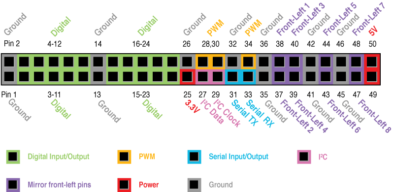

<!-- Version: 160720-KO / Original author: Peter Hoddie / Last reviewed: July 2016 by Lizzie Prader

This document describes how to program Kinoma Create’s hardware pins, and serves as a handy reference for the pin types supported by Kinoma Create.
-->

# Programming with Hardware Pins for Kinoma Create

This document describes how to program Kinoma Create’s hardware pins, and serves as a handy reference to the pin types supported by Kinoma Create.


##About the Pins

Kinoma Create has 66 hardware pins. These pins implement Digital Input/Output, Analog Input, Pulse Width Modulation (PWM), Serial Input/Output, and I<sup>2</sup>C.

<!--from CR: I added mention of Kinoma Code below, as in the Element version of this doc; OK?-->
<!-- from LP: Yes! Excellent. -->

There are 16 pins on the front-facing header, divided into left and right groups of eight pins each (see Figure 1). These pins are user-configurable, using either the Front Pins app on Kinoma Create or in Kinoma Code or the Pins module in an application. The left and right groups are independently configurable to operate at either 3.3 or 5 volts.

**Figure 1.** Kinoma Create Front-Header Pins  


As shown in Figure 2, there are another 50 pins on the back header. The majority of the back pins are fixed-function, with eight of them (pins 51 through 58) mirroring the pin configuration on the front-left pins. The back pins operate at 3.3 volts, except as noted. Four sets of the back pins map to supported protocols, as indicated. Note that:

- Analog In does not map to any particular pins but rather can be supported by any of the front pins when configured. 

- Kinoma Create also supports audio, which is treated programmatically as a pin type but does not map to any pins; the microphone on the device reads audio input and the speaker returns audio output. 

<!--From CR: For consistency with the pin type and the Element pin map, OK to change "UART" (twice) to "Serial" in the following figure?-->
<!-- From LP: Yes, feel free to change it. -->

**Figure 2.** Kinoma Create Back-Header Pins  



## Introducing BLL Modules

All hardware pin programming is done in JavaScript. The non-blocking style of JavaScript programming used in HTML5 client development and `node.js` server development is applied to hardware pins by KinomaJS. KinomaJS separates application code from code that interacts with hardware pins by running the hardware pins code in a separate thread inside its own JavaScript virtual machine, called the *Hardware Pins Service.* The code for each hardware module (sensor, LED, button, motor, and so on) is contained in a JavaScript module called a *BLL.* The application communicates with the BLL using the Pins module.

> **Note:** "BLL" stands for Blinking Light Library, but a BLL is not limited to blinking an LED; a BLL can be used to interact with all kinds of hardware modules.

Developers either implement their own BLL to support the hardware modules they have connected to Kinoma Create or use an existing BLL implementation. Sample BLL implementations for common hardware modules are available in our collection of [sample apps](https://github.com/Kinoma/KPR-examples) on GitHub. In addition, the Pins module includes built-in BLLs for each hardware protocol; you can also find their [source code](https://github.com/Kinoma/kinomajs/tree/master/kinoma/kpr/projects/create/shell/device) on GitHub.

## Application Programming with Pins

Applications first configure the BLLs they will use, and then issue single or repeating commands to the BLL. All of this is done using the Pins module, which builds on the Hardware Pins Service to simplify the code needed to interact with BLLs. (See also the document [*Using the Pins Module to Interact with Sensors on Kinoma Create*](../create-pins-module/).)

The call to `Pins.configure` lists the BLLs that the application uses together with the pins that each BLL uses to communicate to its hardware module.

The following code configures the hardware pins to work with BLLs named `buttonBLL` and `ledBLL`. The BLL code is stored in files named `buttonBLL.js` and `ledBLL.js`. The second argument of `Pins.configure` is a callback function that is invoked whether or not the configuration is successful.

```
Pins.configure({
	greenButton: {
		require: "buttonBLL",
		pins: {
			button: { pin: 53 },
			power: { pin: 54 },
			ground: { pin: 55 },
		}
	},
	redLED: {
		require: "ledBLL",
		pins: {
			led: { pin: 51 },
			ground: { pin: 52 },
		}
	}
}, success => {
	if (success)
		trace("Configured pins.\n");
	else
		trace("Failed to configure pins.\n");
});
```

<!--From CR: I changed "messages" to "commands" as in the Element version of this doc; OK?-->
<!-- From LP: Fine by me. -->

Applications assign a unique name to each hardware module in the configuration. In the preceding example, the button BLL is named `greenButton` and the LED BLL is named `redLED`. The application uses these names to send commands to the corresponding hardware module.

The `require` and `pins` properties are defined by the Hardware Pins Service. The value of the `require` property is the name of the BLL file corresponding to the hardware module. The names of the properties inside the `pins` objects (in this example, `led`, `button`, `power`, and `ground`) are defined by each individual BLL.

While not evident from the application code, the button BLL uses a Digital Input pin, and the LED BLL uses a Digital Output pin. By convention, the application code specifies the pin numbering and the BLL defines the type of pins (Digital Input, Digital Output, PWM, Serial, and so on) that are used. The next section covers how to specify the pin type.

The LED BLL is bound to pins 51 and 52, and the button BLL to pins 53 through 55, as defined in the `pins` object.

Once the pins are configured, an application can invoke BLL functions using the `Pins.invoke` function.

```
Pins.invoke("/redLED/write", 1);  // Turn LED on

Pins.invoke("/redLED/write", 0);  // Turn LED off
```

Applications retrieve values from BLLs in a similar way: calling `Pins.invoke` with the name of the target hardware module and the name of the command in the path. Also passed in is a callback function, which will be called with the value returned.

```
Pins.invoke("/greenButton/get", value => {
	trace("Button value: " + value + "\n");
});
```
	
> **Note:** The format of the value returned from the BLL is determined by the author of the BLL. In the preceding example, the type of the returned value is `Number`, but it may be any valid JavaScript object. 

Applications establish repeated polling of a hardware module at a specified interval using the `Pins.repeat` function. The following example polls the button at 50-millisecond intervals.

```
Pins.repeat("/greenButton/get", 50, value => {
	trace("Button value: " + value + "\n");
});
```
	
Some pin types, such as Audio, support an interrupt-style callback, which uses less CPU time and provides lower latencies than periodic polling. To enable interrupt-style callbacks in place of periodic polling, specify the unique name of the hardware module from the configuration as the value of the `interval` query parameter.

```
Pins.configure({
	microphone: {
		require: "recordingBLL",
		pins: {
			audio: {sampleRate: 8000, channels: 1 }
		}
	}
}, success => {
	if (success) {
		Pins.invoke("/microphone/read", audio, reading => {
			// Do something with reading
			...
		});
	}
});
```

If you would like to take a closer look at the Pins module for Kinoma Create, you can find its [source code](https://github.com/Kinoma/kinomajs/tree/master/kinoma/kpr/libraries/Pins/src) on GitHub. 


## BLL Programming with Pins

As mentioned earlier, a BLL is a JavaScript module that communicates directly with hardware pins. The BLL is configured by the application, which communicates with the BLL using the Pins module.

As illustrated in the simple example below, all BLLs must export the following:

* A `pins` object that defines the types of pins it uses 

* A `configure` function that initializes each of the objects by calling the object's `init` function

* A `close` function that is called automatically when the host application exits and that typically closes the objects used to communicate with pins

You can define and export additional functions required for working with the module to interact with the sensors.

Here are the `pins` exports corresponding to `ledBLL` and `buttonBLL` (respectively) as introduced earlier:

```
exports.pins = {
	led: { type: "Digital", direction: "output" },
	ground: { type: "Ground" }
};

exports.pins = {
	button: { type: "Digital", direction: "input" }
	power: { type: "Power" },
	ground: { type: "Ground" }
};
```

The Hardware Pins Service merges the pin configuration data provided by the application (highlighted in <span class="app-defined">`green`</span> below) is merged with the properties of the `pins` object exported by the BLL (highlighted in <span class="bll-defined">`blue`</span>), to arrive at the following complete configurations:

<pre><code>redLED_configuration = {
	<span class="bll-defined">led</span>: { <span class="bll-defined">type</span>: "Digital", <span class="app-defined">pin</span>: 51, <span class="bll-defined">direction</span>: "output" },
	<span class="bll-defined">ground</span>: { <span class="bll-defined">type</span>: "Ground", <span class="app-defined">pin</span>: 52 }
}

greenButton_configuration = {
	<span class="bll-defined">button</span>: { <span class="bll-defined">type</span>: "Digital", <span class="app-defined">pin</span>: 53, <span class="bll-defined">direction</span>: "input" },
	<span class="bll-defined">power</span>: { <span class="bll-defined">type</span>: "Power", <span class="app-defined">pin</span>: 54 },
	<span class="bll-defined">ground</span>: { <span class="bll-defined">type</span>: "Ground", <span class="app-defined">pin</span>: 55 }
}</code></pre>
	
<!--From CR: Update the following (and maybe also Hardware Pins Reference later) to reflect the addition of power and ground pins in the example?-->
<!-- From LP: I think it's fine the way it is, unless we want to say something like "In this example, it instantiates two objects: one for a digital input sensor, and the other a digital output sensor." Seems clear enough to me though. -->

The Hardware Pins Service then uses the `require` function to load the appropriate BLL, and instantiates JavaScript objects to communicate with the hardware pins. In this example, it instantiates two Digital pin objects: one configured as an input and the other as an output. The input is bound to pin 53 and the output to pin 51. These JavaScript objects are assigned to the module using the property names given by the BLL (`led` and `button` in this example).

Once the objects are instantiated and bound, the Hardware Pins Service invokes the `configure` function of each BLL. The `configure` function must initialize each of the objects by calling the object's `init` function, and it can do any additional work required by the BLL. Note that Power and Ground pins do not need to be initialized.

```
exports.configure = function() {
	this.led.init();
}

exports.configure = function() {
	this.button.init();
}
```
	
The BLL also defines a `close` function, which is called automatically when the host application exits. The `close` function typically closes the objects used to communicate with pins, as follows:

```
exports.close = function() {
	this.led.close();
}

exports.close = function() {
	this.button.close();
}
```

The `configure` and `close` functions are the only functions defined by the Hardware Pins Service. The BLL author may define additional functions required for working with the module. Here are sample `read` and `write` functions for the `led` and `button` objects:

```
exports.read = function() {
	return this.button.read();
}

exports.write = function(value) {
	this.led.write(value ? 1 : 0);
}
```
	
In some situations, a BLL needs to instantiate a hardware pin dynamically instead of having it automatically instantiated before the BLL's `configure` function is called. A BLL can use the `PINS.create` function to instantiate a hardware pin at any time by passing configurations like the following:

<!--From CR: Change 23 to 53 below to match earlier changes?-->
<!-- From LP: It's probably more confusing to have it match, since this is showing how to dynamically instantiate a new object. -->

```
this.digitalOut = PINS.create({ type: "Digital", pin: 23, direction: "output" });
this.newI2C = PINS.create({ type: "I2C", sda: 27, clock: 29, address: 0x39 });
```

As noted earlier, pin numbering is generally specified in the application code. But this is not strictly required, so a call to `PINS.create` may specify pin numbering by itself. Another option is to call `PINS.create` within an exported function that takes in a pin number as an argument, like this:

```
exports.addDigitalOut = function( pinNumber ) {
	this.digitalOut = PINS.create({ type: "Digital", pin: pinNumber, direction: "output" });
}
```

## Hardware Pins Reference

<!--From CR: Each subsection heading is meant to show the exact pin type, hence my changing a couple of them back to that. (I've tried to clarify this below.)-->

This section describes the pins data format that an application uses to configure a BLL. For each of the pin types that are programmatically supported by Kinoma Create--`Digital`, `Analog`, `PWM`, `Serial`, `I2C`, and `Audio`--the following reference details are provided:

* **Pins Object** -- The full pin configuration data, specified in the `pins` object with properties that define the type of pin and the pin number used. Data in <span class="bll-defined">`blue`</span> is defined by the BLL; data in <span class="app-defined">`green`</span>, by the application. 

<!--From CR re the following: FYI, now using "Functions" and "Values" as in Element ref doc.-->

* **Functions**, **Values** -- The functions and value properties supported by the pin type.

The object for each pin type has an `init` function that reserves any hardware resources required by the object, and a `close` function to release the resources used by the object. The object will not operate properly until the `init` function is called.

>**Note:** This reference section refers to chunks, but use of chunks has been deprecated.

### Digital

####Pins Object

<pre><code>{<span class="bll-defined">type</span>: "Digital", <span class="app-defined">pin</span>: 2, <span class="bll-defined">direction</span>: "input"};
{<span class="bll-defined">type</span>: "Digital", <span class="app-defined">pin</span>: 3, <span class="bll-defined">direction</span>: "output"};</code></pre>

####Functions

#####`digital.read()`
Returns 0 or 1, or `undefined` if the read fails. This function is used to retrieve either the value of an input pin or the value being sent by an output pin.

#####`digital.write(value)`
`value` must be 0 or 1. This property can be read or written to change the direction.

####Values

#####`digital.direction`
Value is the string `input` or `output`.

### Analog

####Pins Object

<pre><code>{<span class="bll-defined">type</span>: "Analog", <span class="app-defined">pin</span>: 3};</code></pre>

####Functions

#####`analog.read()`
Returns a floating-point value from 0 to 1.0

### PWM

####Pins Object

<pre><code>{<span class="bll-defined">type</span>: "PWM", <span class="app-defined">pin</span>: 4};</code></pre>

####Functions

#####`pwm.write(value)`

Sets the duty cycle (percentage of time spent "high") to `value` (a floating-point value from 0 to 1.0). The frequency and period (cycle duration, or 1/frequency) are fixed:

* Front PWM pins default to a period of 20ms (50Hz) when a single duty cycle parameter is passed. Specified pulse widths are rounded to multiples of 128µs.  The maximum period is 32.64ms (30.64Hz).

* Back PWM pins only support parameters specifying duty cycle. The PWM frequency of the rear header PWMs is fixed at 12.7KHz (78770ns/cycle) and specified pulse widths are rounded to 1023 multiples of 77ns).

#####`pwm.write(value, period)`
Supported only by the front PWM pins; sets the PWM output pulse width to `value` and the period (cycle duration, or 1/frequency) to `period`, both specified in milliseconds. Pulse width and period can also be specified as an array, as in `pwm.write([width, period])`. Internally the values passed in are rounded to the nearest multiple of 0.128 ms, and the maximum value for each is 32.64 ms.

#####Examples

```
this.pwm.write(0.5);       // 50% duty cycle
this.pwm.write(0.5, 5);    // 0.5 ms pulse width, 5 ms period (10% @ 200 Hz)
this.pwm.write([0.5, 5]);  // Same as preceding example
```

### Serial

####Pins Object

<pre><code>{<span class="bll-defined">type</span>: "Serial", <span class="app-defined">rx</span>: 33, <span class="app-defined">tx</span>: 31, <span class="bll-defined">baud</span>: 38400};</code></pre>

If the serial device is read-only or write-only, the unused pin property, `rx` or `tx`, may be excluded from the pin configuration data.

####Functions

#####`serial.read(format)`
Reads data from the serial input. Pass one of the following strings for the `format` parameter:

- `Chunk` to return the data in a chunk.

- `String` to return a string. The data read into a string must be valid UTF-8 data, otherwise an exception is thrown.

- `Array` to return an array of integer character codes from 0 to 255.

- `charCode` to return a single character code as an integer.  

All formats except `charCode` return all data that is immediately available in the input.

#####`serial.read(format, maximumBytes)`
Same as `serial.read(format)` but reads no more than `maximumBytes`. This call does not block, so only immediately available bytes are returned. This function is not supported for the `charCode` format, which returns either 1 or 0 bytes.

#####`serial.read(format, maximumBytes, msToWait)`
Same as `serial.read(format, maximumBytes)` but waits up to `msToWait` milliseconds for `maximumBytes` to arrive

#####`serial.write(value...)`
Writes the specified value(s) to the output. Each value can be a chunk, a string, an array of integer character codes from 0 to 255, or a single integer character code. 

#####Example
This example writes a string followed by a carriage return-line feed and `null`.

```
var crlf = new Chunk(2);
crlf[0] = 13;
crlf[1] = 10;
serial.write("Hello, world.", [crlf, 0]);
```  

### I2C

####Pins Object

<pre><code>{<span class="bll-defined">type</span>: "I2C", <span class="app-defined">sda</span>: 27, <span class="app-defined">clock</span>: 29, <span class="bll-defined">address</span>: 0x36};</code></pre>

The `address` property is the I<sup>2</sup>C slave address. The data sheet for some I²C devices specifies different slave addresses for read and write, differing only in the least significant bit. If this is the case, use the most significant 7 bits for the slave address here.

####Functions

#####`i2c.readByte()`
Reads one byte <!--(Linux: `read`)-->

#####`i2c.readBlock(count, format)`
Reads the number of bytes specified by `count`.  Pass a string for the `format` parameter: `Chunk` to return the data in a chunk, or `Array` to return an array of integer character codes from 0 to 255. <!--(Linux: `read`)-->

#####`i2c.readByteDataSMB(register)`
Reads one byte from the specified register <!--(Linux: `i2c_smbus_read_byte_data`)-->

#####`i2c.readWordDataSMB(register)`
Reads two bytes from the specified register <!--(Linux: `i2c_smbus_read_word_data`)-->

#####`i2c.readBlockDataSMB(register, count, format)`
Reads `count` bytes starting at the specified register. Pass a string for the `format` parameter: `Chunk` to return the data in a chunk, or `Array` to return an array of integer character codes from 0 to 255. <!--(Linux: `i2c_smbus_read_i2c_block_data`)-->

#####`i2c.writeByte(value)`
Writes one byte <!--(Linux: `write`)-->

#####`i2c.writeBlock(value...)`
Writes the specified value(s), which are treated in the same way as by `serial.write`. <!--(Linux: `write`)-->

#####`i2c.writeByteDataSMB(register, value)`
Writes one byte to the specified register <!--(Linux: `i2c_smbus_write_byte_data`)-->

#####`i2c.writeWordDataSMB(register, value)`
Writes two bytes to specified register <!--(Linux: `i2c_smbus_write_word_data`)-->

#####`i2c.writeBlockDataSMB(register, value...)`
Writes up to 32 bytes starting at the specified register. The value(s) are treated in the same way as by `serial.write`. <!--(Linux: `i2c_smbus_write_i2c_block_data`)-->

#####`i2c.writeQuickSMB(value)`
Sends the low bit of `value` using the I<sup>2</sup>C `write_quick` command <!--(Linux: `i2c_smbus_write_quick`)-->

#####`i2c.processCallSMB(register, value)`
Writes two bytes to the specified register; after the write completes, reads two bytes and returns the resulting data word

<!--From CR: I added "or the Pins module" below as earlier; OK?-->
<!-- From LP: Yes, definitely OK. -->

>**Note:** Kinoma Create has up to three separate I<sup>2</sup>C buses. The primary I<sup>2</sup>C bus corresponds to pins 27 and 29 on the back pins connector. The front-left and front-right pin headers can be configured to have I<sup>2</sup>C pins using the Front Pins app or the Pins module. When configured to have I<sup>2</sup>C pins, each front pin header is a separate I<sup>2</sup>C bus. Having multiple I<sup>2</sup>C buses is very convenient when multiple components in a project share the same I<sup>2</sup>C slave address.

### Audio

####Pins Object

<pre><code>{<span class="bll-defined">type</span>: "Audio", <span class="app-defined">sampleRate</span>: 8000, <span class="app-defined">channels</span>: 1, <span class="bll-defined">direction</span>: "input"};</code></pre>

####Functions

#####`audio.read()`
Reads all available audio input and returns it in a chunk

#####`audio.write(chunk)`
Writes `chunk` to the queue for audio output

#####`audio.start()`
Begins playback (output) or recording (input)

#####`audio.stop()`
Ends playback (output) or recording (input)

#####`audio.setVolume(value)`
Sets the volume level of an audio output to a floating-point value from 0 to 1.0

## Wait Functions

<!--from CR: Should "messages" be reworded/removed below (as has been done everywhere else)?-->
<!-- From LP: Changed to "processes" -->

The Hardware Pins Service provides functions to wait a specified period of time. These functions are useful because many hardware components require a period of time to elapse between certain operations. The wait functions are synchronous; that is, they block. Because Kinoma Create runs BLLs in their own thread, these wait functions do not block the application driving the user interface; however, they do block other processes pending with the BLL.

> **Note:** The wait functions run in Linux user space. This means that the exact amount of time that the function waits may be longer than requested. This is not usually significant, because Kinoma Create has more than enough CPU power for most projects.

#####`sensorUtils.delay(seconds)`
Waits the specified number of seconds. The `seconds` argument is interpreted as an integer, so any fractional portion is ignored.

#####`sensorUtils.mdelay(milliseconds)`
Waits the specified number of milliseconds (thousandths of a second). The `milliseconds` argument is interpreted as an integer, so any fractional portion is ignored.

#####`sensorUtils.udelay(microseconds)`
Waits the specified number of microseconds (millionths of a second). The `microseconds` argument is interpreted as an integer, so any fractional portion is ignored. A microsecond is a very short period of time, making this function considerably less precise than `sensorUtils.delay` and `sensorUtils.mdelay`.
