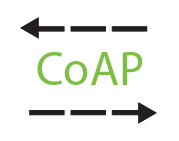
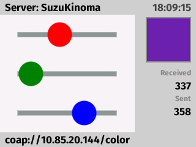
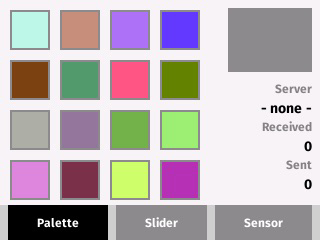

<!-- Version: 160415-CR / Last reviewed: October 2015

Use of network connections by Internet of Things devices is increasingly common. HTTP is a popular protocol for these connections, but there are many problems with it, such as efficiency and speed, and these factors have an impact on the device battery life. CoAP is a lightweight, fast, and reliable protocol designed to be used for constrained devices commonly found in the Internet of Things.
-->



#CoAP Client and Server in KinomaJS

**Basuke Suzuki**  
April 13, 2015

Use of network connections by Internet of Things devices is increasingly common. Even a tiny device in the kitchen might connect to the internet. HTTP is a popular protocol for these connections now and works reasonably well, but there are many problems with it, such as efficiency and speed. These factors have an impact on the device battery life, which is an important concern on IoT devices.

The [Constrained Application Protocol (CoAP)](https://tools.ietf.org/html/rfc7252) is a very young protocol. Designed to be used for constrained devices commonly found in the Internet of Things, it is lightweight, fast, and reliable enough for IoT uses. If you are familiar with TCP/IP, note that CoAP uses UDP, not TCP, for its transport layer. UDP is a packet-based protocol, whereas TCP is stream-based. With UDP, data must fit in a single packet whose size varies from about 1K for a regular PC to less than 100 bytes for constrained devices. This constraint makes UDP suitable for small amounts of data, such as sensor data.
 
## The Problem with TCP and HTTP

TCP is a great transport layer for networking. It is reliable, which is why so many protocols, including HTTP, build on TCP. But to achieve that reliability, TCP does a lot of work behind the scenes: it requires a connection to the destination before it starts communicating; it uses three packets to establish a connection; and the TCP packet header is more than 12 bytes larger than UDP's. In some situations, these small costs become significant.

On top of that, HTTP adds its own header overhead. According to Google in its [introduction to the SPDY project](https://www.chromium.org/spdy/spdy-whitepaper), the average HTTP request today has 700 to 800 bytes of headers. From an IoT perspective, that number is huge. Of course most of that is used for cookies, which are not commonly required in IoT devices, but if the cookie is domain-wide and the request is generated by the browser’s AJAX, those cookies will automatically be attached to the request.

Also, HTTP headers are composed of just text, and the cost of parsing such human-readable text cannot be ignored for small devices. Further, many HTTP headers are not required for communication and so are ignored after the cost of parsing has been paid.
 
##UDP-Based Reliable Protocol

UDP is a simple transport layer, fast and lightweight. It is a connectionless protocol: it simply sends a data packet to the destination without needing a connection handshake. Data can be sent at any time, without the need to establish a connection first. These are the reasons why CoAP chose UDP for its transport layer.

However, UDP is far less reliable than TCP. Each packet may arrive once, more than once, or never. The order of packet delivery is undefined; the first packet may arrive later than the second one. The sender has no way of knowing whether the recipient received the packet.

Because CoAP uses UDP for network transport, delivery of packets is unreliable by default. When sending a packet, the application has the option of making delivery of the packet reliable. Reliable transmission is achieved by marking individual messages with the `confirmable` flag. When an endpoint receives a confirmable message, it responds with an acknowledgment message to let the sender know the message arrived. Each message has its own ID number, so an endpoint can distinguish messages. An endpoint will automatically retransmit a confirmable message if an acknowledgment message is not received in the timeout interval.

As in HTTP, a CoAP message has headers. Unlike in HTTP, the CoAP headers are a compact binary format representing a minimum subset of HTTP’s large header specification. Because of the binary format, parsing to read required headers is easy.
 
##CoAP and HTTP Similarities

From the programmer's perspective, CoAP and HTTP are very similar. Today HTTP is the basis of web APIs, which generally use REST-style communication.

* Both HTTP and CoAP use a URI to identify the target destination and resource.

* Both use a request-and-response style of communication: there is a client that sends a request and a server that gets the request and sends back a response to the client. In addition, CoAP’s message has a content type specifying the format that is used to describe its content.

* With a URI, a `GET`, `POST`, `PUT`, or `DELETE` method can be used in CoAP communication, just as in HTTP.
 
##KinomaJS Implementation of CoAP Client and Server

A CoAP client and server are included in Kinoma Create and Kinoma Studio starting with Kinoma Software 7.0.4. 

The client is simple to use. Here is an example:

```
var client = new CoAP.Client();
var request = client.createRequest('coap://iot.eclipse.org/query?hello=world');
request.onResponse = function(response) {
	trace(response.payload + "\n");
};
client.send(request);
```
  	
The server is equally simple. Configure the newly created server by binding the actual function to the path (in this case, `/hello`).

```
var server = new CoAP.Server();
server.bind("/hello", function(session) {
	var response = session.createResponse();
	response.payload = "Hello world";
	session.send(response);
});
server.start();
```
	
If the IP address of the Kinoma Create device running the code above is 10.85.20.144, the URL of the function above on this CoAP server is `coap://10.85.20.144/hello`.
 
##Client Side: Configuring a Request

To make a request confirmable, set the `confirmable` property to `true`.

```
request.confirmable = true;
```
	
Set the method with the `method` property.

```
request.method = 'GET';
```
	
A request can have data, called its *payload.* There are two ways to set the request’s payload. Set it to plain text data with the `payload` property.

```
request.payload = "Hello world";
```
	
In this case, the content format is automatically text. Alternatively, call the `setPayload` method to set the content format.

```
var data = { result: -1, status: "OK" };
request.setPayload(JSON.stringify(data), 'json');
```
	
The content format can be set to the following values in CoAP (or to their aliases provided by the KinomaJS CoAP implementation, as shown).

**Table 1.** Content Format Values
<table class="normalTable">
  <tbody>
    <tr>
      <th scope="col"><strong>Value</strong></th>
      <th scope="col"><strong>Alias</strong></th>
    </tr>
    <tr>
      <td><code>text/plain; charset=utf-8</code></td>
      <td><code>text/plain or text</code></td>      
    </tr>
    <tr>
      <td><code>application/xml</code></td>
      <td><code>xml</code></td>
    </tr>
    <tr>
      <td><code>application/octet-stream</code></td>
      <td><code>octet-stream</code></td>
    </tr>
    <tr>
      <td><code>application/json</code></td>
      <td><code>json</code></td>
    </tr>
  </tbody>
  </table>

 
##Client Side: Handling a Response Event

To receive the response from a server, the `request` object can have event handlers as properties.

The `onResponse` event is called to process the response from the server.

```
request.onResponse = function(response) {
	var data = response.payload;
	// Do some task with the response
	...
};
```
	
The `response` object has a `payload` property for the response contents.

```
var data = response.payload;
```
	
There is also a `contentFormat` property, so it is easy to handle the response differently depending on its format.

```
var format = response.contentFormat.split(';')[0];
if (format == 'application/json') {
	data = JSON.parse(response.payload);
} else if (format == 'text/plain') {
    data = response.payload;
} else {
	throw "Unknown format";
}
```
	
To be notified when a confirmable request sent by the client has been acknowledged by the receiver, set the `onAck` property.

```
request.onAck = function() {
	// We know the server got my request. Yay!
};
```
 
##Server Side: Handling a Request and Sending a Response

On the server side, request information is available from the `session` object. The following properties are available. All are read-only.

```
session.method;         // GET / POST / PUT / DELETE
session.confirmable;    // true or false
session.messageId;      // e.g., 1234
session.payload;        // e.g., "Hello world"
session.contentFormat;  // text/plain; charset=utf-8
session.uri;            // coap://10.85.20.144:5683/hello?foo=bar&a=123
session.host;           // 10.85.20.144
session.port;           // 5683
session.path;           // /hello
session.query;          // foo=bar&a=123
```
	
A session creates a response using the `createResponse` method.

```
var response = session.createResponse();
```
	
Build the response by setting its payload, just as in the request.

```
response.payload = 'Sayonara';
```
	
In addition to the payload, set the status code of the response using `setCode`. The next section provides details on the response code.

```
response.setCode(2, 5);		// Default success response code
response.setCode(4, 3);		// Forbidden
```
	
Finally, when the response is ready to be sent, call the `send` method to send it back.

```
session.send(response);
```
	
Do not forget to do this; no response is sent automatically.
 
##CoAP Response Codes

The preceding section showed how to set the response code in the response. The response code is similar to an HTTP status code, with small differences. The most noticeable difference is that it is not one digit, but two: *class* and *detail.*

Classes describe whether the response is success or failure.

*	2: Success
*	4: Client Error
*	5: Server Error

Details differ from class to class. These are some examples of *class.detail* combinations:

*	2.01: Created
*	2.05: Content
*	4.01: Unauthorized
*	4.05: Method Not Allowed
*	4.13: Request Entity Too Large

Some CoAP response codes are familiar from HTTP, while others are CoAP-specific. See the [official CoAP response code specification](https://tools.ietf.org/html/rfc7252#section-5.9) for more information.
 
##The Observe Extension: Multiple Responses from the Server

The Observe extension is an important standard extension for CoAP that provides publish and subscribe-style communication. With the Observe extension, a CoAP client can send a registration request and, once it is accepted by the server, the client will receive multiple notification responses, based on the semantics of the server endpoint (see Figure 1). The notifications can be once every five minutes, immediately after the value changes, or as fast as possible, like continuous real-time notification. The contents of a notification can be anything. The basic structure of the notification is similar to a regular response.

**Figure 1.** Multiple Responses from the Server
  


Instantiating the observe registration request is simple: set the `observe` property to `true`.

```
request.observe = true;
```
	
Handling an observe request requires two phases: (1) when the server receives the registration request, and (2) when it wants to send a notification to the observer clients.

An observe request has `true` in its `observe` property, so start by checking that property. Call the `acceptObserve` method to let the client know that the observe request is successfully accepted. If `acceptObserve` is not called by the request handler, the server considers the observe request denied.

```
if (session.observe) {
	// Session registration
	session.acceptObserve();
	sessions.push(session.id);
}
var response = session.createResponse();
response.setCode(2, 5);
session.send(response);
```
  	
In this example, the global variable `sessions` is used to remember the observer’s session ID. The session ID is required to send a notification response back to the client.

More than one client can observe the same resource of the server--which is why the `sessions` variable is an array.

After the registration phase completes, send back a notification response whenever appropriate, such as when the user taps a button or a sensor detects a value change, or at specific time intervals.

```
sessions.forEach(function(id) {
	var session = server.getSession(id);
	if (session) {
		// Send a response as usual with the session
		...
	} else {
		// Remove that ID from sessions
		...
	}
});
```
	
As described earlier, there can be more than one observer, so loop with the session ID in the `sessions` array. From the `server` object, the session can be retrieved with the `getSession` method. Check whether the session is `null` or not before using it, because it is possible that the session has been invalidated because of a communication error or has been cancelled from the client side.

Sending back a response is the same as regular response handling.
 
##CoAP Server and Client Examples

Two KinomaJS sample applications are available on GitHub. These examples, [`coap-server`](https://github.com/Kinoma/KPR-examples/tree/master/coap-server) and [`coap-client`](https://github.com/Kinoma/KPR-examples/tree/master/coap-client), share color information over Wi-Fi. The server is the central point of the color information; clients get that information from the server and send the new color to the server.

**Figure 2.** CoAP Server Example  



The server example consists of three files:

*	`main.xml` -- the user interface and main application logic

*	`slider.xml` -- the slider user interface

*	`server.js` -- all CoAP server-related code, which is imported into `main.xml` as a module named `SERVER`

**Figure 3.** CoAP Client Example  



The client has three tabs at the bottom:

*	**Palette** for the color palette
	
*	**Slider** for the RGB slider
	
*	**Sensor** for the RGB color sensor

All user interface is defined in `main.xml`. The code for communication with the server is stored in `client.js` and is imported into `main.xml` as a module named `CLIENT`.
