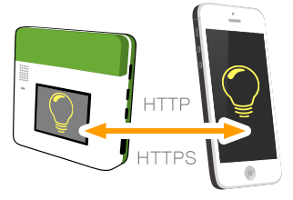

<!-- Version: 160412-KO / Last reviewed: October 2015

It is often necessary for an Internet of Things device to include an HTTP server, for setup or for retrieving information gathered by the device. A KinomaJS app can easily create an HTTP server and advertise its presence on the local network. This Tech Note describes how to start, stop, and customize your app's HTTP server.
-->



#Embedding an HTTP Server in Your Application

**Alain Soquet, Software Architect**  
April 16, 2015

It is often necessary for an Internet of Things device to include an HTTP server, for setup or for retrieving information gathered by the device. A KinomaJS app can easily create an HTTP server and advertise its presence on the local network. This Tech Note describes how to start, stop, and customize your app's HTTP server.

## Starting the Server the Easy Way

For simplicity and reliability, a KinomaJS app can create an HTTP server in one easy step, without having to configure any parameters.

A KinomaJS app starts and stops its HTTP server with the `share` function:

```
application.share(true);   // Start the app HTTP server with the default options
application.share(false);  // Stop the app HTTP server
```

You can obtain the same result with the `shared` accessor:

```
application.shared = true;   // Start the app HTTP server with the default options
application.shared = false;  // Stop the app HTTP server
```

The accessor can be used to check whether the server is running or not:

```
trace("The HTTP Server is " + (application.shared ? "running" : "stopped") + "\n");
```

The server port is selected automatically, so you do not have to know in advance which ports are available on your system. You can retrieve the port used by the server when it is running, with the `serverPort` accessor:

```
var port = application.serverPort;
```

## Advertising the Server

Having a server available is great, but it is even better if interested clients can discover its URL to start communicating with it. For that purpose, the application server is advertised by default with SSDP using the application ID as the device type. For more on SSDP, see the [Net Scanner](../net-scanner/) Tech Note.

For example, if the application ID is `discoveryserver.example.kinoma.marvell.com` (from the [`discovery-server`](https://github.com/Kinoma/KPR-examples/tree/master/discovery-server) example), interested applications can discover the server as follows:

```
application.discover("discoveryserver.example.kinoma.marvell.com");
```

See the [`discovery-client`](https://github.com/Kinoma/KPR-examples/tree/master/discovery-client) example for more details.

## Starting the Server the Custom Way

The default HTTP server settings work well for most situations; however, there are cases where the server needs to meet some specific requirements. In that case, the boolean passed to the `share` function is replaced by a JSON object specifying the custom parameters.

### Using a Specific Port

To start the server on a specific port--for example, 8080--use:

```
application.share({
	port: 8080
});
```

### Selecting the Advertisement Protocols

The server can be advertised with SSDP and/or Zeroconf.

To start the server and advertise it with Zeroconf instead of SSDP, use:

```
application.share({
	zeroconf: true
});
```

### Using a Secure Server

To start an HTTPS server for communicating securely between your KinomaJS apps, use:

```
application.share({
	ssl: true
});
```

The server will then use the default certificates bundled with KinomaJS.

In case the server needs to use specific certificates or policies, you can provide them as follows:

```
application.share({
	ssl: {
		certificates: Files.readText(mergeURI(application.url, "./cert.pem")),
		policies: "allowOrphan",
		key: Files.readText(mergeURI(application.url, "./key.pem"))
	}
});
```

You can check whether the server is secure with the `serverIsSecure` getter:

```
trace("This is an " + (application.serverIsSecure ? "HTTPS" : "HTTP") + " server\n");
```

### Combining the Different Settings

It is possible to combine the different settings inside the JSON object passed to `share`. The following example will open a secure server on port 443 and advertise it using both SSDP and Zeroconf.

```
application.share({
	port: 443,
	ssdp: true,
	zeroconf: true,
	ssl: {
		certificates: Files.readText(mergeURI(application.url, "./cert.pem")),
		policies: "allowOrphan",
		key: Files.readText(mergeURI(application.url, "./key.pem"))
	}
});
```

## Handling Incoming Requests

Now that the server is up and running, the application needs to handle the request messages.

The server delivers messages based on their URL. The path of the message URL selects the handler to receive the message. If the server does not find a handler corresponding to the request URL, the application itself is selected.

During the processing of the request message, two events of the selected behavior will be called:

* The `onAccept` event is called before the request body is received. At this point, only the request method and headers are available in the message, with the `method` accessor and the `getRequestHeader(name)` function, respectively. By default the request body will be stored inside the message and will be accessible with the `requestChunk` or `requestText` accessor. It is also possible to tell the server to store the request body in a file; to do so, set the message `requestPath` to the path of the file where the request body should be written.

* The `onInvoke` event is called after the request body has been received. It allows the application to process the request and prepare the message status, the response headers, and the response body. The message status is set with the `status` accessor, and the response headers are set with the `setResponseHeader(name, value)` function. The response body is set with the `responseChunk` or `responseText` accessor. It is also possible to tell the server to read the response body from a file; to do so, set the message `responsePath` to the path of the file from which the response body should be read.

Some examples follow.

### Simple GET Request Handler

```
Handler.bind("/simpleGet", {
	onInvoke: function(handler, message) {
		if (message.method == "GET") {
			message.setResponseHeader("Content-Type", "text/plain");
			message.responseText = message.query;
		}
		else {
			message.status = 405; // Method not allowed
		}
	}
});
```

The handler returns the content of the query in the response body.

### File PUT Handler

```
Handler.bind("/filePut", {
	onAccept: function(handler, message) {
		if (message.method == "PUT") {
			message.requestPath = mergeURI(application.url, "./upload.txt");
			return true;
		}
		return false;
	}
	onInvoke: function(handler, message) {
		var url = mergeURI(application.url, "./upload.txt");
		if (message.method == "PUT") {
			var text = Files.readText(url);
			// Do something with the file
			...
		}
		else {
			message.status = 405; // Method not allowed
		}
	}
});
```

The handler stores the content of the request body in the file `upload.txt`. The file is ready to be used in `onInvoke`.

### File GET Handler

```
Handler.bind("/fileGet", {
	onInvoke: function(handler, message) {
		if (message.method == "GET") {
			message.setResponseHeader("Content-Type", "text/plain");
			message.responsePath = mergeURI(application.url, "./download.txt");
		}
		else {
			message.status = 405; // Method not allowed
		}
	}
});
```

The content of the file `download.txt` is used as the response body.

### Handling Requests in the Application

```
var model = application.behavior = Object.create(Object.prototype, {
	// Other application behavior functions
	...
	onInvoke: function(application, message) {
		// Filter message on the message URL scheme
		// to ensure it comes from the server
		if ((message.scheme == "http") || (message.scheme == "https")) {
			message.setResponseHeader("Content-Type", "text/plain");
			message.responseText = "Sorry, there is no handler with path: ";
			message.responseText += message.path;
			message.status = 404; // Not found
		}
	}
});
```

This allows the application to catch all requests that do not correspond to a specific handler.

## Starting Supplementary Servers

In case the application server is not sufficient, it is possible to create additional servers.

The optional server parameters `port` and `ssl` are specified in a JSON object passed to the `Server` constructor. 

After the server is started, all incoming requests are handled by the server behavior. Two events will be called: `onAccept(handler, message)` and `onInvoke(handler, message)`.

For example:

```
var server = new HTTP.Server({port: 8080});
server.behavior = {
	onInvoke: function(handler, message) {
		message.setResponseHeader("Content-Type", "text/plain");
		message.responseText = "Please handle incoming requests here!";
		message.status = 200;
	}
};
server.start();
	
trace("This is an " + (server.isSecure ? "HTTPS" : "HTTP")
	+ " server on port " + server.port + "\n");
				
...
	
server.stop();
```

Unlike for the application server, the advertisement of supplementary servers should be done explicitly--for example, using the Zeroconf or SSDP extension.
