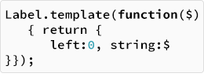

<!-- Version: 160815-CR / Last reviewed: December 2015, partial review by Mike Jennings

This Tech Note introduces how to use dictionary-based constructors and templates to build KinomaJS `content`, `container`, `skin`, and `style` objects. Using dictionaries helps simplify the coding of KinomaJS applications in JavaScript, and templates provide mechanisms similar to those provided by XML elements and attributes in a KinomaJS XML document.
-->



# Introducing KinomaJS Dictionary-Based Constructors and Templates

**Patrick Soquet, Kinoma Software Architect**    
March 10, 2015

In this Tech Note, I will introduce how to use dictionary-based constructors and templates to build KinomaJS `content`, `container`, `skin`, and `style` objects. Using dictionaries helps simplify the coding of KinomaJS applications in JavaScript, and templates provide mechanisms similar to those provided by XML elements and attributes in a KinomaJS XML document.

## Overview

KinomaJS `content`, `container`, `skin`, and `style` objects are host instances (that is, JavaScript objects implemented by platform-native code); they reference native records that the runtime uses to display the user interface. The only way to create such objects is to call their respective constructors.

KinomaJS constructors often have optional arguments to initialize the properties of the object they create. That obviously requires remembering the order of the arguments. Moreover, KinomaJS constructors do not initialize all properties of the new object, so some properties may have to be initialized separately.

```
var redSkin = new Skin("red");
var redContent = new Content({ width: 40, height: 40 }, redSkin); 
redContent.active = true; 
redContent.visible = false;
```

## Dictionary-Based Constructors

A dictionary-based constructor takes one argument: an object with properties. The constructor uses the dictionary’s properties to initialize the properties of the object it creates.

```
var greenSkin = new Skin({ fill: "green" });
var greenContent = new Content({
	width: 40, height: 40, skin: greenSkin, active: true, visible: true 
});
```

A dictionary can also describe a containment hierarchy or rich text. For example:

```
var scroller = new Scroller({ 
	left: 0, width: 160, top: 0, height: 120, 
	clip: true, active: true,
	contents: [
		new Column({ 
			left: 0, right: 0, top: 0,
			contents: [
				new Label({ left: 0, right: 0, string: "one" }),
				new Label({ left: 0, right: 0, string: "two" }),
				new Label({ left: 0, right: 0, string: "three" })
			]
		})
	]
});
	
var text = new Text({
	left:0, width:160, top:0,
	blocks: [
		{ string: "Kinoma" },
		{ spans: [
			{ wrap: new Picture({ 
				url: "http://www.kinoma.com/img/kinoma-logo.png"
			})},
			{ string: "Visit" },
			{ behavior: linkBehavior, string: "kinoma.com",
		  	  style: new Style({ color: "blue" })}
		]}
	]
});
```

> **Note:** For compatibility, the original KinomaJS constructors are used when there are no arguments, when there are multiple arguments, or when there is a single argument that is not an object.

## Templates

From a JavaScript point of view, templates are just elaborate constructors. They can be coded explicitly but it is cumbersome, especially when one template is based on another template.

The KinomaJS XML document format provides templates, as discussed in the [*KinomaJS Overview*](../../overview/) document, but taking advantage of this in a JavaScript-based project requires including it as an XML module. 

Consequently, the constructors for `content` and `container` objects provide the `template` function to create templates. The `template` function takes one argument--an anonymous function that creates a dictionary--and returns a constructor.

```
var MyLabel = Label.template(function($) { return {
	left: 0, right: 0, string: $ 
}});
```
	
When you call such a constructor with `new` and data, the anonymous function is called with the data to create the dictionary used to instantiate the `content` or `container` object.

```
var startLabel = new MyLabel("Start");
var stopLabel = new MyLabel("Stop");
```
	
Templates can be chained.

```
var MyGreenLabel = MyLabel.template(function($) { return {
	skin:greenSkin 
}});
```

In this case, the anonymous functions are called in order from the most generic to the most specific. Properties of the dictionaries are overridden in that order, except for the `contents` properties, which are instead concatenated in that order. (The `contents` property, in a container dictionary, is an array of the `content` objects in the container.)

Notice that `content` or `container` templates do not create a new prototype. The `prototype` property of a template always equals the `prototype` property of the constructor it is based on.

```
// MyGreenLabel.prototype == Label.prototype
```

## Instructions

The KinomaJS XML document format provides the `iterate`, `scope`, and `select` instruction elements (discussed along with templates in [*KinomaJS Overview*](../../overview/) document). Expressions can now be used to achieve the same result in JavaScript, as shown in the following examples.

### Iterate

Here the template uses the `Array.prototype.map` function on `$` to build an array of labels with the `MyLabel` constructor.

```
var MyScroller = Scroller.template(function($) { return {
	left: 0, width: 160, top: 0, height: 120, 
	contents: [
		new Column({
			left: 0, right: 0, top: 0,
			contents: $.map(function($$) {
				return new MyLabel($$);
			})
		})
	]
}});
application.add(new MyScroller(["one", "two", "three", "four"]));
```
	
### Scope

Here the template accesses a property of `$` to call the `MyLabel` constructor with the correct data.

```
var MyHeader = Container.template(function($) { return {
	left: 0, right: 160, top: 0, height: 40,
	contents: [
		new MyLabel($.title)
	]
}});
application.add(new MyHeader({ title: "five" }));
```

### Select

Here the template tests a property of `$` to call the `MyLabel` constructor when appropriate.

```
var MyHeader = Container.template(function($) { return {
	left: 0, right: 160, top: 0, height: 40,
	contents: $.title ? [ new MyLabel($.title) ] : undefined
}});
```

## Calling Constructors as Functions

Dictionary-based constructors take one argument: the dictionary.

```
var myContainer = new Container({ width: 160, height: 40 });
```
	
Template-based constructors also take one argument: the data.

```
var myHeader = new MyHeader({ title: "Settings" })
```
	
When either kind of constructor is called as a function (without `new`), they take two arguments--the data and the dictionary--and return an instance of their `prototype` property.

Calling a template-based constructor as a function is useful for overriding properties.

```
var myHeader = MyHeader({ title: "Settings" }, { height: 50 })
```
	
Calling a dictionary-based constructor as a function is useful for passing data to its behavior.

```
var myContainer = Container({ title: "Settings" }, {
	behavior: Behavior({
		onCreate: function(container, $) {
			// Here $.title == "Settings"
		}
	})
})
```

Calling constructors as functions mostly helps to define templates that construct containment hierarchies without the repetitive `new` and with consistent arguments for all constructors:

```
var MyScreen = Container.template(function($) { return {
	left: 0, right: 0, top: 0, bottom: 0,
	contents: [
		Scroller($, { 
			left: 0, right: 0, top: 44, bottom: 0,
			contents: [
				Column($, { 
					left: 0, right: 0, top: 0,
					contents: [
						Label($, { string: $.items[0] }),
						Label($, { string: $.items[1] }),
						Label($, { string: $.items[2] })
					]
				})
			]
		}),
		MyHeader($,{ height: 44 })
	]
}});
	
var myScreen = new MyScreen({
	title: "Title",
	items: ["zero", "one", " two "]
});
	
application.add(myScreen);
```

## Reference

### Constructors and Dictionaries

The `Canvas`, `Column`, `Content`, `Container`, `Label`, `Layer`, `Layout`, `Line`, `Media`, `Picture`, `Port`, `Scroller`, `Skin`, `Style`, `Text`, and `Thumbnail` constructors may be dictionary-based. In the following description, *`Constructor`* stands for one of these constructors.

*`Constructor`*`(dictionary)`

| | | |
| --- | --- | --- |
| `dictionary` | `object` | required |

> An object with properties to initialize the result

| | | |
| --- | --- | --- |
| Returns | `object` | |

> An instance of *`Constructor`*`.prototype`  

For details about the properties that each dictionary can contain, see the document [*KinomaJS JavaScript Reference*](../../javascript/).

### Templates

The `Canvas`, `Column`, `Content`, `Container`, `Label`, `Layer`, `Layout`, `Line`, `Media`, `Picture`, `Port`, `Scroller`, `Skin`, `Style`, `Text`, and `Thumbnail` constructors provide a `template` function. In the following description, *`Constructor`* stands for one of these constructors.

*`Constructor`*`.template(anonymous)`

| | | |
| --- | --- | --- |
| `anonymous` | `function` | required |

> A function that returns an object with properties to initialize the instances that the result creates

| | | |
| --- | --- | --- |
| Returns | `function` | |

> A constructor that creates instances of *`Constructor`*`.prototype`. The `prototype` property of the result is *`Constructor`*`.prototype`. The result also provides a `template` function.
