<!-- Version: 160711-CR / Last reviewed: December 2015

This Tech Note explains how to build your own pins simulators, both data-driven and fully custom. Pins simulators enable you to develop your Kinoma Create application entirely on your computer by simulating the inputs and outputs of one or more hardware modules.
-->

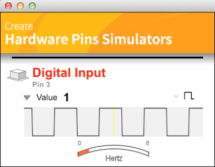

#Pins Simulators

**Sean Allen**  
February 14, 2015

Pins simulators enable you to build and test your Kinoma Create application entirely on your computer by simulating the inputs and outputs of one or more hardware modules. The advantages of using them include:

- System debugging is made easier by isolating application software bugs from hardware component and wiring issues.

- Rapid development cycles are enabled since you are not required to launch and test on a physical device after every change.

- Being able to work on your application away from the hardware makes scenarios such as working on a distributed team, working while traveling, and testing ideas before purchasing components all possible.

This Tech Note explains how to build your own pins simulators, both data-driven and fully custom.

##What They Are

Pins simulators provide the user interface portion of a simulator BLL. BLLs are JavaScript modules that interact with hardware components such as sensors, buttons, and motors; they provide a KinomaJS message API to your application so that it can use these types of components.

>**Note:** For more information about BLLs, see the document [*Programming with Hardware Pins for Kinoma Create*](../../pins/).

Two versions of a BLL that support the same API may be created: one for the device that handles the real hardware protocol and one for the simulator.

Figure 1 shows the [Analog MB1010](https://github.com/Kinoma/KPR-examples/tree/master/analog-MB1010/) sample application loaded into Kinoma Studio. The `device` folder contains the device BLL, and the `simulator` folder contains the simulator BLL (both BLLs are named `MB1010.js`). Placing the BLLs in these folders enables the appropriate one to be loaded at runtime.

**Figure 1.** Analog MB1010 Application in Kinoma Studio  

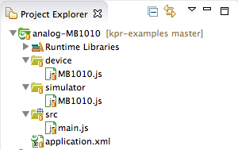

The Analog MB1010 application requires the `MB1010` BLL in `main.xml` when it configures the pins.

```
Pins.configure({
    MB1010: {
        require: "MB1010",
        pins: {
            range: {pin: 62}
        }
    }
}
```

As with any module, the implementation may be in pure JavaScript or in the XML syntax; the root name is specified when the BLL is required. 

##Using Them

If your project uses hardware modules that already have existing BLLs, you may simply place them in the `device` and `simulator` folders.

Many BLLs have already been written, and more are being created all the time. With the help of the developer community, we are building up a catalog. You may find reusable BLLs in the sample applications.

When in use, pins simulators will show up in the Hardware Pins Simulator column on the left in the Kinoma Create Simulator.

Pins simulators come in two flavors: data-driven and custom.


##About Data-Driven Pins Simulators

Data-driven pins simulators are quite easy to create, since you do not need to do any UI design or implementation; instead, you define the number and type of data inputs and outputs.

The data axis types supported are boolean and float, and they may be configured as either an input or an output.


###Boolean Input Axis
A *boolean input* axis is appropriate for any digital input--for example, a digital push button. You can select a square wave with adjustable frequency, as shown in Figure 2.

**Figure 2.** Boolean Input Axis, Square Wave

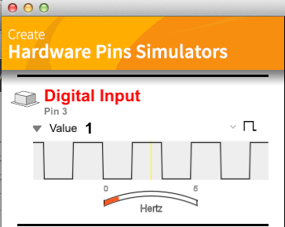

Or, using the pop-up menu shown in Figure 3, you can select a manual switch button (Figure 4)

**Figure 3.** Pop-Up Menu for Boolean Input  


**Figure 4.** Boolean Input Axis, Switch Button


###Float Input Axis
A *float input* axis is appropriate for any analog input--for example, for a pulse sensor, or three for an RGB color sensor or an XYZ accelerometer. The choices available in the pop-up menu (Figure 5) include a sine, triangle, or square wave with adjustable range and frequency. Figure 6 illustrates the sine wave option.

**Figure 5.** Pop-Up Menu for Float Input  
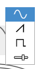

**Figure 6.** Float Input Axis, Sine Wave

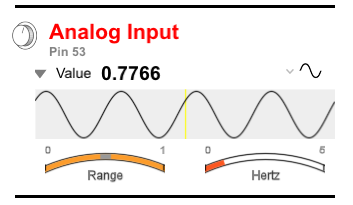

Or you can select the last item in the pop-up menu, for a manual slider control (Figure 7).

**Figure 7.** Float Input, Slider Control

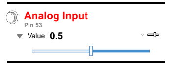

###Boolean Output Axis
A *boolean output* axis is appropriate for any digital output--for example, a simple LED.

**Figure 8.** Boolean Output Axis

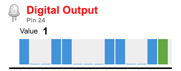

###Float Output Axis
A *float output* axis is appropriate for any PWM output--for example, for a variable-speed DC motor controller, or three for a tri-color LED.

**Figure 9.** Float Output Axis

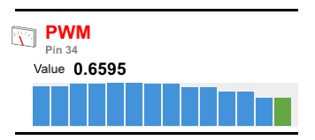

Tap or drag along the output graph to pause and examine each sample value.

**Figure 10.** Sample Value Along Float Output Graph


##Creating Data-Driven Pins Simulators

The [Analog Drawing Toy](https://github.com/Kinoma/KPR-examples/tree/master/analog-drawing-toy/) sample application uses an accelerometer to detect a physical "shake" gesture, and two potentiometers to control the horizontal and vertical positions of the virtual pen. An Accelerometer BLL handles the x, y, and z inputs of the accelerometer, and a single Potentiometers BLL handles both of the potentiometer inputs (see Figure 11).

**Figure 11.** Analog Drawing Toy Simulators


Both of the BLLs build data-driven pins simulators. Here we will take a look at `potentiometers.js`. Below is the entire source, which we will break down part by part.

```
var PinsSimulators = require ("PinsSimulators");

exports.configure = function(configuration) {
	this.pinsSimulator = shell.delegate("addSimulatorPart", {
		header: { 
			label: "Potentiometers", 
			name: "Analog Inputs", 
			iconVariant: PinsSimulators.SENSOR_MODULE 
		},
		axes: [
			new PinsSimulators.AnalogInputAxisDescription(
				{
					valueLabel: "X Position",
					valueID: "xPos",
					defaultControl: PinsSimulators.SINE_GENERATOR,
					speed: 0.3
				}
			),
			new PinsSimulators.AnalogInputAxisDescription(
				{
					valueLabel: "Y Position",
					valueID: "yPos",
					defaultControl: PinsSimulators.SINE_GENERATOR,
					speed: 0.25
				}
			),
		]
	});
}

exports.close = function() {
	shell.delegate("removeSimulatorPart", this.pinsSimulator);
}

exports.read = function() {
	return this.pinsSimulator.delegate("getValue");
}

exports.pins = {
	xPos: { type: "Analog" },
	yPos: { type: "Analog" }
};
```
	
At the top we require the `PinsSimulators` module.

```
var PinsSimulators = require('PinsSimulators');
```
	
This module supplies various constants for identifying icons and default controls, and constructors for creating data-driven axis descriptions. It also contains the code that implements the data-driven pins simulators.

###Creating the Simulator
The `configure` function is where most of the action happens.

```
exports.configure = function(configuration) {
	this.pinsSimulator = shell.delegate("addSimulatorPart", {
```
		
We create a JSON structure describing the header and all the data axes we need (as detailed in the following sections) and pass that to `addSimulatorPart`, which creates our data-driven pins simulator.

####Describing the Header
The `header` property contains a `label` property, which is the large red text at the top, and a `name` property, which is the smaller gray text below (see Figure 12).

```
header: { 
	label: "Potentiometers", 
	name: "Analog Inputs", 
	iconVariant: PinsSimulators.SENSOR_MODULE 
},
```

**Figure 12.** Analog Drawing Toy, Potentiometers Header  

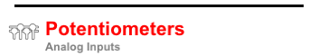

It also contains an `iconVariant` property. The constants for the current options are:

<table style="width: 60%; margin-bottom: 20px;">
<thead>
<tr>
<th></th>
<th></th>
<th></th>
</tr>
</thead>
<tbody>
<tr>
<td></td>
<td style="vertical-align: middle;"><code class="javascript">SENSOR_BUTTON</code></td>
<td></td>
</tr>
<tr>
<td></td>
<td style="vertical-align: middle;"><code class="javascript">SENSOR_KNOB</code></td>
<td></td>
</tr>
<tr>
<td></td>
<td style="vertical-align: middle;"><code class="javascript">SENSOR_LED</code></td>
<td></td>
</tr>
<tr>
<td></td>
<td style="vertical-align: middle;"><code class="javascript">SENSOR_SLIDER</code></td>
<td></td>
</tr>
<tr>
<td>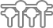</td>
<td style="vertical-align: middle;"><code class="javascript">SENSOR_MODULE</code></td>
<td></td>
</tr>
<tr>
<td>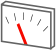</td>
<td style="vertical-align: middle;"><code class="javascript">SENSOR_GAUGE</code></td>
</tr>
</tbody>
</table>

####Describing the Axes
The `axes` property is an array of `AxisDescription` objects. The `AxisDescription` class contains the following properties, used to describe a single data axis:

- `ioType` -- The I/O direction, either `input` or `output`.

- `dataType` -- The data type. Currently the options are `float` and `boolean`.

- `valueLabel` -- The display name of the axis.

- `valueID` -- This one is important: it is the name of the property that contains the value for this axis, and it is used with `setValue` and `getValue`. For example, if `valueID` is `xPos` for the x axis and `yPos` for the y axis, the JSON looks like this:

   ```json
   { xPos: 0.7408, yPos: 0.7003 }
   ```

- `minValue` -- The minimum value for the range slider for input axes. The default is 0.

- `maxValue` -- The maximum value for the range slider for input axes. The default is 1.

- `value` -- The initial value for input axes, useful for the manual slider control.

- `defaultControl` -- This property enables you to select the initial control from the control's input type pop-up menu. 
   
   * The options for boolean input axes are `SQUARE_GENERATOR` and `BUTTON`.
   
   * The options for float input axes are `SINE_GENERATOR`, `TRIANGLE_GENERATOR`, `SQUARE_GENERATOR`, and `SLIDER`.

- `speed` -- The initial frequency for waveform generators such as sine, triangle, and square. It is specified in hertz (cycles per second).
  
`AxisDescription` has four subclasses, which override some of the properties listed above and are often used because they are clearer and more concise. For example, our example uses two `AnalogInputAxisDescription` objects, which already have their `ioType` property set to `input` and their `dataType` property set to `float`.

```
new PinsSimulators.AnalogInputAxisDescription(
	{
		valueLabel: "X Position",
		valueID: "xPos",
		defaultControl: PinsSimulators.SINE_GENERATOR,
		speed: 0.3
	}
),
```
	
The four useful `AxisDescription` subclasses in `PinSimulators.xml` are:

* `DigitalInputAxisDescription`
* `DigitalOutputAxisDescription`
* `AnalogInputAxisDescription`
* `AnalogOutputAxisDescription`
  
###Removing the Simulator on Shutdown
The `close` function is called when the application shuts down. It is important to remove the simulator with `removeSimulatorPart`.

```
exports.close = function() {
	shell.delegate("removeSimulatorPart", this.pinsSimulator);
}
```

###Implementing the BLL API
Next we see the implementation of the BLL API. In this case it is simply a `read` function that returns the current value.

```
exports.read = function() {
	return this.pinsSimulator.delegate("getValue");
}
```

As noted earlier, this value  will be a JSON object with `xPos` and `yPos` properties. If the axis were an output axis instead, we could set the x and y values with the `setValue` function, which could look like this:

```
exports.write = function() {
	// Just an example of using setValue, because our example has no output axes
	var myValue = { xPos: 100, yPos: 100 };
	this.pinsSimulator.delegate("setValue", myValue);
}
```

###Configuring the Pins

Finally, the pins need to be configured. This should match the configuration done by the device BLL.

```
exports.pins = {
	xPos: { type: "Analog" },
	yPos: { type: "Analog" }
};
```

##About Custom Pins Simulators

Custom simulators are fun because they enable you to simulate a hardware module or modules in a more physical manner. If you know how to create a UI in a Kinoma Create application, you already know how to build custom pins simulators: they are just KinomaJS containers.

Figure 13 is an example of a simulator for an LCD output display.

**Figure 13.** Simulator for LCD Output Display  


Figure 14 shows a simulator that allows for testing the Hover, simulating in-air swipe gestures and physical taps with software buttons.

**Figure 14.** Hover Simulator  


##Creating Custom Pins Simulators
Custom simulators enable you to dream up and build any interface that you like. The idea is fairly simple: you create a custom UI for the BLL API, and this custom interface is inserted below the standard header for your pins simulator.

The structure is very similar to the data-driven version, the main difference being that instead of defining an array of data-driven axes, we define a behavior that adds our custom interface. The custom interface is responsible for handling the input and output requirements of the BLL's API.

Below is the source for the [I<sup>2</sup>C Hover](https://github.com/Kinoma/KPR-examples/tree/master/i2c-hover/) sample's simulator BLL, which we will break down part by part.

```
var THEME = require ("themes/flat/theme");
var CONTROL = require ("mobile/control");
var PinsSimulators = require ("PinsSimulators");
var buttonStyle = new Style({ font: "bold 20px", color: ["white","white","black"], 
								horizontal: "center" });
var OrientationBehavior = function(column, data) {
	Behavior.call(this, column, data);
}
OrientationBehavior.prototype = Object.create(Behavior.prototype, {
	onCreate: { value: function(column, data) {
		column.partContentsContainer.add(new OrientationLine(data)); 
	}},
});
var OrientationButton = Container.template(function($) { return {
	width: 80, height: 30, active: true, skin: THEME.buttonSkin,
	behavior: Object.create(CONTROL.ButtonBehavior.prototype, {
		onCreate: { value: function(container, $) {
			CONTROL.ButtonBehavior.prototype.onCreate.call(this, container, $.data);
			this.value = $.value;
		}},
		onTap: { value: function(container) {
			this.data.value = this.value;
		}},
	}),
	contents: [
		Label($, { top: 0, bottom: 0, style: buttonStyle, string: $.string }),
	]
}});
    
var OrientationLine = Container.template(function($) { return {
	left: 0, right: 0, height: 260,
	contents: [
		Label($, { left: 0, right: 0, top: 0, height: 30, style: THEME.labeledButtonStyle, 
					string: "Touch" }),
		Container(null, {
			left: 0, right: 0, top: 30, height: 110,
			contents: [
				OrientationButton({ data: $, string: "Top", value: "touch top" }, { top: 0 }),
				OrientationButton({ data: $, string: "Left", value: "touch left" }, { left: 0 }),
				OrientationButton({ data: $, string: "Center", value: "touch center" }, { }),
				OrientationButton({ data: $, string: "Bottom", value: "touch bottom" }, { bottom: 0 }),
				OrientationButton({ data: $, string: "Right", value: "touch right" }, { right: 0 }),
			],
		}),
		Label($, { left: 0, right: 0, top: 150, height: 30, style: THEME.labeledButtonStyle, 
					string: "Swipe" }),
		Container(null, {
  			left: 0, right: 0, top: 180, height: 70,
  			contents: [
				OrientationButton({ data: $, string: "Up", value: "swipe up" }, { top: 0 }),
				OrientationButton({ data: $, string: "Left", value: "swipe to left" }, { left: 0 }),
				OrientationButton({ data: $, string: "Down", value: "swipe down" }, { bottom: 0 }),
				OrientationButton({ data: $, string: "Right", value: "swipe to right" }, { right: 0 }),
			],
		}),
	],
}});
	
exports.configure = function(configuration) {
	this.data = {
		id: 'HOVER',
		behavior: OrientationBehavior,
		header: { 
			label: "hover", 
			name: "HOVER", 
			iconVariant: PinsSimulators.SENSOR_KNOB 
		},
		value: undefined
	};
	this.container = shell.delegate("addSimulatorPart", this.data);
}
	
exports.close = function() {
	shell.delegate("removeSimulatorPart", this.container);
}
	
exports.read = function() {
	var value = this.data.value;
	this.data.value = undefined;
	return value;
}
    
exports.pins = {
	ts: {type: "Digital", direction: "input"},
	reset: {type: "Digital", direction: "output"},
	data: {type: "I2C", address: 0x42},
}
```

In addition to requiring the `PinsSimulator` module, we create a button style and require a theme and the `mobile/control` library so that we can create buttons.

```
var THEME = require ("themes/flat/theme");
var CONTROL = require ("mobile/control");
var PinsSimulators = require ("PinsSimulators");
var buttonStyle = new Style({ font: "bold 20px", color: ["white","white","black"], 
								horizontal: "center" });
```
	
The `configure` function serves the same purpose as in the earlier data-driven example: to instantiate our pins simulator. The key difference is that instead of an axes array we supply a behavior called `OrientationBehavior`, which will instantiate our custom interface.

```
exports.configure = function(configuration) {
	this.data = {
		id: 'HOVER',
		behavior: OrientationBehavior,
```
		
The implementation of `OrientationBehavior` is a single line that adds an instance of `OrientationLine` into `partContentsContainer` so that it will appear below the standard header.

```
OrientationBehavior.prototype = Object.create(Behavior.prototype, {
	onCreate: { value: function(column, data) {
		column.partContentsContainer.add(new OrientationLine(data)); 
	}},
});
```

We will not go into much detail here about the custom UI itself, since building a KinomaJS UI is explained elsewhere. Briefly, `OrientationLine` contains the labels and containers full of `OrientationButton` objects. Of interest is the value of the buttons, such as `swipe up` and `swipe to left`.

```
OrientationButton({ data: $, string: "Up", value: "swipe up" }, { top: 0 }),
OrientationButton({ data: $, string: "Left", value: "swipe to left" }, { left: 0 }),
```
	
The `onTap` method of `OrientationButton` sets the data's `value` property to its own value, such as `swipe up`, enabling the last button's value to be returned by `read`.

```
onTap: { value: function(container) {
	this.data.value = this.value;
}},
```
    
Again we implement `close` and remove the pins simulator.

```
exports.close = function() {
	shell.delegate("removeSimulatorPart", this.container);
}
```

The BLL's API consists of a single `read` function, which returns the value of the last button pressed.

```
exports.read = function() {
	var value = this.data.value;
	this.data.value = undefined;
	return value;
}
```
	
And we define `pins` in the same way the device BLL does.

```
exports.pins = {
	ts: {type: "Digital", direction: "input"},
	reset: {type: "Digital", direction: "output"},
	data: {type: "I2C", address: 0x42},
}
```

##Exercises

###Build a Data-Driven Pins Simulator

The [Tri-Color LED](https://github.com/Kinoma/KPR-examples/tree/master/pwm-tri-color-led/) sample has a custom pins simulator that displays a colored LED. The goal of this exercise is to create a data-driven version of the pins simulator that allows for examining each color component's value.

**Figure 15.** Tri-Color LED Simulator
  
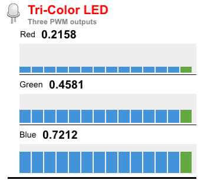

One possible solution is shown below.

```
var PinsSimulators = require('PinsSimulators');

exports.configure = function(configuration) {
	this.pinsSimulator = shell.delegate("addSimulatorPart", {
		header: { 
			label: "Tri-Color LED", 
			name: "Three PWM outputs", 
			iconVariant: PinsSimulators.SENSOR_LED
		},
		axes: [
			new PinsSimulators.AnalogOutputAxisDescription(
				{
					valueLabel: "Red",
					valueID: "r"
				},
			),
			new PinsSimulators.AnalogOutputAxisDescription(
				{
					valueLabel: "Green",
					valueID: "g"
				},
			),
			new PinsSimulators.AnalogOutputAxisDescription(
				{
					valueLabel: "Blue",
					valueID: "b"
				},
			),
		]
	});
}

exports.close = function() {
	shell.delegate("removeSimulatorPart", this.pinsSimulator);
}

exports.write = function(parameters) {
	switch( parameters.color ) {
		case( "red" ):
			this.pinsSimulator.delegate("setValue", "r", parameters.value);
			break;
		case( "green" ):
			this.pinsSimulator.delegate("setValue", "g", parameters.value);
			break;
		case( "blue" ):
			this.pinsSimulator.delegate("setValue", "b", parameters.value);
			break;
	}
}

exports.pins = {
	red: { type: "PWM", value: 1 },
	green: { type: "PWM", value: 1  },
	blue: { type: "PWM", value: 1  },
	anode: { type: "Digital", direction: "output", value: 1  } 
};
```	

###Build a Custom "Shake" Pins Simulator

The [Analog Drawing Toy](https://github.com/Kinoma/KPR-examples/tree/master/analog-drawing-toy/) sample only uses its accelerometer to detect a physical "shake" gesture. It considers a shake gesture to have happened if the current frame's x, y, and z values are all a bit different from the last frame's. You can play around with the data-driven version and make this happen, but it would be cooler to have a button that you just press to simulate a shake (see Figure 16). 

**Figure 16.** Accelerometer with Shake Button

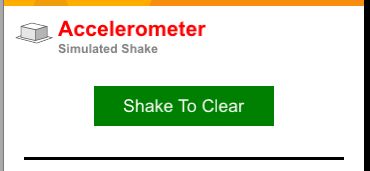

An easy way to simulate a shake would be to increment the x, y, and z values returned by a small amount each time the `read` function is called. One possible solution is shown below.

```
var PinsSimulators = require('PinsSimulators');
	
var ShakeBehavior = function(content, data, dictionary) {
	Behavior.call(this, content, data, dictionary);
}
ShakeBehavior.prototype = Object.create(Behavior.prototype, {
	onCreate: { value: 
		function(column, data) {
  			// Create and add custom shake button
  			buttonContainer = new ButtonContainer(data);
  			column.partContentsContainer.add(buttonContainer);
		}
	}
});

// Custom shake button
var twoColorSkin = exports.twoColorSkin = new Skin({ fill: ['green', 'yellow'], });
var labelStyle = exports.labelStyle = new Style({ 
	color: 'white', font: '20px', horizontal: 'null', vertical: 'null', 
});
var ButtonContainer = exports.ButtonContainer = Container.template(function($) { return { 
	left: 0, right: 0, top: 0, height: 100, 
	contents: [
		Container($, { width: 180, height: 40, active: true, skin: twoColorSkin, name: 'button', 
			behavior: Object.create(ButtonContainerBehavior.prototype), 
			contents: [
				Label($, { left: 0, right: 0, top: 0, bottom: 0, style: labelStyle, 
				string: 'Shake To Clear', }),
			]
		})
	]
}});

var ButtonContainerBehavior = function(content, data, dictionary) {
	Behavior.call(this, content, data, dictionary);
}
ButtonContainerBehavior.prototype = Object.create(Behavior.prototype, {
	onCreate: { value: 
		function(container, data) {
			this.value = { x: 0.1, y: 0.1, z: 0.1 }
		},
	},
	onTouchBegan: { value: 
		function(container, id, x, y, ticks) {
			container.state = 1;
			this.value.x += .01;
			this.value.y += .01;
			this.value.z += .01;
		},
	},
	onTouchEnded: { value: 
		function(container, id, x, y, ticks) {
			container.state = 0;
		},
	},
	getValue: { value: 
		function(container) {
			return this.value;
		},
	},
});

// BLL API
var configure = exports.configure = function(configuration) {
	var data = {
		behavior: ShakeBehavior,			
		header: { 
			label: "Accelerometer", 		
			name: "Simulated Shake", 		
			iconVariant: PinsSimulators.SENSOR_BUTTON 
		}
	};
	this.pinsSimulator = shell.delegate("addSimulatorPart", data);
	value = 0;
}

var close = exports.close = function() {
	shell.delegate("removeSimulatorPart", this.pinsSimulator);
}

var read = exports.read = function() {
	return buttonContainer.button.delegate("getValue");
}

exports.pins = {
	x: { type: "A2D" },
	y: { type: "A2D" },
	z: { type: "A2D" }
};
```
