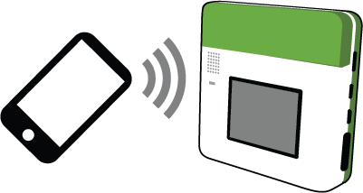
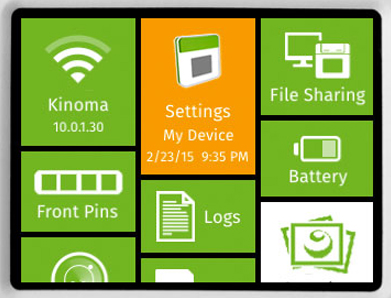

<!-- Version: 160415-CR / Last reviewed: November 2015

Most Internet of Things devices work together with a mobile app, enabling the user to monitor, configure, and control the device using a phone or tablet. The DIAL protocol created by Netflix is a great solution for connecting your mobile app to your IoT project running on Kinoma Create. This Tech Note introduces the DIAL protocol, how to discover DIAL-compatible devices using Net Scanner, and how to add DIAL support to your KinomaJS app.
-->



#Using DIAL to Launch Apps Remotely

**Peter Hoddie**  
February 24, 2015

Most Internet of Things devices work together with a mobile app, enabling the user to monitor, configure, and control the device using a phone or tablet. The DIAL protocol created by Netflix is a great solution for connecting your mobile app to your IoT project running on Kinoma Create. This Tech Note introduces the DIAL protocol, how to discover DIAL-compatible devices using Net Scanner, and how to add DIAL support to your KinomaJS app.

 
##Launching Apps with DIAL

Applications are the fundamental building block for projects on Kinoma Create. When you start a new project, the first code you write is always an application, even if it is just a simple host for your sensors. Each app installed on Kinoma Create appears as a tile on the home screen (Figure 1).

**Figure 1.** App Tiles on Kinoma Create



Users can launch apps by tapping app tiles on the built-in touch screen. But sometimes the device is out of reach, and launching from the touch screen is not always the user experience a developer is testing.

* Some projects are located in a physical location that is inconvenient to reach. For example, your Kinoma Create might be mounted on the ceiling so that sensors can monitor a room or control a ceiling fan or ceiling lights. Climbing a ladder to launch an app is impractical.

* IoT projects interact often with a companion app running on a mobile phone or tablet. It is more convenient if the mobile app can launch the application on Kinoma Create directly, instead of requiring the user to launch the correct app on both Kinoma Create and the mobile device.

Televisions face these two problems as well. The engineers at Netflix created an elegantly simple protocol called [DIAL](http://www.dial-multiscreen.org/), which has only one purpose: remote launching of applications. Netflix designed DIAL for televisions to launch the Netflix app on a TV from their mobile app, but it works equally well on Kinoma Create. In fact, every Kinoma Create is a DIAL server out of the box.

The DIAL protocol identifies the application to launch with an ID rather than a human-readable name. That means it is important that each application have a unique ID. Each KinomaJS application already has an ID in addition to its human-readable name. The KinomaJS application ID is usually in the form of a URL to ensure it is unique. A typical KinomaJS application ID is in the form `hover.example.kinoma.marvell.com`.

> **Note:** One design constraint of DIAL to understand is that it is not an application directory service; there is no way to ask a DIAL server for a list of all the installed applications. Instead, you query a DIAL server to determine if a specific application ID is available. This makes DIAL useful for remote launching of a known application but not for building a general-purpose remote application launcher.

DIAL uses the SSDP protocol for discovery. The [Net Scanner](../net-scanner/) application on Kinoma Create shows the SSDP devices on the local network. Use Net Scanner to see DIAL devices on your network.

Kinoma Create uses SSDP multicast packets to announce the availability of the DIAL service on the local network. Applications running on other devices in the same network receive these multicast packets using an SSDP client. SSDP client libraries available for iOS and Android make it straightforward to discover DIAL services. KinomaJS has built-in support for SSDP, which can be used to discover DIAL devices from mobile apps written in KinomaJS. A sample KinomaJS [SSDP network scanner](https://github.com/Kinoma/KPR-examples/tree/master/ssdp) app is available for Kinoma Create. You could use one Kinoma Create to remotely launch applications on another Kinoma Create in this way.


##Implementing a DIAL Handler

All KinomaJS applications running on Kinoma Create can be launched remotely using DIAL. The remote application that initiates the launch can send your application parameters to configure the application. To receive those parameters, your application implements a handler with the ID `dial`, which will be invoked immediately following application launch. Here is the outline of a simple DIAL handler that uses the query parameters of the DIAL HTTP request:

```
var HandlerBehavior = function(handler, data, context) {
	Behavior.call(this, handler, data, context);
};

HandlerBehavior.prototype = Object.create(Behavior.prototype, {
	onInvoke: {
		value: function(handler, message) {
			if (("query" in message) && message.query) {
				var query = parseQuery(message.query);
				// Use query contents
				...
			}
		}
	},
});
```
	
Here is the code that installs the dial handler, typically during an application `onLaunch`event:

```
var handler = new Handler("/dial");
handler.behavior = new HandlerBehavior(handler);
Handler.put(handler);
```

##Sample Code to Get Started with DIAL

If you are just getting started with DIAL, a good place to start is the [`dial-client`](https://github.com/Kinoma/KPR-examples/tree/master/dial-client) and [`dial-remote`](https://github.com/Kinoma/KPR-examples/tree/master/ial-remote) sample apps. The client app (Figure 2) displays several bouncing balls; the remote app launches the client app and configures the number of balls shown. Both apps can be run on Kinoma Create, on your computer using the Kinoma simulator, and on mobile phones.

**Figure 2.** DIAL Client App  


A more complex example of using DIAL is the KinomaJS SomaFM internet radio app. Run the [`somafm-player`](https://github.com/Kinoma/KPR-examples/tree/master/somafm-player) app on one device and [`somafm-remote`](https://github.com/Kinoma/KPR-examples/tree/master/somafm-remote) on another. If you do not have two Kinoma Create devices yet, you can run one app on your Kinoma Create and another on the Kinoma Create Simulator using Kinoma Studio. The `somafm-player` app is a simple internet radio player using [SomaFM](http://somafm.com/); `somafm-remote` contains the same player but also knows how to launch `somafm-player` if it is installed on other devices. In `somafm-remote` you will see a list of available remote devices; selecting the remote device transfers playback from the device running `somafm-remote` to the other device.
